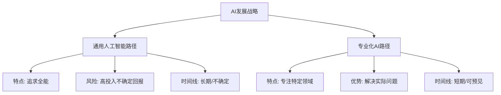

在当前AI技术迅猛发展的时代，AI Agent（智能代理）正以惊人的速度重塑商业格局。作为企业决策者，您面临着关键的战略抉择：如何在这场技术革命中把握机遇，引领而非被动适应变革？本文将深入剖析AI Agent的本质、发展趋势和商业价值，为企业高管提供切实可行的战略指导。

<!--more-->

## AI Agent的商业意义：超越炒作看本质

当我们谈论AI Agent，我们并不是在讨论遥远的科幻概念，而是已经开始改变商业规则的现实技术。要理解其真正价值，首先需要厘清几个关键概念。

### 什么是AI Agent，为何重要？

AI Agent是一种能够自主执行任务、作出决策并采取行动的智能系统。它区别于传统AI系统的关键在于：

- **自主性**：能够在一定范围内独立思考和行动
- **目标导向**：根据设定的目标规划和执行行动序列
- **工具使用**：能够选择性地调用各种工具完成任务
- **环境感知**：通过各种接口感知并理解周围环境
- **反思能力**：能够分析自己的行动效果，调整策略

从商业角度看，AI Agent代表了从"被动工具"到"主动助手"的根本性转变。这种转变将重新定义企业运营模式、客户服务方式和价值创造过程。

### 专业化AI vs. 通用AI：战略选择的关键

在AI发展讨论中，常被提及两种方向：一是追求所谓的"通用人工智能"（AGI），这种假设中的系统理论上能够胜任任何智力任务；二是发展专业化AI，专注于解决特定领域的具体问题。而实际上，前者更多是科幻概念而非实际可行的技术方向。

作为企业决策者，理解这一区别至关重要：

- 所谓"**通用AI**"：不仅在逻辑上存在根本性问题，实际上也不是严肃科研机构的追求方向，更像是商业炒作和科幻想象
- **专业化AI**：关注特定业务问题，投资回报可预测，能够创造即时价值，具备商业可行性

市场数据支持专业化路径的优势：垂直AI市场预计将从2024年的51亿美元增长到2030年的471亿美元，年复合增长率超过37%。专业化AI企业展现出超过400%的年同比增长率，远超传统软件解决方案。

### 专业化AI的商业价值

专业化AI Agent的价值体现在多个方面：

1. **效率提升**：自动化复杂流程，减少人工干预，加速业务循环
2. **决策增强**：提供数据驱动的洞察，支持更精准的决策
3. **个性化能力**：实现大规模个性化服务，提升客户体验
4. **创新加速**：缩短从想法到实施的周期，促进快速迭代
5. **资源优化**：智能分配有限资源，最大化投资回报

埃森哲的研究表明，成功实施AI战略的企业实现了平均26%的毛利率提升，而专业化AI应用在特定领域更是能带来30-70%的效率提升。

## 市场趋势：垂直AI的爆发式增长

### 重要市场数据

根据最新市场研究，专业化AI（垂直AI）正在经历爆发性增长：

- 垂直AI市场预计将从2024年的51亿美元增长到2030年的471亿美元
- AI Agent市场的投资在2024年几乎是前一年的三倍
- 63%的企业高管在CB Insights的调查中表示，AI Agent对未来12个月的业务至关重要
- 垂直AI初创公司正在达到传统垂直SaaS合同价值的80%，同时增长速度快得多

### 成功案例分析

多个行业的案例充分证明了专业化AI的价值：

#### 医疗行业

Mayo Clinic通过其"AI工厂"方法在不到三年的时间内开发了200多个专业化AI应用，包括：

- 医学影像分析AI：提高了诊断准确率，减少了等待时间
- 临床决策支持系统：整合患者数据，提供治疗建议
- 医疗资源优化AI：优化床位分配和手术排期

PathAI的专业化医学诊断系统被全球前15大生物制药公司中的90%所采用，显著提升了诊断准确性。

#### 金融服务

大型金融机构正积极采用垂直AI解决方案：

- 风险评估AI：实时监控交易，识别欺诈模式，准确率达95%以上
- 客户服务Agent：处理常规查询，准确回答产品问题，减少等待时间
- 投资分析系统：整合市场数据与企业财报，提供投资洞察

摩根大通报告称，其AI系统每年为企业节省数亿美元成本，同时提高了客户满意度。

#### 制造与供应链

工业巨头如GE和西门子正在部署专业化AI：

- 预测性维护系统：减少设备停机时间，平均提升生产效率15-20%
- 智能供应链管理：优化库存水平，减少30%的库存成本
- 质量控制AI：识别产品缺陷，提高良品率

## 战略框架：企业AI Agent实施路径

对于企业决策者，关键问题不是"是否应该采用AI Agent"，而是"如何有效地实施AI Agent战略"。以下是一个实用的战略框架：

### 第一阶段：评估与规划

1. **业务流程审计**：
   - 识别高价值、高重复性的流程
   - 评估当前效率瓶颈和人工干预点
   - 量化自动化潜在收益

2. **AI Agent机会地图**：
   - 创建业务流程与AI能力矩阵
   - 根据技术可行性和业务价值排序机会
   - 定义成功指标和预期回报

3. **内部准备评估**：
   - 审查数据基础设施和质量
   - 评估技术团队能力
   - 识别变革管理需求

### 第二阶段：初步实施

1. **选择高价值试点项目**：
   - 聚焦可在3-6个月内显示价值的领域
   - 平衡短期收益与长期战略意义
   - 确保有明确、可量化的成功指标

2. **构建AI Agent能力**：
   - 确定构建、购买或合作策略
   - 培养内部AI人才或寻找合适的合作伙伴
   - 建立数据管理和隐私保护框架

3. **有效的治理结构**：
   - 确立明确的决策权和问责制
   - 建立跨部门协作机制
   - 设计人机协作模式

### 第三阶段：扩展与优化

1. **规模化成功经验**：
   - 将试点经验转化为可复制的模板
   - 开发内部AI Agent能力中心
   - 建立知识共享机制

2. **持续监控与学习**：
   - 实施AI性能监控系统
   - 收集用户反馈，迭代改进
   - 追踪商业价值实现情况

3. **组织文化调整**：
   - 培养AI思维方式和技能
   - 重新设计工作流程和职责
   - 优化人机协作模式

## 行业特定战略：专业化应用指南

不同行业面临不同挑战，AI Agent的应用策略也应有所区别。以下是主要行业的战略重点：

### 金融服务业

金融机构应优先考虑以下领域：

- **风险管理**：欺诈检测、信用评估和市场风险分析
- **客户体验**：个性化金融建议、自动化客户服务
- **合规性**：监管报告自动化、交易监控
- **投资分析**：市场情绪分析、投资组合优化

瑞银集团通过实施专业化AI Agent，将分析师报告生成时间缩短了60%，同时提高了内容质量和一致性。

### 医疗健康

医疗机构应关注：

- **临床决策支持**：诊断辅助、治疗方案建议
- **行政效率**：预约管理、保险处理、文档自动化
- **患者参与**：个性化健康指导、远程监控
- **研究加速**：文献分析、临床试验匹配

克利夫兰诊所报告称，其AI辅助诊断系统将某些疾病的早期检测率提高了30%，同时减少了误诊。

### 制造业

制造企业应侧重于：

- **智能维护**：设备状态监控、预测性维护
- **质量控制**：自动缺陷检测、质量预测
- **供应链优化**：需求预测、库存管理
- **生产计划**：资源分配、生产调度

宝马集团通过AI Agent优化生产线，减少了15%的停机时间，提高了整体设备效率(OEE)。

### 零售与电商

零售企业的重点领域包括：

- **智能库存管理**：需求预测、自动补货
- **个性化营销**：客户行为分析、精准推荐
- **供应链优化**：路线规划、配送优化
- **价格策略**：动态定价、竞争分析

沃尔玛通过AI库存管理减少了30%的过度库存，同时将缺货率降低了15%。

## 实施挑战与应对策略

### 数据挑战

数据质量和可用性是AI Agent实施的首要障碍：

- **挑战**：数据分散、质量不一、缺乏标准化
- **解决方案**：
  - 开展数据审计，识别关键数据资产
  - 实施数据治理框架，确保质量和一致性
  - 建立数据湖/数据仓库，整合分散数据
  - 采用增量方法，从高质量数据集开始

普华永道的研究表明，有效的数据准备可以将AI项目成功率提高30%。

### 人才与技能差距

AI人才短缺是普遍挑战：

- **挑战**：专业AI人才稀缺、现有员工技能不足
- **解决方案**：
  - 采用混合团队模式：核心AI专家+领域专家
  - 投资内部培训和技能提升
  - 考虑与AI专业服务提供商合作
  - 创建AI卓越中心，培养内部能力

### 变革管理

技术实施往往比变革管理更容易：

- **挑战**：员工抵抗、流程中断、角色转变
- **解决方案**：
  - 提前沟通AI战略及其目标
  - 强调增强而非替代的信息
  - 让员工参与AI设计和实施过程
  - 创建明确的转型路线图和支持系统

麦肯锡研究发现，有效的变革管理可以将AI实施成功率提高五倍。

### 伦理与责任

AI Agent引发的伦理问题需要认真对待：

- **挑战**：决策透明度、责任归属、潜在偏见
- **解决方案**：
  - 建立明确的AI伦理指南和原则
  - 实施透明度和可解释性机制
  - 建立人工监督和干预机制
  - 定期进行偏见审查和公平性测试

## 未来展望：AI Agent的演进路径

作为决策者，了解AI Agent的发展趋势有助于制定长期战略。

### 短期趋势（1-2年）

- **多模态融合**：AI Agent将整合文本、图像、语音等多种数据源
- **专业化加深**：针对特定行业和流程的高度专业化Agent将涌现
- **自主性提升**：Agent将能够处理更复杂的任务链和决策流程
- **人机协作模式成熟**：更有效的交互界面和反馈机制

### 中期发展（3-5年）

- **多Agent协作系统**：专业化Agent组成的协作网络将共同解决复杂问题
- **自我改进能力**：Agent将能从经验中学习并优化自身性能
- **更深入的环境感知**：通过物联网和边缘计算，实现更全面的环境理解
- **行业生态系统形成**：行业特定的AI Agent标准和生态系统将成形

### 长期愿景（5年以上）

- **具身智能体系统**：AI与物理世界更深度融合，如高级机器人和自主系统
- **组织智能网络**：企业将进化为由人类和AI Agent组成的混合智能网络
- **新型商业模式**：基于AI Agent的全新商业模式将重塑行业格局

## 结语：把握专业化发展机遇

AI Agent代表了企业数字化转型的新前沿，而专业化发展路径提供了最具商业可行性的实施途径。作为决策者，关键在于：

1. **拥抱专业化思维**：聚焦解决特定业务问题，而非追求通用AI
2. **采取渐进式方法**：从高价值领域开始，循序渐进扩展应用
3. **重视人机协作**：设计人类与AI互补的工作模式，发挥各自优势
4. **建立适应性组织**：培养持续学习和适应的文化和能力

正如哲学家老子所言："天之道，损有余而补不足"。专业化AI Agent的价值在于补足企业能力的短板，解决具体的业务挑战，而非盲目追求高大全的解决方案。

企业领导者应认识到，AI竞争不是简单的技术竞争，而是思维模式、组织能力和战略视野的竞争。那些能够明智地将专业化AI Agent整合到业务战略中的企业，将在这场技术革命中脱颖而出。

如果您想了解更多基础知识，请查看我们的[普通读者指南]( "认识AI Agent")。

或者，如果您是职场人士，我们的[职场人士指南]( "AI Agent与职场变革")将为您提供个人应对策略。
