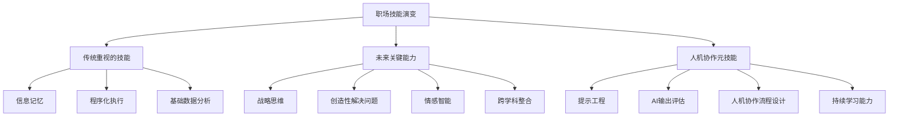

在当前AI技术飞速发展的时代，AI Agent（AI代理）作为新一代人工智能应用正在重塑我们的工作方式和职业发展路径。对于职场专业人士而言，理解这一变革并主动适应，不仅关乎个人竞争力，更决定着未来的职业发展空间。本文将深入探讨AI Agent如何改变职场生态，以及专业人士应如何应对这场技术革命。

<!--more-->

## AI Agent如何重新定义工作方式？

AI Agent（AI代理）区别于传统AI应用的关键在于其自主性、目标导向性和行动能力。它能够理解复杂指令，规划执行路径，调用各种工具完成任务，甚至能够反思和调整策略。这些特性正在深刻改变专业人士的日常工作方式。

### 从辅助工具到协作伙伴

传统的软件工具需要人类明确操作每一步，而AI Agent能够理解更高层次的目标和意图，自主完成中间步骤。例如：

- **传统方式**：你需要手动搜索信息、整理数据、制作图表、编写报告
- **AI Agent方式**：你只需要表达"分析过去三个季度的销售数据并找出关键趋势"，AI Agent会自动完成搜索、分析、可视化和总结等一系列任务

这种转变使专业人士可以将更多精力集中在创造性思考、战略规划和人际互动等AI难以替代的领域。

### 数据处理与决策支持

在数据密集型工作中，AI Agent的优势尤为明显：

- **处理海量信息**：快速筛选和分析大量文件、报告、新闻等信息源
- **发现隐藏模式**：识别数据中的趋势和关联，提供人类可能忽略的洞见
- **提供决策支持**：根据历史数据和当前情境，提供决策建议和风险评估

例如，一位金融分析师可以借助AI Agent同时监控多个市场指标，获取实时分析，并在关键时刻收到提醒，大大提高工作效率和决策质量。

### 自动化例行任务

职场中的许多重复性任务正在被AI Agent接管：

- **日程管理**：智能安排会议，优化时间分配，提醒重要事项
- **沟通协调**：自动回复常规邮件，整理会议记录，跟踪项目进度
- **文档处理**：生成报告，整理资料，维护知识库

这种自动化不仅提高效率，还减少了人为错误，让专业人士能够专注于更有价值的工作。

## 各行业的AI Agent应用案例

AI Agent在不同行业的应用形式各异，但都体现了"专业化"的发展趋势。以下是几个典型案例：

### 法律行业

法律专业人士正在借助AI Agent处理文档密集型工作：

- **自动化文件审查**：AI可以在几周内审阅20万份文件，而人工在同等时间内仅能完成约10%
- **法律研究助手**：快速检索相关判例和法规，生成初步法律分析
- **合同管理**：自动识别合同中的风险条款，提供修改建议

一位资深律师分享："借助AI处理文档审查，我能将更多时间用于与客户沟通和案件战略规划，这既提高了效率，也增强了客户满意度。"

### 医疗健康

医疗专业人员正在利用AI Agent提升诊断和治疗效率：

- **医学影像分析**：辅助解读X光、CT和MRI等影像，标注可疑区域
- **病历管理**：自动记录和整理医患对话，生成标准化病历
- **治疗方案建议**：基于最新医学研究和患者具体情况，提供个性化治疗建议

"AI不是要取代医生的判断，"一位放射科医生解释道，"而是帮助我们更快、更准确地筛查问题，让我们能够将精力集中在需要人类专业知识和同理心的复杂案例上。"

### 金融服务

金融行业的AI Agent应用正在从简单的交易分析向全面的决策支持演进：

- **风险评估**：实时监控交易数据，识别潜在风险和欺诈行为
- **投资分析**：整合市场数据、公司财报和宏观经济指标，提供投资建议
- **个性化理财**：根据客户目标和风险偏好，制定和调整财务规划

### 创意产业

即使在创意领域，AI Agent也正在成为创作者的得力助手：

- **内容创作**：提供创意灵感，协助写作和编辑，生成初稿
- **设计辅助**：根据设计师的概念草图生成多个设计方案
- **音乐制作**：协助编曲、混音和后期处理

"AI不会替代创意人才，"一位设计师表示，"它更像是一个能够立即实现我想法的助手，让我可以更快地探索不同创意方向。"

## 职场技能的重新定义

AI Agent的兴起正在重新定义职场价值和必备技能，专业人士需要主动适应这种变化。

### 不再吃香的技能

随着AI Agent的发展，某些传统上备受重视的技能可能会贬值：

- **纯粹的信息记忆**：当知识触手可及时，记忆大量事实的能力变得不那么重要
- **简单的数据分析**：基础数据整理和分析正被AI自动化
- **程序化任务执行**：遵循固定流程的工作正在被自动化
- **基础内容创作**：标准化的文案、报告等内容生成正在被AI接管

### 越来越重要的能力

与此同时，一些能力将变得更加宝贵：

- **战略思维**：理解大局，制定长期战略，做出关键决策
- **创造性问题解决**：面对新情况，提出创新解决方案
- **批判性思考**：质疑假设，评估信息可靠性，做出独立判断
- **情感智能**：理解他人情感，建立有效人际关系，进行有效沟通
- **跨学科整合**：连接不同领域的知识，创造新的见解和方法

### AI协作的元技能

最关键的是发展与AI协作的新型元技能：

- **提示工程（Prompt Engineering）**：学会有效指导AI，清晰表达目标和约束
- **AI输出评估**：快速判断AI生成内容的质量、准确性和适用性
- **人机协作流程设计**：设计高效的工作流程，确定人类和AI各自的责任
- **持续学习能力**：主动获取新知识和技能，适应技术和行业变化

## 如何提升AI时代的职场竞争力

面对AI Agent带来的变革，专业人士可以采取以下策略提升自身竞争力：

### 1. 重新定位专业角色

首先评估你的职业领域将如何受到AI Agent的影响，找到人类独特价值所在：

- **审视工作内容**：哪些任务可能被AI自动化？哪些需要人类独特能力？
- **识别机会领域**：AI创造了哪些新的需求和角色？
- **调整价值主张**：如何强调你的独特能力和AI不易替代的技能？

例如，一位会计可能从数字处理者转变为财务战略顾问；一位内容编辑可能从语法检查者转变为创意引导者。

### 2. 主动学习AI工具

了解和掌握AI Agent的使用是必不可少的：

- **熟悉主流AI平台**：了解不同平台的特点和适用场景
- **掌握有效提示技巧**：学习如何清晰地表达需求，获得最佳结果
- **建立工作流程**：将AI Agent整合到日常工作中，形成高效流程

"不需要成为AI专家，但需要成为AI工具的熟练使用者，"一位项目经理建议，"就像我们不需要了解汽车引擎的每个零件，但需要知道如何高效驾驶。"

### 3. 发展互补技能

培养AI难以替代的能力：

- **创造力和原创思维**：提出新想法，创造独特内容
- **复杂沟通**：谈判、说服、激励和教导他人
- **情境适应**：在不可预测的情况下做出判断
- **伦理决策**：在考虑价值观和社会影响的基础上做决策

### 4. 建立终身学习习惯

在AI快速发展的时代，终身学习不再是选择，而是必需：

- **保持好奇心**：对新技术和行业趋势保持开放态度
- **建立学习系统**：定期分配时间学习新知识和技能
- **寻找实践机会**：通过实际项目应用新技能
- **加入学习社区**：与志同道合者交流经验和见解

## 管理AI焦虑与职业前景

面对AI带来的变化，许多专业人士感到焦虑是自然的。以下是一些应对策略：

### 正视现实，保持乐观

- **了解实际情况**：AI Agent有能力也有局限，不会一夜之间改变所有工作
- **关注转型机会**：每次技术革命都创造了新的工作岗位和机会
- **汲取历史经验**：过去的技术变革（如个人电脑、互联网）最终创造了更多工作，而非减少

### 主动适应，而非被动等待

- **提前规划**：评估自己的职业路径，制定学习和转型计划
- **尝试新角色**：主动承担涉及AI的项目，积累经验
- **寻找盲点**：找出现有AI解决方案的不足，发现自己可以填补的价值空白

### 建立支持网络

- **同行交流**：与行业同仁讨论AI对行业的影响和应对策略
- **跨领域连接**：建立跨学科的人脉网络，拓宽视野
- **寻找导师**：向已成功适应AI变革的专业人士学习

## 结语：协作而非对抗的未来

AI Agent代表了一种全新的人机协作模式，而非简单的人机对抗。未来的职场成功将取决于专业人士如何与AI建立有效的协作关系，发挥各自优势。

人类的创造力、情感智能、道德判断和适应能力，结合AI的数据处理能力、准确性和不知疲倦的特性，将创造前所未有的可能性。

作为职场专业人士，现在正是重新思考自己角色、提升相关技能、拥抱变化的最佳时机。那些能够适应这一变革的人将在未来的职场中取得更大的成功。

"在变革时代，最大的风险不是变革本身，而是依然用昨天的逻辑去应对今天的变化。"

如果您想了解更多基础知识，请查看我们的[普通读者指南]( "认识AI Agent")。

或者，如果您是企业决策者或管理者，我们的[管理者指南]( "AI Agent: 决策者战略指南")将为您提供更深入的战略思考。
