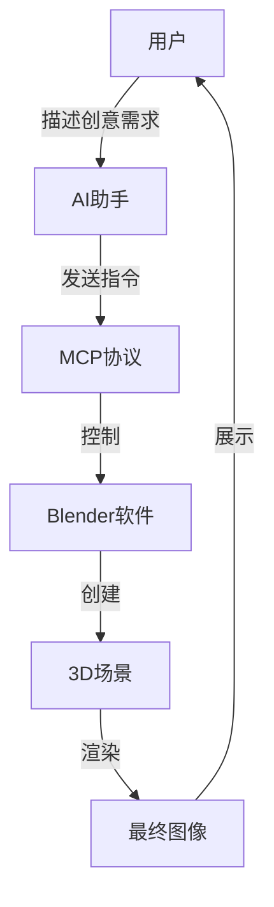

想象一下，你只需描述一个想法，AI就能帮你在3D软件中创建出精美的模型和场景。这不是科幻电影里的场景，而是已经实现的现实。通过AI与3D建模软件Blender的结合，创意人员可以用语言指令完成以往需要数小时甚至数天的工作。这种革命性的组合正在改变设计师、艺术家和内容创作者的工作方式。

<!--more-->

## 当AI成为你的3D助手

李明是一名广告公司的创意总监。他需要为客户提案准备一个水晶主题的场景效果图，但公司的3D建模师都在忙其他项目。以往，这种情况下他只能推迟提案或花钱外包。

现在，李明有了新选择——尽管他对3D建模知之甚少，但他可以借助AI与Blender的结合来创建所需场景。

这张图片从构思到完成只用了约30分钟，而传统方式可能需要专业人士花费一整天。

## 这是如何实现的？

AI与Blender的协作是通过一种叫作"模型上下文协议"（Model Context Protocol，简称MCP）的技术实现的。这种协议让AI助手能够直接与Blender软件"对话"并控制它。

简单来说，这个过程就像你有了一个精通Blender的助手，你告诉他你想要什么，他就能帮你在软件中点击各种按钮、调整各种设置来实现你的想法。

## 一次魔法水晶创作之旅

让我们看看李明是如何完成他的水晶场景的：

### 第一步：设置连接

李明首先安装了Blender软件和一个名为"[Blender-MCP](https://github.com/ahujasid/blender-mcp)"的插件。这个插件就像是AI和Blender之间的翻译官，让它们能够互相理解。

1. 他打开Blender后，在右侧面板找到"Blender-MCP"选项卡
2. 点击"Start MCP Server"按钮，启动连接服务
3. 然后打开支持MCP的AI助手应用程序

### 第二步：描述创意

连接建立后，李明只需用自然语言告诉AI助手他想要什么：

"我需要一个魔幻风格的水晶场景，包含一个中央的蓝色主水晶，周围有一些小型水晶体。整体效果要有光芒四射的感觉。"

### 第三步：AI开始创作

AI理解了需求后，立即开始控制Blender进行创作：

1. 首先创建一个主水晶球体
2. 使用变形工具使其表面不规则，形成晶体效果
3. 添加蓝色半透明材质，并设置适当的折射率
4. 在周围创建多个锥形小晶体
5. 设置光照，包括顶光、侧光和背光
6. 添加粒子效果模拟光线散射

整个过程中，李明只需看着AI操作，偶尔提供一些反馈如"光线太暗"或"水晶颜色再蓝一些"。

### 第四步：优化与渲染

创作完成后，AI还会根据李明的电脑性能（MacBook Air M1）自动优化渲染设置：

1. 调整采样数量到适中水平（32-64）
2. 开启降噪功能提高渲染质量
3. 设置合理的分辨率（800×600）
4. 设置最优的光线反弹次数

最后，只需按F12键或选择菜单中的"渲染图像"，几分钟内就能得到专业级别的3D渲染图。

## 这种协作带来的改变

这种AI与3D软件的结合彻底改变了创作流程：

1. **效率提升**：从小时级到分钟级的工作效率飞跃
2. **门槛降低**：非专业人士也能创建专业级3D内容
3. **创意释放**：更快速地尝试不同创意，不受技术限制
4. **成本节约**：减少对专业3D设计师的依赖，降低项目成本

## 技术不是取代，而是赋能

值得强调的是，这种技术并不是要取代专业3D艺术家，而是为更多人提供创作工具，同时让专业人士能够更专注于创意本身而非繁琐的技术操作。

正如一位使用这项技术的设计师所说："它不是来抢我的工作的，而是让我能专注于更有创意的部分，把重复性的工作交给AI。"

## 体验这项技术

如果你想尝试这种创新的创作方式，可以按照以下步骤：

1. 安装Blender（免费开源的3D软件）
2. 在GitHub上下载Blender-MCP插件
3. 安装配置支持MCP的AI助手应用
4. 启动Blender并激活插件
5. 连接AI助手，开始你的创作之旅

虽然这项技术目前还在发展中，但它已经展示了AI与创意软件结合的巨大潜力。未来，我们可能会看到更多领域出现类似的人机协作方式，从视频剪辑到音乐创作，从建筑设计到游戏开发。

这不是人类创造力的终结，而是一个新起点。技术工具在进化，但创意的火花依然来自人类的想象力。AI只是帮助我们更快、更容易地将这些想象变为现实。

---

**你有想通过AI创建的3D场景吗？欢迎在评论区分享你的创意！**
