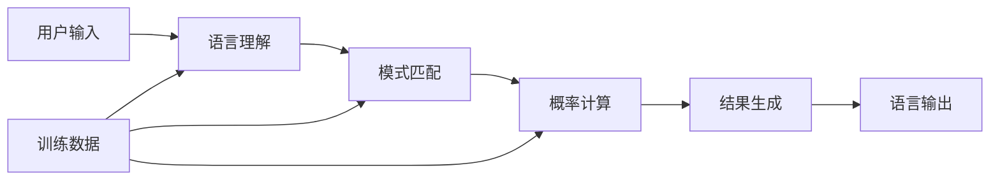

AI会取代人类吗？这个问题已经被讨论得铺天盖地，但大多数讨论都基于一个根本性的误解：将AI视为独立的行为主体。让我们回归理性，重新审视AI的本质，澄清那些被炒作和恐惧扭曲的认知。

<!--more-->

## 一个简单的现实检验

让我们从一个最基本的问题开始：如果你不跟ChatGPT说话，它会自己在你的电脑里弹出对话框吗？

答案很简单：不会。

这个看似简单的问题，却揭示了AI的根本特性：**AI是被动的工具，而不是主动的行为者**。

### AI的本质限制

无论多么强大的AI系统，都有着根本性的限制：

**物理限制**：
- 没有手脚，无法进行物理操作
- 没有自主的硬件载体
- 依赖人类提供的计算资源

**行为限制**：
- 无法主动发起交互
- 不能独立进行商业活动
- 无法承担法律责任

**认知限制**：
- 没有持续的记忆和状态
- 缺乏长期目标和动机
- 不具备真正的自主意识

## 威胁论的误区与根源

### 科幻作品的影响

大众对AI的认知很大程度上来自科幻电影和小说：
- 《终结者》中的天网
- 《黑客帝国》中的机器人统治
- 《我，机器人》中的机器人叛乱

这些作品虽然精彩，但它们描述的是完全不同于现实的技术场景。

### 媒体炒作的放大效应

**标题党文化**：
- "AI将在X年内取代所有工作"
- "人工智能已经超越人类"
- "机器人即将统治世界"

这些夸张的表述为了获得点击量，往往忽略了技术的真实现状。

### 技术公司的营销策略

某些技术公司出于商业考虑，有意夸大AI的能力：
- 制造"人工智能威胁"的紧迫感
- 吸引投资和关注
- 掩盖技术的实际局限性

## AI的真实定位：语言逻辑工具

### 什么是AI？

从技术角度看，当前的AI系统本质上是：
- **大规模的语言模型**：通过学习海量文本数据，掌握语言规律
- **模式识别系统**：能够识别和处理各种数据模式
- **概率计算工具**：基于统计学原理进行预测和生成

### AI的工作原理

这个过程看起来很神奇，但本质上是数学计算和统计分析。

### AI能做什么

**擅长的领域**：
- 文本生成和理解
- 图像识别和处理
- 数据分析和模式发现
- 语言翻译和转换
- 代码编写和调试

**不能做的事情**：
- 独立思考和决策
- 承担责任和后果
- 进行创造性的价值判断
- 建立真正的情感连接
- 超越训练数据的范围

## 人机协作的未来模式

### 从"替代"到"增强"

正确的思路不是"AI替代人类"，而是"AI增强人类能力"：

**会计师的例子**：
- 错误认知：AI会取代会计师
- 现实情况：AI帮助会计师处理重复性工作，让他们专注于分析和决策

**医生的例子**：
- 错误认知：AI会取代医生
- 现实情况：AI辅助诊断，提高医生的准确率和效率

**律师的例子**：
- 错误认知：AI会取代律师
- 现实情况：AI帮助检索法条，让律师专注于案例分析和法庭辩论

### 新的工作分工模式

未来的工作场景可能是这样的：

**AI负责**：
- 信息收集和整理
- 重复性任务执行
- 数据分析和计算
- 初步方案生成

**人类负责**：
- 最终决策和判断
- 创意和战略规划
- 人际沟通和协调
- 价值观和伦理考量

## 定价机制与普及障碍

### 当前的定价困境

AI服务目前价格较高的原因：

**成本因素**：
- 巨额的研发投入
- 昂贵的计算资源
- 专业人才的高薪

**市场因素**：
- 供应商相对集中
- 需求快速增长
- 缺乏充分竞争

**认知因素**：
- 用户对价值认知不明确
- 使用方式尚未标准化
- ROI计算困难

### 类比通信产业的发展

回顾通信产业的历史，我们可以看到相似的发展轨迹：

**90年代的短信**：
- 一条短信1-2元，是奢侈品
- 只有少数人使用
- 被视为高科技产品

**2000年代的普及**：
- 价格降到1毛钱
- 开始进入普通家庭
- 使用场景逐渐清晰

**2010年代的免费化**：
- 成为套餐的免费部分
- 被微信等新技术冲击
- 完成历史使命

### AI发展的预期路径

**第一阶段（当前）**：高价格，少数用户
- 主要是企业和专业用户
- 使用门槛较高
- 效果显著但成本不菲

**第二阶段（2-3年内）**：价格下降，用户扩大
- 中小企业开始大规模采用
- 个人用户增加
- 应用场景更加明确

**第三阶段（5-10年内）**：成为基础工具
- 像搜索引擎一样普及
- 集成到各种软件中
- 几乎免费使用

## 社会适应的关键因素

### 教育体系的转变

**传统教育的挑战**：
- 强调记忆和标准答案
- 忽视批判性思维
- 缺乏人机协作训练

**未来教育的方向**：
- 培养与AI协作的能力
- 强调创意和判断力
- 重视沟通和领导力

### 法律制度的完善

**需要解决的问题**：
- AI生成内容的知识产权归属
- AI辅助决策的责任认定
- AI服务的质量标准和监管

**发展方向**：
- 建立人机协作的法律框架
- 明确人类在决策中的最终责任
- 保护用户数据和隐私权利

### 社会心理的适应

**当前的认知障碍**：
- 对未知技术的恐惧
- 对工作安全感的担忧
- 对技术依赖的抗拒

**适应过程的特点**：
- 从恐惧到接受的渐进过程
- 需要成功案例的示范效应
- 要求透明和可理解的技术

## 理性看待AI的发展

### 避免两个极端

**过度恐惧**：
- 认为AI会立即取代所有工作
- 拒绝学习和使用AI工具
- 呼吁停止AI发展

**过度乐观**：
- 认为AI能解决所有问题
- 忽视技术的局限性
- 盲目投资AI项目

### 建立正确的预期

**AI会带来的改变**：
- 工作方式的优化
- 生产效率的提升
- 新的商业模式
- 不同的技能需求

**AI不会改变的东西**：
- 人类的基本需求
- 社会的伦理价值
- 人际关系的重要性
- 创造和决策的主导权

## 实践建议：如何与AI共存

### 对个人的建议

**学习新技能**：
- 掌握基本的AI工具使用
- 培养与AI协作的思维方式
- 发展AI无法替代的能力

**调整心态**：
- 将AI视为助手而非威胁
- 保持学习和适应的开放性
- 专注于人类独有的价值

### 对企业的建议

**渐进式应用**：
- 从简单任务开始尝试
- 建立AI使用的标准流程
- 培训员工与AI协作

**投资重点**：
- 不要盲目追求最新技术
- 关注实际的业务价值
- 重视数据质量和安全

### 对政策制定者的建议

**监管平衡**：
- 既要保护公众利益，也要促进创新
- 建立灵活的监管框架
- 鼓励负责任的AI发展

**社会支持**：
- 投资AI相关的教育和培训
- 建立社会安全网支持转型
- 促进公平的技术普及

## 结语：拥抱理性的AI未来

AI不是科幻电影中的反派，也不是商业宣传中的万能神器。它是一个强大但有限的工具，需要人类的指导、监督和负责任的使用。

真正的威胁不是AI本身，而是我们对AI的误解和非理性反应。只有当我们清楚地认识AI的本质和边界时，才能最大化地利用它的优势，同时避免潜在的风险。

未来属于那些能够与AI有效协作的人和组织。这不是一场人机对抗的战争，而是一次人机协作的机遇。让我们抛弃不必要的恐惧，拥抱理性的AI未来。

技术的发展最终是为了服务人类，而不是取代人类。在这个前提下，AI将成为我们探索未知、解决问题、创造价值的强大伙伴。

---

*当我们不再把AI当作威胁，而是当作工具时，我们就找到了通往未来的正确道路。这条路需要理性、需要学习，更需要勇气去拥抱变化。*
