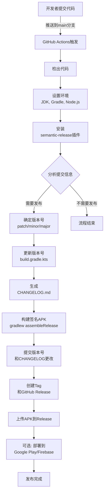

作为一名Android开发者，你是否经历过这样的场景：每次发布新版本时，手动修改版本号、编写更新日志、构建APK并上传到各个平台，这些重复性工作不仅枯燥，还容易出错。如果你正在为此苦恼，那么这篇文章将为你带来解脱。

<!--more-->

## 为什么需要CI/CD？

持续集成/持续部署（CI/CD）已经成为现代软件开发流程中不可或缺的一部分。对于Android开发者来说，引入自动化流程有以下几个明显优势：

1. **版本管理自动化**：不再需要手动修改版本号，系统根据提交信息自动增加版本
2. **构建过程标准化**：确保每次构建遵循相同的流程，减少人为干扰
3. **发布流程简化**：自动生成更新日志、打包APK并发布到指定平台
4. **提高团队协作效率**：减少手动操作，让团队专注于功能开发
5. **降低发布风险**：自动化测试与验证，减少发布过程中的错误

对于一个成熟的Android项目，实现自动化构建和发布不仅可以节省时间，还能提高产品质量和团队效率。

## 自动化工具选择

在Android项目中实现CI/CD，我们有多种工具可以选择，这里我将介绍一种特别适合Android项目的组合：GitHub Actions + Semantic Release。

### GitHub Actions

GitHub Actions是GitHub提供的集成CI/CD服务，它允许你在GitHub仓库中直接创建自动化工作流程。对于Android开发者来说，它有以下优势：

- 与GitHub代码仓库无缝集成
- 提供多种预配置的动作(Actions)，简化配置过程
- 支持各种触发条件（如代码推送、PR创建等）
- 自带密钥管理功能，方便存储签名密钥等敏感信息

### Semantic Release

Semantic Release是一个自动化版本管理和发布工具，基于语义化版本控制（Semantic Versioning）原则。它会：

- 分析提交信息，自动确定版本号（主版本、次版本或补丁版本）
- 自动生成更新日志（Changelog）
- 创建版本标签和发布版本
- 支持自定义发布流程

将这两者结合，我们可以构建一个强大的自动化流程，让Android应用的发布变得简单而可靠。

## 整体流程图

在开始详细讲解之前，我们先通过下面的流程图直观地了解整个CI/CD过程：



通过这个流程图，我们可以清晰地看到整个自动化发布过程从代码提交到最终发布的每一个步骤。下面，我将详细介绍如何实现这个流程。

## 实现步骤

下面，我将分步骤介绍如何在一个典型的Android项目中设置自动化发布流程。

### 1. 配置GitHub仓库

首先，确保你的Android项目已经托管在GitHub上，并且项目结构符合标准的Android项目格式。

### 2. 创建Workflow文件

在项目根目录创建`.github/workflows`文件夹，然后添加`release.yml`文件，内容如下：

```yaml
name: Release

on:
  push:
    branches: [ main ]

permissions:
  contents: write
  issues: write
  pull-requests: write

jobs:
  release:
    runs-on: ubuntu-latest
    
    steps:
      - uses: actions/checkout@v4
        with:
          fetch-depth: 0
          
      - name: Set up JDK 17
        uses: actions/setup-java@v4
        with:
          java-version: '17'
          distribution: 'temurin'
          
      - name: Setup Gradle
        uses: gradle/gradle-build-action@v2
          
      - name: Decode Keystore
        run: |
          echo "${{ secrets.KEYSTORE_BASE64 }}" | base64 -d > app-release.jks
          
      - name: Setup Node.js
        uses: actions/setup-node@v4
        with:
          node-version: 'lts/*'
          
      - name: Install semantic-release
        run: |
          npm install -g semantic-release @semantic-release/git @semantic-release/changelog @semantic-release/exec
          
      - name: Release
        env:
          GITHUB_TOKEN: ${{ secrets.GITHUB_TOKEN }}
          STORE_PASSWORD: ${{ secrets.STORE_PASSWORD }}
          KEY_PASSWORD: ${{ secrets.KEY_PASSWORD }}
        run: npx semantic-release
```

这个工作流将会：
- 在代码推送到main分支时触发
- 设置Java和Gradle环境
- 解码存储在GitHub Secrets中的签名密钥
- 安装Semantic Release及其插件
- 执行发布流程

### 3. 配置Semantic Release

在项目根目录创建`.releaserc.json`文件，配置Semantic Release：

```json
{
  "branches": ["main"],
  "plugins": [
    "@semantic-release/commit-analyzer",
    "@semantic-release/release-notes-generator",
    "@semantic-release/changelog",
    ["@semantic-release/exec", {
      "verifyConditionsCmd": "./gradlew assembleDebug -x lint",
      "prepareCmd": "sed -i 's/versionName \".*\"/versionName \"${nextRelease.version}\"/g' app/build.gradle.kts",
      "publishCmd": "./gradlew assembleRelease --info --stacktrace -x lint -Psigning.storePassword=$STORE_PASSWORD -Psigning.keyPassword=$KEY_PASSWORD"
    }],
    ["@semantic-release/git", {
      "assets": [
        "app/build.gradle.kts",
        "CHANGELOG.md"
      ],
      "message": "chore(release): ${nextRelease.version}\n\n${nextRelease.notes}"
    }],
    ["@semantic-release/github", {
      "assets": [
        {"path": "app/build/outputs/apk/release/app-release.apk", "label": "App ${nextRelease.version}"}
      ]
    }]
  ]
}
```

这个配置文件定义了发布流程中的各个步骤：
- 使用commit-analyzer分析提交信息
- 使用release-notes-generator生成发布说明
- 使用changelog更新CHANGELOG.md文件
- 使用exec执行Gradle命令，更新版本号并构建APK
- 使用git将更改提交到仓库
- 使用github创建GitHub发布版本并上传APK

### 4. 设置GitHub Secrets

在GitHub仓库的Settings > Secrets and variables > Actions中添加以下密钥：

- `KEYSTORE_BASE64`: 使用base64编码的签名密钥文件
- `STORE_PASSWORD`: 密钥库密码
- `KEY_PASSWORD`: 签名密钥密码

这样可以安全地在CI环境中使用这些敏感信息。

### 5. 使用约定式提交信息

为了让Semantic Release正确识别版本更新类型，我们需要使用约定式提交（Conventional Commits）格式编写提交信息：

- `fix: 修复某个bug` - 修复bug，增加补丁版本 (1.0.0 -> 1.0.1)
- `feat: 添加新功能` - 新功能，增加次版本 (1.0.0 -> 1.1.0)
- `feat!: 添加不兼容的新功能` 或 `fix!: 不兼容的修复` - 不兼容更新，增加主版本 (1.0.0 -> 2.0.0)
- `docs: 更新文档` - 文档更改，不增加版本号
- `chore: 例行工作` - 常规维护工作，不增加版本号

这种格式不仅让版本管理自动化，还提高了提交历史的可读性。

## 实际应用中的挑战与解决方案

在我们实施这套自动化流程时，遇到了一些常见的挑战，以下是解决方案：

### 权限问题

**问题**: 在GitHub Actions中，默认的`GITHUB_TOKEN`可能没有足够的权限执行某些操作，比如推送标签。

**解决方案**: 在workflow文件中添加explicit permissions配置：

```yaml
permissions:
  contents: write
  issues: write
  pull-requests: write
```

### Android Lint错误

**问题**: Android Lint检查可能会报告一些错误，导致构建失败，特别是在使用一些特殊权限时。

**解决方案**: 修改`.releaserc.json`文件，在验证和发布命令中跳过lint检查：

```json
"verifyConditionsCmd": "./gradlew assembleDebug -x lint",
"publishCmd": "./gradlew assembleRelease -x lint -Psigning.storePassword=$STORE_PASSWORD -Psigning.keyPassword=$KEY_PASSWORD"
```

或者在`app/build.gradle.kts`中配置lint：

```kotlin
android {
    // 其他配置
    lint {
        disable += "ProtectedPermissions"
        abortOnError = false
    }
}
```

### 受保护权限问题

**问题**: 某些Android权限（如`PACKAGE_USAGE_STATS`）是受保护的，仅供系统应用使用，会触发lint错误。

**解决方案**: 在应用中确实需要这些权限时，可以通过以下方式解决：

1. 创建`app/lint.xml`文件：

```xml
<?xml version="1.0" encoding="UTF-8"?>
<lint>
    <issue id="ProtectedPermissions" severity="ignore" />
</lint>
```

2. 在`app/build.gradle.kts`中引用此文件：

```kotlin
android {
    lint {
        lintConfig = file("lint.xml")
    }
}
```

## 实际效果

当所有配置完成后，每次你将代码推送到main分支，自动化流程将会：

1. 检查提交信息，确定是否需要发布新版本
2. 自动更新版本号
3. 生成或更新CHANGELOG.md文件
4. 构建签名APK文件
5. 创建一个新的Git标签和GitHub Release
6. 将APK文件附加到Release中

整个过程无需人工干预，大大提高了发布效率和一致性。

## 进阶优化

在基本流程运行顺利后，你可以考虑以下进阶优化：

### 添加自动化测试

在发布前自动运行测试，确保代码质量：

```yaml
- name: Run tests
  run: ./gradlew test
```

### 集成Firebase App Distribution

自动将测试版APK分发给测试人员：

```yaml
- name: Upload to Firebase App Distribution
  run: |
    npm install -g firebase-tools
    firebase appdistribution:distribute app/build/outputs/apk/release/app-release.apk \
      --app ${{secrets.FIREBASE_APP_ID}} \
      --token ${{secrets.FIREBASE_TOKEN}} \
      --groups "testers" \
      --release-notes "$(cat CHANGELOG.md)"
```

### 自动部署到Google Play

将应用自动发布到Google Play：

```yaml
- name: Upload to Google Play
  uses: r0adkll/upload-google-play@v1
  with:
    serviceAccountJsonPlainText: ${{ secrets.SERVICE_ACCOUNT_JSON }}
    packageName: com.your.package
    releaseFiles: app/build/outputs/apk/release/app-release.apk
    track: production
    status: completed
```

## 总结

通过结合GitHub Actions和Semantic Release，我们可以为Android项目构建一个强大的自动化发布流程。这不仅节省了大量手动操作的时间，还提高了发布质量和团队协作效率。

对于有Android开发经验的开发者来说，学习和实施这套CI/CD流程是提升开发效率的重要一步。虽然初期设置可能需要一些时间，但长期来看，自动化带来的好处将远远超过这些成本。

希望本文能帮助你在Android项目中实现自动化发布，提高开发效率，让你有更多时间专注于创造优秀的应用体验。

## 参考资源

- [GitHub Actions文档](https://docs.github.com/en/actions)
- [Semantic Release文档](https://semantic-release.gitbook.io/semantic-release/)
- [Conventional Commits规范](https://www.conventionalcommits.org/)
- [Gradle Android Plugin文档](https://developer.android.com/studio/build)
