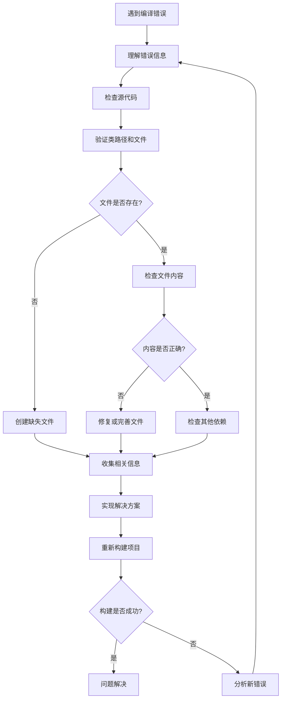
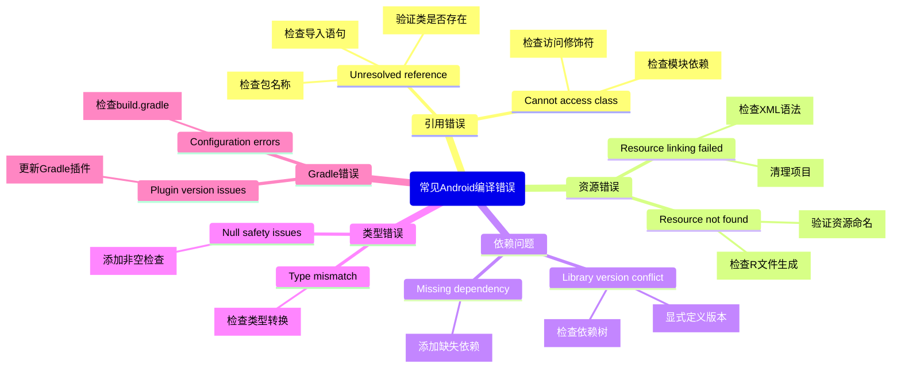

在Android开发过程中，编译错误是每位开发者都会遇到的挑战。对于有一定Android开发经验但不太熟悉编译和调试流程的开发者来说，系统性地解决这些问题可能会比较困难。本文将通过一个真实案例，详细介绍如何分析和解决Android项目中的编译错误，帮助你提升调试能力。

<!--more-->

## 问题情境

想象一下，你刚接手一个Android项目，尝试构建时却遇到了如下编译错误：

```
> Task :app:compileReleaseKotlin FAILED
e: file:///path/to/MainActivity.kt:28:32 Unresolved reference: adapter
e: file:///path/to/MainActivity.kt:44:38 Unresolved reference: LogAdapter
e: file:///path/to/MainActivity.kt:58:22 Unresolved reference: LogAdapter
```

这类错误提示看似简单，但解决起来可能需要一系列有条理的思考和探索。接下来，我们会从错误分析开始，一步步演示如何找到并解决这个问题。

## 系统性分析方法

让我们先通过一个流程图来概览解决Android编译错误的系统方法：



这个流程图展示了从遇到编译错误到最终解决的完整过程。下面让我们详细讨论每个步骤：

### 1. 理解错误信息

遇到编译错误时，第一步是仔细阅读错误信息，理解它的具体含义：

- 错误类型：`Unresolved reference`（未解析的引用）表明代码中引用了某个不存在或无法访问的标识符
- 错误位置：明确指出了问题出现在`MainActivity.kt`文件的特定行号和位置
- 错误对象：`adapter`和`LogAdapter`是导致编译失败的未解析引用

这三条错误信息已经给出了重要线索：MainActivity类中使用了LogAdapter类，但编译器无法找到这个类的定义。

### 2. 检查源代码

确定问题后，下一步是查看相关源文件，了解实际使用情况：

```kotlin
// 查看MainActivity.kt的关键部分
private lateinit var logAdapter: LogAdapter

override fun onCreate(savedInstanceState: Bundle?) {
    // ...
    
    // 初始化适配器
    logAdapter = LogAdapter()
    
    // ...
}

private fun setupUI() {
    // ...
    
    // 设置RecyclerView
    val recyclerView = findViewById<RecyclerView>(R.id.rvLogs)
    recyclerView.layoutManager = LinearLayoutManager(this@MainActivity)
    recyclerView.adapter = logAdapter
}
```

通过代码可以看到，MainActivity确实使用了LogAdapter类来为RecyclerView提供数据。从导入语句中可以看到：

```kotlin
import ai.jiejue.mfdetector.ui.adapter.LogAdapter
```

### 3. 验证类路径和文件存在性

接下来我们需要检查LogAdapter类是否存在于指定的路径中：

```
/path/to/ai/jiejue/mfdetector/ui/adapter/LogAdapter.kt
```

我们可以通过检查文件系统来验证：

```bash
# 检查adapter目录
ls /path/to/ai/jiejue/mfdetector/ui
```

结果显示adapter目录确实存在：

```
adapter
viewmodel
```

进一步检查adapter目录内容：

```bash
ls /path/to/ai/jiejue/mfdetector/ui/adapter
```

结果显示：

```
LogAdapter.kt
```

这很有趣 - 文件确实存在，但编译器却无法识别。这种情况可能有几种原因：

1. 文件存在但内容为空或不完整
2. 文件中的类名与导入的类名不匹配
3. 文件有权限问题，无法被读取

### 4. 检查文件内容

尝试读取LogAdapter.kt的内容：

```bash
cat /path/to/ai/jiejue/mfdetector/ui/adapter/LogAdapter.kt
```

如果没有输出内容，那么可能文件是空的或有权限问题。这就解释了为什么编译器找不到LogAdapter类的定义。

### 5. 收集相关信息

在创建缺失的类之前，我们需要了解它应该如何工作。这需要查看与之相关的类和接口：

1. **查看ViewModel类**：因为适配器通常与数据源关联
```kotlin
// LogViewModel.kt
class LogViewModel(application: Application) : AndroidViewModel(application) {
    private val repository: LogRepository
    // ...
    val logs = repository.getAllLogs()
    // ...
}
```

2. **查看数据模型**：了解适配器需要处理的数据类型
```kotlin
// LogEntry.kt
@Entity(tableName = "logs")
data class LogEntry(
    @PrimaryKey(autoGenerate = true)
    val id: Long = 0,
    val timestamp: Long,
    val eventType: String,
    val filePath: String,
    @TypeConverters(ProcessListConverter::class)
    val processes: List<ProcessInfo>
)

data class ProcessInfo(
    val packageName: String,
    val appName: String,
    val status: String
)
```

3. **检查布局文件**：了解UI元素和视图结构
```xml
<!-- item_log.xml -->
<androidx.cardview.widget.CardView>
    <LinearLayout>
        <TextView android:id="@+id/tvTimestamp" />
        <TextView android:id="@+id/tvEventInfo" />
        <TextView android:id="@+id/tvFilePath" />
        <TextView android:id="@+id/tvProcesses" />
    </LinearLayout>
</androidx.cardview.widget.CardView>
```

## 实施解决方案

基于收集到的信息，我们现在有足够的了解来实现LogAdapter类：

### 1. 创建LogAdapter类

```kotlin
package ai.jiejue.mfdetector.ui.adapter

import android.view.LayoutInflater
import android.view.View
import android.view.ViewGroup
import android.widget.TextView
import androidx.recyclerview.widget.DiffUtil
import androidx.recyclerview.widget.ListAdapter
import androidx.recyclerview.widget.RecyclerView
import ai.jiejue.mfdetector.R
import ai.jiejue.mfdetector.data.model.LogEntry
import java.text.SimpleDateFormat
import java.util.Date
import java.util.Locale

class LogAdapter : ListAdapter<LogEntry, LogAdapter.LogViewHolder>(LogDiffCallback()) {

    override fun onCreateViewHolder(parent: ViewGroup, viewType: Int): LogViewHolder {
        val view = LayoutInflater.from(parent.context)
            .inflate(R.layout.item_log, parent, false)
        return LogViewHolder(view)
    }

    override fun onBindViewHolder(holder: LogViewHolder, position: Int) {
        val logEntry = getItem(position)
        holder.bind(logEntry)
    }

    class LogViewHolder(itemView: View) : RecyclerView.ViewHolder(itemView) {
        private val tvTimestamp: TextView = itemView.findViewById(R.id.tvTimestamp)
        private val tvEventType: TextView = itemView.findViewById(R.id.tvEventType)
        private val tvFilePath: TextView = itemView.findViewById(R.id.tvFilePath)
        private val tvProcesses: TextView = itemView.findViewById(R.id.tvProcesses)
        
        private val dateFormat = SimpleDateFormat("yyyy-MM-dd HH:mm:ss", Locale.getDefault())
        
        fun bind(logEntry: LogEntry) {
            tvTimestamp.text = dateFormat.format(Date(logEntry.timestamp))
            tvEventType.text = logEntry.eventType
            tvFilePath.text = logEntry.filePath
            
            // 处理进程信息
            val processesText = logEntry.processes.joinToString("\n") { 
                "${it.appName} (${it.packageName}): ${it.status}" 
            }
            tvProcesses.text = processesText
        }
    }
    
    class LogDiffCallback : DiffUtil.ItemCallback<LogEntry>() {
        override fun areItemsTheSame(oldItem: LogEntry, newItem: LogEntry): Boolean {
            return oldItem.id == newItem.id
        }
        
        override fun areContentsTheSame(oldItem: LogEntry, newItem: LogEntry): Boolean {
            return oldItem == newItem
        }
    }
}
```

### 2. 发现和修复布局不一致问题

在仔细检查item_log.xml布局文件后，我们发现LogAdapter中引用的`tvEventType`在布局中实际是`tvEventInfo`，这是一个不一致的命名：

```kotlin
// 错误版本
private val tvEventType: TextView = itemView.findViewById(R.id.tvEventType)

// 修正版本
private val tvEventType: TextView = itemView.findViewById(R.id.tvEventInfo)
```

这种不一致是导致运行时崩溃的常见原因，所以在编写适配器时要特别注意视图ID的匹配。

### 3. 重新构建项目

完成上述修改后，再次构建项目：

```bash
./build-release.fish
```

构建成功，编译错误已解决！

## 调试技巧与最佳实践

对于开发者而言，编译错误的类型很多，但解决方法通常是有规律可循的。下面这个图表概括了常见的Android编译错误类型及其解决思路：




通过这个案例，我们可以总结出以下调试技巧和最佳实践：

### 1. 系统性调试方法

1. **理解错误信息**：不要只看到错误就慌张，仔细阅读错误信息，了解错误类型、位置和上下文
2. **检查源代码**：查看相关文件，了解代码的实际使用方式
3. **逐步排查**：从错误位置开始，逐步扩展检查相关的类、接口和资源文件
4. **收集依赖信息**：在解决问题前，收集足够的信息以了解组件之间的关系
5. **实施解决方案**：基于收集的信息，实施有针对性的解决方案

### 2. 预防编译错误的技巧

1. **命名一致性**：保持布局ID、变量名和类名的一致性，避免混淆
2. **定期构建**：频繁构建项目，及早发现问题
3. **模块化开发**：将功能划分为小模块，隔离潜在问题
4. **使用IDE提示**：充分利用Android Studio的代码检查和提示功能
5. **版本控制**：使用Git等版本控制工具，方便回溯和对比代码变更

## 额外思考：为什么会出现这个问题？

在实际开发中，这种"文件存在但内容为空"的情况可能由多种原因导致：

1. **代码合并冲突**：在团队协作中，合并代码时可能导致文件被清空
2. **Git操作错误**：不正确的Git操作可能导致文件内容丢失
3. **项目迁移问题**：在项目迁移过程中，某些文件可能未被正确复制
4. **编辑器问题**：某些编辑器操作可能意外清空文件内容

这提醒我们在团队协作和项目管理中要格外谨慎，确保代码完整性。

## 结论

解决Android编译错误需要系统性思考和分析能力。通过理解错误信息、检查代码依赖、收集相关信息，最后实施针对性解决方案，大多数编译问题都能够被有效解决。

希望这个实际案例能帮助你提升Android开发中的调试能力，建立起自己的排错思路和方法。记住，调试不仅是一种技能，更是一种思维方式，它需要耐心、细心和系统性思考。

---

通过本文的学习，你应该能够更自信地面对Android项目中的编译错误，并能够采用系统化的方法进行分析和解决。如果你有任何疑问或遇到其他类型的编译问题，欢迎在评论区分享！

**注**：图片链接有效期为10分钟，请及时保存。
