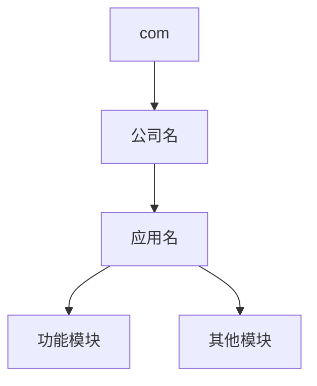

作为一名安卓开发者，你可能已经写了不少代码，但当准备将应用发布到应用商店时，往往会遇到一些意想不到的问题。包名设计就是其中最容易被忽视，却又影响深远的一环。

<!--more-->

## 包名的秘密：为什么是反向域名格式？

你是否曾经好奇过为什么安卓应用的包名看起来像是"倒过来"的域名？比如微信是 `com.tencent.mm`，而不是 `tencent.com.mm`？

这种命名约定源于 Java 的包命名传统。采用反向域名格式（如 `com.公司名.应用名`）主要是为了解决以下问题：

1. **全球唯一性**：因为域名是唯一的，所以基于域名的包名也能保证全球范围内不会冲突
2. **层次化管理**：从一般到特殊的结构使代码组织更清晰
3. **文件系统映射**：在 Java/Android 中，包名直接对应文件系统的目录结构



## 个人开发者如何选择包名？

如果你是个人开发者，没有公司域名，依然有以下选择：

1. **使用你自己的域名**：如果你有个人网站 example.com，可使用 `com.example.应用名`
2. **使用 Github 用户名**：`io.github.用户名.应用名`
3. **使用个人名称**：`dev.你的名字.应用名`

无论采用哪种方式，都要记住这个**黄金法则**：**包名一旦在 Google Play 发布，就永远无法更改**。这意味着你必须在项目初期就做好规划。

## 包名的结构设计

好的包名结构应当保持层次清晰且具有扩展性。以下是一些实际案例分析：

| 包名 | 分析 |
|------|------|
| `com.facebook.katana` | Facebook 主应用，简洁明了 |
| `com.ss.android.lark` | 字节跳动的飞书，平台标识显式标注 |
| `com.ea.game.pvz2_na` | EA 的植物大战僵尸2北美版，包含地区信息 |

对于个人开发者，建议遵循以下结构：

```
域名反转.项目名[.平台][.版本][.模块]
```

例如：
```
dev.你的名字.awesome.android.pro.networking
```

但要注意：**不要过度设计**。通常3-4段就足够了，过长的包名反而会增加维护成本。

## Google Play 发布时的"不可变"规则

在 Google Play 上发布应用时，有几个与包名相关的"不可变"规则必须了解：

1. **包名一旦发布无法更改**：如果你想彻底改变包名，只能发布一个全新的应用
2. **版本号只能升级，不能降级**：versionCode 只能增加，不能减少
3. **签名必须保持一致**：更新应用时必须使用相同的签名密钥

这些规则意味着，在首次发布前必须慎重考虑包名设计。

## 免费版与付费版：如何设计？

对于想要提供免费版和付费版的应用，有两种主流方案：

### 方案一：应用内购买（推荐）

使用同一个应用包，通过应用内购买解锁高级功能：

```java
// 伪代码示例
if (isPremiumUser()) {
    // 显示高级功能
} else {
    // 显示基础功能和升级提示
}
```

**优势**：
- 维护单一代码库
- 用户数据无缝共享
- 应用商店评分和排名集中
- 用户升级体验流畅

### 方案二：分开发布两个应用

```
com.你的域名.应用名          // 免费版
com.你的域名.应用名.pro      // 付费版
```

**适用场景**：
- 两个版本功能差异极大
- 付费版需要特殊权限
- 针对完全不同的用户群体

在当前移动应用生态中，方案一（应用内购买）已成为主流，除非有特殊需求，否则不建议使用方案二。

## 避坑指南：包名设计常见错误

1. **使用无所有权的域名**：如随意使用 `com.google` 开头的包名
2. **使用通用占位符**：如 `com.example.myapp`（仅适用测试）
3. **使用无层次结构的包名**：如直接 `myapp`
4. **频繁更换发布包名**：导致用户混淆，评价分散
5. **过度冗长**：如 `com.你的域名.category.subcategory.app.module.submodule`

## 结语

包名设计看似简单，实则需要前瞻性思考。对于个人开发者而言，建议采用与个人身份相关的域名结构，保持简洁明了，为未来的扩展留有余地。

记住：在 Google Play 上，包名是应用的"身份证"，一旦确定就无法更改。所以，在发布前多花一点时间规划，将为你未来的应用维护带来极大便利。

---

你有什么关于安卓应用发布的疑问吗？欢迎在评论区分享！
