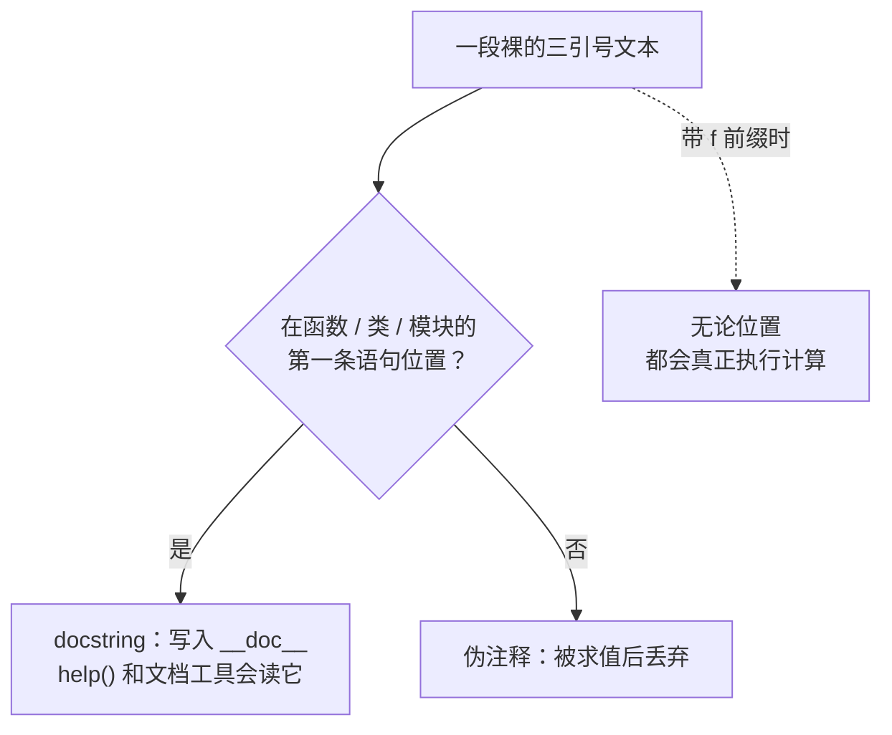

每个写过 Python 的人，都见过三个引号。多数人对它的印象停在「可以写多行文本」——这个印象没错，但不完整。试着回答两个问题：成对的三引号到底是注释还是字符串？在三个引号中间写一行 `# 这是注释`，它会被当成注释吗？

这两个问题的答案，恰好落在「注释」这个概念的真实边界上。这篇文章从三引号说起，理清它的三个身份；然后回答一个更根本的问题——注释是写给谁看的；再对比 Python、Bash、Fish 三种语言的注释机制；最后给出一个写完注释就能用的判断标准。

<!--more-->

## 一、三引号不是注释，它有三副面孔

「三引号是插入多行文本的吧？」——对，这是它的第一副面孔。但当同样的字面量被放到代码里的不同位置时，它会变成另外两种完全不同的东西。

### 身份一：多行字符串（数据）

最基本的一副面孔：被赋值或被使用的字符串。

```python
text = """第一行
第二行"""
```

换行、缩进、单引号、双引号都可以直接写在里面，不需要转义。

### 身份二：docstring（文档）

把一条裸字符串放在模块、类、函数的**第一条语句**位置，它就自动成为该对象的 `__doc__` 属性——`help()`、IDE 提示、文档生成工具全部读取它：

```python
def greet(name):
    """向指定用户问好。

    参数：name —— 用户名
    返回：问候语
    """
    return f"Hello, {name}!"
```

这是 Python 的风格标志：**文档不需要特殊语法，它就是一个字符串字面量**。对比其他语言用宏（`@doc`）或从注释里提取文档，Python 的做法是最简的一种。

### 身份三：伪注释（会被求值，然后丢弃）

把同样的裸字符串放在**非首条语句**的位置，就得到一块「伪注释」——很多人的临时代码屏蔽就是这么写的：

```python
def process(data):
    result = transform(data)
    """
    for row in result:
        validate(row)   # 旧逻辑，暂时屏蔽
    """
    return result
```

它看起来像注释，行为却和注释完全不同：

| | `#` 注释 | 三引号伪注释 |
|---|---|---|
| 解释器可见性 | 词法阶段直接丢弃，完全不可见 | **是表达式**：被求值成字符串对象，字节码里留下一条「加载-丢弃」指令 |
| f-string 前缀 | 不存在 | `f"""...{调用()}..."""` 会**真正执行计算** |
| 内容限制 | 任意内容 | 不能包含三引号序列自身，否则边界崩塌 |
| 屏蔽含 docstring 的代码 | 没问题 | 容易翻车（内部三引号会闭合外层） |

三个身份归纳成一张表：

| 身份 | 触发条件 | 谁在读它 | 成本 |
|------|----------|----------|------|
| 多行字符串 | 被赋值或使用 | 你的程序 | 它本来就是数据 |
| docstring | 位于模块/类/函数首条语句 | `help()`、IDE、文档工具 | 近乎零（编译期常量） |
| 伪注释 | 其他位置的裸字符串 | 没有人 | 一次求值 + 丢弃 |



**位置决定身份**是最反直觉的一点：一模一样的字面量，往上挪两行就从「文档」变成「被丢弃的表达式」。想屏蔽的代码恰好位于函数开头时，它会神不知鬼不觉地变成函数的 docstring——这是这个语法复用里最容易踩的坑。

回到开头第二个问题：**三引号里的 `#` 是文本的一部分，永远不是注释**。因为注释的识别发生在词法阶段，而字符串一旦开始，词法规则就切换成「原样收集字符，直到闭合引号」——`#` 在这个模式里只是一个普通字符。这也解释了为什么在任何语言里，`//`、`--`、`#` 都不会穿透字符串边界。

## 二、注释是给谁看的？——四类读者

了解了机制（解释器怎么读），再看意图（这条注释写给谁）。写注释前先问一句「这条注释写给谁看」，答案直接决定它该写什么：

| 读者 | 该写什么 | 例子 |
|------|----------|------|
| 未来的自己 | 为什么这样做 | `# 上游 API 有 off-by-one，见 issue #1234` |
| 协作者 | 契约：输入、输出、副作用 | docstring、usage 说明 |
| 机器 | 协议指令 | `#!/usr/bin/env python3`、`# noqa: E501`、`# shellcheck disable=SC2086` |
| 调试中的自己 | 临时屏蔽 | 三引号块、heredoc 块 |

前两类是常识，第四类人人都会。**第三类「机器读者」最容易被忽略，工程价值却最高**——写这种注释时，你其实在写配置；它长得像注释，读者却是工具链：

```python
#!/usr/bin/env python3          # 内核读：指定解释器
x = 1          # type: int      # mypy 读：类型标注
y = compute()  # noqa: E501     # flake8 读：豁免这条警告
z = weird()    # fmt: off       # black 读：这行别格式化
def f():       # pragma: no cover  # coverage.py 读：不计入覆盖率
```

```bash
# shellcheck disable=SC2086    # shellcheck 读：豁免这条检查
```

同一个 `#` 符号，内核、类型检查器、linter、格式化器、覆盖率工具各读各的。注释之所以是放这些指令的天然位置，原因很妙：**它对运行时零影响**——任何语言都不会执行注释，把控制信号伪装成注释，永远不会改变程序行为。

## 三、三种语言的注释机制：都只有一种写法

Python、Bash、Fish 在这件事上有罕见的共识：

| | Python | Bash | Fish |
|---|---|---|---|
| 行注释 | `#` | `#` | `#` |
| 块注释 | 无 | 无 | 无 |
| 伪块注释技巧 | 三引号（会被求值，有限制） | `: <<'COMMENT'` heredoc | 无，逐行 `#` |

### Bash 的 heredoc 技巧

Bash 里可以模拟块注释：

```bash
: <<'COMMENT'
这段文字会被完整读入，然后整块丢弃
$变量 不会被展开，`命令` 也不会执行（外层引号是关键）
COMMENT
```

原理：`:` 是一个内置命令，作用是什么都不做（等价于 `true`）。heredoc 是喂给它的标准输入，而它根本不读 stdin——整块文本就这样被安静地丢掉了。注意 `'COMMENT'` 外面的单引号：不加引号的话，`$变量` 和反引号命令都还会被**真正展开**，屏蔽代码时可能产生副作用。

### Fish 的取舍

Fish 长期不支持 heredoc（这是它与 Bash 最大的语法分歧之一），也没有对应的替代技巧——逐行加 `#` 是唯一方式。这个「不方便」是设计选择：Fish 把自己定位成交互式 shell，拒绝为文本处理场景引入复杂语法。关于 Fish 的更多安全写法，见[另一篇]( "Fish Shell 的安全编程：从文件重命名说起")。

### 为什么三种语言都没有块注释？

这不是缺失，是设计选择。Python 社区早年讨论过是否加入块注释，最终没有加入：`#` 可以叠很多行，而引入第二种机制会带来一串边界问题——嵌套怎么办？未闭合怎么报错？能不能出现在表达式中间？

对比 C 系的 `/* ... */`：这种注释**不能嵌套**，于是大量代码里出现「注释掉的代码里藏着 `/*`」，一删就崩的事故。**机制唯一 = 没有组合爆炸**。Python、Bash、Fish 一致选择了「一种注释机制，永远不会有嵌套和未闭合问题」这条路线。

### 两个同源陷阱

开头说的「三引号里不能出现三引号」，和 Bash 里这个经典陷阱其实是同一类问题：

```bash
echo a#b        # 输出 a#b —— # 此时是字面量
echo a #b       # 输出 a —— 前面有空白，# 才开启注释
```

一个说「闭合引号之前，一切都是文本」，一个说「`#` 只在词首或分隔符之后生效」。两个坑的共同根源是：**注释的识别依赖边界字符**。理解边界，两个坑都不会再踩。

## 四、一条判据：删掉它，信息会丢失吗？

机制讲完了，最后给一个写完注释就能用的判断标准。只有一句话：

**删掉这条注释，信息是否丢失？**

- 丢失了 → 它在承担代码无法表达的东西（为什么这么写、有什么历史约束、在哪踩过坑）。留着。
- 没丢失 → 代码本身已经说清楚了，注释是重复的噪音。删掉。

一句话版本：**代码说 what（做了什么），注释说 why（为什么这样做）**。互补，不重复。

```python
# 噪音：注释只是把代码翻译了一遍
i += 1   # i 加 1

# 资产：说出一行代码装不下的事
i += 1   # 补偿上游 API 的 off-by-one，见 issue #1234
```

## 五、一个视角：注释掉代码，是最轻的「暂停」

注释掉一段代码，在底层发生了什么？代码并没有消失——**它依然躺在文件里（存储保留），只是不再参与执行（计算暂停）**。取消注释，计算立刻恢复。这是程序员每天在用的、最轻量的「可撤回操作」：比删掉后重写轻，比 Git 回退快。

三引号注释在这个视角下有个微妙差别：`#` 是「完全暂停」——解释器根本看不到它；三引号是「空转一次再暂停」——文本被完整读入、求值成字符串，然后丢弃。选哪个，取决于你要不要那次空转的副作用（docstring 身份、f-string 真实求值、不能含三引号）。

实践建议就三条：

1. 屏蔽纯文本片段 → 两者皆可，怎么顺手怎么来；
2. 屏蔽的内容里有三引号、或想要零限制 → 用 `#`，逐行加上去；
3. 临时留档一大段、又不想逐行加 `#` → 三引号更省事，但要记得它**会被求值**这件事。

## 最后

开放问题留给你：在你最熟悉的项目里翻开一个文件，随便找一条注释，用第四节那个判据问一遍——删掉它，信息会丢失吗？如果答案是「不丢失」，删了它；如果答案是「不知道谁写的、为什么写」，那它可能正该被重写成一条「为什么」。认真整理十条，你对注释的感觉会和以前完全不一样。
