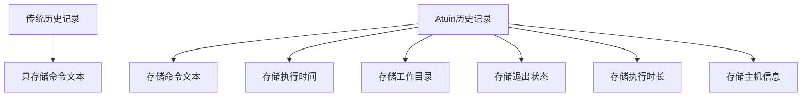

你是否曾经在终端中敲过一个很复杂的命令，然后过了几天就怎么也想不起来了？或者记得命令的一部分，但要在成百上千条历史记录中找到它却像大海捞针？Atuin 就是为解决这类问题而生的终端历史管理工具，它不仅能记录你的命令，还能记录命令的执行时间、工作目录、执行状态等上下文信息，让你的终端历史变得更加智能和易用。

<!--more-->

## 为什么需要更好的命令历史工具？

想象一下这个场景：小李是一名系统管理员，他每天要在服务器上执行各种维护工作。有一天，他需要再次执行两周前用过的一个特殊查询命令，但他只记得这个命令包含了"network"和"error"这两个关键词。

在传统的终端中，他可能要这样做：
1. 按下 `Ctrl+R` 开始反向搜索
2. 输入 "network"，然后不停地按 `Ctrl+R` 希望能找到那个命令
3. 如果没找到，再换个关键词尝试
4. 最终可能需要手动浏览整个历史列表

而使用 Atuin 后，小李只需要：
1. 按下 `Ctrl+R` 进入全屏搜索界面
2. 输入 "network error"
3. 立即看到所有匹配的命令，并带有执行时间、目录等信息
4. 选择正确的命令并执行

这就是命令行效率的巨大提升！

## Atuin 是什么？

Atuin（读作"ah-to-in"）是一个开源工具，它使用 SQLite 数据库替代传统的文本文件来存储你的 shell 历史。与传统的历史记录不同，Atuin 会记录更多信息：

- 命令的执行时间
- 执行的工作目录
- 命令的退出状态码（成功还是失败）
- 执行持续时间
- 主机名和会话信息

这样的设计让你可以基于这些额外信息进行更智能的搜索和过滤。



## 快速开始使用 Atuin

### 安装

最简单的安装方式是使用官方提供的安装脚本：

```bash
curl --proto '=https' --tlsv1.2 -LsSf https://setup.atuin.sh | sh
```

或者，你也可以使用包管理器安装：

- macOS: `brew install atuin`
- Arch Linux: `pacman -S atuin`
- 通过 Cargo: `cargo install atuin`

### 配置 Shell

安装完成后，需要在你的 shell 配置文件中添加 Atuin 的初始化命令：

对于 Bash，在 `~/.bashrc` 中添加：
```bash
eval "$(atuin init bash)"
```

对于 Zsh，在 `~/.zshrc` 中添加：
```bash
eval "$(atuin init zsh)"
```

对于 Fish，在 `~/.config/fish/config.fish` 中添加：
```fish
atuin init fish | source
```

### 导入已有历史记录

安装并配置好 Atuin 后，可以导入现有的 shell 历史记录：

```bash
atuin import auto
```

这个命令会自动检测你的 shell 类型并导入相应的历史记录。

## Atuin 的基本使用方法

### 搜索历史记录

Atuin 最基本和强大的功能是历史记录搜索。默认情况下，它会替换你的 `Ctrl+R` 快捷键和向上箭头键。

按下 `Ctrl+R` 后，你会看到一个全屏的搜索界面，可以输入关键词进行搜索。搜索结果会显示匹配的命令以及相关上下文信息。


在搜索界面中，你可以：

- 使用 `Enter` 键执行选中的命令
- 使用 `Tab` 键编辑选中的命令
- 使用 `Alt+数字` 快速选择特定的结果（例如 `Alt+1` 选择第一个结果）
- 多次按 `Ctrl+R` 在不同的过滤模式间切换（全局/主机/会话/目录）

### 命令行搜索和过滤

除了交互式界面，你还可以直接在命令行中搜索和过滤历史记录：

```bash
# 简单搜索
atuin search git commit

# 按退出状态码过滤（只显示成功的命令）
atuin search --exit 0 git commit

# 按工作目录过滤
atuin search --cwd ~/projects

# 按时间范围过滤
atuin search --after "yesterday 3pm" --before "today"
```

### 统计功能

Atuin 还提供了统计功能，帮助你了解自己的终端使用习惯：

```bash
# 显示基本统计信息
atuin stats

# 查看今天的统计
atuin stats today

# 查看本周的统计
atuin stats week
```

这些统计可以帮助你了解自己最常用的命令、平均命令执行时间等信息。

## 高级使用技巧

### 自定义输出格式

你可以使用 `--format` 参数自定义输出格式：

```bash
atuin search --format "{time} - [{duration}s] - {directory}$ {command}"
```

可用的格式变量包括：
- `{command}` - 命令文本
- `{exit}` - 退出状态码
- `{duration}` - 执行时长（秒）
- `{time}` - 执行时间
- `{directory}` 或 `{cwd}` - 工作目录
- `{host}` 或 `{hostname}` - 主机名
- `{user}` - 用户名
- `{session}` - 会话 ID
- `{relativetime}` - 相对时间（例如"2小时前"）

### 多设备同步

如果你在多台设备上工作，Atuin 可以加密同步你的历史记录：

```bash
# 注册账户
atuin register -u <用户名> -e <邮箱>

# 同步历史记录
atuin sync
```

所有同步的数据都会进行端到端加密，保证你的历史记录安全。

## 实际应用场景

### 开发者日常工作

对于软件开发者，Atuin 可以帮助你：

1. 快速找回之前成功编译或部署的命令
2. 查看特定项目目录下执行过的所有命令
3. 分析哪些命令耗时最长，帮助优化工作流

### 系统管理员任务

对于系统管理员，Atuin 可以帮助你：

1. 记录并轻松找回复杂的系统配置命令
2. 追踪在特定服务器上执行过的命令
3. 查找并重用那些成功解决过系统问题的命令

### 数据分析工作

对于数据分析师，Atuin 可以帮助你：

1. 保存并快速找回复杂的数据处理查询
2. 区分在不同数据集上执行过的命令
3. 追踪数据处理任务的执行时间，找出性能瓶颈

## 常见问题解答

### 如何清理历史记录中的失败命令？

如果你希望清理历史记录中的失败命令（退出状态码非0），可以使用以下命令：

```bash
# 删除所有退出状态码不为0的命令
atuin search --delete --exclude-exit 0
```

### 历史记录存储在哪里？

Atuin 的历史记录存储在 SQLite 数据库中，通常位于：
- Linux: `~/.local/share/atuin/history.db`
- macOS: `~/.local/share/atuin/history.db`
- Windows: `%APPDATA%\atuin\history.db`

### 如何备份 Atuin 数据？

最简单的方法是复制整个 Atuin 数据目录：

```bash
cp -r ~/.local/share/atuin/ ~/backup/atuin/
```

## 总结

Atuin 为传统的终端历史记录添加了强大的功能，让你能更高效地查找和重用命令。它的主要优势包括：

1. 带上下文信息的强大搜索功能
2. 友好的全屏搜索界面
3. 灵活的过滤选项
4. 实用的统计功能
5. 设备间的加密同步

无论你是开发者、系统管理员还是数据分析师，Atuin 都能显著提升你的终端工作效率。你需要做的就是花几分钟安装和配置它，然后享受它带来的便利。

你有没有想过，如果能将 Atuin 的上下文感知搜索与其他命令行工具结合，会创造出怎样的工作流？例如，将搜索结果直接通过管道传递给其他工具，或者基于历史记录自动生成常用操作的脚本？不妨尝试一下，探索更多可能性。
