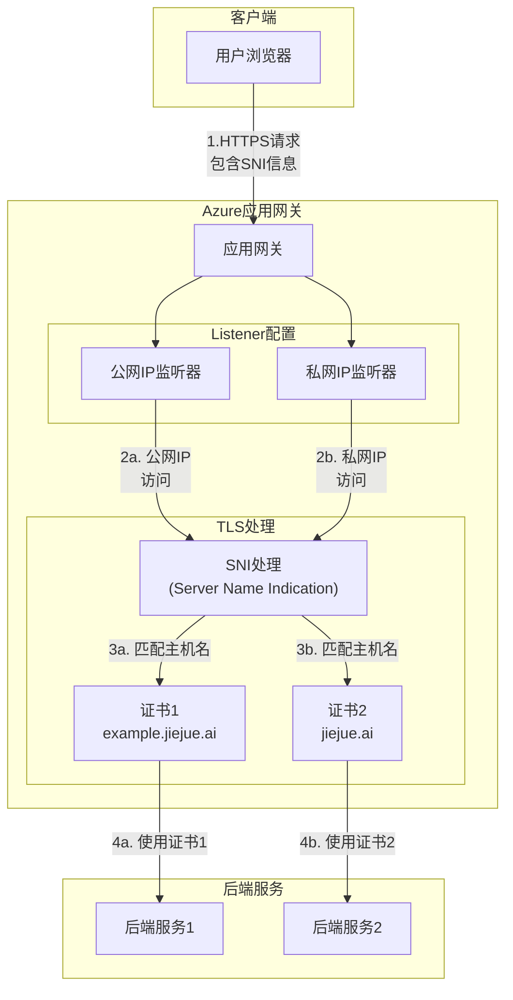

在将Azure Application Gateway从公网迁移到私网环境时，即使配置看似正确，你可能会突然遇到TLS连接被重置的问题。本文将分享一个看似简单却常被忽略的关键配置：SNI（Server Name Indication）参数设置，以及它如何解决连接重置问题。

<!--more-->

## 问题场景

最近，我们需要将一个部署在Azure Application Gateway上的服务从公网IP迁移到私网IP，以满足安全要求。迁移过程看似简单：在Terraform配置中将`frontend_ip`从`appGwPublicIpv4`更改为`appGwPrivateIpv4`。

然而，当配置应用后，即使正确修改了hosts文件进行DNS解析，尝试访问服务时仍然遇到了以下错误：

```
$ curl https://example.jiejue.ai/v1/chat/completions -v --resolve example.jiejue.ai:443:10.23.4.5
* Added example.jiejue.ai:443:10.23.4.5 to DNS cache
* Hostname example.jiejue.ai was found in DNS cache
*   Trying 10.23.4.5:443...
* Connected to example.jiejue.ai (10.23.4.5) port 443
* ALPN: curl offers h2,http/1.1
* (304) (OUT), TLS handshake, Client hello (1):
*  CAfile: /etc/ssl/cert.pem
*  CApath: none
* Recv failure: Connection reset by peer
* LibreSSL/3.3.6: error:02FFF036:system library:func(4095):Connection reset by peer
* Closing connection
curl: (35) Recv failure: Connection reset by peer
```

而使用telnet测试基本连接时却是正常的：

```
$ telnet 10.23.4.5 443
Trying 10.23.4.5...
Connected to example.jiejue.ai.
Escape character is '^]'.
Connection closed by foreign host.
```

这说明基本的网络连接是正常的，但在TLS握手阶段发生了问题。

## 解决方案：启用SNI

经过排查，我们发现增加一行简单的配置就解决了问题：

```hcl
require_sni = true
```

这个参数需要添加到HTTPS监听器的配置中。完整的Terraform配置差异如下：

```diff
listener = {
  frontend_ip   = "appGwPrivateIpv4"
  frontend_port = 443
  protocol      = "Https"
+ require_sni   = true
}
```

添加这一行后，服务立即恢复正常访问。

## 为什么会这样？SNI是什么？

SNI（Server Name Indication）是TLS协议的扩展，它允许客户端在SSL/TLS握手过程的早期阶段就指明它要连接的主机名。这使得服务器能够在同一个IP地址上提供多个不同域名的HTTPS服务，每个域名使用不同的SSL证书。

### SNI工作原理

SNI的工作流程如下：

1. 客户端发起HTTPS连接，在TLS握手的ClientHello消息中包含SNI扩展，指明目标主机名
2. 服务器根据这个主机名选择正确的SSL证书
3. 服务器使用选定的证书完成TLS握手



## 公网IP与私网IP的SNI行为差异

有趣的是，我们发现公网IP和私网IP环境下，Application Gateway处理SNI的方式存在差异：

```mermaid
flowchart TD
    subgraph "公网IP配置<br>require_sni = false"
        C1[客户端] -->|1.请求到公网IP| PG[应用网关<br>公网IP前端]
        PG -->|2.TLS握手<br>没有SNI也能工作| PH["主机检查<br>(宽松)"]
        PH -->|3.选择默认证书| PB[后端服务]
    end

    subgraph "私网IP配置<br>require_sni = false"
        C2[客户端] -->|1.请求到私网IP| VG[应用网关<br>私网IP前端]
        VG -->|2.TLS握手<br>没有SNI信息| VH["主机检查<br>(严格)"]
        VH -->|3.无法确定证书<br>连接重置!| VB[后端服务]
    end

    subgraph "私网IP配置<br>require_sni = true"
        C3[客户端] -->|1.请求到私网IP<br>包含主机名| SG[应用网关<br>私网IP前端]
        SG -->|2.TLS握手<br>使用SNI信息| SH["主机检查<br>(严格)"]
        SH -->|3.正确匹配证书| SB[后端服务]
    end
```



- **公网IP环境**：即使客户端不提供SNI信息（如直接通过IP访问），Application Gateway也能选择一个"默认"证书来完成TLS握手
- **私网IP环境**：如果客户端不提供SNI信息，Application Gateway会直接重置连接，导致TLS握手失败

这种差异可能是由Azure内部实现或安全策略决定的，但这一行为在微软官方文档中并没有明确说明。

## 关于SNI参数的更多细节

在Azure Application Gateway的Terraform配置中，`require_sni`参数定义如下：

```
require_sni - (Optional) Should Server Name Indication be Required? Defaults to false.
```

虽然官方将其描述为可选参数，并默认为`false`，但在私网环境中，它实际上是必需的，特别是在以下情况：

1. 多个站点共享同一个应用网关
2. 使用HTTPS协议
3. 前端IP配置为私网IP

## 排查建议

如果你在Azure Application Gateway私网环境下遇到类似的连接重置问题，请尝试以下排查步骤：

1. 检查基本连接（使用telnet等工具）
2. 验证证书配置是否正确
3. **检查SNI设置**，确保HTTPS监听器上设置了`require_sni = true`
4. 确保客户端请求包含正确的主机名（而不是直接使用IP）

## 为什么Azure Portal会自动处理这个问题？

有趣的是，如果你在Azure Portal中手动将Application Gateway的前端IP从公网切换到私网，Portal会自动启用SNI要求。这表明Microsoft意识到了这个行为差异，并在UI操作中进行了智能处理。

然而，在使用Terraform等IaC工具时，这种自动调整不会发生，需要手动添加`require_sni = true`配置。

## 最佳实践建议

基于我们的经验，建议采取以下最佳实践：

1. **始终启用SNI**：无论公网还是私网环境，都设置`require_sni = true`
2. **使用域名访问**：确保客户端通过域名而非IP直接访问服务
3. **明确在IaC中配置**：在Terraform等代码中显式设置SNI参数
4. **文档化配置要求**：在项目文档中注明这一关键配置

## 深入理解：Application Gateway的SNI架构

对于希望深入了解技术细节的读者，以下是Azure Application Gateway中SNI处理的架构图：



SNI配置影响着整个TLS握手流程，特别是在多站点环境中。当`require_sni = true`时，应用网关严格要求客户端提供主机名信息，这不仅提高了安全性，还确保了正确的证书选择和请求路由。

## 结论

在Azure Application Gateway的私网配置中，SNI参数扮演着关键角色，它不仅是一个可选的安全增强措施，而是确保服务正常运行的必要配置。理解公网和私网环境下的这种微妙差异，将帮助你避免不必要的故障排查时间，并设计出更健壮的云架构。

最后，这个案例提醒我们，即使是最简单的配置参数也可能对服务可用性产生重大影响，特别是在迁移或环境变更时，需要特别注意这些"默认"但关键的配置项。

你是否也遇到过类似的云服务配置问题？欢迎在评论区分享你的经验！
