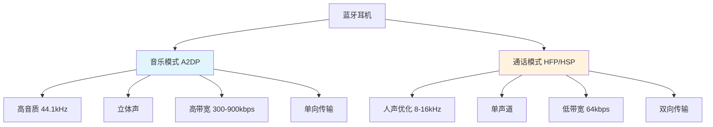

你有没有发现，当你连接蓝牙耳机时，手机的蓝牙设置里总是会显示两个选项：「媒体音频」和「通话音频」？为什么明明是同一副耳机，却要分成两种模式呢？今天我们就来聊聊这个有趣的技术话题。

<!--more-->

## 一个简单的观察引发的思考

想象一下这个场景：你正戴着蓝牙耳机听音乐，音质还不错，突然有电话打进来。接通后你发现，怎么对方的声音听起来有点"闷"，没有刚才听音乐时那么清晰？这不是你的错觉，而是因为你的耳机在这一瞬间切换了工作模式。

这种现象背后隐藏着一个精妙的技术设计。蓝牙耳机实际上就像一个"双重身份"的间谍，它可以在两种截然不同的角色之间自由切换：音乐播放器和电话免提器。

## 分工明确的"四兄弟"

要理解这个问题，我们得先认识蓝牙技术中的四个重要"角色"。就像一个乐队需要不同的乐手负责不同的乐器一样，蓝牙也有四个专门的"协议"来分工合作：

**A2DP（高级音频分发协议）**：这是专门负责传输音乐的"音响师"。它的任务就是把手机里的音乐用最好的音质传送到你的耳机里。

**AVRCP（音视频遥控协议）**：这是"遥控器管家"，负责处理播放、暂停、上一曲、下一曲这些控制指令。

**HFP（免提协议）**：这是"通话专家"，专门处理电话通话，不仅能传输声音，还能控制接听、挂断等操作。

**HSP（耳机协议）**：这是"基础通话助手"，提供最基本的通话音频功能。

为什么要这样分工呢？因为听音乐和打电话的需求完全不同。

## 听音乐 vs 打电话：两种完全不同的需求

### 听音乐时我们要什么？

当你听音乐时，你希望：
- **音质越好越好**：能听到贝斯的低音震撼，也能听到小提琴的高音悠扬
- **立体声效果**：左右声道分离，营造空间感
- **不用太在意延迟**：晚个100毫秒播放，你也察觉不出来
- **单向传输就够了**：只需要从手机传到耳机，不需要反向传输

### 打电话时我们要什么？

但是打电话时，需求完全变了：
- **实时性最重要**：延迟超过150毫秒就会影响对话流畅度
- **双向传输**：既要听到对方说话，也要把你的声音传给对方
- **人声清晰度**：只要能听清楚对方在说什么就行，不需要Hi-Fi音质
- **节能**：通话时间往往很长，需要省电

## 技术上的巧妙权衡

这两种不同的需求，导致了技术实现上的根本差异：

### 音乐模式（A2DP）的技术特点

想象一下，音乐就像一幅精美的油画，需要丰富的色彩和细节。音乐模式采用了类似的思路：

- **采样率高达44100Hz**：这意味着每秒钟要"拍摄"44100张声音的"照片"，就像高速摄影一样捕捉音乐的每个细节
- **立体声传输**：左右声道分别传输，营造空间感
- **高带宽**：可以达到300-900kbps的传输速率，相当于每秒传输几十万个字符

### 通话模式（HFP/HSP）的技术特点

而通话模式更像是素描，追求的是简洁明了：

- **传统通话采样率只有8000Hz**：只捕捉人声最关键的频率范围（300Hz-3400Hz）
- **单声道传输**：没必要搞立体声，听清楚就行
- **低带宽**：只需要64kbps，相当于每秒几千个字符

这种设计哲学可以用一个类比来理解：如果你要给朋友描述一朵花，发送高清照片（音乐模式）当然最好，但如果只是要告诉他"这是红色的玫瑰"（通话模式），一条简单的文字消息就足够了，而且传输更快、更省电。

## 频率的秘密：为什么通话音质听起来"不如"音乐？

这里涉及到一个物理概念：**频率范围**。

人耳能听到的声音频率范围大约是20Hz到20000Hz。音乐包含了这个范围内的丰富频率，从低音鼓的60Hz到小提琴泛音的15000Hz以上。

但是人声主要集中在300Hz到3400Hz这个相对狭窄的范围内。通话模式就是专门针对这个范围优化的，就像用望远镜观察远方的星星一样，通过"聚焦"特定频段来保证这部分内容的清晰度和传输效率。

这就解释了为什么你会觉得通话时声音"闷闷的"——因为系统有意过滤掉了人声频段之外的内容，专注于传输最重要的信息。

## 现代技术的进步

随着技术发展，通话音质也在不断改善：

**新一代mSBC编解码器**将通话采样率从8000Hz提升到16000Hz，明显改善了通话音质。但相比音乐的44100Hz，仍然有不小差距。

**蓝牙5.2引入的LE Audio和LC3编解码器**则是一个全新的方向，在保证音质的同时大幅降低功耗，被称为"蓝牙音频的革命"。

## 版本升级的真相

很多人认为蓝牙5.0比4.0音质更好，但实际上：

- **蓝牙版本主要影响连接稳定性、传输距离和功耗**
- **音质主要取决于音频协议和编解码器**，而不是蓝牙版本号
- 升级到蓝牙5.0耳机，你更可能感受到的是连接更稳定、延迟更低，而不是音质的显著提升

## 为什么要这样设计？

这种"分工明确"的设计看似复杂，实际上体现了工程师的智慧：

1. **节约带宽资源**：通话时不需要传输音乐级别的高音质，节省的带宽可以用来降低延迟
2. **节约电量**：处理简单的通话音频比处理复杂的音乐信号耗电更少
3. **优化用户体验**：每种模式都针对特定场景做了最优化

这就像高速公路分车道一样：货车走货车道，小汽车走小汽车道，各行其道才能保证整体效率最高。

## 小结

下次当你注意到蓝牙设置里的"媒体"和"通话"选项时，你就知道这背后隐藏着精妙的技术分工。这不是设备厂商的随意设置，而是整个蓝牙技术生态系统经过深思熟虑的设计。

每一次模式切换，都是你的耳机在不同的"专业技能"之间切换，为你提供当前场景下的最佳体验。这种看似简单的功能背后，承载着工程师们对用户需求的深刻理解和技术权衡的智慧。

科技的魅力往往就在于此：那些我们习以为常的便利功能，背后都有着令人惊叹的技术故事。
