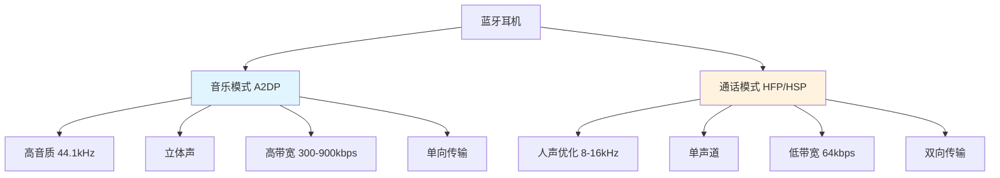

Вы когда-нибудь замечали, что при подключении Bluetooth-гарнитуры в настройках Bluetooth вашего телефона всегда отображаются две опции: "Медиа-аудио" и "Аудио для звонков"? Почему очевидно, что это одна и та же пара наушников, но разделенная на два режима? Сегодня мы поговорим об этой интересной технической теме.

<! ---далее-->

## Мысль, вызванная простым наблюдением

Представьте себе такой сценарий: вы слушаете музыку на своей Bluetooth-гарнитуре, качество звука довольно хорошее, и вдруг вам звонят. Когда вы отвечаете на звонок, то понимаете, что голос собеседника звучит немного "приглушенно" и не так четко, как когда вы слушали музыку ранее. Это не ваша иллюзия, а потому что ваша гарнитура в этот момент переключается в рабочий режим.

За этим явлением скрывается тонкий технический дизайн. Bluetooth-гарнитура на самом деле похожа на шпиона с "двойной личностью", она может свободно переключаться между двумя совершенно разными ролями: музыкального плеера и телефонного спикерфона.

## Четыре брата с четким разделением труда

Чтобы понять это, нам нужно осознать четыре важные "роли" в технологии Bluetooth. Как в оркестре для разных инструментов нужны разные музыканты, так и в Bluetooth есть четыре специализированных "протокола", которые работают вместе:

**A2DP (Advanced Audio Distribution Protocol)**: это "звукорежиссер", отвечающий за передачу музыки. Его задача - передать музыку с вашего мобильного телефона на гарнитуру с наилучшим качеством звучания.

**AVRCP (Audio Video Remote Control Protocol)**: Это "менеджер дистанционного управления", отвечающий за воспроизведение, паузу, предыдущую песню, следующую песню и другие команды управления.

**HFP (Hands Free Protocol)**: это "специалист по вызовам", специализирующийся на телефонных звонках, не только передающий звук, но и управляющий такими операциями, как ответ на звонок и вешание трубки.

**HSP (Headset Protocol)**: это "базовый помощник вызова", обеспечивающий самые основные функции аудиовызова.

Почему такое разделение труда? Потому что у прослушивания музыки и совершения звонков совершенно разные потребности.

## Слушать музыку и звонить по телефону: две совершенно разные потребности.

## Чего мы хотим, когда слушаем музыку?

Когда вы слушаете музыку, вы хотите:
- **Чем лучше качество звука, тем он лучше**: вы можете слышать басы и высокие ноты скрипки.
- **Стереоэффект**: разделение левого и правого каналов для создания ощущения пространства.
- **Не волнуйтесь слишком сильно о задержке**: вы не заметите, если она будет воспроизведена на 100 мс позже.
- **Достаточно односторонней передачи**: только с мобильного телефона на наушники, обратная передача не требуется

### Что мы хотим, когда звоним?

Но при совершении телефонного звонка потребности полностью меняются:
- **Реальное время наиболее важно***: задержка более чем на 150 миллисекунд повлияет на плавность разговора.
- **Двунаправленная передача**: вам нужно не только слышать собеседника, но и передавать ему свой голос.
- **Чистота голоса**: пока вы отчетливо слышите, что говорит собеседник, вам не нужно качество звука Hi-Fi.
- **Энергосбережение**: время разговора часто бывает очень долгим, поэтому необходимо экономить электроэнергию

## Технически продуманные компромиссы

Эти две разные потребности приводят к фундаментальным различиям в технической реализации:

### Технические особенности музыкального режима (A2DP)

Представьте, что музыка похожа на тонкую картину маслом, требующую насыщенных цветов и деталей. Музыкальный режим использует аналогичную идею:

- **Частота дискретизации до 44 100 Гц**: Это означает, что каждую секунду делается 44 100 "снимков" звука, запечатлевая каждую деталь музыки, подобно высокоскоростной фотографии.
- **Стереопередача**: левый и правый каналы передаются отдельно, чтобы создать ощущение пространства.
- **Высокая пропускная способность**: скорость передачи данных 300-900 кбит/с, что эквивалентно сотням тысяч символов в секунду.

### Технические характеристики режима разговора (HFP/HSP)

Режим разговора больше похож на эскиз, стремящийся к простоте и ясности:

- **Обычная частота дискретизации при разговоре составляет всего 8000 Гц**: захватывается только самый важный диапазон частот человеческого голоса (300-3400 Гц).
- **Моно передача**: нет необходимости в стерео, просто слышите все четко.
- **Низкая пропускная способность**: требуется всего 64 кбит/с, что эквивалентно нескольким тысячам символов в секунду

Эту философию дизайна можно понять по аналогии: если вы хотите описать другу цветок, то, конечно, лучше всего отправить фотографию высокой четкости (музыкальный режим), но если вы просто хотите сказать ему "это красная роза" (режим вызова), то достаточно будет простого текстового сообщения, а передача будет более быстрой и энергоэффективной.

## Секреты частоты: почему звонок звучит "тише", чем музыка?

Здесь задействовано физическое понятие: **частотный диапазон**.

Человеческое ухо слышит звук в диапазоне частот от 20 до 20 000 Гц, а музыка охватывает множество частот в этом диапазоне, от 60 Гц для бас-барабанов до более чем 15 000 Гц для скрипичных обертонов.

Однако вокал в основном сосредоточен в относительно узком диапазоне от 300 до 3400 Гц. Режим разговора оптимизирован для этого диапазона, как при наблюдении в телескоп за далекими звездами, путем "фокусировки" на определенных частотных диапазонах для обеспечения четкости и эффективности передачи в этой части спектра.

Это объясняет, почему вы можете чувствовать себя "приглушенным" во время разговора - потому что система намеренно отфильтровывает контент за пределами голосового диапазона и фокусируется на передаче наиболее важной информации.

## Достижения современной технологии

С развитием технологий растет и качество звонков:

**В новом поколении кодека mSBC** частота дискретизации звонков увеличена с 8000 Гц до 16000 Гц, что значительно улучшает качество звука при разговоре. Однако по сравнению с частотой дискретизации 44 100 Гц в музыке все еще наблюдается значительное отставание.

**Bluetooth 5.2 представил LE Audio и кодек LC3** - это совершенно новое направление, призванное обеспечить качество звука при одновременном значительном снижении энергопотребления, известное как "аудиореволюция Bluetooth".

## Правда об обновлении версий

Многие думают, что Bluetooth 5.0 лучше, чем 4.0, но это не так:

- **Версия Bluetooth в основном влияет на стабильность соединения, дальность передачи и энергопотребление**.
- **Качество звука зависит в первую очередь от аудиопротокола и кодека**, а не от номера версии Bluetooth.
- Обновив гарнитуру Bluetooth 5.0, вы, скорее всего, ощутите более стабильное соединение и меньшую задержку, чем значительное улучшение качества звука.

## Почему гарнитура разработана таким образом?

Такое "разделение труда" может показаться сложным, но на самом деле оно является отражением изобретательности инженеров:

1. **Экономия ресурсов полосы пропускания**: сэкономленная полоса пропускания может быть использована для уменьшения задержки, когда звонок не требует передачи музыки высокого качества.
2. **Экономия электроэнергии**: обработка простого звука вызова потребляет меньше энергии, чем обработка сложных музыкальных сигналов.
3. **Оптимизированный пользовательский опыт**: каждый режим оптимизирован для определенных сценариев.

Это как разделение полос на автостраде: грузовые автомобили едут по полосе для грузовиков, легковые - по полосе для легковых автомобилей, и каждый едет по своему пути, чтобы обеспечить максимальную общую эффективность.

## Резюме

В следующий раз, когда вы заметите в настройках Bluetooth опции "Медиа" и "Вызов", знайте, что за кулисами существует тонкое разделение труда. Это не случайная настройка производителей устройств, а целенаправленная разработка всей экосистемы Bluetooth.

Каждый раз, когда вы переключаете режимы, ваша гарнитура переключается между различными "экспертизами", чтобы обеспечить вам наилучшие впечатления в текущем сценарии. За этой, казалось бы, простой функцией стоит глубокое понимание инженерами потребностей пользователей и мудрость технических компромиссов.

В этом и заключается красота технологий: за удобными функциями, которые мы воспринимаем как должное, стоят удивительные технические истории.
