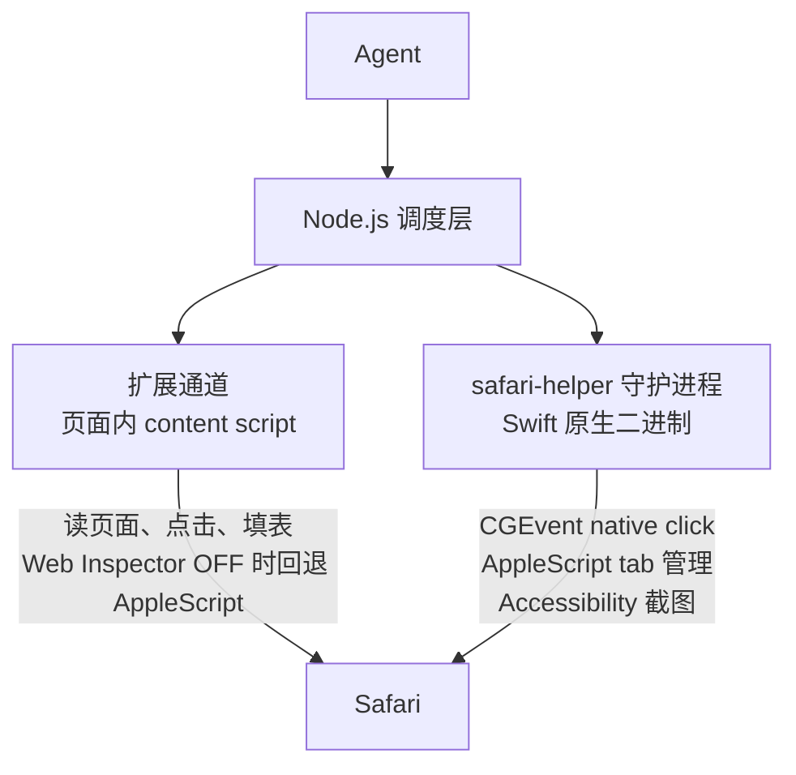

这篇文章不是「哪个工具最强」的速查表——它是一份决策指南。如果你是日常用户，你会找到为什么 Safari MCP 够用；如果你是前端开发者，你会看到为什么 Chrome DevTools MCP 是不可或缺的调试通道；如果你是自动化测试工程师，你会理解 Playwright 为什么能让你少写 80% 的等待代码。三个工具，三种架构哲学，对应三种使用场景。

<!--more-->

## 一条报错炸出的权限冰山

故事从一次 Safari MCP 的权限报错开始：

```
Not authorized to send Apple events to Safari.
```

查了 GitHub issue、读了源码、跑了 `safari_doctor`——最后发现问题的根源埋得比想象中深：macOS 的 TCC 权限数据库、Ad-hoc 代码签名、AppleScript 的进程间通信。一个浏览器自动化工具，为什么需要这么多「旁门左道」？

答案引出了第一个工具的全貌，以及三个工具之间最核心的差异。

### Safari MCP：被 Apple 的地基逼出来的三通道拼图

Chrome 有一道天生的门——**CDP（Chrome DevTools Protocol）**。这是一个完整、稳定、拥有上百个 domain 的调试级协议，通过 WebSocket 暴露给外部。任何工具只要挂上 `--remote-debugging-port`，就能通过这条通道访问 DOM、执行 JavaScript、拦截网络请求、注入事件。

Safari 没有这道门。WebKit 有自己的调试协议（Web Inspector Protocol），但它有两个致命限制：只对打开了 Web Inspector 的标签页有效，且 Apple 不给第三方用它做自动化的路线图。

于是 Safari MCP 被迫选择了另一条路：**用三条完全独立的通道拼出一座桥。**



每条通道都有独立的能力边界：

| 通道 | 能做 | 不能做 | 为什么存在 |
|------|------|--------|-----------|
| 扩展（content script）| 读页面（snapshot/tab_content）、JS 点击/填表、执行 JS（evaluate）| 穿透 WAF/Cloudflare——JS 合成事件 `isTrusted=false`，被 bot 检测拦截 | 最快的通道，覆盖 80% 日常操作 |
| CGEvent native click | 发 OS 级真实鼠标事件（`isTrusted=true`），穿透 WAF，截图 | 不读 DOM、不注入 JS——只是「点一下」 | 唯一能穿透 WAF 的合法方式 |
| AppleScript | tab 管理（获取 URL、新建、关闭、切换窗口）| 不交互 DOM——只能访问浏览器元信息 | tab 控制和扩展失效时的后备 |

三条腿各司其职，但各有一条腿会断的场景——而接缝就是性能和安全模型被削弱的地方。当你访问一个 Web Inspector 关闭的页面（icloud.com、appleid.apple.com 登录页、很多银行页面），扩展通道失效，操作回退到 AppleScript。此时 `snapshot` 返回的内容大幅减少——ref ID 没了，可点击元素列表没了，`click`、`evaluate` 直接不可用。

这是 Safari MCP 的第一道裂缝。第二道更棘手：**macOS 26（Tahoe）上 CGEvent.postToPid 即使 Accessibility 权限已授予也可能静默失败**——native click 通路直接断掉。这道裂缝不是 bug，是 Apple 在收紧系统级事件的权限模型。维护者在 v2.15.0 的 `safari_doctor` 里加了 Tahoe 版本检测，但目前没有替代方案。

**Safari MCP 适合你，如果你是**：
- 日常用户，用 agent 读文档、搜资料、操作已登录网站
- 不想多开一个浏览器、不想维护额外的登录态
- 能接受偶尔撞到 Web Inspector 关闭的页面时操作能力下降

## Chrome DevTools MCP：一道完整地基上的桥

接下来看第二个工具。如果说 Safari MCP 是「用三条木板拼出来的桥」，Chrome DevTools MCP 就是**一道直接架在 CDP 上的完整桥梁**。

**Chrome DevTools MCP**（Google 官方维护）坐落在 CDP 的原生能力之上。CDP 有上百个 domain——`Runtime`（JavaScript 执行与 Console）、`Network`（请求拦截与响应体读取）、`Debugger`（断点与堆栈）、`Performance`（性能剖析）、`DOM`（完整 DOM 遍历）——Chrome DevTools MCP 把这些 domain 暴露为 MCP 工具，agent 可以直接调用。没有扩展通道、没有 AppleScript 后备、没有 native click 与 JS click 的差异——**一条 WebSocket 连接，全能力覆盖。**

这和 Safari MCP 的「拼图」形成了结构性的差异：

| | Safari MCP | Chrome DevTools MCP |
|---|---|---|
| 架构 | 扩展 + AppleScript + CGEvent 三通道拼合 | **CDP 单通道，全能力原生覆盖** |
| Console 输出 | ❌ | ✅ `Runtime.consoleAPICalled` |
| 网络请求拦截 | ❌ | ✅ `Network` domain 全套 |
| JS 断点调试 | ❌ | ✅ `Debugger` domain |
| 性能剖析 | ❌ | ✅ `Performance`/`Profiler` |
| DOM inspect + snapshot | ✅ 但有损（Web Inspector 关闭时回退） | ✅ 完整 |
| WAF/Cloudflare 抗性 | ✅ CGEvent native click（Tahoe 上可能静默失败） | ❌ CDP 合成事件 `isTrusted=false` |

**Chrome DevTools MCP 适合你，如果你是**：
- 前端开发者，需要看 Console 日志、抓网络请求、性能剖析
- 需要跑复杂 `evaluate` 的场景——CDP 的 JS 执行不受 Web Inspector 限制
- 能接受额外开一个带 `--remote-debugging-port` 的 Chrome 实例（它不共享你 Safari 的登录态）

对前端开发来说，这是不可替代的——没有 Console 和 Network，你等于盲调。但对日常 agent 用户来说，需要额外开一个浏览器就意味着维护两套登录态：你的 GitHub、Apple ID、OAuth token 都在 Safari 里，Chrome 里要从头登录。这笔账划不划算，完全取决于你多频繁用到 Console 和 Network。

## Playwright：引擎之上的重量级平台

接着——对第二个工具的思考自然催生了对第三个工具的审视。如果说 Chrome DevTools MCP 是 CDP 的原生暴露，Playwright 就是在 CDP 之上构建的一层**全自动抽象**。它不只是测试工具——它的本质是**一个跨平台的浏览器自动化引擎**，测试框架只是这个引擎上最著名的上层应用。

### Playwright 到底是什么？

类比：Docker 是容器运行时引擎，跑 Nginx 是它最常见的用法，但它也能跑数据库、CI、开发环境。Playwright 同理：

```
Playwright 引擎（浏览器启动 + 控制 + 状态读取）
├── Playwright Test    → E2E 测试（自动等待 + 断言 + 隔离）
├── Playwright MCP     → agent 的浏览器自动化（高层语义 API）
├── Playwright Inspector → 可视化调试
├── Trace Viewer       → 录制与回放
└── 以及 rmux 这样的第三方项目 → 「Web Share」浏览器共享功能
```

rmux（文章里提到的终端复用器）用了 Playwright 的一个边缘功能——**作为程序化浏览器启动器来渲染实时终端画面**——它不需要测试、不需要断言、不需要隔离。这恰好证明了 Playwright 是一个通用平台，而非「只是测试工具」这个狭义定位。

### 三层核心能力

Playwright 之所以在测试领域封王，是因为下面三层能力每一层都解决了一个 CDP 裸操作解决不了的问题。

**第一层：自动等待（Auto-waiting）。** CDP 的每个操作都是裸的——你发一个 `click`，它帮你点了，然后立即返回。按钮触发的请求发出了没？DOM 更新了没？新页面渲染好了没？CDP 不负责。所以用 CDP 写自动化，代码里充斥着 `sleep(2000)` 和 `waitFor('.result')`。

Playwright 在设计之初就改变了游戏规则：**每个 action 执行前，先向浏览器查询真实渲染状态，确认一切就绪后再动手。** 一个 `click` 背后自动检查五个条件：元素存在、可见、稳定（动画结束）、不被遮挡、enabled。点击后会再等触发的导航完成、新页面就绪——然后才把控制权还给你。这就是为什么 Playwright 测试极少 flaky。

**第二层：Web-First 断言。** CDP 给你读 DOM 的能力，但验证一个 toast 是否出现、是否包含特定文字，你得自己写判断逻辑 + 重试循环。Playwright 内建了带有自动重试的断言：

```javascript
await expect(page.locator('.toast')).toBeVisible();     // 自动重试直到可见或超时
await expect(page.locator('.toast')).toContainText('成功');
await expect(page.locator('.cart-count')).toHaveText('3');
```

每个断言都是一个轮询器，持续验证直到通过。这不是 CDP wrapper——是 Playwright 引擎层在持续监控浏览器状态。

**第三层：Browser Context 隔离。** 这是架构上最精彩的设计，CDP 原生做不到。

CDP 中一个 target（标签页）就是一个实体。同时测两个用户登录、并行跑多套数据，你要么串行，要么开多个浏览器实例。Playwright 的方案更为根本：**Browser Context = 一个独立浏览器会话的完整沙箱。** 每个 context 有独立的 localStorage、cookies、sessionStorage——同一进程里可并行 N 个 context：

```
playwright.launch()    → 一个 Chromium 进程
  ├─ context1           → 用户 A 登录态
  │   ├─ page1 (TC-1)
  │   └─ page2 (TC-2)
  ├─ context2           → 用户 B 登录态（与 context1 完全隔离）
  │   └─ page3 (TC-3)
  └─ context3           → 无登录态
      └─ page4
```

对应你的 E2E 场景：「同一时间，用不同用户身份访问同一应用，验证各自看到的 UI」——没有 Browser Context，要么串行跑（慢），要么多开浏览器（资源爆炸）。

还有**网络 Mock**：`page.route()` 可以精确拦截并改写任意请求的响应体——测「后端挂了前端怎么表现」「支付失败页面怎么渲染」的标准手段。

**Playwright 适合你，如果你是**：
- 自动化测试工程师——**自动等待 + 断言 + Context 隔离**让你少写 80% 的 flaky 处理代码
- 需要并行测试多用户场景的团队
- **不适合**日常 agent 用户——它比 Safari MCP 重一个量级，且不共享已有登录态

## 决策矩阵

现在把三个工具放在同一张表里，按场景和受众一一对照：

| | safari-mcp | chrome-devtools-mcp | playwright-mcp |
|---|---|---|---|
| **架构哲学** | 扩展 + AppleScript + CGEvent 三通道拼合 | CDP 单通道，全能力原生暴露 | CDP 之上的一层全自动抽象引擎 |
| **Console + Network** | ❌ | ✅ | ✅（间接）|
| **JS 调试** | ❌ | ✅ Debugger domain | ❌（不是设计目的）|
| **WAF/Cloudflare** | ✅ CGEvent native click（Tahoe ⚠️）| ❌ isTrusted=false | ❌ isTrusted=false |
| **自动等待** | ❌ | ❌ | ✅ 引擎层内建 |
| **Web-First 断言** | ❌ | ❌ | ✅ 持续轮询 |
| **Browser Context** | ❌ | ❌ | ✅ 多登录态并行 |
| **已登录 session** | ✅ Safari 共享 | ❌ 需另开 Chrome | ❌ 独立浏览器 |
| **资源开销** | 零额外（Safari 已运行，Apple Silicon 上低 40-60% CPU）| 中（Chrome 进程）| 高（Chromium + Context + CDP）|
| **维护方** | 社区个人 | Google Chrome DevTools 团队 | Microsoft |
| **谁的首选** | 日常 agent 用户 | 前端开发者 | 自动化测试工程师 |

## 一条结论，三张标签

**你不需要选一个。** 三个工具不是竞争品——是对同一道问题的三种回答：**「agent 需要和浏览器对话，谁来当翻译？」**

Safari MCP 回答：用现有的东西，拼三块木板过去——轻、快、但有接缝。日常 agent 操作，这是最省事的。Chrome DevTools MCP 回答：在 CDP 上建一座完整的桥——任何 Debugger 域的能力都能调。前端调试不可或缺。Playwright 回答：在这座桥上加一层引擎，让通过它的人不用自己看路——自动等待、自动断言、自动隔离。测试领域的门槛从此被拉到最低。

需要看 Console 的时候开 Chrome + CDP，需要 WAF 穿透的时候回 Safari，需要并行测试的时候启动 Playwright。每条通道对应一个场景，不做非此即彼的选择。

---

留一个动手组合：在 `.mcp.json` 里同时配置 safari-mcp 和 chrome-devtools-mcp（它们暴露的工具前缀分别是 `safari_*` 和 `chrome_*`，互不冲突），在同一个 agent 会话里先用 Safari 打开一个已登录的 GitHub 页面，再用 Chrome 跑一次 `Runtime.evaluate`——感受双通道共存的实际体验。
