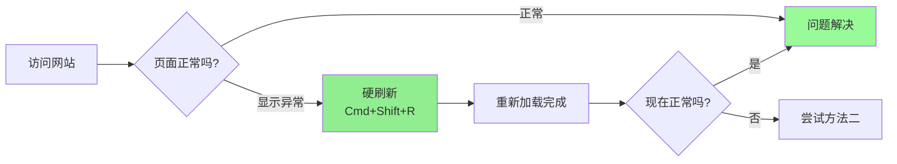
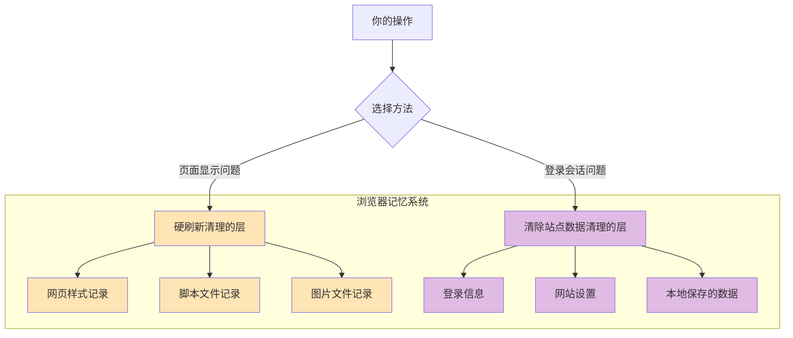

你是不是遇到过这种情况：明明网络好好的，但某个网站就是打不开，或者显示的内容看起来很奇怪？别急，这很可能是浏览器"记性太好"导致的。今天就来教你几招简单实用的解决办法。

<!--more-->

## 为什么会出现这种问题？

想象一下，浏览器就像你的助手，为了让你上网更快，它会把网站的内容"记下来"（这就是缓存）。下次访问同一个网站时，直接从"笔记本"里调出来，不用重新下载，速度当然快。

但问题来了：如果网站更新了内容，而浏览器还在用旧"笔记本"里的记录，就会出现各种奇怪的现象：
- 页面显示不完整或错位
- 登录不上去
- 功能按钮点了没反应
- 明明网站已经修复，你这边还是有问题

## 快速自查：真的是缓存问题吗？

有个简单办法可以立刻判断：**打开隐私模式（无痕浏览）试试**。

怎么打开隐私模式？
- 在浏览器里按 `Cmd+Shift+N`（Mac）或 `Ctrl+Shift+N`（Windows）
- 或者在菜单里找"新建隐私窗口"

如果在隐私模式下网站正常了，那就可以确定：问题出在缓存上。

## 解决方案：对症下药

根据不同的问题类型，我们有不同的"清理大法"。

### 方法一：硬刷新（最常用，最安全）

**适用场景：** 页面样式乱了、图片没更新、功能失效

**快捷键：**
- Mac：`Cmd + Shift + R`
- Windows/Linux：`Ctrl + Shift + R`

**为什么推荐这个方法？**
因为它只清理当前页面的资源缓存，不会让你退出登录，也不会丢失网站上保存的设置。

**操作演示：**
1. 访问出问题的网站
2. 按住 `Cmd + Shift`（Mac）或 `Ctrl + Shift`（Windows）
3. 再按一下 `R` 键
4. 等待页面重新加载



### 方法二：清除站点数据（解决登录问题）

**适用场景：** 登录不上、网站显示别人的账号信息、会话异常

**步骤：**
1. 点击地址栏左边的**小锁图标**（或网站图标）
2. 选择"**站点设置**"（Site Settings）
3. 找到"**使用情况**"（Usage）部分
4. 点击右边的"**清除数据**"（Clear Data）按钮
5. 确认清除

**注意：** 这个方法会让你退出登录，清除后需要重新登录。

**图示位置：**
```
地址栏:  [🔒] https://example.com
         ↓ 点这里
     [站点设置]
         ↓
     [清除数据]
```

### 方法三：开发者工具清除（精准控制）

**适用场景：** 需要保留部分数据，只清除特定类型的缓存

**步骤：**
1. 按 `F12` 打开开发者工具（看起来像代码的界面，别担心）
2. 点击顶部的"**Application**"标签
3. 左边找到"**Storage**"部分
4. 点击"**Clear site data**"按钮
5. 可以取消勾选不想清除的项目
6. 点击"Clear"

这个方法让你能选择：只清除 Cookie、只清除本地存储，或者都清除。

## 不同问题的快速对照表

| 遇到的问题 | 推荐方法 | 快捷键/操作 |
|-----------|---------|-----------|
| 页面样式错乱 | 硬刷新 | `Cmd+Shift+R` |
| 图片显示旧版本 | 硬刷新 | `Cmd+Shift+R` |
| 按钮点击无效 | 硬刷新 | `Cmd+Shift+R` |
| 登录不上 | 清除站点数据 | 地址栏锁图标 → 清除数据 |
| 显示别人账号 | 清除站点数据 | 地址栏锁图标 → 清除数据 |
| 表单数据异常 | 清除站点数据 | 地址栏锁图标 → 清除数据 |

## 浏览器的"记忆"系统

为了帮你更好地理解，我们用一个简单的比喻：



- **HTTP缓存层**（硬刷新清理的）：存放网页的"样子"——CSS样式、JavaScript脚本、图片等
- **应用数据层**（清除站点数据清理的）：存放你的"信息"——登录状态、网站设置、填写的表单等

## 实用建议

1. **遇到问题先试硬刷新**：90%的情况下都能解决，而且不会影响你的登录状态

2. **隐私模式是诊断神器**：不确定是不是缓存问题？先用隐私模式打开试试

3. **清除站点数据前做好准备**：记得把登录账号和密码找出来，清除后需要重新登录

4. **定期清理不是必需的**：缓存本来就是为了提速，不需要经常清理。只有出问题时才清理

5. **如果以上方法都不行**：可能是网站服务器本身的问题，或者网络连接问题，可以：
   - 换个网络试试（比如从WiFi换成手机热点）
   - 过一段时间再访问
   - 联系网站客服

## 总结

记住这三个方法就够了：

1. **页面显示有问题** → 硬刷新 `Cmd+Shift+R`
2. **登录有问题** → 地址栏锁图标 → 清除站点数据
3. **不确定是什么问题** → 先用隐私模式打开看看

下次再遇到网页打不开的情况，不用慌，照着这几步试试看，大多数问题都能自己搞定！
