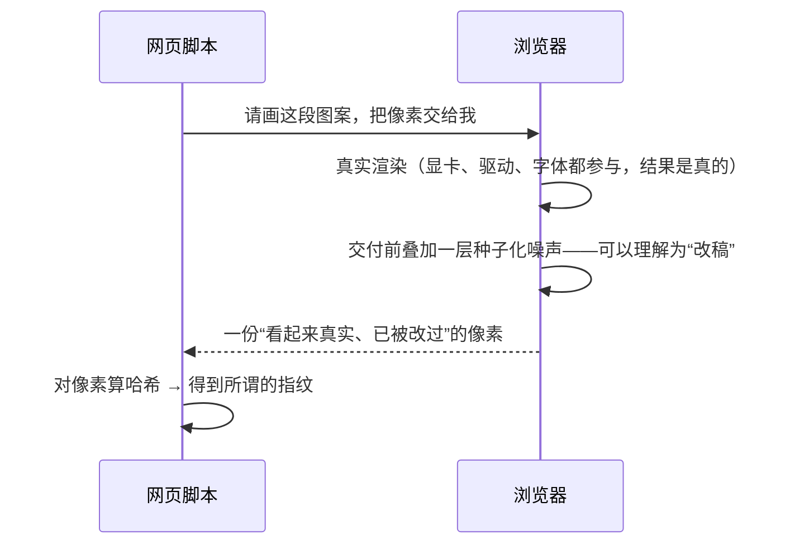

你有没有经历过这种事：清除了所有 Cookie，换到无痕窗口，甚至重启了路由器——再打开昨天逛过的购物网站，首页推的还是昨天看过的那双鞋。

网站不是"记得"你，而是在**认出**你。就像一个侦探不看身份证，只比对笔迹：同一支笔、同一个人写出来的字，换多少张纸，都认得出来。

这套"笔迹鉴定"在浏览器里的名字，叫**浏览器指纹（Browser Fingerprinting）**。这篇文章想回答三个问题：网站到底能从你的浏览器里"读"到哪些东西？浏览器在把这些数据交出去之前做了什么手脚？以及你在隐私测试网站上看到的「你的浏览器有随机化指纹」，到底是什么意思？

<!--more-->

## 一、追踪的目标：不是"你是谁"，而是"是不是同一个设备"

先分清两条路线。

**Cookie 路线**像"发号码牌"：服务器给你一个 ID，存在你的浏览器里，下次来访你举着牌子进场，服务器一看牌子就认出你。弱点很明显——号码牌在你手里，清掉就丢了。

**指纹路线**像"比对笔迹"：不存任何东西，每次你来，现场做一套"测量"，把结果组合成一个标识符。网站不需要知道你是谁，只需要判断"这次的你"和"上次的你"是不是同一台设备。

所以指纹从设计之初就瞄准两个苛刻的指标：

| 维度 | 要求 | 为什么 |
|------|------|--------|
| 设备维度 | 不同设备测出的值要不同（熵高） | 才能区分不同的"人" |
| 时间维度 | 同一设备每次测出的值要一样（稳定） | 才能把同一个"人"的多次访问关联起来 |

追踪的本质是**关联**——把今天和明天连起来。"稳定"这个要求会成为后面所有攻防的着力点，先记住它。

指纹的用途也不止广告：电商用它识别批量注册的"薅羊毛"小号；风控系统用它判断"这台设备是不是第一次登录这个账号"；反爬系统用它识破无头浏览器——真实设备的渲染"笔迹"复杂，脚本伪造的往往过于工整。

## 二、网站怎么"验笔迹"：一次指纹采集的全过程

一次典型的采集会收集这些：

- **基本属性**：User Agent、屏幕分辨率、时区、语言、CPU 核心数
- **字体列表**：你装了哪些字体（字体集合的差异度很高）
- **Canvas 渲染**：让浏览器画一张图，看画出来的像素
- **WebGL**：显卡型号、驱动信息、渲染细节
- **音频处理**：让浏览器的音频栈做一道计算题，看结果数值

后面三项最有意思，因为它们都是"让设备做一件事，然后看它做得怎么样"。以最经典的 Canvas 为例，BrowserLeaks 的测试页把自己的"考卷"公开贴着：

```js
var txt = "BrowserLeaks,com <canvas> 1.0";
ctx.font = "14px 'Arial'";
ctx.fillStyle = "#f60";
ctx.fillRect(125,1,62,20);              // 橙色矩形
ctx.fillStyle = "#069";
ctx.fillText(txt, 2, 15);               // 深蓝文字
ctx.fillStyle = "rgba(102, 204, 0, 0.7)";
ctx.fillText(txt, 4, 17);               // 半透明绿文字，与上一行重叠
```

绘制指令全网所有人都一样，但**每个设备"写出来的字"都不同**：显卡怎么抗锯齿、驱动怎么处理混色、系统怎么渲染字体——这些实现细节的微小差异最终落在像素上，脚本再把整张图的像素哈希成一个字符串。这就是"笔迹"。

音频测试同理：用 Web Audio API 的 `OfflineAudioContext` 在内存里**离线**渲染一段固定信号（经典配方是一个振荡器接一个压缩器），读回样本数值求和——得到类似 `124.04344884395687` 这样的数字。注意：它不播放声音、不用麦克风，纯粹是一道"声音的数学题"。

讲到这里，需要点破整篇文章的地基：

> **脚本读到的每个值，都不是从硬件上"读"下来的，而是浏览器"交"出去的。**

网页脚本活在浏览器的沙盒里，没有任何途径绕过浏览器直接摸硬件。它请求"把这张图的像素给我"，真正递出这只手的，是浏览器。这意味着——**防御的立足点出现了**。

## 三、亲手验一次：两个五分钟实验

理论说再多，不如自己看。打开两个公开测试页。

**实验一：[EFF Cover Your Tracks](https://coveryourtracks.eff.org)**

电子前哨基金会（EFF）的测试页会给出三种判定之一：

- **unique（独特）**：你的配置在人群样本里显得少见，追踪者一眼就能记住
- **randomized（随机化）**：浏览器在按边界给采集值"换笔迹"，跨站、跨会话的关联会失效——这是好消息
- **near-uniform（近似一致）**："藏进人群"，所有人都长一个样（Tor Browser 的路线）

**实验二：[BrowserLeaks Canvas](https://browserleaks.com/canvas)**

页面会现场画出上面那段代码的测试图，并展示这份 PNG 的三个层面：

- **Signature**：对整份图像数据算的哈希，也就是这张图的"指纹"
- **File Size**：PNG 文件的字节数
- **IDAT**：PNG 里装载压缩像素数据的数据块

然后做两个动作，把结果记下来：

1. 在**同一标签页里刷新**几次——Signature 不变（如果刷新也变，说明你这款浏览器的粒度更细，同样符合"按边界切换"的设计）
2. 把页面**关掉，重新打开**——Signature、File Size、IDAT 全变，但画面肉眼看上去一模一样

先记住"刷新不变、重开全变"这两个现象，第五节会解释：这正是浏览器防御机制的设计核心。

## 四、浏览器的反击：不换硬件，换"证词"

前面点破了地基：指纹脚本拿到的一切，都是浏览器递出去的。**浏览器是整条链上唯一有动机、也有能力"在交卷前改稿"的一环。** 它的武器库大致有四类：

| 思路 | 做法 | 代表 |
|------|------|------|
| **拦**（对付存储路线） | 拦截第三方 Cookie、把本地存储按站点隔离 | Safari ITP、Firefox ETP、Brave |
| **扰**（随机化） | 交付前把读数"轻轻地改一改"，让值随边界变化 | Brave 的 farbling、Safari 26 的 AFP（默认开启）、Firefox 的 FPP |
| **藏**（统一化） | 让所有用户交出同样的值，藏在人群里 | Tor Browser |
| **减**（削减暴露面） | 少给、给粗：冻结 UA、限制字体枚举、对第三方直接拿掉 Canvas/WebGL API | Brave、Safari、Chrome |

"扰"这一招最值得细看，因为它是主流浏览器的默认策略。以 Canvas 为例，一次采集的真实链路是：



"改稿"的手法是微调：像素值 ±1（人眼完全看不出）、音频样本加一点微小偏移、WebGL 读回的数据做点扰动。但指纹是对**整个数据块**算哈希——改掉几个字节的最低比特，整个指纹就面目全非。用 Brave 官方文档的话说：**随机化一个值，就能"毒化"整个组合指纹。**

## 五、随机但不失控：种子，与"作用域"

看到这里你可能会有一个疑问：如果每个值都是"随机"的，浏览器不会把正常网站搞坏吗？自己刷新一下值就变，网站不就知道"这设备动过手脚"？

答案在一个词：**种子（seed）**。

浏览器的噪声不是每次现摇骰子，而是由一个确定性函数生成的：

```
读数 = f(设备真实特征, 种子(作用域))
```

种子是浏览器内部的一个秘密值，网页永远读不到它；而种子的**作用域**——也就是"在什么范围内不变"——是按追踪者最需要关联的边界来切的：**每个会话、每个站点、甚至每个标签页，一份种子**（具体粒度因浏览器而异：Brave 的文档说按"会话 × 站点"切换；Safari 的同类防护在实测中会细到标签页）。于是就有了实验里观察到的现象：

| 动作 | 结果 | 原因 |
|------|------|------|
| 同一标签页内刷新 | 值**不变** | 还在同一个作用域里，种子没换 |
| 换一个标签页 / 关掉重开 | 值**变** | 跨出了作用域，种子换了 |
| 换一个网站 | 值**变** | 站点也是作用域的一部分 |
| 同一页面里把 canvas 读两次 | 值**完全一样** | 确定性——故意的 |

最后一行是设计的关键：如果每次读取都不一样，网站"读两次对比"就能识破伪装，正常画图的功能也会坏。所以浏览器追求的不是"看起来随机"，而是**"在追踪者需要的边界上精确断开"**：作用域之内，你像一个稳定的真实设备；跨过边界，你就像换了一个人。

用程序员熟悉的话说：这是伪随机数发生器的经典结构——**真随机的种子 + 确定性的展开**。对不知道种子的一方（网站），输出不可预测；对知道种子的系统（浏览器），随时可复现。

## 六、攻防的第二层：覆盖面 × 作用域

现在可以把整场攻防压缩成两个旋钮：

- **覆盖面**：浏览器对多少个读数做了手脚？（Canvas、音频、WebGL 被处理了，字体度量、时序侧信道、网络层特征可能没有）
- **作用域粒度**：这些手脚以什么边界切换？（会话级、标签页级、站点级）

防御方拧的就是这两个旋钮。追踪方对应地有三条路：

1. **找没被覆盖的读数**——防护只护住了几张表，追踪者就去翻其余的格子
2. **利用作用域内的稳定值**——同一个会话里，站内分析照样能工作（这是故意留的）
3. **统计去噪**——不读种子，直接用大量样本把噪声"平均"掉

第三条路有真实的研究背书：2024 年 12 月，Google 安全团队披露了一种可以把 WebKit 的 Canvas 噪声"去噪"、还原接近原始像素的方法；2025 年也有一篇题为《Breaking the Shield》的论文，用统计方法攻击 Brave 的 farbling。目前的结论相当克制：**没有完美的防御**——加噪式防护可以被统计分析削弱，而"统一化"（大家一起长一个样）相对更稳健。

几个诚实的提醒，作为这一节的收尾：

- **randomized ≠ 隐身**。有安全评测者的实测报告显示：即便清空数据、更换 IP，商业指纹服务仍能以高置信度重新识别出同一台设备——因为稳定锚点不止一个，被防护的只是其中一部分。
- **防护本身也会成为指纹**。"这台设备开了随机化防护"这个事实本身也是一种信息，EFF 明确提醒过这一点。
- **另有一批通道不受这套机制管辖**：IP 地址、登录账号、广告链接里的点击参数（clickid）——指纹防护都管不到。

## 七、作为普通读者，怎么做才合理

把上面所有内容翻译成可执行的建议：

1. **选一个自带防护的浏览器**：Safari（26 起 AFP 默认开启）、Brave（farbling 默认开启）、Firefox（严格模式）都内置了这套机制；高敏感场景可以上 Tor Browser。
2. **别装一堆"打乱指纹"的扩展**。EFF 的建议恰恰相反：**标准化优于伪装**——装太多扩展、改太多设置，每个改动本身都会让你更"独特"；质量不佳的随机化反而会变成新的指纹。
3. **先分清你想防谁**。防广告联盟的跨站画像，主流浏览器默认配置已经挡住大半；防有针对性的定向对抗，才需要 Tor 这种"藏进人群"的方案。
4. **把它当成体检而不是考试**：偶尔去 Cover Your Tracks 测一次，看到 randomized 说明机制在工作；看到 unique 也不必恐慌，它只说明你的配置在人群里比较少见。
5. **接受合理的预期**：这套防护的目标是**抬高追踪成本**，不是让网站"看不见你"。你访问的网站当然知道你在访问——防护要保护的是"这一次的你"和"下一次的你"之间那根线，能不能被连起来。

## 八、写在最后

这场攻防有一个耐人寻味的不对称：**防御方要护住所有的格子，追踪方只需要找到一个没护住的格子。** 而且双方都在走向统计化——攻击者用统计和机器学习把噪声"平均"掉、把零散的信号拼成画像；防御策略也在随之进化。这是一场没有终局的军备竞赛，也没有"装上就隐身"的银弹。

如果只能记住一句话，我希望是这句：

> 硬件不可改没关系——网站从来碰不到硬件。它拿到的每一份数据，都是浏览器这个"中间人"誊抄给它的。防御不需要换掉你的笔，只需要换掉誊抄时用的字帖。

最后一个问题留给你，只需要五分钟：去 `coveryourtracks.eff.org` 测一次，你是 unique 还是 randomized？再去 `browserleaks.com/canvas` 做那两个动作——刷新，和关掉重开。你亲眼看到的那条"变与不变"的边界，就是这篇文章讲的所有东西。
