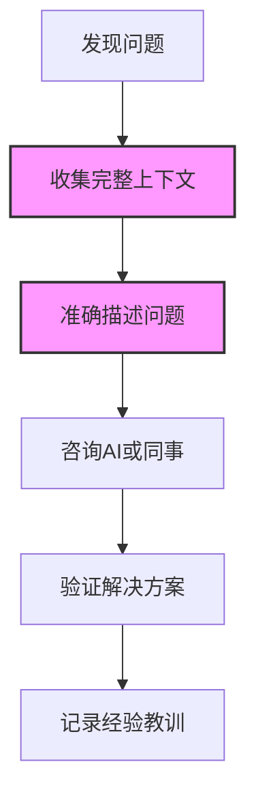

在云服务的世界里，官方文档经常被视为圣经。但即使是最权威的文档，也可能存在小错误或遗漏，这些微小的"陷阱"足以让你浪费数小时甚至数天的时间。今天，我就分享一次与Azure角色分配相关的debug经历，展示为什么有时我们需要对官方文档保持一定的警惕。

<!--more-->

## 问题场景

作为一名云基础设施工程师，我最近在为AKS（Azure Kubernetes Service）集群配置磁盘加密集（Disk Encryption Set）的访问权限。我严格按照微软官方文档的指导执行命令：

```bash
az role assignment create --role "Contributor" --assignee $aksIdentity --scope $diskEncryptionSetId
```

结果却遇到了这样的错误：

```
Cannot find user or service principal in graph database for '"0265f235-0740-4c69-875e-06e3113af063"'. 
If the assignee is an appId, make sure the corresponding service principal is created with 
'az ad sp create --id "0265f235-0740-4c69-875e-06e3113af063"'.
```

检查变量值后发现：

```bash
$ echo $diskEncryptionSetId
/subscriptions/659eaf27-2492-41f3-abb5-68ad43690880/resourceGroups/oasis-dev/providers/Microsoft.Compute/diskEncryptionSets/oasis-des-aks-dev
$ echo $aksIdentity
"0265f235-0740-4c69-875e-06e3113af063"
```

## 问题根源

仔细观察后发现，`$aksIdentity`变量的值被双引号包围了。而这个变量是通过官方文档中的另一条命令获取的：

```bash
set aksIdentity (az aks show --resource-group $myResourceGroup --name $CLUSTER_NAME --query "identity.principalId")
```

问题就出在这里！Azure CLI默认以JSON格式返回结果，所以`identity.principalId`的值带有引号。而角色分配命令期望接收的是不带引号的纯UUID值。

## 解决方案

解决方法很简单，使用string manipulation去除多余的引号：

```bash
# Fish shell中去除引号的方法
set aksIdentity (echo $aksIdentity | tr -d '"')
az role assignment create --role "Contributor" --assignee $aksIdentity --scope $diskEncryptionSetId
```

或者更优雅的方法是在最初获取变量时，就指定输出格式为TSV（Tab-Separated Values）：

```bash
set aksIdentity (az aks show --resource-group $myResourceGroup --name $CLUSTER_NAME --query "identity.principalId" -o tsv)
```

使用`-o tsv`参数可以让Azure CLI返回原始值，没有格式化的引号或其他标记。

## 深层思考：为什么会发生这种问题？

这个看似微小的问题实际上反映了在复杂技术栈中常见的一类问题：**工具链接口不匹配**。

Azure CLI的两个命令在设计上存在不一致：
- `az aks show`命令默认返回JSON格式的数据
- `az role assignment create`命令期望接收不带引号的UUID

官方文档虽然提供了正确的命令序列，但没有考虑到这种格式不匹配的情况，尤其是在脚本环境中的表现。

## 为什么这类问题很难发现？

1. **文档盲点**：官方文档通常假设读者了解工具的默认行为
2. **测试场景受限**：文档可能在特定环境中验证过，但未必覆盖所有shell环境或使用场景  
3. **无形的格式问题**：引号、空格、换行符等不可见字符很容易被忽略
4. **错误信息不直观**：错误消息未明确指出真正的问题（引号问题）

## 应对策略：如何避免文档陷阱？

以下是一些实用的策略，可以帮助你在使用官方文档时避免类似陷阱：

1. **检查变量值**：在调试时始终打印关键变量的值并仔细检查
   ```bash
   echo $aksIdentity | od -c  # 查看包括不可见字符在内的完整字符表示
   ```

2. **理解工具输出格式**：了解常用工具的默认输出格式及其特性
   - Azure CLI: 默认JSON格式
   - AWS CLI: 也是默认JSON格式
   - kubectl: 可能是YAML或自定义表格

3. **明确指定输出格式**：
   ```bash
   # Azure CLI
   az command --query "property" -o tsv
   
   # AWS CLI
   aws command --query "property" --output text
   
   # kubectl
   kubectl get resource -o jsonpath='{.property}'
   ```

4. **利用AI辅助**：将完整的命令、错误信息和环境上下文提供给AI助手，可以更快地发现这类微妙问题

## 如何提高排错效率？

在我这次的经历中，一个关键因素加速了问题解决：**提供完整上下文**。

当我把完整的错误信息、变量值和相关命令一并提供给AI助手时，问题在几秒钟内就被识别出来了。这比我自己可能花费的数小时调试时间要高效得多。



## 总结与反思

官方文档确实是学习和使用技术的宝贵资源，但我们不应盲目信任其中的每一个细节。将文档视为指南而非教条，保持批判性思维，并善用辅助工具（如AI、同行评审）可以大大提高我们解决问题的效率。

云计算领域的复杂性决定了我们永远无法预见所有可能的问题，但通过培养良好的调试习惯和开放的求助心态，我们可以更加从容地应对各种挑战。

下次当你遵循官方文档却遇到奇怪错误时，请记住：文档也是由人编写的，偶尔会有疏漏。多观察，多思考，必要时寻求帮助，你会发现解决方案往往比想象中更简单。

---

你有没有遇到过类似的官方文档"陷阱"？欢迎在评论区分享你的经历和应对之道！
