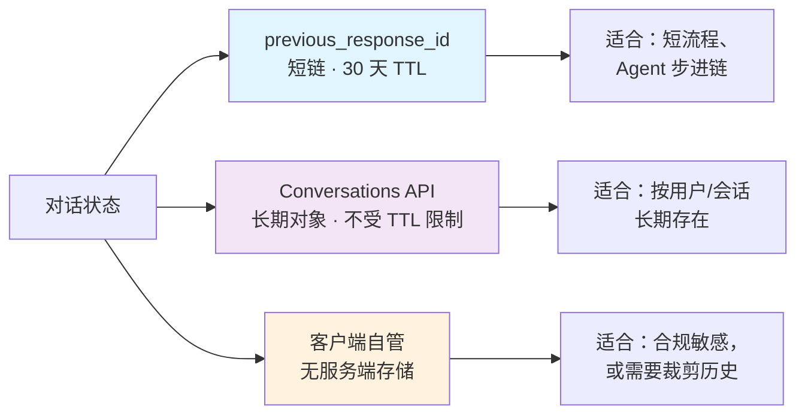
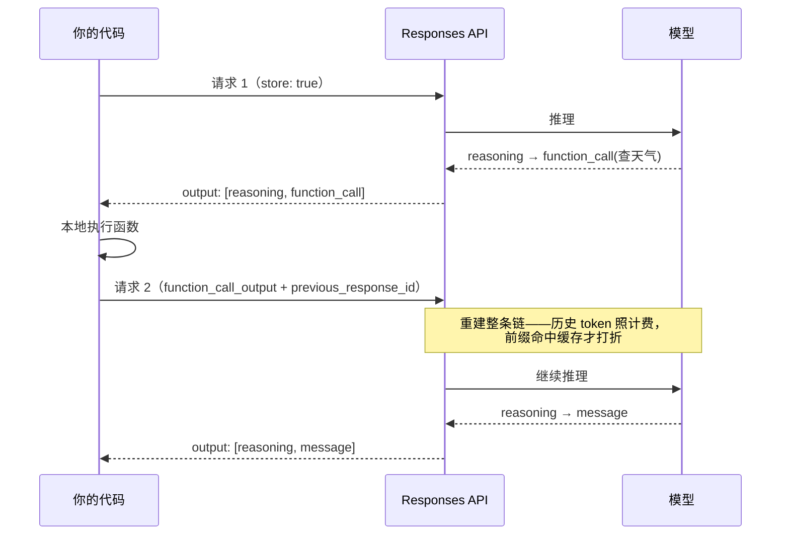

打开 OpenAI 的文档，会发现两个端点同时存在：老的 `/v1/chat/completions` 和新的 `/v1/responses`。官方建议新项目用后者，理由写着"性能、成本、Agent 能力"；但网上的对比文章经常拿错比较对象——把 GPT-3 时代的补全接口拖出来比，结论自然走样。本文跳过名词之争，只回答三个问题：状态存在哪、钱花在哪、"思考-行动"循环由谁在跑。事实核对自 2026 年 9–10 月的官方文档。

<!--more-->

## 一、先把三个端点摆正

很多对比文章开篇就错：拿 GPT-3 时代的 `/v1/completions` 和 `/v1/responses` 比，然后得出"completion 不支持工具调用"之类的结论。但你在代码里遇到的"completion"，几乎都是另一个端点。先把三个端点分清：

| 端点 | 出生 | 输入 → 输出 | 对话状态 |
|------|------|------------|----------|
| `/v1/completions` | GPT-3 时代，遗留接口 | 纯文本 prompt → 文本补全 | 无 |
| `/v1/chat/completions` | 2023 年起，行业事实标准 | messages 数组 → message | 无，历史由客户端自己带 |
| `/v1/responses` | 2025 年 3 月 | typed items → typed items | 默认由服务端托管 |

两个容易踩的点：

1. **"completion 不支持工具调用"只对第一行成立。** `/v1/chat/completions` 从 2023 年起就支持 function calling，是过去两年绝大多数 Agent 框架的基座。
2. **`/v1/chat/completions` 早已不只是 OpenAI 的端点。** 几乎所有厂商的兼容层都以它为事实标准，所以向 `/v1/responses` 迁移是一次真正的私有接口迁移，不像当年在不同厂商之间切换那样可平滑互换。这一点后面还会用到。

本文说的"两者的区别"，指的都是后两行。

## 二、Responses API 的设计：从"对话记录"到"事件账本"

Chat Completions 的输入输出都是 message：`role` + `content`。它描述的是**谁说了什么**。

Responses 把结构换成了 **typed items（带类型的条目）**：message 只是其中一种类型，和它平级的还有 `reasoning`（推理）、`function_call`（工具调用）、`function_call_output`（工具结果）、`web_search_call` 等。官方迁移指南的原话：

> Chat Completions uses messages as both input and output. Responses uses input and output arrays of typed Items.

用类比说：Chat Completions 递给你的是一摞**对话记录**；Responses 给你的是一本**事件账本**——谁说了什么、想了什么、做了什么、拿到了什么结果，全部是平级、可枚举的结构。

一次典型的 Agent 回合（使用自定义函数）长这样：

```
请求 1  output: [ reasoning, function_call(查天气) ]
           ↓ 你在本地执行函数
请求 2  input:  [ function_call_output(结果) ] + previous_response_id = 请求1
        output: [ reasoning, message("北京今天……") ]
```

这里有一组重要区分——**两类工具，决定"循环"由谁在跑**：

- **内置工具**（web search、file search、code interpreter、computer use、远程 MCP、image generation）：服务端执行。一次 API 请求内，模型可以连续调用多个工具，官方称之为 "agentic loop by default"。
- **自定义函数**：你执行、你回传，循环跨请求。API 替你做的，是记住"之前发生过什么"。

流式事件也随之重做了：`response.output_item.added`、`response.reasoning_summary_text.delta`、`response.function_call_arguments.delta`……这是带语义的事件流，而不是 Chat Completions 那种统一 delta 换了个名字。

## 三、"状态"到底是什么状态

先破除最大的一个直觉误解：**服务端的"状态"不是模型的记忆。**

类比：不是接线员记住了你，而是系统在每次接起电话之前，把工单完整读了一遍。

每次请求底层仍然是一次无状态的前向推理；所谓"有状态"，是服务端替你持久化了 Response 对象的完整 item 列表（输入 + 输出，包括推理条目和工具调用记录），`response.id` 是句柄。传入 `previous_response_id` 时，服务端沿链取出这些条目，拼进新请求的上下文。它托管的是**数据**，不是"想法的延续"。

几个决定使用边界的硬事实：

- **默认保留 30 天。** `store: true` 是默认值；Response 对象 30 天后过期，引用过期 ID 会得到 404。挂在 Conversation 对象上的条目则不受 30 天限制。
- **可关、可删。** `store: false` 关闭存储；`DELETE` 主动删除。零数据保留（ZDR）组织会被强制 `store: false`，此时靠**加密推理项**续推理：推理内容加密后随响应返回给你，下次请求带回，服务端在内存中解密、用完即弃。
- **`instructions` 不随链携带。** `previous_response_id` 不会带上上一轮的顶层 `instructions`，每轮都要重发——这是迁移时的经典坑。

三种对话状态的承载方式，取舍如下：



另外，2026 年还补了一块拼图：Responses 支持了 WebSocket 长连接模式，连接内维护近期响应的本地缓存，续链延迟更低；拿不到缓存的 ID 时，用 `previous_response_id: null` + 全量输入兜底。

## 四、成本：把"贵不贵"拆成三层看

"服务端存了上下文，是不是重复花了很多钱？"这个问题要拆成三层，每层结论不同。

**① 存储费：没有这一项。** 计价表里不存在"存储"收费条目。但先别高兴——看第二层。

**② 历史 token：每轮重新计费。** 官方文档写得毫不含糊：

> Even when using previous_response_id, all previous input tokens for responses in the chain are billed as input tokens in the API.

翻译过来：**"存档"不等于"免单"**。每轮请求，服务端把整条链重建出来喂给模型，历史 token 照收输入费。所以"服务端存了，就不用重复付钱"是错误直觉。

**③ 缓存：真正的省钱机制。** 那官方凭什么说更省？因为 Responses 的**缓存命中率明显更高**：官方内部测试显示缓存利用率比 Chat Completions 高 **40%–80%**，原因是推理链被稳定地持久化，请求前缀更一致、更容易命中缓存。缓存读取按折扣价计费（官方称部分模型最高可到 95% 折扣）；而在较新的模型上，写缓存按 1.25× 单独计费。

**真正的成本增量项，是"跨轮保留的推理内容"。** 这是明码标价的"质量换成本"：推理条目留在上下文里，每轮跟着计费。开发者论坛有人贴过账单：一份 1,716 token 的提示词，最终被计成 9,708 token——历史链、内置工具定义都在里面。官方也给了控制手段，包括 `reasoning.context`（`current_turn` / `all_turns`）显式选择推理上下文的携带范围。

成本控制清单：

| 手段 | 作用 |
|------|------|
| `reasoning.context: "current_turn"` | 不把全部历史的推理内容带进上下文 |
| `truncation: "auto"` | 上下文超窗时自动丢弃最旧的轮次 |
| `store: false` | 不服务端存储（配加密推理项使用） |
| 主动 DELETE | 用完即删，缩短保留窗口 |
| `prompt_cache_key` | 稳定路由，提高缓存命中 |

## 五、那 Completion 上到底有没有推理、工具和回复？

不是"有没有"的问题，是**"保留与回传机制"**的问题。一张对照表：

| 能力 | Chat Completions | Responses |
|------|------------------|-----------|
| 最终回复 | ✅ | ✅ |
| 自定义函数调用 | ✅（function calling） | ✅，且 item 化 |
| 内置工具 | 仅 web search 有兼容形式 | 6 种内置，专属 |
| 推理内容可见 | ❌ 从不返回（只有 token 计数） | ✅ 推理条目 + 摘要流式输出 |
| 推理跨轮保留 | ❌ 官方比喻：侦探每次出门就忘掉线索 | ✅ 保留（或加密回传） |
| `n` / `seed` / `logprobs` / `logit_bias` | ✅ | ❌ |
| 音频输入 | ✅（目前独有） | 尚未支持 |

而 2026 年的现实是：**功能剥离正在从模型侧发生**——

- GPT-5.4 起，Chat Completions 上只有把推理关到 `none` 才能调工具；
- GPT-6 Astra、GPT-6.1 Sol 在 Chat Completions 上完全不支持 function calling（官方推理指南原话）；
- file search、computer use、code interpreter、MCP、image generation、reasoning summaries 六项能力只在 Responses 提供；
- 旧的 Assistants API 已于 2026 年 8 月 26 日关停。

同时要诚实地说：**Chat Completions 本身仍然被支持，没有下线日期**（截至 2026 年 9 月的官方口径）。迁移压力来自模型能力，而不是端点关停倒计时。

## 六、"思考-行动"循环与 interleaved

"思考-行动循环"就是：**想 → 调工具 → 看结果 → 再想 → …… → 最后回话**。在 Responses 里，这个过程以条目序列的形式暴露出来：



关键在 **interleaved（交错）**：不是"出发前想完一整套计划再动手"，而是每拿到一个工具结果就**重新思考一次**，用真实数据校准下一步——打一枪、看一眼、修正瞄准。这个模式比"一次性规划"更抗现实偏差。

顺带说一个名词的出处："interleaved thinking" 最早是 Anthropic 在 2025 年 5 月为 Claude 4 发布的能力（以 beta 请求头 `interleaved-thinking-2025-05-14` 开启）；到 2026 年，Claude 4.6 的自适应思考已默认开启交错；MiniMax M2 是第一个通过 `reasoning_details` 字段暴露该能力的开放权重模型。OpenAI 在 Responses 里把同一模式原生化，并多做了两件事：**内置工具由服务端执行（循环收进单次请求）**、**推理条目跨轮保留（换棒时不丢线索）**。

官方博客的比喻很传神：Chat Completions 里的推理，像侦探每次离开房间就忘掉线索；Responses 让他"笔记本一直开着"。官方给出的数据：GPT-5 接 Responses 后 TAUBench 高 5%，纯粹来自保留推理。

一个常见误解要修正：**"平台自动编排思考-行动循环"只对内建工具成立**。你用自己的函数时，循环仍然由你的代码在跑，API 只是替你保管上下文。

## 七、官方为什么推荐它

把官方理由按证据强度排：

1. **性能**：推理跨轮保留 → 多轮工具场景表现更好（GPT-5 TAUBench +5%，官方内部数据）；
2. **成本**：缓存利用率提升 40%–80%，重复前缀走缓存折扣；
3. **Agentic by default**：一轮请求内多工具编排，内置工具开箱即用；
4. **状态化默认**：客户端不再自己维护历史数组，只存一个 response id；
5. **生态先发**：新能力全部落在 Responses；Assistants 关停、旗舰模型在 Chat Completions 上被剥离工具能力，都是同一个信号。

也要把话说全：Responses 现在还拿不到 `n`/`seed`/`logprobs`/`logit_bias`（评测、分类场景的刚需），音频输入目前也只有 Chat Completions 有。所以是**"新项目首选"，不是"存量必须全迁"**。

## 八、给你的决策清单

- **新项目、要做 Agent（多轮工具 + 推理）**：直接用 Responses，状态策略按上文三选一。
- **存量应用**：不必恐慌式迁移。先做一件事——把你现在多轮请求的 `usage` 打出来，看 `input_tokens_details` 里缓存命中了多少。这个数字决定你迁移的收益上限。
- **要 `n`/`seed`/`logprobs` 的评测或分类场景**：继续留在 Chat Completions，或接受能力缺失。
- **迁移前必定的两件事**：① 状态策略（短链 / Conversation / 自管，对应不同的 TTL 与合规含义）；② 前缀设计（`instructions` 每轮重发、放在前缀最前，缓存命中率才不会塌）。

留一个问题给你：如果"对话状态"交给供应商托管，你的应用会新增哪些失效模式——TTL 过期、跨区域合规，还是对某个供应商的软锁定？而这些代价，和"缓存命中率提升 40%–80%"之间，你愿意怎么交换？

## 参考

- [Migrate to the Responses API](https://developers.openai.com/api/docs/guides/migrate-to-responses)
- [Why we built the Responses API](https://developers.openai.com/blog/responses-api)
- [Conversation state](https://developers.openai.com/api/docs/guides/conversation-state)
- [Reasoning models](https://developers.openai.com/api/docs/guides/reasoning)
- [Prompt Caching 201](https://developers.openai.com/cookbook/examples/prompt_caching_201)
- [Better performance from reasoning models using the Responses API](https://cookbook.openai.com/examples/responses_api/reasoning_items)
