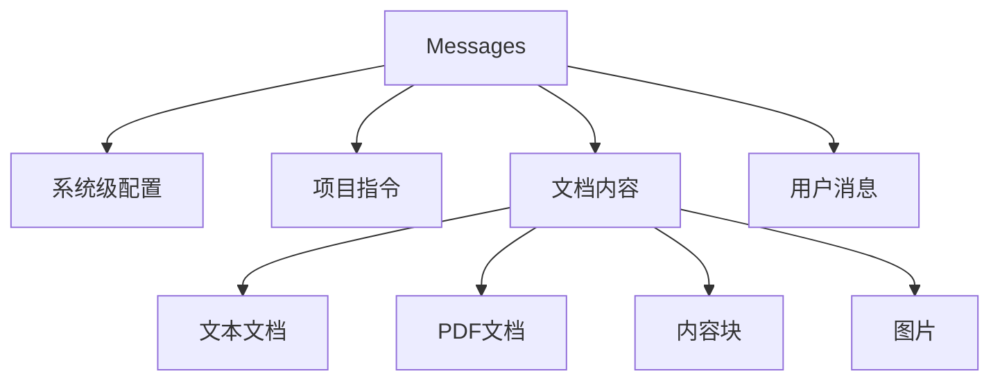

最近在深入研究 Claude API 时，发现官方文档对消息内容类型的描述比较分散。本文将系统地介绍 Claude API 中的各种内容类型、数据格式以及最佳实践方式。

<!--more-->

## 消息结构概览

Claude API 支持 JSON 和 XML 两种格式。两种格式各有特点：
- JSON 格式更适合程序化调用
- XML 格式更适合在提示词中使用

一个完整的消息结构应该包含：



## 内容类型详解

Claude API 支持以下几种内容类型：

### 1. text 类型

最基础的文本类型，支持普通文本内容：

```json
{
  "type": "text",
  "text": "文本内容",
  "source": "source.txt",        // 可选
  "title": "文档标题",           // 可选
  "context": "文档说明"          // 可选
}
```

### 2. pdf 类型

用于处理 PDF 文档：

```json
{
  "type": "pdf",
  "source": "document.pdf",
  "text": "<base64 encoded content>",
  "context": "PDF document metadata"
}
```

### 3. content 类型

用于结构化的内容块：

```json
{
  "type": "content",
  "content": [
    {"text": "第一个内容块"},
    {"text": "第二个内容块"}
  ],
  "source": "structured.txt"
}
```

### 4. image 类型

用于处理图片内容：

```json
{
  "type": "image",
  "source": {
    "type": "base64",
    "media_type": "image/jpeg",
    "data": "<base64 encoded image>"
  }
}
```

## 最佳实践示例

下面是一个完整的 API 调用示例，展示如何组织多种内容类型：

```python
import anthropic
import base64

client = anthropic.Anthropic()

# 准备 PDF 内容
with open("document.pdf", "rb") as f:
    pdf_content = base64.b64encode(f.read()).decode()

# 准备图片内容
with open("image.jpg", "rb") as f:
    image_content = base64.b64encode(f.read()).decode()

# 创建消息
message = client.messages.create(
    model="claude-3-5-sonnet-20241022",
    max_tokens=1024,
    messages=[
        {
            "role": "user",
            "content": [
                # 系统指令
                {
                    "type": "text",
                    "text": "使用以下规则处理文档...",
                    "context": "system instructions",
                    "title": "processing_rules.md"
                },
                # PDF 文档
                {
                    "type": "pdf",
                    "source": "document.pdf",
                    "text": pdf_content,
                    "context": "Main document for analysis"
                },
                # 结构化内容
                {
                    "type": "content",
                    "content": [
                        {"text": "Section 1: Introduction"},
                        {"text": "Section 2: Methods"}
                    ],
                    "source": "outline.txt"
                },
                # 图片
                {
                    "type": "image",
                    "source": {
                        "type": "base64",
                        "media_type": "image/jpeg",
                        "data": image_content
                    }
                },
                # 用户问题
                {
                    "type": "text",
                    "text": "分析上述文档和图片的内容"
                }
            ]
        }
    ]
)
```

如果在提示词中使用 XML 格式，可以这样组织：

```xml
<document>
  <source>main_doc.pdf</source>
  <context>主文档内容</context>
  <content>
    <text>文档内容...</text>
    <image>base64编码的图片内容</image>
  </content>
</document>
```

## 关键注意事项

1. **内容顺序**
   - 系统指令应放在最前面
   - 文档内容按重要性排序
   - 用户实际问题放在最后

2. **字段使用**
   - `context` 字段用于提供元数据说明
   - `title` 字段用于简短标识
   - `source` 字段用于文件溯源

3. **性能优化**
   - 使用文档引用避免重复内容
   - PDF 和图片注意大小限制（32MB）
   - 合理使用 prompt caching

## 使用建议

1. **保持一致性**
   - JSON 或 XML 格式选择一种并坚持使用
   - 标签命名保持统一
   - 文档引用方式保持一致

2. **结构化管理**
   - 使用嵌套结构表达层级关系
   - 合理组织多文档的顺序
   - 清晰标注文档类型和用途

3. **错误处理**
   - 验证 base64 编码的完整性
   - 检查文件大小限制
   - 处理格式转换异常

## 结语

熟练运用 Claude API 的各种内容类型，可以大大提升工作效率。关键是要理解每种类型的特点和适用场景，并在实践中不断优化使用方式。希望本文能帮助你更好地使用 Claude API。
