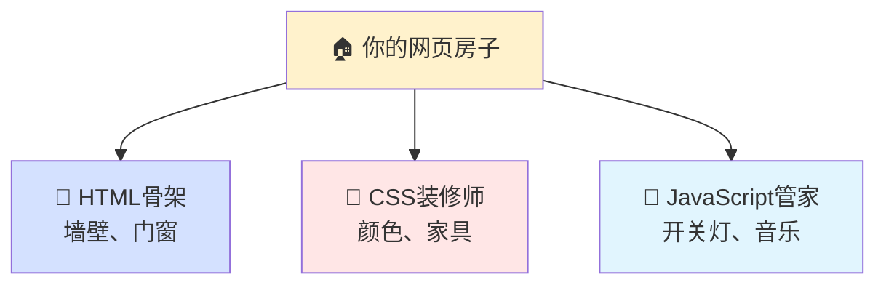
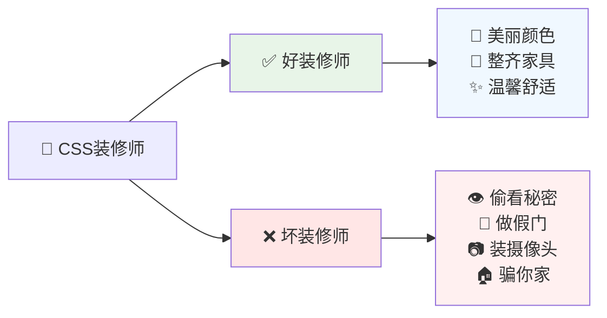
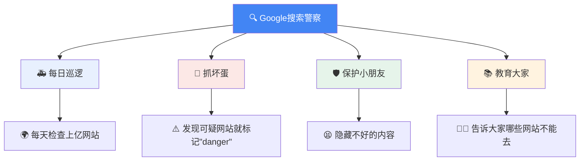
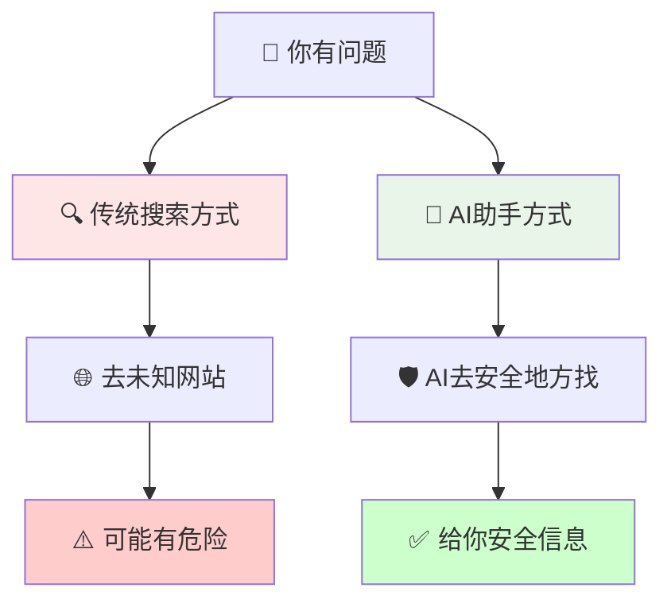
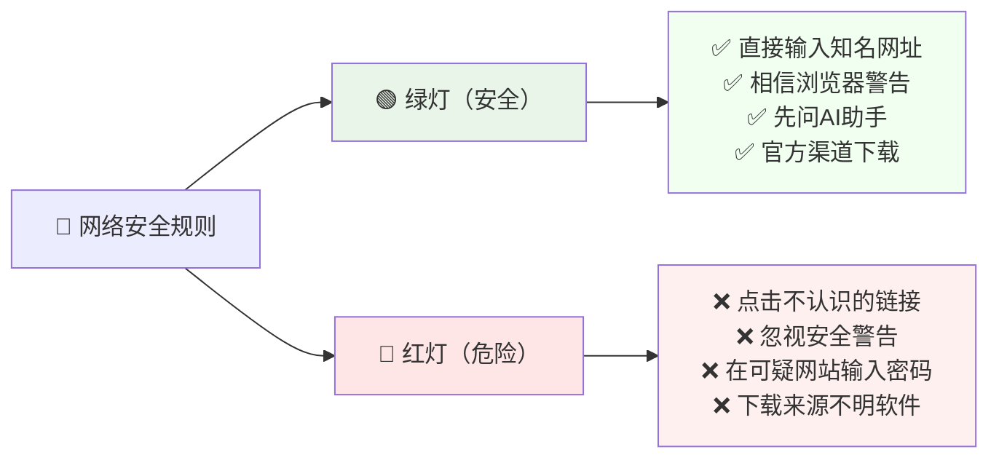

# 为什么有些网站不让我们用漂亮的颜色？——小朋友也能懂的网络安全故事

小朋友，你有没有好奇过，为什么在GitHub（一个程序员的乐园）或者安装软件的地方，我们不能用漂亮的彩色字体和会动的按钮呢？今天我们来讲一个有趣的故事，告诉你这背后的秘密！

<!--more-->

## 🏠 把网页想象成你的房子



首先，我们把网页想象成你的房子：

- **HTML** 就像房子的**骨架**（墙壁、门窗）
- **CSS** 就像房子的**装修师**（决定墙壁颜色、家具摆放）
- **JavaScript** 就像房子的**管家**（开关灯、播放音乐）

### 🎨 好的装修师 vs 坏的装修师



**好的装修师（安全的CSS）会这样做：**
- 把墙壁涂成你喜欢的颜色 🎨
- 把家具摆放得整整齐齐 🛋️
- 让房间看起来温馨舒适 ✨

**坏的装修师（恶意的CSS）会偷偷做坏事：**
- 在墙上挖洞，让坏人偷看你的秘密 👁️
- 把真正的门藏起来，做一个假门骗你 🚪
- 偷偷在房间里装摄像头 📷
- 让你以为你在自己家，其实在坏人的房子里 🏚️

## 🎭 坏的装修师有哪些骗人招数？

### 第一招：隐身术 👻
```css
/* 这是坏装修师的"隐身魔法" */
.真正的登录按钮 { 
    看不见: 是的; 
}
.假的登录按钮 { 
    放在最前面: 是的; 
}
```

就像你以为按的是"开电视"的按钮，其实按的是"给坏人打电话"的按钮！

### 第二招：变脸术 🎪
坏装修师可以让你的房间看起来像银行，其实是他们的陷阱房间：

```css
/* 坏装修师的"变脸魔法" */
.我的房间 {
    伪装成: 银行;
    颜色: 和真银行一样;
    标志: 偷来的银行标志;
}
```

### 第三招：偷听术 👂
```css
/* 坏装修师偷偷听你说话的魔法 */
输入框[你输入的密码^="a"] { 
    偷偷告诉坏人: "密码第一个字母是a"; 
}
```

这就像你每说一个字，装修师就偷偷记下来告诉坏人！

## 🛡️ 网站管理员是怎么保护我们的？

### 方法一：不让陌生装修师进门 🚫
```
GitHub叔叔说："对不起，我们不让任何装修师来，
虽然房间可能不够漂亮，但绝对安全！"
```

### 方法二：只用自己信任的装修师 ✅
```
安全网站说："我们只用经过考试、有证书的装修师，
而且我们会一直监督他们工作！"
```

## 🔍 为什么搜索引擎像警察叔叔？



Google叔叔和其他搜索引擎就像网络世界的警察：

### 🚨 他们每天在做什么？
1. **巡逻检查**：每天检查上亿个网站
2. **抓坏蛋**：发现可疑网站就标记"危险"
3. **保护小朋友**：看到不好的内容就隐藏起来
4. **教育大家**：告诉大家哪些网站不能去

### ⚠️ 但是警察叔叔也有限制：
- 坏人总是想新办法骗过警察
- 世界太大了，警察不能检查每一个角落
- 有些坏人很聪明，会伪装成好人

## 🤖 为什么AI助手更安全？

想象一下，如果你有一个超级聪明的机器人朋友：

### AI助手的超能力：
- **火眼金睛**：能看出哪些信息是真的，哪些是假的
- **保护盾**：在你和危险之间建立保护墙
- **翻译官**：把复杂的信息变成你能理解的话
- **安全向导**：只带你去安全的地方找信息

### 传统搜索 vs AI助手：



## 👨‍👩‍👧‍👦 怎么保护自己和家人？

### 给小朋友的建议：
1. **问大人**：上网前先问爸爸妈妈 👨‍👩‍👧‍👦
2. **认网址**：只去你认识的网站（就像只去认识的朋友家） 🏠
3. **看警告**：如果电脑说"危险"，马上停止 ⛔
4. **用AI**：有问题先问AI助手，比自己乱点更安全 🤖

### 给大人的建议：
1. **选择可信的浏览器**：使用来源明确的浏览器
2. **保持更新**：及时更新软件
3. **使用AI助手**：优先通过AI获取信息
4. **教育孩子**：和孩子一起学习网络安全

## 🎯 记住这些简单的规则：



### 🟢 绿灯（安全的做法）：
- 直接输入知名网站地址
- 相信浏览器的安全警告
- 先问AI助手再行动
- 从官方渠道下载软件

### 🔴 红灯（危险的做法）：
- 点击不认识的链接
- 忽视安全警告
- 在可疑网站输入密码
- 下载来源不明的软件

## 🌟 结语：安全比漂亮更重要

虽然有些网站看起来没有那么花哨，但这是为了保护我们的安全。就像学校的围墙虽然不够漂亮，但能保护小朋友一样。

记住：**在网络世界里，安全永远比漂亮更重要！**

当你长大后，如果你成为了程序员，也要记得这个道理：**用户的安全比网站的美观更重要。**

---

**小贴士**：把这篇文章分享给你的朋友和家人，让更多人了解网络安全的重要性！

*文章中提到的技术细节都经过简化，目的是让小朋友也能理解网络安全的基本概念。实际的技术实现比这复杂得多，但核心原理是相同的。*
