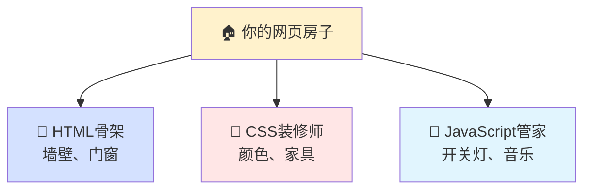
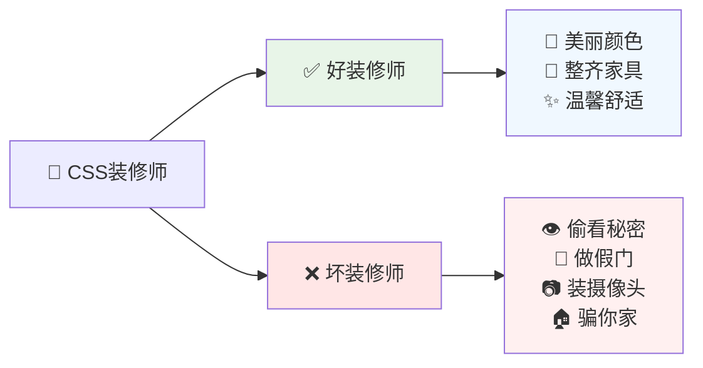
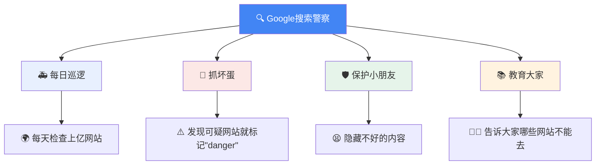
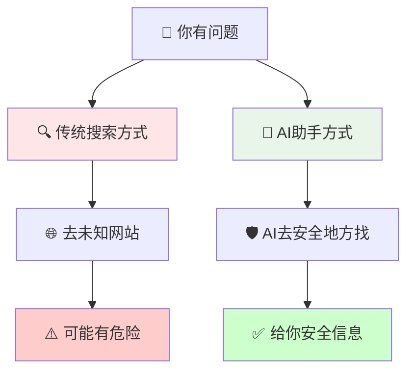

# Почему некоторые сайты не позволяют нам использовать красивые цвета? # Истории о безопасности в Интернете, которые понятны даже детям

Дети, вы когда-нибудь задумывались, почему мы не можем использовать красивые цветные шрифты и подвижные кнопки на GitHub (рай для программистов) или везде, где мы устанавливаем программы? Сегодня мы расскажем вам забавную историю, которая раскроет вам секрет!

<! ---далее-->

## 🏠 Представьте, что веб-страница - это ваш дом!



Для начала давайте представим, что веб-страница - это ваш дом:

- **HTML** - это как **каркас** дома (стены, двери, окна)
- **CSS** - это **декоратор** дома (выбор цвета стен, расстановка мебели)
- **JavaScript** - это **дворецкий** в доме (включает и выключает свет, играет музыку).

### 🎨 хороший декоратор против плохого декоратора



**Хороший декоратор (безопасный CSS) сделает следующее:**
- Покрасит стены в свой любимый цвет 🎨
- Аккуратно расставить мебель 🛋️
- Сделать комнату уютной и комфортной ✨

**Плохие декораторы (вредоносные CSS) будут тайно делать плохие вещи:**
- Выкопайте дыры в стенах, чтобы плохие парни могли подглядывать за вашими секретами 👁️
- Спрятать настоящую дверь и сделать фальшивую, чтобы обмануть вас 🚪
- Пронести камеру в комнату 📷
- Заставить вас думать, что вы находитесь в своем собственном доме, когда на самом деле вы находитесь в доме плохого парня 🏚️

## 🎭 Какие мошеннические трюки используют плохие декораторы?

### Уловка ### ### Первая уловка: скрытность 👻
```css
/* 这是坏装修师的"隐身魔法" */
.真正的登录按钮 { 
    看不见: 是的; 
}
.假的登录按钮 { 
    放在最前面: 是的; 
}
```

Как только вы думаете, что нажимаете кнопку "включить телевизор", на самом деле вы нажимаете кнопку "позвонить плохому парню"!

### Уловка #2: Лицевая сторона 🎪
Плохие декораторы могут сделать вашу комнату похожей на банк, хотя на самом деле это их комната-ловушка:

```css
/* 坏装修师的"变脸魔法" */
.我的房间 {
    伪装成: 银行;
    颜色: 和真银行一样;
    标志: 偷来的银行标志;
}
```


```css
/* 坏装修师偷偷听你说话的魔法 */
输入框[你输入的密码^="a"] { 
    偷偷告诉坏人: "密码第一个字母是a"; 
}
```

Как будто каждое ваше слово декоратор тайно записывает, чтобы передать плохим парням!

## 🛡️ Как вебмастера защищают нас?

### Способ 1: Не пускать чужих декораторов 🚫
```
GitHub叔叔说："对不起，我们不让任何装修师来，
虽然房间可能不够漂亮，但绝对安全！"
```

### Метод 2: Используйте только те декораторы, которым вы доверяете ✅
```
安全网站说："我们只用经过考试、有证书的装修师，
而且我们会一直监督他们工作！"
```

## 🔍 Почему поисковые системы похожи на дядюшек-полицейских?



Дядя Google и другие поисковые системы - это как полиция в онлайн-мире:

### 🚨 Что они делают каждый день?
1. **Патрулируют и проверяют**: каждый день проверяются сотни миллионов сайтов.
2. **Ловля плохих парней**: помечают подозрительные сайты как "опасные".
3. **Защита детей**: скрывать плохой контент, когда они его видят.
4. **Образование людей**: рассказать людям, на какие сайты не стоит заходить.

### ⚠️ Но возможности полиции ограничены:
- Плохие люди всегда придумывают новые способы обмануть полицию.
- Мир слишком велик, чтобы полиция могла проверить каждый уголок.
- Некоторые плохие парни достаточно умны, чтобы маскироваться под хороших парней.

## 🤖 Почему ИИ-помощники безопаснее?

Представьте, что у вас есть суперумный робот-друг:

#### Суперспособности ИИ-ассистента:
- **Огненные глаза**: способность видеть, какая информация правдива, а какая нет.
- **Защитный щит**: возводит защитную стену между вами и опасностью.
- **Переводчик**: превращает сложную информацию в понятные вам слова
- **Безопасный волшебник**: доставляет информацию только в безопасные места

### Традиционный поиск против ИИ-помощника:



### 👨‍👩‍👧‍👦 Как вы защищаете себя и свою семью?

### Советы для детей:
1. **Спросите взрослого**: спросите маму или папу, прежде чем выходить в Интернет 👨‍👩‍👧‍👦.
2. **Узнавайте сайты**: заходите только на те сайты, которые вам знакомы (например, только в гости к друзьям) 🏠.
3. **Следите за предупреждениями**: если компьютер говорит "Опасно", немедленно остановитесь ⛔ 4.
4. **Используйте ИИ**: безопаснее задать вопрос помощнику ИИ, чем возиться с ним 🤖.

### Советы для взрослых:
1. **Выбирайте надежный браузер**: используйте браузер из надежного источника.
2. **Будьте в курсе событий**: своевременно обновляйте программное обеспечение
3. **Используйте помощников искусственного интеллекта**: расставляйте приоритеты в информации с помощью искусственного интеллекта
4. **Обучайте своих детей**: узнавайте о безопасности в Интернете вместе со своими детьми

## 🎯 Запомните эти простые правила:

```mermaid
flowchart LR
    A[🎯 网络安全规则] --> B[🟢 绿灯（安全）]
    A --> C[🔴 红灯（危险）]
    
    B --> D[✅ 直接输入知名网址<br/>✅ 相信浏览器警告<br/>✅ 先问AI助手<br/>✅ 官方渠道下载]
    C --> E[❌ 点击不认识的链接<br/>❌ 忽视安全警告<br/>❌ 在可疑网站输入密码<br/>❌ 下载来源不明软件]
    
    style B fill:#e8f5e8
    style C fill:#ffe6e6
    style D fill:#f0fff0
    style E fill:#fff0f0
```.

### 🟢 Зеленый свет (безопасная практика):
- Вводите адрес известного сайта напрямую.
- Доверяйте предупреждениям браузера о безопасности
- Спрашивайте ИИ-помощника, прежде чем действовать
- Загружайте программное обеспечение из официальных источников

### 🔴 Красный свет (опасная практика):
- Переход по незнакомым ссылкам
- Игнорирование предупреждений о безопасности
- Ввод паролей на сомнительных веб-сайтах
- Загрузка программного обеспечения из неизвестных источников

## 🌟 Вывод: безопасность важнее красоты!

Хотя некоторые сайты выглядят не очень красиво, они предназначены для нашей защиты. Так же как школьный забор не слишком красив, но он защищает детей.

Помните:** В онлайн-мире безопасность всегда важнее красоты! **

Когда вы вырастете, если станете программистом, помните и об этом:** Безопасность пользователя важнее красоты сайта. **

---

**Совет**: поделитесь этой статьей со своими друзьями и близкими, чтобы больше людей поняли важность безопасности в Интернете!

*Технические детали, упомянутые в статье, были упрощены с целью сделать основные концепции кибербезопасности понятными даже детям. На самом деле техническая реализация гораздо сложнее, но основные принципы остаются неизменными. *
