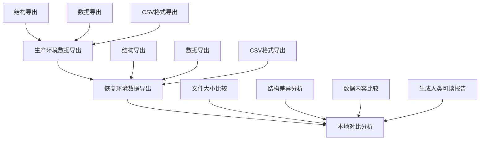
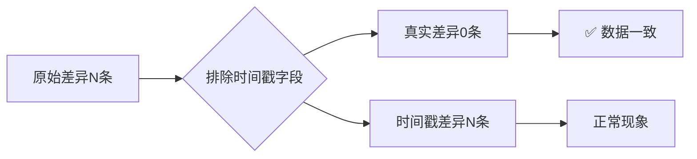

在生产环境中，数据库故障往往来得猝不及防。当你发现某个关键表突然无法访问，而其他表运行正常时，这种局部性故障往往比全面宕机更加棘手。本文记录了一次完整的数据库一致性检查实践，从紧急故障排除到建立标准化检查方法论的全过程。

<!--more-->

## 故障背景：看似简单的访问问题

事情始于一个看似平常的操作失误。在使用DBeaver进行数据库操作时，原本目标是test-db，却意外选中了prod-db。意识到错误后立即断开了网络连接，但随后发现某个核心业务表（user_data）变得无法访问，而同一数据库中的其他表仍然正常工作。

更有趣的是，不仅DBeaver无法访问该表，其他数据库IDE工具如DataGrip也遇到了相同问题。这说明问题出现在数据库服务器层面，而非客户端缓存问题。

## 第一阶段：PostgreSQL锁机制诊断

### 问题定位

PostgreSQL的锁机制设计决定了锁只在事务结束时自动释放，没有手动解锁命令。当网络突然中断时，未提交的事务可能导致表级锁定。

### 诊断方法

通过系统视图进行锁状态检查：

```sql
-- 查看活跃连接和等待状态
SELECT pid, state, query, wait_event_type, wait_event, query_start 
FROM pg_stat_activity 
WHERE datname = 'target_database';

-- 检查特定表的锁情况
SELECT l.locktype, l.pid, l.mode, l.granted, a.query, c.relname
FROM pg_locks l
LEFT JOIN pg_stat_activity a ON l.pid = a.pid
LEFT JOIN pg_class c ON l.relation = c.oid
WHERE c.relname = 'target_table';
```

### 解决方案

对于阻塞进程的处理策略：

1. **温和取消**：`SELECT pg_cancel_backend(pid)`
2. **强制终止**：`SELECT pg_terminate_backend(pid)`

## 第二阶段：建立系统化检查流程

解决了紧急故障后，我们意识到需要建立一套标准化的数据一致性检查方法论。

### 环境准备

在与数据库同一VNet中部署RHEL检查节点：

```bash
# 安装PostgreSQL客户端工具
sudo dnf install -y postgresql16 postgresql16-libs libpq-devel
```

### 三阶段检查方法论

我们设计了一个三步检查流程：



#### 阶段一：生产环境数据导出

创建自动化脚本进行多格式数据导出：

- **结构导出**：`pg_dump --schema-only`
- **数据导出**：`pg_dump --data-only`
- **CSV导出**：`\COPY table_name TO 'file.csv' WITH CSV HEADER`

#### 阶段二：恢复环境数据导出

使用相同的脚本对恢复环境进行数据导出，确保格式一致性。

#### 阶段三：智能差异分析

这是整个方法论的核心创新点。我们发现初步比较显示了数十条"缺失"记录和"多余"记录，但进一步分析发现，这些差异主要集中在时间戳字段上。

### 时间戳敏感分析法

我们开发了一套排除时间戳字段的比较方法：

1. **自动识别时间戳字段**：`last_activity`, `modified_date`, `timestamp_col`
2. **字段级过滤**：移除时间敏感字段后重新比较
3. **真实差异提取**：区分"仅时间戳差异"和"业务数据差异"



## 技术创新点

### 1. 分层比较策略

- **L1 文件级**：大小、校验和快速比较
- **L2 结构级**：表结构、索引、约束比较  
- **L3 数据级**：逐行内容比较
- **L4 业务级**：排除技术字段的业务逻辑比较

### 2. 多格式输出

- **技术报告**：详细的diff文件和统计数据
- **管理报告**：Markdown格式的可读性报告
- **决策支持**：明确的"可用/不可用"结论

### 3. 自动化工具链

整个检查过程实现了高度自动化：

```bash
# 一键执行完整检查流程
./master_consistency_check.sh

# 输出结果：
# - 技术详细报告
# - 管理层摘要
# - 可执行的建议
```

## 核心发现与洞察

### 时间戳差异的本质

在数据库备份恢复场景中，时间戳字段的差异是完全正常的：

1. **备份时点**：时间戳反映数据被备份的时刻
2. **系统时钟**：不同环境间的微小时间差
3. **自动更新字段**：如`last_activity`等在备份后可能发生变化
4. **事务时序**：并发事务的提交顺序可能略有不同

### 业务数据完整性才是关键

我们的分析证明，看似严重的多条记录差异，在排除时间戳字段后差异数量降为0，说明：

- ✅ 所有业务核心数据完整保存
- ✅ 用户信息、权限设置等关键字段一致
- ✅ 数据恢复过程成功且可靠

## 方法论的通用价值

这套检查方法论不局限于PostgreSQL，可以适用于：

### 适用场景

- **数据库迁移验证**
- **灾备系统一致性检查**
- **数据同步质量监控**
- **版本升级前后对比**

### 扩展应用

- **多数据库支持**：MySQL、Oracle、SQL Server
- **大数据场景**：Hadoop、Spark数据集对比
- **云原生环境**：容器化数据库的一致性验证

## 经验总结与最佳实践

### 故障处理经验

1. **保持冷静**：不要急于重启或强制操作
2. **系统性诊断**：使用数据库自带的诊断工具
3. **分层解决**：从最安全的方法开始尝试

### 一致性检查原则

1. **自动化优先**：减少人工错误和重复劳动
2. **分层验证**：从粗粒度到细粒度逐步深入
3. **业务视角**：关注对业务有实际影响的差异
4. **可读性报告**：让非技术人员也能理解结果

### 工具选择建议

- **脚本语言**：Bash + Python的组合提供了灵活性和可靠性
- **数据处理**：Python的CSV处理能力优于纯Shell脚本
- **报告生成**：Markdown格式兼顾技术细节和可读性

## 未来展望：AI驱动的智能化

随着大语言模型的发展，数据库一致性检查可能迎来新的变革：

### 智能问题诊断

AI可以分析数据库日志、错误模式，自动识别问题根因：

- 自动识别锁竞争模式
- 预测可能的数据不一致风险
- 推荐最优的修复策略

### 自适应检查策略

基于历史数据和业务特征，AI可以：

- 动态调整检查重点
- 自动识别业务关键字段
- 优化检查脚本的执行顺序

### 预测性维护

通过模式识别，AI系统可以：

- 预警潜在的一致性问题
- 建议最佳的备份恢复时间窗口
- 自动化日常一致性监控

---

*本文基于真实的生产环境故障处理经验总结。在实施类似检查时，请根据具体环境调整方案，并在非生产环境充分测试后再应用于生产系统。*
