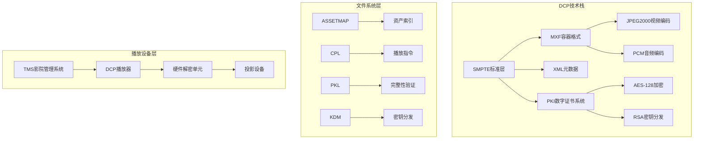
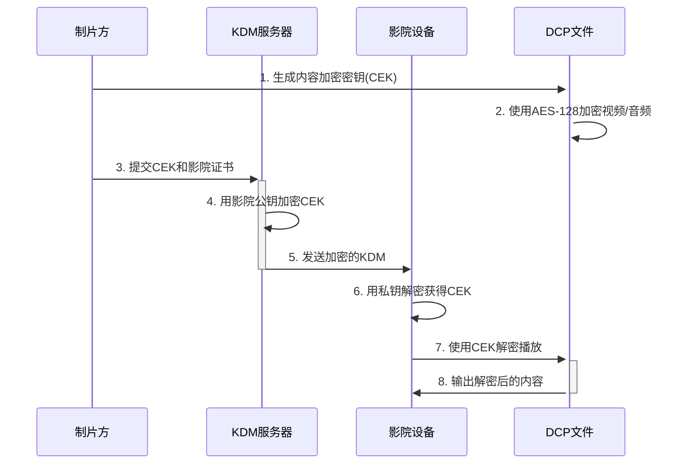
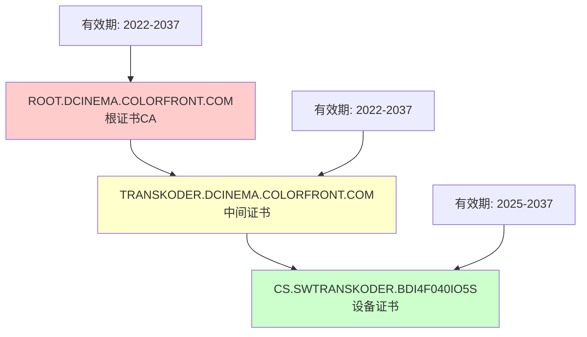
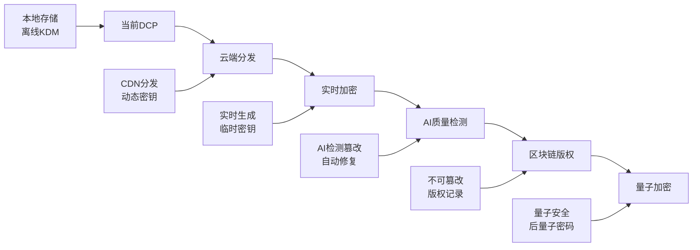

作为一名计算机工程师，当我第一次接触到500GB的DCP文件时，我以为用FFmpeg转换一下就能播放了。结果发现这个看似简单的"视频文件"，背后竟然有着复杂的加密体系和严密的安全架构。通过深入分析一个真实的DCP样本，我们来彻底搞懂数字电影的技术内幕。

<!--more-->

## DCP技术架构深度剖析

### 核心技术栈概览



### MXF容器格式深度分析

**MXF（Material eXchange Format）** 不是普通的视频容器，它是专为专业广播和电影设计的元数据丰富格式：

```python
# MXF文件结构解析
class MXFStructure:
    def __init__(self):
        self.header_partition = {
            "operational_pattern": "OP1a",  # 操作模式
            "essence_containers": [],       # 内容容器类型
            "metadata": {}                  # 元数据集合
        }
        self.body_partition = {
            "essence_data": [],            # 实际音视频数据
            "index_table": []              # 索引表
        }
        self.footer_partition = {
            "random_index_pack": {},       # 随机访问包
            "klv_alignment": []            # KLV对齐数据
        }
```

### 加密体系架构

DCP使用了类似HTTPS的非对称加密模式，但更加复杂：



## 实际案例：哪吒2 DCP技术分析

基于我们获得的实际DCP样本，让我们深入分析其技术细节：

### 文件结构分析

通过解析实际文件，我们发现了以下关键信息：

```json
{
  "dcp_metadata": {
    "title": "NEZHA2_FTR_S_QMS-XX_51_2K_20250118_COL_IOP_OV",
    "creation_date": "2025-01-18T05:00:37-00:00",
    "creator": "Colorfront Transkoder 2023 build63444",
    "resolution": "2048x858",
    "frame_rate": "24fps",
    "duration": "207330 frames (2h23m58s)",
    "aspect_ratio": "2.39:1",
    "audio_channels": "5.1 surround"
  }
}
```

### 加密密钥分析

从KDM文件中我们可以提取到以下信息：

```xml
<!-- KDM核心结构 -->
<KDMRequiredExtensions>
    <Recipient>
        <X509SubjectName>
            dnQualifier=/mshztQpz0vqQFx0m707VMBKL3U=,
            CN=CS.SWTRANSKODER.BDI4F040IO5S.DCINEMA.COLORFRONT.COM
        </X509SubjectName>
    </Recipient>
    <ContentKeysNotValidBefore>2025-01-18T04:28:20-00:00</ContentKeysNotValidBefore>
    <ContentKeysNotValidAfter>2026-01-18T04:28:20-00:00</ContentKeysNotValidAfter>
    <KeyIdList>
        <TypedKeyId>
            <KeyType>MDIK</KeyType>  <!-- 图像解密密钥 -->
            <KeyId>urn:uuid:5fddf735-93ae-4c0c-9206-93be5a657c6e</KeyId>
        </TypedKeyId>
        <TypedKeyId>
            <KeyType>MDAK</KeyType>  <!-- 音频解密密钥 -->
            <KeyId>urn:uuid:6ec9c186-62f3-4639-b577-cf3df634448d</KeyId>
        </TypedKeyId>
    </KeyIdList>
</KDMRequiredExtensions>
```

### 证书链分析

这个DCP使用了Colorfront的三级证书链：



## FFmpeg与DCP：为什么不兼容？

### 技术层面分析

当我们尝试用FFmpeg处理DCP时，遇到了以下错误：

```bash
[mxf @ 0x133606f30] probably incorrect decryption key
[jpeg2000 @ 0x135804ba0] unsupported marker 0xA08E at pos 0x10523
[jpeg2000 @ 0x135804ba0] Missing EOC Marker.
```

这些错误说明了什么？

1. **加密层阻断**：MXF容器感知到内容被加密，但没有正确的解密密钥
2. **JPEG2000损坏**：加密导致JPEG2000数据流出现"伪随机"数据
3. **格式不识别**：标准的开源工具不支持DCP特有的加密机制

### 代码层面分析

```c
// FFmpeg中MXF解密的简化逻辑
int mxf_decrypt_frame(MXFContext *mxf, uint8_t *data, int size) {
    if (mxf->encrypted && !mxf->decryption_key) {
        av_log(NULL, AV_LOG_WARNING, "probably incorrect decryption key\n");
        return AVERROR_DECRYPT;
    }
    
    // 尝试AES解密
    if (mxf->crypto_context) {
        return av_aes_crypt(mxf->crypto_context, data, data, size/16, NULL, 1);
    }
    
    return AVERROR_DECRYPT;
}
```

## 专业工具深度使用

### ASDCP-lib工具链

我们使用Docker容器中的专业工具进行分析：

```bash
# 检查DCP基本信息
asdcp-info movie.mxf
# 输出：Interop file essence type is JPEG 2000 pictures, (207330 edit units)

# 尝试提取帧（加密情况下会失败）
asdcp-unwrap -v movie.mxf output_frame.j2c
# 结果：提取出加密的伪随机数据

# 检查音频轨道
asdcp-info movie_audio.mxf  
# 输出：Interop file essence type is PCM audio, (207330 edit units)
```

### DCP-o-matic工具分析

使用专业DCP工具可以获得更多信息：

```bash
# 检查KDM详细信息
dcpomatic2_kdm_inspect kdm_file.xml

# 验证DCP完整性
dcpomatic2_verify_cli /path/to/dcp/

# 分析播放列表
dcpomatic2_cli --analyse-dcp /path/to/dcp/
```

## 加密算法深度解析

### AES-128-CBC加密实现

DCP使用的具体加密方案：

```python
from cryptography.hazmat.primitives.ciphers import Cipher, algorithms, modes
from cryptography.hazmat.primitives import hashes
import os

class DCPCrypto:
    def __init__(self, content_key):
        self.content_key = content_key  # 128位内容密钥
        self.iv_size = 16  # 初始化向量大小
        
    def encrypt_frame(self, frame_data):
        # 为每帧生成随机IV
        iv = os.urandom(self.iv_size)
        
        # 创建AES-CBC加密器
        cipher = Cipher(
            algorithms.AES(self.content_key),
            modes.CBC(iv)
        )
        encryptor = cipher.encryptor()
        
        # PKCS7填充
        padded_data = self._pkcs7_pad(frame_data)
        
        # 加密数据
        ciphertext = encryptor.update(padded_data) + encryptor.finalize()
        
        return iv + ciphertext  # IV + 密文
        
    def _pkcs7_pad(self, data):
        padding_length = 16 - (len(data) % 16)
        padding = bytes([padding_length] * padding_length)
        return data + padding
```

### RSA密钥封装机制

KDM中的密钥封装：

```python
from cryptography.hazmat.primitives.asymmetric import rsa, padding
from cryptography.hazmat.primitives import serialization, hashes

class KDMCrypto:
    def encrypt_content_key(self, content_key, cinema_public_key):
        # 使用影院公钥加密内容密钥
        encrypted_key = cinema_public_key.encrypt(
            content_key,
            padding.OAEP(
                mgf=padding.MGF1(algorithm=hashes.SHA1()),
                algorithm=hashes.SHA1(),
                label=None
            )
        )
        return encrypted_key
        
    def decrypt_content_key(self, encrypted_key, cinema_private_key):
        # 影院使用私钥解密内容密钥
        content_key = cinema_private_key.decrypt(
            encrypted_key,
            padding.OAEP(
                mgf=padding.MGF1(algorithm=hashes.SHA1()),
                algorithm=hashes.SHA1(),
                label=None
            )
        )
        return content_key
```

## SMPTE标准技术细节

### CPL（Composition Playlist）结构

```xml
<!-- CPL核心结构分析 -->
<CompositionPlaylist xmlns="http://www.digicine.com/PROTO-ASDCP-CPL-20040511#">
    <Id>urn:uuid:be2ced31-707c-49a6-bbe8-74faffe506d7</Id>
    <ContentTitleText>NEZHA2_FTR_S_QMS-XX_51_2K_20250118_COL_IOP_OV</ContentTitleText>
    <ReelList>
        <Reel>
            <AssetList>
                <MainPicture>
                    <EditRate>24 1</EditRate>          <!-- 24fps -->
                    <IntrinsicDuration>207330</IntrinsicDuration>  <!-- 总帧数 -->
                    <KeyId>urn:uuid:5fddf735-93ae-4c0c-9206-93be5a657c6e</KeyId>
                    <Hash>sR/cIYDh27/AZG7OAQgSc+6whqE=</Hash>  <!-- SHA-1校验 -->
                </MainPicture>
                <MainSound>
                    <Language>zh</Language>            <!-- 中文音轨 -->
                    <KeyId>urn:uuid:6ec9c186-62f3-4639-b577-cf3df634448d</KeyId>
                </MainSound>
            </AssetList>
        </Reel>
    </ReelList>
</CompositionPlaylist>
```

### PKL（Packing List）校验机制

```python
import hashlib
import base64

class DCPIntegrityChecker:
    def verify_asset_hash(self, file_path, expected_hash):
        """验证DCP资产文件完整性"""
        sha1_hash = hashlib.sha1()
        
        with open(file_path, "rb") as f:
            # 分块读取大文件
            for chunk in iter(lambda: f.read(4096), b""):
                sha1_hash.update(chunk)
        
        calculated_hash = base64.b64encode(sha1_hash.digest()).decode()
        return calculated_hash == expected_hash
        
    def verify_dcp_package(self, pkl_file):
        """验证整个DCP包的完整性"""
        # 解析PKL文件获取所有资产的哈希值
        # 逐一验证每个文件的完整性
        pass
```

## 破解可能性分析

### 理论攻击向量

1. **密钥泄露**：影院私钥被盗取
2. **实现漏洞**：播放软件的安全缺陷
3. **侧信道攻击**：通过硬件特征推断密钥
4. **社会工程**：获取合法KDM文件

### 防护机制强度

```python
# 安全强度分析
class DCPSecurityAnalysis:
    def __init__(self):
        self.aes_key_space = 2**128          # AES-128密钥空间
        self.rsa_key_space = 2**2048         # RSA-2048密钥空间
        self.cert_validity = 365 * 10        # 证书有效期10年
        self.kdm_validity = 365              # KDM有效期1年
        
    def brute_force_time_estimate(self):
        # 假设每秒尝试10^9次
        attempts_per_second = 10**9
        years_to_crack = self.aes_key_space / (attempts_per_second * 60 * 60 * 24 * 365)
        return f"暴力破解AES需要约 {years_to_crack:.2e} 年"
```

结果：即使用最先进的硬件，暴力破解AES-128也需要约 10^20 年。

## 技术发展趋势与AI应用

### 下一代DCP技术



### AI在DCP中的应用前景

1. **智能质量检测**：AI自动检测画面和音频缺陷
2. **动态密钥管理**：基于行为分析的风险评估
3. **内容保护升级**：深度学习的水印和指纹技术
4. **自动化工作流**：从后期制作到影院播放的全自动化

### 实际代码实现示例

```python
import tensorflow as tf
from tensorflow import keras

class DCPQualityAI:
    def __init__(self):
        # 加载预训练的质量检测模型
        self.video_quality_model = keras.models.load_model('dcp_video_qa.h5')
        self.audio_quality_model = keras.models.load_model('dcp_audio_qa.h5')
        
    def analyze_video_quality(self, frame_data):
        """AI检测视频质量问题"""
        # 预处理帧数据
        processed_frame = self.preprocess_frame(frame_data)
        
        # AI推理
        quality_score = self.video_quality_model.predict(processed_frame)
        
        # 问题分类
        issues = {
            'compression_artifacts': quality_score[0][0],
            'color_banding': quality_score[0][1], 
            'motion_blur': quality_score[0][2],
            'noise_level': quality_score[0][3]
        }
        
        return issues
        
    def recommend_fixes(self, issues):
        """基于检测结果推荐修复方案"""
        recommendations = []
        
        if issues['compression_artifacts'] > 0.7:
            recommendations.append("建议提高JPEG2000质量设置")
        if issues['color_banding'] > 0.6:
            recommendations.append("建议增加色彩深度或使用抖动")
            
        return recommendations
```

## 总结：DCP技术的工程学价值

通过这次深度分析，我们发现DCP不仅仅是一个"视频文件"，而是一个完整的安全通信系统：

1. **多层加密架构**：结合了对称和非对称加密的优点
2. **PKI证书管理**：完善的信任链和身份验证
3. **完整性保护**：多重校验确保内容不被篡改
4. **时间控制机制**：精确的播放窗口管理
5. **标准化协议**：全球统一的技术规范

对于我们计算机工程师来说，DCP展示了如何在复杂的商业环境中实现技术与安全的平衡。它的设计理念和实现方式，对我们设计其他安全系统具有重要的参考价值。

从这个500GB的"看不了的电影文件"中，我们学到了比电影本身更有价值的东西：现代数字内容保护的技术精髓。
