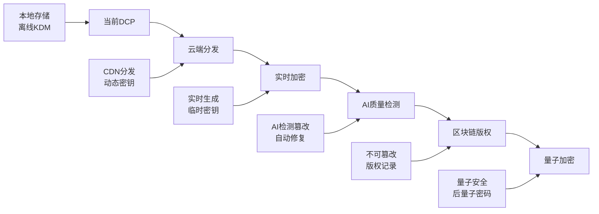

Будучи компьютерным инженером, когда я впервые столкнулся с файлом DCP объемом 500 ГБ, я подумал, что смогу воспроизвести его, конвертировав с помощью FFmpeg. Оказалось, что за этим, казалось бы, простым "видеофайлом" стоит сложная система шифрования и строгая архитектура безопасности. Благодаря глубокому анализу реальных образцов DCP мы полностью понимаем технические тонкости цифрового кино.

<! --подробнее-->

## Глубокий анализ архитектуры технологии DCP

### Обзор основного технологического стека

```mermaid
graph TB
    subgraph "DCP技术栈"
        A[SMPTE标准层] --> B[MXF容器格式]
        B --> C[JPEG2000视频编码]
        B --> D[PCM音频编码]
        A --> E[XML元数据]
        A --> F[PKI数字证书系统]
        F --> G[AES-128加密]
        F --> H[RSA密钥分发]
    end
    
    subgraph "文件系统层"
        I[ASSETMAP] --> J[资产索引]
        K[CPL] --> L[播放指令]
        M[PKL] --> N[完整性验证]
        O[KDM] --> P[密钥分发]
    end
    
    subgraph "播放设备层"
        Q[TMS影院管理系统] --> R[DCP播放器]
        R --> S[硬件解密单元]
        S --> T[投影设备]
    end
```_.

### Углубленный анализ формата контейнера MXF

**MXF (Material eXchange Format)** - это не обычный видеоконтейнер, а формат с богатыми метаданными, предназначенный для профессионального вещания и кино:

```python
# MXF文件结构解析
class MXFStructure:
    def __init__(self):
        self.header_partition = {
            "operational_pattern": "OP1a",  # 操作模式
            "essence_containers": [],       # 内容容器类型
            "metadata": {}                  # 元数据集合
        }
        self.body_partition = {
            "essence_data": [],            # 实际音视频数据
            "index_table": []              # 索引表
        }
        self.footer_partition = {
            "random_index_pack": {},       # 随机访问包
            "klv_alignment": []            # KLV对齐数据
        }
```.

### Архитектура шифрования

DCP использует модель асимметричного шифрования, похожую на HTTPS, но более сложную:

```mermaid
sequenceDiagram
    participant CP as 制片方
    participant KDM as KDM服务器
    participant Cinema as 影院设备
    participant DCP as DCP文件
    
    CP->>+DCP: 1. 生成内容加密密钥(CEK)
    DCP->>DCP: 2. 使用AES-128加密视频/音频
    CP->>+KDM: 3. 提交CEK和影院证书
    KDM->>KDM: 4. 用影院公钥加密CEK
    KDM->>-Cinema: 5. 发送加密的KDM
    Cinema->>Cinema: 6. 用私钥解密获得CEK
    Cinema->>+DCP: 7. 使用CEK解密播放
    DCP->>-Cinema: 8. 输出解密后的内容
```.

## Практический пример: технический анализ DCP Nezha 2

На основе полученного нами образца DCP давайте подробно проанализируем его технические характеристики:

### Анализ файловой структуры

Разобрав реальный файл, мы обнаружили следующую ключевую информацию:

```json
{
  "dcp_metadata": {
    "title": "NEZHA2_FTR_S_QMS-XX_51_2K_20250118_COL_IOP_OV",
    "creation_date": "2025-01-18T05:00:37-00:00",
    "creator": "Colorfront Transkoder 2023 build63444",
    "resolution": "2048x858",
    "frame_rate": "24fps",
    "duration": "207330 frames (2h23m58s)",
    "aspect_ratio": "2.39:1",
    "audio_channels": "5.1 surround"
  }
}
```.

### Анализ ключа шифрования

Из файла KDM мы можем извлечь следующую информацию:

```xml
<!-- KDM核心结构 -->
<KDMRequiredExtensions>
    <Recipient>
        <X509SubjectName>
            dnQualifier=/mshztQpz0vqQFx0m707VMBKL3U=,
            CN=CS.SWTRANSKODER.BDI4F040IO5S.DCINEMA.COLORFRONT.COM
        </X509SubjectName>
    </Recipient>
    <ContentKeysNotValidBefore>2025-01-18T04:28:20-00:00</ContentKeysNotValidBefore>
    <ContentKeysNotValidAfter>2026-01-18T04:28:20-00:00</ContentKeysNotValidAfter>
    <KeyIdList>
        <TypedKeyId>
            <KeyType>MDIK</KeyType>  <!-- 图像解密密钥 -->
            <KeyId>urn:uuid:5fddf735-93ae-4c0c-9206-93be5a657c6e</KeyId>
        </TypedKeyId>
        <TypedKeyId>
            <KeyType>MDAK</KeyType>  <!-- 音频解密密钥 -->
            <KeyId>urn:uuid:6ec9c186-62f3-4639-b577-cf3df634448d</KeyId>
        </TypedKeyId>
    </KeyIdList>
</KDMRequiredExtensions>
```.

### Анализ цепочки сертификатов

В этом DCP используется трехуровневая цепочка сертификатов Colorfront:

```mermaid
graph TD
    A[ROOT.DCINEMA.COLORFRONT.COM<br/>根证书CA] --> B[TRANSKODER.DCINEMA.COLORFRONT.COM<br/>中间证书]
    B --> C[CS.SWTRANSKODER.BDI4F040IO5S<br/>设备证书]
    
    A1[有效期: 2022-2037] --> A
    B1[有效期: 2022-2037] --> B  
    C1[有效期: 2025-2037] --> C
    
    style A fill:#ffcccc
    style B fill:#ffffcc
    style C fill:#ccffcc
```.

## FFmpeg и DCP: почему они несовместимы?

### Анализ технического уровня

Когда мы пытаемся обработать DCP с помощью FFmpeg, мы сталкиваемся со следующей ошибкой:

```bash
[mxf @ 0x133606f30] probably incorrect decryption key
[jpeg2000 @ 0x135804ba0] unsupported marker 0xA08E at pos 0x10523
[jpeg2000 @ 0x135804ba0] Missing EOC Marker.
```.

На что указывают эти ошибки?

1. **Блокировка криптоуровня**: контейнер MXF чувствует, что содержимое зашифровано, но не имеет правильного ключа дешифрования.
2. **Искажение JPEG2000**: шифрование приводит к появлению "псевдослучайных" данных в потоке JPEG2000.
3. **Формат не распознан**: стандартные инструменты с открытым исходным кодом не поддерживают механизмы шифрования, характерные для DCP.

### Анализ на уровне кода

```c
// FFmpeg中MXF解密的简化逻辑
int mxf_decrypt_frame(MXFContext *mxf, uint8_t *data, int size) {
    if (mxf->encrypted && !mxf->decryption_key) {
        av_log(NULL, AV_LOG_WARNING, "probably incorrect decryption key\n");
        return AVERROR_DECRYPT;
    }
    
    // 尝试AES解密
    if (mxf->crypto_context) {
        return av_aes_crypt(mxf->crypto_context, data, data, size/16, NULL, 1);
    }
    
    return AVERROR_DECRYPT;
}
```.

## Углубленный анализ специализированных инструментов

### Набор инструментов ASDCP-lib

Для анализа мы используем профессиональные инструменты в контейнерах Docker:

```bash
# 检查DCP基本信息
asdcp-info movie.mxf
# 输出：Interop file essence type is JPEG 2000 pictures, (207330 edit units)

# 尝试提取帧（加密情况下会失败）
asdcp-unwrap -v movie.mxf output_frame.j2c
# 结果：提取出加密的伪随机数据

# 检查音频轨道
asdcp-info movie_audio.mxf  
# 输出：Interop file essence type is PCM audio, (207330 edit units)
```.

### Анализ инструментов DCP-o-matic

Дополнительную информацию можно получить с помощью профессионального инструмента DCP:

```bash
# 检查KDM详细信息
dcpomatic2_kdm_inspect kdm_file.xml

# 验证DCP完整性
dcpomatic2_verify_cli /path/to/dcp/

# 分析播放列表
dcpomatic2_cli --analyse-dcp /path/to/dcp/
```

## Алгоритмы шифрования в глубину

### Реализация шифрования AES-128-CBC

Конкретная схема шифрования, используемая в DCP:

```python
from cryptography.hazmat.primitives.ciphers import Cipher, algorithms, modes
from cryptography.hazmat.primitives import hashes
import os

class DCPCrypto:
    def __init__(self, content_key):
        self.content_key = content_key  # 128位内容密钥
        self.iv_size = 16  # 初始化向量大小
        
    def encrypt_frame(self, frame_data):
        # 为每帧生成随机IV
        iv = os.urandom(self.iv_size)
        
        # 创建AES-CBC加密器
        cipher = Cipher(
            algorithms.AES(self.content_key),
            modes.CBC(iv)
        )
        encryptor = cipher.encryptor()
        
        # PKCS7填充
        padded_data = self._pkcs7_pad(frame_data)
        
        # 加密数据
        ciphertext = encryptor.update(padded_data) + encryptor.finalize()
        
        return iv + ciphertext  # IV + 密文
        
    def _pkcs7_pad(self, data):
        padding_length = 16 - (len(data) % 16)
        padding = bytes([padding_length] * padding_length)
        return data + padding
```.

### Механизм инкапсуляции ключа RSA

Инкапсуляция ключей в KDM:

```python
from cryptography.hazmat.primitives.asymmetric import rsa, padding
from cryptography.hazmat.primitives import serialization, hashes

class KDMCrypto:
    def encrypt_content_key(self, content_key, cinema_public_key):
        # 使用影院公钥加密内容密钥
        encrypted_key = cinema_public_key.encrypt(
            content_key,
            padding.OAEP(
                mgf=padding.MGF1(algorithm=hashes.SHA1()),
                algorithm=hashes.SHA1(),
                label=None
            )
        )
        return encrypted_key
        
    def decrypt_content_key(self, encrypted_key, cinema_private_key):
        # 影院使用私钥解密内容密钥
        content_key = cinema_private_key.decrypt(
            encrypted_key,
            padding.OAEP(
                mgf=padding.MGF1(algorithm=hashes.SHA1()),
                algorithm=hashes.SHA1(),
                label=None
            )
        )
        return content_key
```.

## Технические детали стандарта SMPTE

### Структура CPL (Composition Playlist)

```xml
<!-- CPL核心结构分析 -->
<CompositionPlaylist xmlns="http://www.digicine.com/PROTO-ASDCP-CPL-20040511#">
    <Id>urn:uuid:be2ced31-707c-49a6-bbe8-74faffe506d7</Id>
    <ContentTitleText>NEZHA2_FTR_S_QMS-XX_51_2K_20250118_COL_IOP_OV</ContentTitleText>
    <ReelList>
        <Reel>
            <AssetList>
                <MainPicture>
                    <EditRate>24 1</EditRate>          <!-- 24fps -->
                    <IntrinsicDuration>207330</IntrinsicDuration>  <!-- 总帧数 -->
                    <KeyId>urn:uuid:5fddf735-93ae-4c0c-9206-93be5a657c6e</KeyId>
                    <Hash>sR/cIYDh27/AZG7OAQgSc+6whqE=</Hash>  <!-- SHA-1校验 -->
                </MainPicture>
                <MainSound>
                    <Language>zh</Language>            <!-- 中文音轨 -->
                    <KeyId>urn:uuid:6ec9c186-62f3-4639-b577-cf3df634448d</KeyId>
                </MainSound>
            </AssetList>
        </Reel>
    </ReelList>
</CompositionPlaylist>
```.

### Механизм контрольной суммы PKL (Packing List)

```python
import hashlib
import base64

class DCPIntegrityChecker:
    def verify_asset_hash(self, file_path, expected_hash):
        """验证DCP资产文件完整性"""
        sha1_hash = hashlib.sha1()
        
        with open(file_path, "rb") as f:
            # 分块读取大文件
            for chunk in iter(lambda: f.read(4096), b""):
                sha1_hash.update(chunk)
        
        calculated_hash = base64.b64encode(sha1_hash.digest()).decode()
        return calculated_hash == expected_hash
        
    def verify_dcp_package(self, pkl_file):
        """验证整个DCP包的完整性"""
        # 解析PKL文件获取所有资产的哈希值
        # 逐一验证每个文件的完整性
        pass
```

## Анализ возможности взлома

### Теоретический вектор атаки

1. **Раскрытие ключей**: похищение закрытого ключа театра
2. **Уязвимость реализации**: недостатки безопасности в программном обеспечении для воспроизведения
3. **Атака по боковому каналу**: вычисление ключа по аппаратным характеристикам
4. **Социальная инженерия**: получение легитимных файлов KDM

### Сила защитных механизмов

```python
# 安全强度分析
class DCPSecurityAnalysis:
    def __init__(self):
        self.aes_key_space = 2**128          # AES-128密钥空间
        self.rsa_key_space = 2**2048         # RSA-2048密钥空间
        self.cert_validity = 365 * 10        # 证书有效期10年
        self.kdm_validity = 365              # KDM有效期1年
        
    def brute_force_time_estimate(self):
        # 假设每秒尝试10^9次
        attempts_per_second = 10**9
        years_to_crack = self.aes_key_space / (attempts_per_second * 60 * 60 * 24 * 365)
        return f"暴力破解AES需要约 {years_to_crack:.2e} 年"
```.

Результат: Даже при использовании самого современного оборудования для взлома AES-128 потребуется около 10^20 лет.

## Технологические тенденции и применение ИИ

## Технология DCP нового поколения



### Будущее искусственного интеллекта в DCP

1. **Интеллектуальная проверка качества**: ИИ автоматически обнаруживает дефекты изображения и звука
2. **Динамическое управление ключами**: оценка рисков на основе поведенческого анализа
3. **Улучшение защиты контента**: технология водяных знаков и отпечатков пальцев на основе глубокого обучения
4. **Автоматизированный рабочий процесс**: полная автоматизация от постпроизводства до воспроизведения в кинотеатре

### Пример реализации фактического кода

```python
import tensorflow as tf
from tensorflow import keras

class DCPQualityAI:
    def __init__(self):
        # 加载预训练的质量检测模型
        self.video_quality_model = keras.models.load_model('dcp_video_qa.h5')
        self.audio_quality_model = keras.models.load_model('dcp_audio_qa.h5')
        
    def analyze_video_quality(self, frame_data):
        """AI检测视频质量问题"""
        # 预处理帧数据
        processed_frame = self.preprocess_frame(frame_data)
        
        # AI推理
        quality_score = self.video_quality_model.predict(processed_frame)
        
        # 问题分类
        issues = {
            'compression_artifacts': quality_score[0][0],
            'color_banding': quality_score[0][1], 
            'motion_blur': quality_score[0][2],
            'noise_level': quality_score[0][3]
        }
        
        return issues
        
    def recommend_fixes(self, issues):
        """基于检测结果推荐修复方案"""
        recommendations = []
        
        if issues['compression_artifacts'] > 0.7:
            recommendations.append("建议提高JPEG2000质量设置")
        if issues['color_banding'] > 0.6:
            recommendations.append("建议增加色彩深度或使用抖动")
            
        return recommendations
```.

## Резюме: инженерная ценность технологии DCP

Проведя глубокий анализ, мы пришли к выводу, что DCP - это не просто "видеофайл", а полноценная система безопасной связи:

1. **Многоуровневая архитектура шифрования**: сочетает в себе преимущества симметричного и асимметричного шифрования.
2. **Управление сертификатами PKI**: идеальная цепочка доверия и аутентификации.
3. **Защита целостности**: многочисленные проверки гарантируют, что содержимое не будет подделано.
4. **Механизм контроля времени**: точное управление окном воспроизведения
5. **Стандартизированные протоколы**: единые для всего мира технические спецификации

Для нас, компьютерных инженеров, DCP демонстрирует, как достичь баланса между технологиями и безопасностью в сложной бизнес-среде. Его концепция и реализация являются для нас важными ориентирами при разработке других систем безопасности.

Из этого 500-гигабайтного "файла с нежелательным фильмом" мы узнали нечто более ценное, чем сам фильм: суть современной технологии защиты цифрового контента.
