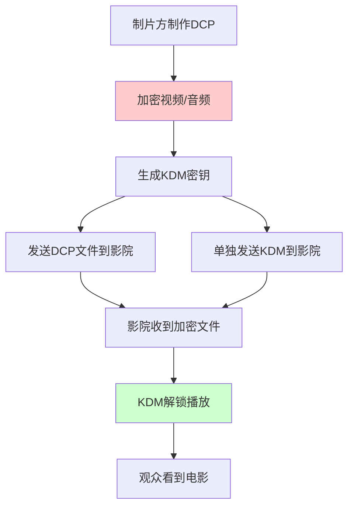

小李是某影院的技术员，最近总是被各种DCP文件搞得头疼。有时候片子播不出来，有时候画面是黑的，有时候KDM过期了还不知道。如果你也遇到类似问题，这篇文章会让你彻底搞懂DCP是怎么回事。

<!--more-->

## DCP到底是什么？

**DCP（Digital Cinema Package，数字电影包）** 就是数字时代的"电影拷贝"。以前电影是胶片卷，现在是一堆数字文件打包在一起。

想象一下，DCP就像一个"密码箱"：
- 箱子里装着高质量的电影文件
- 箱子有密码锁（加密）
- 只有对的钥匙（KDM）才能打开
- 钥匙还有使用期限

## DCP文件长什么样？

当你拿到一个DCP时，会看到这样的文件结构：

```
电影名称_DCP文件夹/
├── ASSETMAP          ← 这是"目录清单"
├── VOLINDEX          ← 这是"卷标"
├── CPL_电影名.xml     ← 这是"播放指令"
├── PKL_编号.xml       ← 这是"包装清单"
├── 电影名_01.mxf      ← 这是"视频文件"（巨大）
├── 电影名_audio.mxf   ← 这是"音频文件"
└── 电影名_self.kdm.xml ← 这是"解密钥匙"
```

**重点提醒：** 不要随意移动或重命名这些文件！系统需要按照精确的文件名来找到对应的内容。

## 加密保护：为什么有些DCP播不了？



### 常见播放问题及解决方案

**问题1：播放器显示黑屏**
- **原因：** 没有对应的KDM文件
- **解决：** 联系发行方获取正确的KDM

**问题2：提示"密钥过期"**
- **原因：** KDM有时间限制，过期就用不了
- **解决：** 申请新的KDM文件

**问题3：提示"设备不匹配"**
- **原因：** KDM是为特定播放设备生成的
- **解决：** 确认设备证书，重新申请匹配的KDM

## 影院技术员日常操作指南

### 1. 接收DCP文件
- 通过硬盘、网络下载或卫星传输接收
- 检查文件完整性（大小、数量）
- 确认ASSETMAP文件存在

### 2. 验证DCP内容
```bash
# 使用专业工具检查DCP
dcpomatic2_verify_cli /path/to/dcp/folder
```

### 3. 安装KDM
- 将KDM文件复制到播放服务器
- 通过播放系统导入KDM
- 确认播放权限和时间窗口

### 4. 测试播放
- 播放前几分钟检查画面音质
- 确认字幕正常显示
- 检查声道配置（5.1或7.1）

## 制片方和后期制作指南

### DCP制作流程


### 常用制作工具
- **DCP-o-matic**：开源免费，适合独立制片
- **Colorfront Transkoder**：专业级，支持复杂工作流
- **Doremi DCP Creator**：影院级标准工具
- **Resolve DaVinci**：集成DCP输出功能

### 技术参数建议
- **分辨率：** 2K (2048×1080) 或 4K (4096×2160)
- **帧率：** 24fps（标准）或 25fps（PAL地区）
- **色彩空间：** XYZ（影院标准）
- **音频：** 5.1或7.1声道，24bit/48kHz

## 版本管理和本地化

### 多版本DCP管理
影院经常需要处理同一部电影的不同版本：
- **OV（Original Version）**：原始语言版本
- **VF（Version Française）**：法语版本
- **SUB（Subtitled）**：字幕版本
- **DUB（Dubbed）**：配音版本

### 广告插入流程
很多影院需要在正片前插入本地广告：

1. **准备广告DCP**：按照相同标准制作广告内容
2. **创建播放列表**：在TMS（影院管理系统）中设置播放顺序
3. **时间控制**：确保广告和正片之间的切换流畅


## 常见错误处理

### 文件损坏处理
```bash
# 检查MXF文件完整性
asdcp-info 电影文件.mxf

# 验证哈希值
sha1sum 电影文件.mxf
```

### KDM问题诊断
```bash
# 检查KDM详细信息
dcpomatic2_kdm_inspect kdm文件.xml
```

## 成本优化建议

### 存储管理
- **及时清理**：播放结束后删除过期DCP
- **压缩存储**：使用专用存储系统
- **带宽优化**：选择合适的传输方案

### 设备维护
- **定期校准**：确保色彩和音质标准
- **系统更新**：保持软件最新版本
- **备份机制**：关键设备要有备用方案

## 实用小贴士

1. **文件命名**：严格按照标准命名，避免中文字符
2. **网络传输**：大文件建议分段传输，确保稳定性
3. **时间同步**：服务器时间要准确，影响KDM验证
4. **日志记录**：保存操作日志，便于问题追踪

## 未来趋势

**云端分发**：越来越多采用云端到影院的直接传输
**HDR支持**：高动态范围内容成为标准
**沉浸式音频**：Dolby Atmos等技术普及
**AI辅助**：自动化质量检查和问题诊断

通过掌握这些实用知识，无论你是影院技术员还是制片方工作人员，都能更好地处理DCP相关工作，确保观众获得最佳的观影体验。
