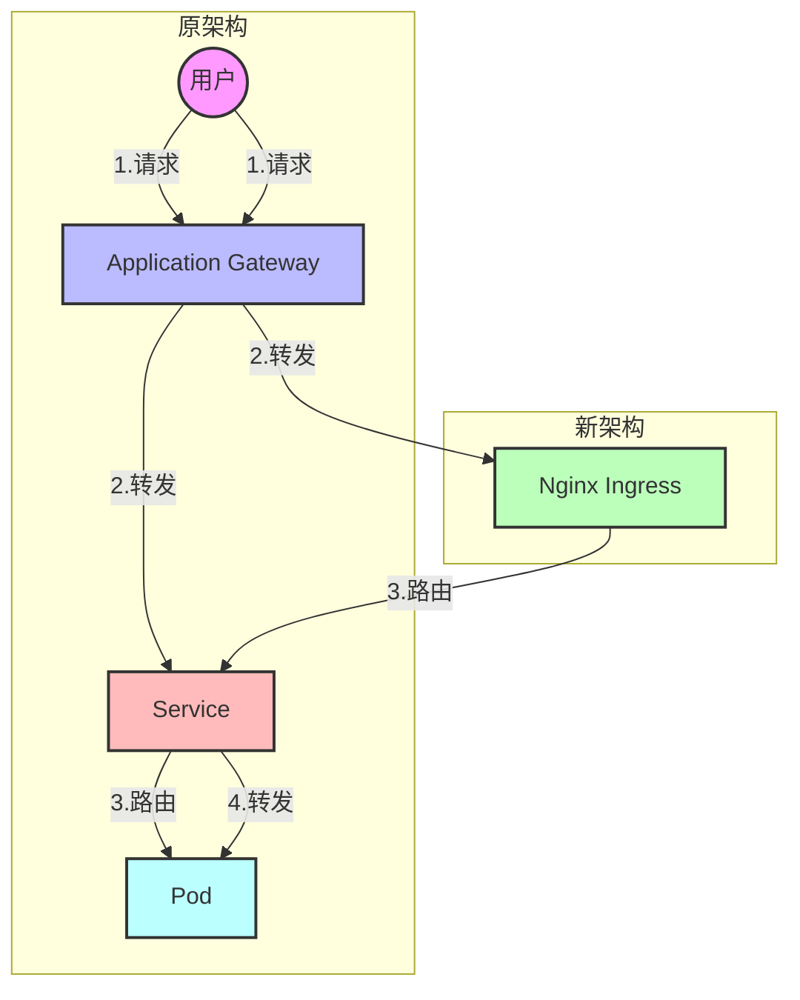
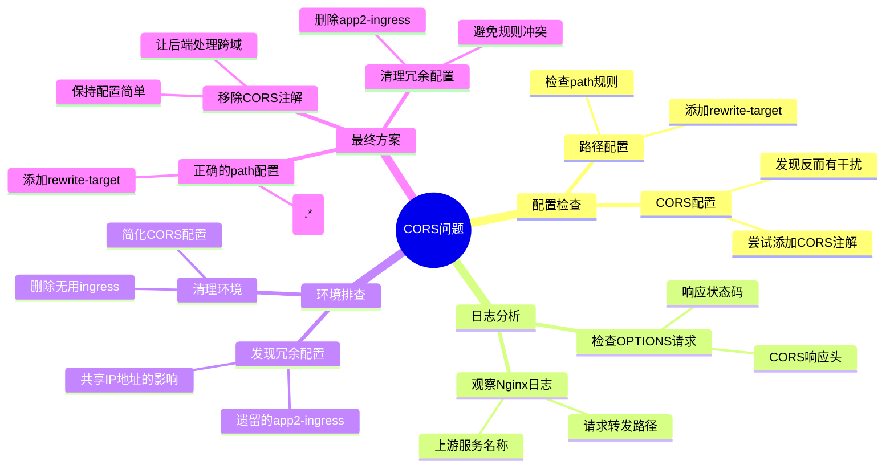

作为一名开发人员，你是否也曾遇到过这样的情况：明明代码没有改动，配置看起来也都正确，服务却突然不能用了？今天我想和大家分享一个在 Kubernetes 环境中调试跨域问题的真实案例，希望能给同样困扰的你一些启发。

<!--more-->

## 问题背景

我们的 Web 应用部署在 Azure Kubernetes Service (AKS) 上，原本的架构是这样的：

```
用户请求 -> Application Gateway -> Service -> Pod
```

为了优化性能，我们需要在中间加入一层 Nginx Ingress。架构变更如下：



配置完成后，发现浏览器报错 CORS（跨域）错误。这个问题看起来很简单，但解决过程却颇有意思。

## 第一次尝试：添加 CORS 配置

作为处理跨域问题的"标准做法"，我们首先尝试在 Ingress 配置中添加 CORS 相关的设置：

```yaml
annotations:
    nginx.ingress.kubernetes.io/enable-cors: "true"
    nginx.ingress.kubernetes.io/cors-allow-origin: "https://我们的前端域名"
```

结果：失败了。浏览器依然报跨域错误。

## 深入排查：系统性思考

这时候，我们开始系统性地分析问题：

1. 检查 OPTIONS 请求（预检请求）的响应：
```bash
curl -X OPTIONS -I \
  -H "Origin: https://我们的前端域名" \
  -H "Access-Control-Request-Method: POST" \
  https://我们的后端域名
```

返回结果看起来是正确的，包含了所有需要的 CORS 头部。

2. 查看 Nginx Ingress 的日志：
```bash
kubectl -n ingress命名空间 logs -l app=nginx-internal-0 -f
```

在日志中发现了一个关键信息：请求被转发到了一个意外的服务 `[app2-app2-service-80]`，而不是我们期望的 `app1-service`。

## 问题的真相：意外的配置冲突

通过日志分析，我们发现了一个被遗忘的 Ingress 配置正在影响我们的服务。这就好比你家的 WiFi 信号被邻居的路由器干扰了 —— 两个配置在同一个环境中"打架"。

在 Azure AKS 中，所有的 Ingress 都共享同一个 IP 地址，这意味着不同项目的 Ingress 配置可能会相互影响。我们发现了一个已经不用的 `app2-ingress` 配置仍然存在，它正在干扰我们的请求路由。

## 解决方案：化繁为简

最终的解决方案包含三个关键步骤：

1. 修正 Ingress 的路径配置：
```yaml
spec:
  rules:
  - http:
      paths:
      - path: /(.*) # 使用通配符匹配所有路径
        pathType: Prefix
        backend:
          service:
            name: app1-service
            port:
              number: 80
  annotations:
    nginx.ingress.kubernetes.io/rewrite-target: /$1 # 保证路径正确转发
```

2. 删除不再使用的 Ingress 配置：
```bash
kubectl delete ingress app2-ingress -n app2 
```

3. 移除所有手动添加的 CORS 配置（让后端服务自己处理跨域）

这里特别说明一下第一步的路径配置：
- `path: /(.*)` 用来匹配所有的请求路径
- `rewrite-target: /$1` 确保请求被正确转发到后端服务，保持原始路径不变
- 如果没有这个配置，所有请求可能都会被转发到根路径 `/`，导致APP1无法正常工作

问题解决！

## 经验总结

这次排查过程可以用下面的思维导图来总结：



这次排查经历让我们学到了几个重要的经验：

1. **看日志很重要**
   - 日志中的每个细节都可能是线索
   - 特别要注意请求被转发到了哪个服务（upstream 信息）

2. **了解环境特性**
   - 在 AKS 中，同一个 Ingress Controller 会共享一个 IP
   - 这意味着不同项目的 Ingress 配置可能会相互影响
   - 要特别注意清理不再使用的配置

3. **配置越简单越好**
   - 有时候"多一层保护"反而会把事情搞复杂
   - 如果后端服务已经正确处理了 CORS，就不要在 Ingress 层再配置一遍

4. **系统性思考**
   - 问题可能不在你最初怀疑的地方
   - 按部就班地检查每个环节，寻找异常

## 实用建议

如果你在 Kubernetes 环境中遇到类似问题，可以按照这个流程排查：

1. 查看日志，特别关注请求的转发路径
2. 检查所有相关的配置，包括看起来不相关的旧配置
3. 从简单的解决方案开始尝试
4. 保持环境整洁，及时清理不用的配置

最后，我想说的是：在微服务架构中，问题往往不像表面看起来那么简单。但只要我们保持耐心，系统地分析，就一定能找到解决方案。调试的过程虽然有时令人沮丧，但每一次成功的排查都会让我们对系统有更深的理解。

希望这篇文章能帮助你在遇到类似问题时有所启发。如果你有类似的经历或者其他想法，欢迎在评论区分享！
