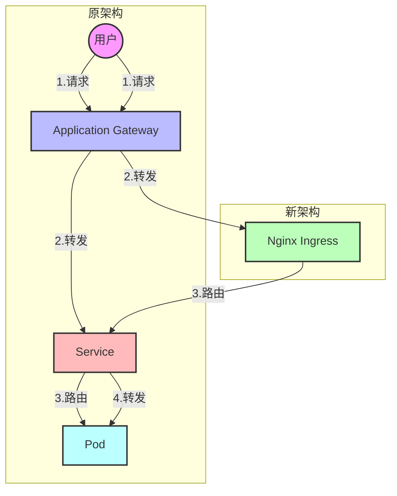

Как разработчик, вы когда-нибудь сталкивались с ситуацией, когда в коде нет никаких изменений, конфигурация вроде бы правильная, но сервис вдруг не работает? Сегодня я хочу поделиться с вами реальным случаем отладки кросс-доменных проблем в среде Kubernetes и надеюсь вдохновить вас на решение аналогичной проблемы.

<! --подробнее-->

## История проблемы

Наше веб-приложение развернуто на Azure Kubernetes Service (AKS) и изначально было спроектировано следующим образом:

```
用户请求 -> Application Gateway -> Service -> Pod
```

Чтобы оптимизировать производительность, нам нужно добавить слой Nginx Ingress в середине. Изменения в архитектуре следующие:



После завершения настройки мы обнаружили, что браузер сообщает об ошибке CORS (cross domain). Это кажется простой проблемой, но решение довольно интересное.

## Первая попытка: добавление конфигурации CORS

В качестве "стандартной практики" для решения проблем с кросс-доменами мы сначала попробовали добавить настройки, связанные с CORS, в конфигурацию Ingress:

```yaml
annotations:
    nginx.ingress.kubernetes.io/enable-cors: "true"
    nginx.ingress.kubernetes.io/cors-allow-origin: "https://我们的前端域名"
```

Результат: Неудача. Браузер по-прежнему сообщает об ошибке кросс-домена.

## Глубокое устранение неполадок: мыслим системно

На этом этапе мы начинаем анализировать проблему системно:

1. изучите ответ на запрос OPTIONS (запрос предварительной проверки):
```bash
curl -X OPTIONS -I \
  -H "Origin: https://我们的前端域名" \
  -H "Access-Control-Request-Method: POST" \
  https://我们的后端域名
```.

Результат возврата выглядит корректным и содержит все необходимые CORS-заголовки.

2. просмотрите журналы Nginx Ingress:
```bash
kubectl -n ingress命名空间 logs -l app=nginx-internal-0 -f
```

В логах было обнаружено ключевое сообщение: запрос был перенаправлен на неожиданный сервис `[app2-app2-service-80]` вместо ожидаемого `app1-service`.

## Правда: неожиданный конфликт конфигурации

Проанализировав журналы, мы обнаружили забытую конфигурацию Ingress, которая влияла на работу нашего сервиса. Это похоже на то, как если бы сигналу вашего домашнего WiFi мешал соседский роутер - две конфигурации "борются" в одной среде.

В Azure AKS все Ingress'ы имеют один и тот же IP-адрес, а это значит, что конфигурации Ingress'ов из разных проектов могут влиять друг на друга. Мы обнаружили, что неиспользуемая конфигурация `app2-ingress` все еще существовала и мешала маршрутизации наших запросов.

## Решение: Упростить

Окончательное решение состоит из трех ключевых шагов:

1. Исправьте конфигурацию пути проникновения:
```yaml
spec:
  rules:
  - http:
      paths:
      - path: /(.*) # 使用通配符匹配所有路径
        pathType: Prefix
        backend:
          service:
            name: app1-service
            port:
              number: 80
  annotations:
    nginx.ingress.kubernetes.io/rewrite-target: /$1 # 保证路径正确转发
```.

2. Удалите конфигурацию Ingress, которая больше не используется:
```bash
kubectl delete ingress app2-ingress -n app2 
```

3. удалите все добавленные вручную конфигурации CORS (пусть бэкэнд-сервис сам справляется с кросс-доменом).

Особое внимание обратите на конфигурацию пути в первом шаге:
- `path: /(.*)` используется для соответствия всем путям запроса.
- `rewrite-target: /$1` гарантирует, что запросы будут корректно перенаправлены на внутренний сервис, сохраняя оригинальный путь нетронутым.
- Без этой настройки все запросы могут быть перенаправлены на корневой путь `/`, что приведет к неправильной работе APP1

Проблема решена!

## Извлеченные уроки.

Этот процесс устранения неисправностей можно обобщить в виде следующей схемы:

```mermaid
mindmap
  root((CORS问题))
    配置检查
      路径配置
        检查path规则
        添加rewrite-target
      CORS配置
        尝试添加CORS注解
        发现反而有干扰
    日志分析
      检查OPTIONS请求
        响应状态码
        CORS响应头
      观察Nginx日志
        上游服务名称
        请求转发路径
    环境排查
      发现冗余配置
        遗留的app2-ingress
        共享IP地址的影响
      清理环境
        删除无用ingress
        简化CORS配置
    最终方案
      正确的path配置
        使用/(.*)
        添加rewrite-target
      移除CORS注解
        让后端处理跨域
        保持配置简单
      清理冗余配置
        删除app2-ingress
        避免规则冲突
```.

Этот опыт поиска и устранения неисправностей преподал нам несколько важных уроков:

1. **Важно смотреть на журналы**.
   - Каждая деталь в журналах может быть подсказкой.
   - Обратите особое внимание на то, к какой службе был направлен запрос (информация о восходящем потоке).

2. **Понимание характеристик среды
   - В AKS один и тот же Ingress Controller использует один IP.
   - В AKS один и тот же Ingress Controller использует один IP, что означает, что конфигурации Ingress из разных проектов могут взаимодействовать друг с другом.
   - Уделите особое внимание очистке конфигураций, которые больше не используются

3. ** Чем проще конфигурация, тем лучше.
   - Иногда "дополнительный уровень защиты" может все усложнить.
   - Если бэкэнд-сервис уже корректно обрабатывает CORS, не стоит настраивать его еще раз на уровне Ingress!

4. **Системное мышление
   - Проблема может быть не там, где вы ее сначала заподозрили.
   - Изучите каждый шаг за шагом, ищите аномалии.

## Практический совет

Если вы столкнулись с подобными проблемами в своей среде Kubernetes, вы можете следовать этому процессу для устранения неполадок:

1. просмотрите журналы, обращая особое внимание на пути, по которым перенаправляются запросы
2. проверьте все соответствующие конфигурации, включая старые конфигурации, которые кажутся неактуальными.
3. начните с простого решения
4. поддерживайте чистоту среды, своевременно удаляйте неиспользуемые конфигурации

В заключение я хотел бы сказать, что в архитектуре микросервисов проблемы часто не так просты, как кажутся. Но если мы сохраняем терпение и систематически анализируем их, мы обязательно найдем решение. Процесс отладки иногда разочаровывает, но каждое успешное устранение неполадок дает нам более глубокое понимание системы.

Надеюсь, эта статья поможет вам просветиться, когда вы столкнетесь с подобными проблемами. Если у вас есть похожий опыт или другие идеи, не стесняйтесь делиться ими в разделе комментариев!
