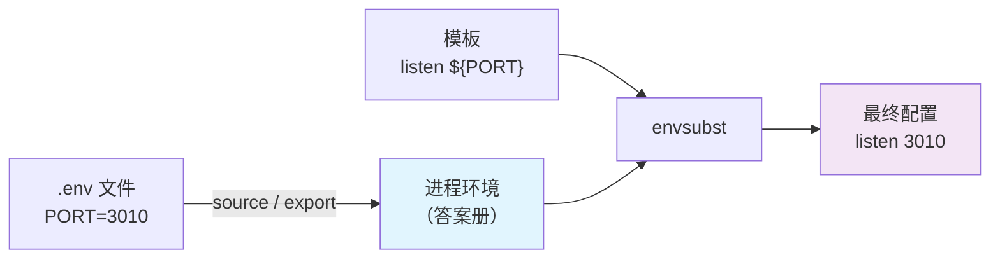

同一份配置要部署到不同环境——开发、预发、生产，差别只是几个值。"模板 + 变量替换"是最省事的做法：`sed` 太脆，模板引擎太重，`envsubst` 看起来刚刚好。

它确实刚刚好，前提是你知道它只做一件事：把"引用"换成值。第一次用它的人常踩到三个静默陷阱——模板里该保留的 `$host` 被清空、`.env` 文件喂进去毫无反应、`${VAR:-default}` 等不到默认值。三个都不报错。本文所有命令输出均在 GNU gettext-runtime 1.0 上实测。

<!--more-->

## 一、先建立心智模型：它处理"引用"，不处理"定义"

看两个长得几乎一样的字符串：

```
PORT=3010      ← 定义：给一个名字赋值
${PORT}        ← 引用：使用一个名字的值
```

`envsubst` 只认识右边那种。把它放进"模板 + 环境"的分工里，角色可以用一句话说清：

> **模板是留了空的试卷，环境变量是答案册，`envsubst` 是抄写员——只负责把答案册里的值填进试卷的空里。**

这个类比立刻推出两个判断：

- **答案册的写法它看不懂。** `.env` 文件里全是 `PORT=3010` 这样的"定义"，没有"空"可填，直接喂给 `envsubst` 只会逐字节原样吐回来。
- **没上桌的答案抄不了。** 只有 export 过的变量才在"进程环境"里，`envsubst` 才看得见。在 shell 里敲了 `PORT=3010` 但不 export，模板里的 `${PORT}` 照样是空。

数据流长这样：



记住这张图，"陷阱二"就不会踩。

## 二、五分钟基础

语法只有两段：

```bash
envsubst [OPTION] [SHELL-FORMAT]
```

不传参数时，从标准输入读到标准输出，替换其中所有 `$NAME` 和 `${NAME}` 形态的引用：

```bash
$ export PORT=3010 APP_TITLE='My Service'
$ echo 'Port is $PORT, app: ${APP_TITLE}' | envsubst
Port is 3010, app: My Service
```

完整的行为边界如下表，全部实测：

| 输入 | 行为 |
|------|------|
| `$NAME` / `${NAME}`，环境里有值 | 替换为该值 |
| `$NAME` / `${NAME}`，环境里没有 | **替换为空，无警告，退出码 0** |
| `$$`、`$5`、单独的 `$` | 原样复制 |
| `${NAME:-default}` 这类 shell 参数展开 | 原样复制（不支持默认值） |
| 被替换进去的值里如果还有 `$` | 不再二次展开 |

后三行值得展开说说。

### 变量名边界：`$PORT_EXTRA` 不是 `$PORT` 加 `_EXTRA`

```
$ echo 'boundary[$PORT_EXTRA] vs [${PORT}_EXTRA]' | envsubst
boundary[] vs [3010_EXTRA]
```

`$PORT_EXTRA` 被当作一整个变量名 `PORT_EXTRA` 去环境里查——查不到，变空。想在值后面拼接，必须用 `${PORT}_EXTRA` 把变量名边界圈清楚。这就是花括号写法存在的意义。

### 不认识的形式，原样放行

`envsubst` 认识的形态只有两种：`$` 后跟合法变量名，或 `${` 变量名 `}`。除此之外的 `$` 相关写法，它既不报错也不替换，逐字复制：

```
$ echo 'pid[$$] price[$5] dollar[$]' | envsubst
pid[$$] price[$5] dollar[$]
```

```
$ echo 'A[${NOT_SET:-fallback}]B' | envsubst
A[${NOT_SET:-fallback}]B
```

第二行值得警惕：很多人以为 `${VAR:-fallback}` 能在这里当"默认值"用——不会。整段原样漏进最终配置文件。

### `-v`：列出引用，而不是替换

```bash
$ envsubst -v 'x $PORT y ${DOMAIN} z $PORT $UNSET_A'
PORT
DOMAIN
PORT
UNSET_A
```

按出现顺序逐行输出，三个细节：**不去重**（PORT 出现两次就是两行）、**没定义的变量也列**、忽略标准输入（此时它只分析参数里的内容）。

## 三、陷阱一：不带"白名单"的替换，会误伤模板里的其他 `$`

用最经典的场景开刀——模板渲染 nginx 配置：

```nginx
server {
    listen ${PORT};
    server_name ${DOMAIN};
    location / {
        proxy_set_header Host $host;
        proxy_set_header X-Real-IP $remote_addr;
    }
}
```

朴素用法直接渲染：

```bash
$ export PORT=3010 DOMAIN=example.com
$ envsubst < nginx.conf.template
server {
    listen 3010;
    server_name example.com;
    location / {
        proxy_set_header Host ;
        proxy_set_header X-Real-IP ;
    }
}
```

**`$host` 和 `$remote_addr` 被清空了。** 它们恰好长成了"`$` + 合法变量名"的形态，`envsubst` 便尽职地去环境里查"host 这个变量"——环境里没有——按规则替换为空。它不知道这是 nginx 自己的运行时变量。

正确姿势是给一个"白名单"（man page 里叫 `SHELL-FORMAT`）：

```bash
$ envsubst '${PORT} ${DOMAIN}' < nginx.conf.template
server {
    listen 3010;
    server_name example.com;
    location / {
        proxy_set_header Host $host;
        proxy_set_header X-Real-IP $remote_addr;
    }
}
```

规则是：**只有白名单上出现的变量名会被替换，其余引用原样保留。** 而且它是精确的名字匹配：

```
$ echo '$PORT $PORT_EXTRA ${PORT} ${PORT_EXTRA}' | envsubst '${PORT}'
3010 $PORT_EXTRA 3010 ${PORT_EXTRA}
```

白名单里只有 `PORT`，`$PORT_EXTRA` 不沾光——名字不同，原样保留。另外实测确认：白名单参数写成 `'$PORT'` 还是 `'${PORT}'` 完全等价，模板里两种写法都会被替换。

顺带堵一条岔路：有人会想用反斜杠转义 `\$host` 来保护字面 `$`——这条路不通。实测 `abc\$DEF` 的输出是 `abc\`：反斜杠照常输出，`$DEF` 照常被替换。**保护字面 `$` 的可靠手段就是白名单。**

### 进阶：自动生成白名单

手写白名单的麻烦在于模板一改就可能忘了同步。换个角度：**"哪些变量该被替换"的答案，其实就是"环境里真实存在的那些"**——环境变量名列表天然就是一份白名单：

```bash
defined_envs=$(printf '${%s} ' $(env | cut -d= -f1))
envsubst "$defined_envs" < nginx.conf.template
```

实测输出与手写白名单完全一致：`${PORT}`、`${DOMAIN}` 被替换，`$host`、`$remote_addr` 保留——因为 host、remote_addr 不在环境里，天然被排除。

这不是民间偏方：nginx 官方 Docker 镜像的模板机制（`/docker-entrypoint.d/20-envsubst-on-templates.sh`，1.19+）用的就是这个思路——把环境里的变量名拼成白名单传给 envsubst，并提供 `NGINX_ENVSUBST_FILTER` 参数用正则进一步圈定名字范围（比如只认 `NGINX_` 开头的）。

## 四、陷阱二：把"定义文件"当模板喂

回到 `.env` 文件。这类文件长这样：

```bash
# Application environment
PORT=3010
NODE_ENV=production
APP_TITLE="My Service"
```

直接喂给 `envsubst`：

```bash
$ envsubst < app.env
# Application environment
PORT=3010
NODE_ENV=production
APP_TITLE="My Service"
```

逐字节原样——理由第一节说过：没有"空"可填。**`envsubst` 永远不会"读取 .env 并取值"**，想让两者协作，顺序是反过来的：先把 `.env` 灌进环境，再用环境渲染模板。

### 三行工作流

```bash
set -a              # allexport：接下来 source 的赋值全部自动 export
source app.env
set +a
envsubst '${PORT} ${NODE_ENV} ${APP_TITLE}' < app.env.template
```

为什么必须 `set -a`？因为 `envsubst` 是独立进程，只能继承"已 export 的变量"。实测对照：

```
$ UNEXPORTED=secret; export EXPORTED=visible
$ echo 'u=[$UNEXPORTED] e=[$EXPORTED]' | envsubst
u=[] e=[visible]
```

`set -a` 让 source 期间的所有赋值自动带上 export 属性——省掉逐行 `export`。

### 这个工作流自带一个坑：值含空格必须加引号

如果 `.env` 里写 `APP_TITLE=My Service`（没加引号），source 的瞬间 shell 会把这行解析成"对 APP_TITLE 临时赋值 My，然后执行命令 Service"：

```
$ source app.env
app.env: line 4: Service: command not found
$ echo "APP_TITLE=[$APP_TITLE]"
APP_TITLE=[]
```

报错算直白，但该行的赋值**没有生效**——如果这段发生在 CI 的日志洪流里，很可能没人回头看一眼。规则很简单：**值里含空格就加引号**。

另外记住 source 的本质是"执行这个文件"：里面写什么都会被当成代码执行，来源不可信的 `.env` 不要 source。

### fish 用户：source 这条路不通

fish 不支持 `PORT=3010` 这种赋值语句，source bash 风格的 `.env` 会当场被拦下：

```
$ source app.env
app.env (line 2): Unsupported use of '='. In fish, please use 'set PORT 3010'.
```

fish 的惯用法是逐行读、逐行 set：

```fish
for line in (grep -v '^#' app.env | grep -v '^$')
    set -gx (string split -m1 = -- $line)
end
```

`string split -m1 =` 把每行从第一个 `=` 切开，得到的两段正好是 `set -gx` 需要的"变量名 值"。实测灌入后模板渲染正常。一个小提醒：这个逐行方案不剥引号——`APP_TITLE="My Service"` 的值会带着字面引号进环境，如果 `.env` 大量使用引号，可以在循环里补一步 `string trim -c '"'`。

## 五、陷阱三：它的所有失败，都是静默的

前两个陷阱其实共用同一个性格：**`envsubst` 没有任何报错机制**。汇总成一句话——出了问题，它不会喊：

- 变量未定义 → 安静变空，退出码 0
- 变量名拼错 → 安静变空，退出码 0（和"故意没定义"无法区分）
- 模板里写了 `${VAR:-default}` → 安静地原样漏进最终文件

```
$ echo 'Z[${MISSING}]' | envsubst; echo "exit=$?"
Z[]
exit=0
```

渲染一个数据库连接串 `postgres://$DB_USER:$DB_PASS@$DB_HOST/db`，如果 `DB_PASS` 拼成了 `DB_PASW`，产物是 `postgres://user:@host/db`——看起来"只是密码为空"，直到连接失败才会有人回头看。

### 防御：用 `-v` 做飞行前检查

`-v` 能列出模板引用的所有变量，于是可以在替换之前先"对账"：

```bash
$ envsubst -v "$(cat nginx.conf.template)"
PORT
DOMAIN
host
remote_addr
```

输出分两类：`PORT`、`DOMAIN` 是你该检查的；`host`、`remote_addr` 是"模板里别人的变量"——它们出现在清单里这件事本身，就在提醒你"这个模板不能不带白名单地全量替换"。

对纯 `envsubst` 模板（不含第三方 `$` 语法），这个清单可以直接用来做缺失检查：

```bash
# 列出"模板需要、但环境里没有"的变量
comm -23 <(envsubst -v "$(cat template.conf)" | sort -u) <(env | cut -d= -f1 | sort -u)
```

## 六、选型对照：什么时候不该用 envsubst

| 需求 | 建议 |
|------|------|
| 只做 `$VAR` 替换，没有逻辑 | envsubst（模板里含"别人的 `$` 语法"时，务必带白名单） |
| 需要默认值、条件、循环 | gomplate / Jinja2 / Helm（K8s 场景） |
| 需要大小写变换等字符串处理 | gomplate / Jinja2 |
| 生产环境多环境配置管理 | Ansible template / Helm / 配置中心 |

envsubst 的定位是**管道里的一颗螺丝钉**：二十年没大改，任何环境都有，只做一件事。它的价值不在能力，在于"小到可以放心塞进任何脚本"。

而它的三个静默陷阱正是"小而简单"的代价：没有默认值、没有条件、没有报错。复杂度需求一旦冒头，就该换工具，而不是在它外面裹三层 shell 判断。

## 七、附：当 AI 开始帮你写配置

让 AI 助手写一份部署配置，有两种产物形态：

1. **直接生成最终配置**——把数据库密码、密钥的真实值写进 AI 生成的 YAML。秘密进入了对话上下文、模型日志和后续会话的"记忆"。
2. **生成模板**——AI 只写 `${DB_PASSWORD}` 这样的引用，真实值由运行时的环境注入。

第二种形态恰好是 `envsubst` 的领地，且带来三重收益：

- **秘密与对话分离**：AI 全程看不到真实值，上下文里没有可泄露的内容
- **模板可复用**：同一份模板配不同环境，不必为"生产/测试差异"生成两份
- **权责清晰**：模板（结构）与值（环境）分别管理——审计模板不必看秘密，轮换秘密不必改模板

"定义与引用分离"——第一节的心智模型——在 AI 时代换了个名字叫"数据与代码分离"，内核是同一件事。

## 一页速查表

```bash
# 基础
envsubst < template > output                  # 全量替换（当心误伤）
envsubst '${PORT} ${DOMAIN}' < template       # 白名单替换（推荐）
envsubst -v "$(cat template)"                 # 列出模板引用的变量

# .env 工作流（bash/sh）
set -a; source app.env; set +a                # 先注入环境（值含空格要加引号）
envsubst '${PORT}' < template                 # 再渲染

# .env 工作流（fish）
for line in (grep -v '^#' app.env | grep -v '^$')
    set -gx (string split -m1 = -- $line)
end

# 自动白名单：环境变量名即白名单（nginx 官方镜像思路）
envsubst "$(printf '${%s} ' $(env | cut -d= -f1))" < template

# 缺失检查：模板需要、环境里没有的变量
comm -23 <(envsubst -v "$(cat template)" | sort -u) <(env | cut -d= -f1 | sort -u)
```

```bash
# 三个"它会安静地做错事"的点，动手前扫一眼：
#   1. 不带白名单 → 模板里 $host 这类"别人的变量"会被清空
#   2. 把 .env 当模板喂 → 原样输出，什么都没发生
#   3. ${VAR:-default} → 原样漏出；拼错的变量名 → 静默变空
```

## 回到开头

下次动手前，花十秒过一遍三问：

1. **模板里有没有"别人的 `$` 语法"？**（nginx 的 `$host`、Prometheus 的 `$labels`……）有 → 白名单
2. **值从哪来？** `envsubst` 只认"已 export 的环境变量"——`.env` 要先注入，值含空格要先加引号
3. **替换完了怎么确认没漏？** `-v` 对账；`${VAR:-x}` 和拼错的名字都不会报警

最后留一个可以自己动手验证的问题：白名单参数写成 `'$PORT $DOMAIN'`（不带花括号）和 `'${PORT} ${DOMAIN}'`（带花括号），替换结果有区别吗？——想清楚这个，白名单参数的两种写法就都拿准了。
