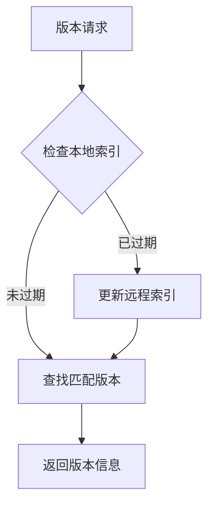
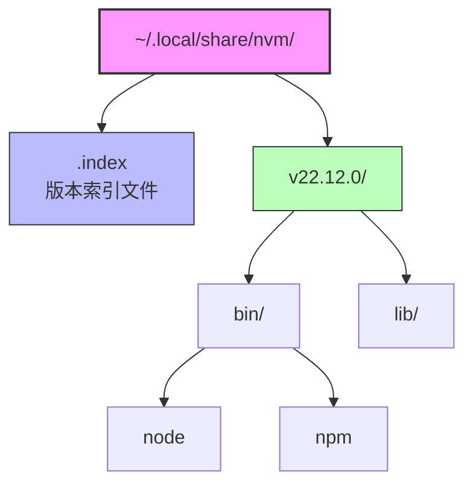

Node.js版本管理是现代前端开发中的一个关键话题。不同的项目可能需要不同版本的Node.js，如何在fish shell环境下优雅地解决这个问题？让我们深入探讨nvm.fish的工作原理和最佳实践。

<!--more-->

## 版本管理的核心问题

Node.js的版本管理本质上需要解决以下几个问题：

1. 二进制管理：如何下载、存储和组织不同版本的Node.js二进制文件
2. 环境变量：如何动态修改PATH等环境变量以切换当前shell会话的Node.js版本
3. 项目关联：如何将特定项目与特定Node.js版本关联起来
4. 依赖管理：如何处理全局安装的npm包在不同Node.js版本间的兼容性

## nvm.fish的实现原理

### 1. 版本存储结构

nvm.fish采用了简洁的文件系统结构：

```
~/.local/share/nvm/
├── v14.17.0/
│   ├── bin/
│   │   ├── node
│   │   └── npm
│   └── lib/
├── v16.14.0/
└── .index    # 版本索引文件
```

每个版本都有独立的目录，包含完整的二进制文件和依赖库。

### 2. 环境变量管理

nvm.fish通过fish的环境变量机制实现版本切换：

```fish
function _nvm_version_activate --argument-names ver
    set --global nvm_current_version $ver
    set --prepend PATH $nvm_data/$ver/bin
end

function _nvm_version_deactivate --argument-names ver
    set --erase nvm_current_version
    set --erase PATH
end
```

这种实现确保了：
- 版本切换只影响当前shell会话
- 不同终端窗口可以使用不同的Node.js版本
- 快速回退到系统默认版本

### 3. 自动版本检测

nvm.fish使用递归向上查找的方式定位配置文件：

```fish
function _nvm_find_up --argument-names path file
    test -e "$path/$file" && echo $path/$file || begin
        test ! -z "$path" || return
        _nvm_find_up (string replace --regex -- '/[^/]*$' "" $path) $file
    end
end
```

这个设计允许：
- 在任意子目录中自动检测项目的Node.js版本要求
- 支持多种配置文件格式（.nvmrc、.node-version）
- 维持项目配置的向上继承关系

## 高级特性与最佳实践

### 1. 远程索引缓存

nvm.fish维护了一个本地版本索引，通过它可以：
- 快速查找可用的Node.js版本
- 支持版本别名（如lts、latest）
- 实现智能版本匹配



### 2. 架构适配

nvm.fish能够智能检测系统架构并下载对应的二进制文件：

```fish
switch $arch
    case i*86
        set arch x86
    case x86_64
        set arch x64
    case arm64
        string match --regex --quiet "v(?<major>\d+)" $ver
        if test "$os" = darwin -a $major -lt 16
            set arch x64
        end
end
```

这个设计处理了：
- 不同CPU架构（x86、x64、ARM）
- 特殊情况（如M1 Mac的Rosetta 2模拟）
- 历史版本的兼容性问题

### 3. 镜像支持

为了适应不同地区的网络环境，nvm.fish提供了镜像配置：

```fish
# 使用自定义镜像
set -g nvm_mirror https://npmmirror.com/mirrors/node

# 支持的下载模式
function _nvm_download
    command curl --silent $nvm_mirror/$ver/$dir.$ext
end
```

### 4. shell集成

nvm.fish通过fish的补全系统提供了丰富的命令行体验：

```fish
complete --command nvm --exclusive --condition __fish_use_subcommand
complete --command nvm --exclusive --condition "__fish_seen_subcommand_from install" --arguments "(
    test -e $nvm_data && string split ' ' <$nvm_data/.index
)"
```

这样的设计提供了：
- 上下文感知的命令补全
- 动态版本列表
- 实时命令提示

## 工程化实践

### 1. 项目标准化

推荐在项目中使用`.nvmrc`文件管理Node.js版本：

```bash
# .nvmrc
16.14.0
```

配合CI/CD系统：

```yaml
# GitHub Actions示例
steps:
  - uses: actions/checkout@v2
  - name: Setup Node.js
    run: |
      curl -o- https://raw.githubusercontent.com/fish-shell/nvm.fish/main/install.sh | fish
      nvm install
```

### 2. 团队协作

为了确保团队成员使用一致的Node.js版本：

1. 在项目文档中明确版本要求
2. 使用git hooks自动检查Node.js版本
3. 配置编辑器集成（如VSCode的工作区设置）

## 未来展望

随着Node.js生态的发展，版本管理工具也在不断进化：

1. 容器化趋势
   - 开发环境容器化
   - 多版本并行运行
   - 隔离的依赖管理

2. 新包管理工具
   - pnpm的崛起
   - yarn的持续创新
   - npm的稳定演进

3. 跨平台支持
   - ARM架构的普及
   - 云开发环境
   - 远程开发模式

nvm.fish的设计为这些变化预留了扩展空间，通过模块化的结构和清晰的接口，能够适应未来的发展需求。

## 总结

nvm.fish通过优雅的设计和强大的功能，很好地解决了fish shell环境下的Node.js版本管理问题。它不仅提供了便捷的使用体验，还在工程化实践中发挥着重要作用。随着开发模式的演进，这类工具将继续在开发效率提升中扮演关键角色。

---

- 配图：展示nvm.fish的文件系统结构图


- 配图：展示版本切换时的环境变量变化过程
```fish
$ echo "16.14.0" > .nvmrc
$ cd ..
$ nvm use lts
Now using Node v22.12.0 (npm 10.9.0) ~/.local/share/nvm/v22.12.0/bin/node
$ nvm list
   v16.14.0 lts/gallium
 ▶ v22.12.0 lts/jod
$ z -
$ nvm use
Now using Node v16.14.0 (npm 8.3.1) ~/.local/share/nvm/v16.14.0/bin/node
$ nvm list
 ▶ v16.14.0 lts/gallium
   v22.12.0 lts/jod
```
