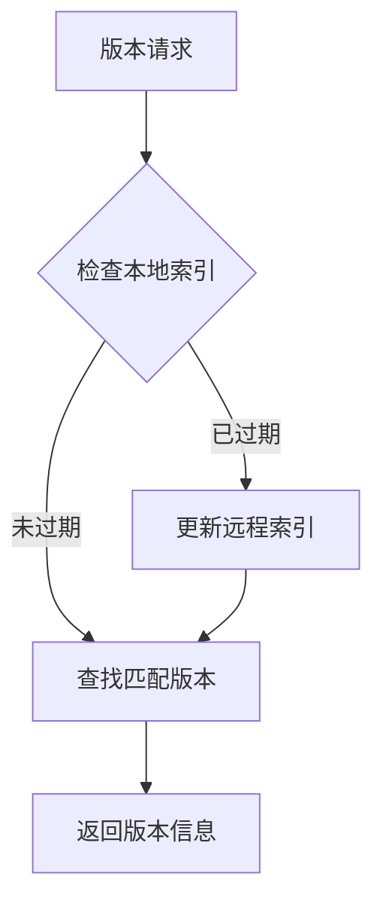

Версионность Node.js - ключевая тема в современной фронтенд-разработке. Для разных проектов могут потребоваться разные версии Node.js, как элегантно решить эту проблему в среде fish shell? Давайте разберемся, как работает nvm.fish, и рассмотрим лучшие практики.

<! --подробнее...

## Основные проблемы версионирования

Версионирование Node.js в основном требует решения следующих вопросов:

1. управление двоичными файлами: как загружать, хранить и организовывать различные версии двоичных файлов Node.js
2. переменные окружения: как динамически изменять переменные окружения, такие как PATH, для переключения версии Node.js в текущей сессии оболочки
3. ассоциация проектов: как связать конкретный проект с конкретной версией Node.js
4. управление зависимостями: как обеспечить совместимость глобально установленных пакетов npm между различными версиями Node.js

## принцип реализации nvm.fish

### 1. Структура хранения версий

nvm.fish использует простую структуру файловой системы:

```
~/.local/share/nvm/
├── v14.17.0/
│   ├── bin/
│   │   ├── node
│   │   └── npm
│   └── lib/
├── v16.14.0/
└── .index    # 版本索引文件
```.

Каждая версия имеет отдельный каталог, содержащий полные двоичные файлы и зависимые библиотеки.

### 2. Управление переменными окружения

nvm.fish обеспечивает переключение версий через механизм переменных окружения fish:

```fish
function _nvm_version_activate --argument-names ver
    set --global nvm_current_version $ver
    set --prepend PATH $nvm_data/$ver/bin
end

function _nvm_version_deactivate --argument-names ver
    set --erase nvm_current_version
    set --erase PATH
end
```.

Эта реализация гарантирует, что:
- переключение версий влияет только на текущую сессию оболочки.
- Разные окна терминала могут использовать разные версии Node.js.
- Быстрый возврат к версии системы по умолчанию

### 3. Автоматическое определение версии

nvm.fish использует рекурсивный восходящий поиск для нахождения конфигурационных файлов:

```fish
function _nvm_find_up --argument-names path file
    test -e "$path/$file" && echo $path/$file || begin
        test ! -z "$path" || return
        _nvm_find_up (string replace --regex -- '/[^/]*.

Такая конструкция позволяет:
- Автоматическое определение требований к версии Node.js проекта в любом подкаталоге
- Поддержка нескольких форматов конфигурационных файлов (.nvmrc, .node-version).
- Поддерживать восходящее наследование конфигураций проекта

## Дополнительные возможности и лучшие практики

### 1. Удаленное кэширование индексов

nvm.fish поддерживает локальный индекс версий, с помощью которого вы можете:
- Быстро находить доступные версии Node.js.
- Поддерживать псевдонимы версий (например, lts, latest).
- Реализовать интеллектуальное сопоставление версий



### 2. Адаптация архитектуры

nvm.fish может интеллектуально определять архитектуру системы и загружать соответствующие двоичные файлы:

```fish
switch $arch
    case i*86
        set arch x86
    case x86_64
        set arch x64
    case arm64
        string match --regex --quiet "v(?<major>\d+)" $ver
        if test "$os" = darwin -a $major -lt 16
            set arch x64
        end
end
```.

Эта конструкция справляется с:
- различные архитектуры процессоров (x86, x64, ARM)
- особые случаи (например, эмуляция Rosetta 2 для компьютеров M1 Mac)
- проблемы совместимости исторических версий

### 3. Поддержка зеркал

Чтобы адаптироваться к сетевому окружению в разных регионах, nvm.fish предоставляет возможность настройки зеркал:

```fish
# 使用自定义镜像
set -g nvm_mirror https://npmmirror.com/mirrors/node

# 支持的下载模式
function _nvm_download
    command curl --silent $nvm_mirror/$ver/$dir.$ext
end
```.

### 4. интеграция оболочки

nvm.fish предоставляет богатый опыт работы с командной строкой через систему дополнений fish:

```fish
complete --command nvm --exclusive --condition __fish_use_subcommand
complete --command nvm --exclusive --condition "__fish_seen_subcommand_from install" --arguments "(
    test -e $nvm_data && string split ' ' <$nvm_data/.index
)"
```.

Она предназначена для обеспечения:
- Контекстно-зависимое завершение команд
- Динамические списки версий
- Подсказки команд в реальном времени

## Инженерия на практике

### 1. Стандартизация проекта

Рекомендуется использовать файл __PROTECTED_INLINE_CODE__11__ для управления версиями Node.js в вашем проекте:

```bash
# .nvmrc
16.14.0
```

Работает с системами CI/CD:

```yaml
# GitHub Actions示例
steps:
  - uses: actions/checkout@v2
  - name: Setup Node.js
    run: |
      curl -o- https://raw.githubusercontent.com/fish-shell/nvm.fish/main/install.sh | fish
      nvm install
```

### 2. Работа в команде

Чтобы гарантировать, что члены команды используют согласованную версию Node.js:

1. укажите требования к версии в документации проекта
2. используйте git-хуки для автоматической проверки версий Node.js
3. настройте интеграцию с редактором (например, параметры рабочего пространства VSCode)

## Перспективы на будущее

По мере развития экосистемы Node.js развиваются и инструменты версионирования:

1. Тенденции контейнеризации
   - Контейнеризация сред разработки
   - Параллельная работа нескольких версий
   - Изолированное управление зависимостями

2. Новые инструменты управления пакетами
   - Возвышение pnpm
   - Непрерывные инновации в yarn
   - Постоянная эволюция npm

3. Поддержка кросс-платформ
   - Популярность архитектуры ARM
   - Облачная среда разработки
   - Режим удаленной разработки

Дизайн nvm.fish оставляет пространство для расширения с учетом этих изменений и способен адаптироваться к будущим потребностям разработки благодаря модульной структуре и понятным интерфейсам.

## Резюме

nvm.fish хорошо решает проблему версионирования Node.js в среде fish shell благодаря своему элегантному дизайну и мощным функциям. Он не только обеспечивает удобство использования, но и играет важную роль в инженерной практике. По мере развития модели разработки такие инструменты будут продолжать играть ключевую роль в повышении эффективности разработки.

---

- Рисунок: Структура файловой системы nvm.fish
```mermaid
graph TD
    NVM[~/.local/share/nvm/] --> Index[.index<br/>版本索引文件]
    NVM --> V22[v22.12.0/]
    V22 --> Bin22[bin/]
    Bin22 --> Node22[node]
    Bin22 --> NPM22[npm]
    V22 --> Lib22[lib/]
    
    style NVM fill:#f9f,stroke:#333,stroke-width:2px
    style Index fill:#bbf,stroke:#333,stroke-width:1px
    style V22 fill:#bfb,stroke:#333,stroke-width:1px
```.

- На рисунке показано, как изменяются переменные окружения при переключении между версиями.
```fish
$ echo "16.14.0" > .nvmrc
$ cd ..
$ nvm use lts
Now using Node v22.12.0 (npm 10.9.0) ~/.local/share/nvm/v22.12.0/bin/node
$ nvm list
   v16.14.0 lts/gallium
 ▶ v22.12.0 lts/jod
$ z -
$ nvm use
Now using Node v16.14.0 (npm 8.3.1) ~/.local/share/nvm/v16.14.0/bin/node
$ nvm list
 ▶ v16.14.0 lts/gallium
   v22.12.0 lts/jod
``` с диаграммой, показывающей, как изменяются переменные окружения при переключении между версиями.
 "" $path) $file
    end
end
```.

Такая конструкция позволяет:
- Автоматическое определение требований к версии Node.js проекта в любом подкаталоге
- Поддержка нескольких форматов конфигурационных файлов (.nvmrc, .node-version).
- Поддерживать восходящее наследование конфигураций проекта

## Дополнительные возможности и лучшие практики

### 1. Удаленное кэширование индексов

nvm.fish поддерживает локальный индекс версий, с помощью которого вы можете:
- Быстро находить доступные версии Node.js.
- Поддерживать псевдонимы версий (например, lts, latest).
- Реализовать интеллектуальное сопоставление версий

```mermaid
graph TD
    A[版本请求] --> B{检查本地索引}
    B -- 已过期 --> C[更新远程索引]
    B -- 未过期 --> D[查找匹配版本]
    C --> D
    D --> E[返回版本信息]
```

### 2. Адаптация архитектуры

nvm.fish может интеллектуально определять архитектуру системы и загружать соответствующие двоичные файлы:

```fish
switch $arch
    case i*86
        set arch x86
    case x86_64
        set arch x64
    case arm64
        string match --regex --quiet "v(?<major>\d+)" $ver
        if test "$os" = darwin -a $major -lt 16
            set arch x64
        end
end
```.

Эта конструкция справляется с:
- различные архитектуры процессоров (x86, x64, ARM)
- особые случаи (например, эмуляция Rosetta 2 для компьютеров M1 Mac)
- проблемы совместимости исторических версий

### 3. Поддержка зеркал

Чтобы адаптироваться к сетевому окружению в разных регионах, nvm.fish предоставляет возможность настройки зеркал:

```fish
# 使用自定义镜像
set -g nvm_mirror https://npmmirror.com/mirrors/node

# 支持的下载模式
function _nvm_download
    command curl --silent $nvm_mirror/$ver/$dir.$ext
end
```.

### 4. интеграция оболочки

nvm.fish предоставляет богатый опыт работы с командной строкой через систему дополнений fish:

```fish
complete --command nvm --exclusive --condition __fish_use_subcommand
complete --command nvm --exclusive --condition "__fish_seen_subcommand_from install" --arguments "(
    test -e $nvm_data && string split ' ' <$nvm_data/.index
)"
```.

Она предназначена для обеспечения:
- Контекстно-зависимое завершение команд
- Динамические списки версий
- Подсказки команд в реальном времени

## Инженерия на практике

### 1. Стандартизация проекта

Рекомендуется использовать файл __PROTECTED_INLINE_CODE__11__ для управления версиями Node.js в вашем проекте:

```bash
# .nvmrc
16.14.0
```

Работает с системами CI/CD:

```yaml
# GitHub Actions示例
steps:
  - uses: actions/checkout@v2
  - name: Setup Node.js
    run: |
      curl -o- https://raw.githubusercontent.com/fish-shell/nvm.fish/main/install.sh | fish
      nvm install
```

### 2. Работа в команде

Чтобы гарантировать, что члены команды используют согласованную версию Node.js:

1. укажите требования к версии в документации проекта
2. используйте git-хуки для автоматической проверки версий Node.js
3. настройте интеграцию с редактором (например, параметры рабочего пространства VSCode)

## Перспективы на будущее

По мере развития экосистемы Node.js развиваются и инструменты версионирования:

1. Тенденции контейнеризации
   - Контейнеризация сред разработки
   - Параллельная работа нескольких версий
   - Изолированное управление зависимостями

2. Новые инструменты управления пакетами
   - Возвышение pnpm
   - Непрерывные инновации в yarn
   - Постоянная эволюция npm

3. Поддержка кросс-платформ
   - Популярность архитектуры ARM
   - Облачная среда разработки
   - Режим удаленной разработки

Дизайн nvm.fish оставляет пространство для расширения с учетом этих изменений и способен адаптироваться к будущим потребностям разработки благодаря модульной структуре и понятным интерфейсам.

## Резюме

nvm.fish хорошо решает проблему версионирования Node.js в среде fish shell благодаря своему элегантному дизайну и мощным функциям. Он не только обеспечивает удобство использования, но и играет важную роль в инженерной практике. По мере развития модели разработки такие инструменты будут продолжать играть ключевую роль в повышении эффективности разработки.

---

- Рисунок: Структура файловой системы nvm.fish
```mermaid
graph TD
    NVM[~/.local/share/nvm/] --> Index[.index<br/>版本索引文件]
    NVM --> V22[v22.12.0/]
    V22 --> Bin22[bin/]
    Bin22 --> Node22[node]
    Bin22 --> NPM22[npm]
    V22 --> Lib22[lib/]
    
    style NVM fill:#f9f,stroke:#333,stroke-width:2px
    style Index fill:#bbf,stroke:#333,stroke-width:1px
    style V22 fill:#bfb,stroke:#333,stroke-width:1px
```.

- На рисунке показано, как изменяются переменные окружения при переключении между версиями.
```fish
$ echo "16.14.0" > .nvmrc
$ cd ..
$ nvm use lts
Now using Node v22.12.0 (npm 10.9.0) ~/.local/share/nvm/v22.12.0/bin/node
$ nvm list
   v16.14.0 lts/gallium
 ▶ v22.12.0 lts/jod
$ z -
$ nvm use
Now using Node v16.14.0 (npm 8.3.1) ~/.local/share/nvm/v16.14.0/bin/node
$ nvm list
 ▶ v16.14.0 lts/gallium
   v22.12.0 lts/jod
``` с диаграммой, показывающей, как изменяются переменные окружения при переключении между версиями.
