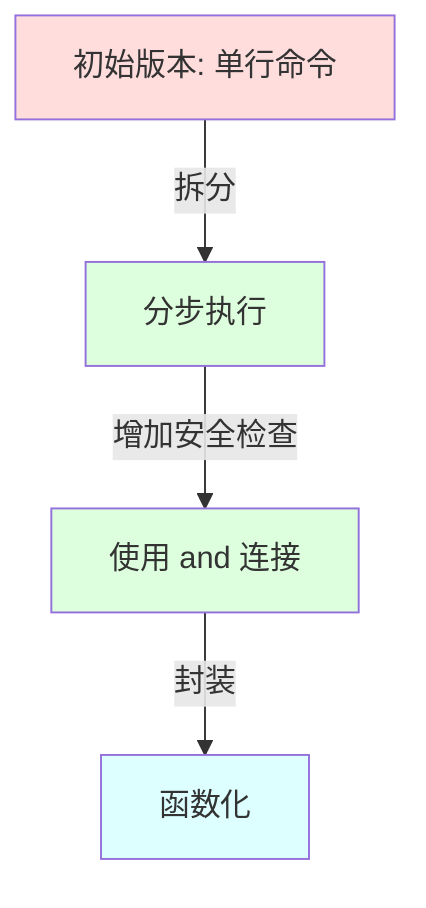
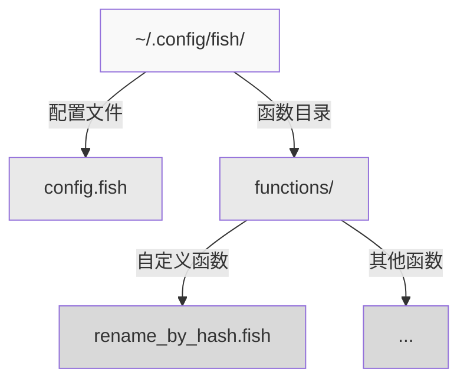

在日常工作中，我们经常需要批量处理文件，比如根据文件内容的特征来重命名文件。如果你刚开始接触 shell 编程，可能会觉得这是一个简单的任务。但实际上，如何安全地完成这项工作，涉及到了很多细节和最佳实践。让我们通过一个具体的例子，来了解 Fish Shell 在安全编程方面的特色。

<!--more-->

## 从需求说起

假设我们有这样一个需求：把一个 JPEG 图片和它对应的文本说明文件重命名，新文件名要包含文本文件的 MD5 值和图片文件的时间戳。这是一个典型的文件处理任务，涉及到：

1. 计算文件的 MD5 值
2. 获取文件的时间戳
3. 重命名两个相关文件

## 初学者的常见做法

如果你之前使用过 Bash 或 Zsh，可能会这样写：

```bash
mv sample.jpeg "$(md5 sample.txt | awk '{print $NF}').t$(gstat --format=%W sample.jpeg).jpeg"
```

这行命令在 Bash 或 Zsh 中是可以工作的。但当你把它放到 Fish Shell 中运行时，会发现它并不会按预期执行。

## Fish Shell 的安全理念

为什么同样的命令在 Fish Shell 中不工作呢？这涉及到 Fish Shell 的一个重要设计理念：保守求值（Conservative Evaluation）。

在 Bash/Zsh 中，当遇到 `$(...)` 或反引号时，shell 会立即执行命令并替换结果。这种"贪婪求值"的方式虽然方便，但也带来了安全隐患：
- 字符串中的命令会被自动执行，可能导致意外的命令执行
- 错误处理不够清晰，中间步骤的失败可能被忽略
- 命令串联时的错误传播不够明确

Fish Shell 采用了不同的方案：
1. 字符串中的命令替换不会自动执行
2. 需要显式地使用 `eval` 或其他方式来执行命令
3. 推荐使用更结构化的方式来组织命令

## 循序渐进的改进

让我们看看如何一步步改进这个命令：



### 1. 分步执行
首先，我们可以把操作拆分成多个步骤：

```fish
set md5sum (md5 sample.txt | awk '{print $NF}')
set timestamp (gstat --format=%W sample.jpeg)
mv sample.jpeg "$md5sum.t$timestamp.jpeg"
```

这样的好处是：
- 每一步都清晰可见
- 容易检查中间结果
- 方便调试

### 2. 使用 and 连接确保安全性

进一步改进，我们使用 `and` 来确保每一步都成功：

```fish
set md5sum (md5 sample.txt | awk '{print $NF}'); and \
set timestamp (gstat --format=%W sample.jpeg); and \
mv sample.jpeg "$md5sum.t$timestamp.jpeg"; and \
mv sample.txt "$md5sum.txt"
```

这样的好处是：
- 如果任何一步失败，后续步骤不会执行
- 避免了部分文件重命名而另一部分失败的情况
- 保持了文件的一致性

### 3. 封装为函数

最后，我们可以把这个功能封装成一个可重用的函数：

```fish
function rename_by_hash
    set -l txt_file $argv[1]
    set -l jpeg_file $argv[2]
    
    if test ! -f $txt_file; or test ! -f $jpeg_file
        echo "Usage: rename_by_hash text_file jpeg_file"
        return 1
    end
    
    if set -l md5sum (md5 $txt_file | awk '{print $NF}')
        and set -l timestamp (gstat --format=%W $jpeg_file)
        mv $jpeg_file "$md5sum.t$timestamp.jpeg"
        and mv $txt_file "$md5sum.txt"
        echo "Files renamed successfully"
    else
        echo "Error occurred during renaming"
        return 1
    end
end
```

这个最终版本具备了很多优秀的特性：
- 输入验证：检查文件是否存在
- 错误处理：提供清晰的错误信息
- 灵活性：可以处理任意文件名
- 可复用：封装为函数便于重复使用
- 友好提示：操作结果清晰可见

## Fish Shell 安全编程的要点

通过这个例子，我们可以总结出 Fish Shell 安全编程的几个重要原则：

1. **显式优于隐式**：
   - 命令的执行应该是显式的，而不是隐藏在字符串中
   - 变量的作用域应该明确（使用 -l 标记局部变量）

2. **渐进式错误处理**：
   - 使用 `and` 串联相关命令
   - 重要操作前进行条件检查
   - 提供有意义的错误信息

3. **结构化编程**：
   - 将相关操作封装为函数
   - 使用有意义的变量名
   - 添加适当的注释和提示

4. **安全性检查**：
   - 验证输入文件的存在性
   - 检查命令执行的结果
   - 保持操作的原子性

5. **用户友好**：
   - 提供清晰的使用说明
   - 输出操作的结果状态
   - 保持代码的可读性

## 实践建议

1. 开发新功能时，先在命令行中测试各个步骤
2. 确认基本功能后，逐步添加错误处理
3. 当发现某个操作经常重复时，考虑封装为函数
4. 将常用函数保存到 `~/.config/fish/functions/` 目录下
5. 定期审查和更新已有的函数，确保它们符合最新的安全实践



## 小结

Fish Shell 的安全特性可能在初次接触时显得有些严格，但这些限制实际上帮助我们写出了更安全、更可靠的代码。通过遵循这些原则，我们可以:
- 避免常见的 shell 编程陷阱
- 创建更容易维护的代码
- 提供更好的用户体验

当你逐渐适应了这种编程方式，你会发现这些"限制"实际上是在帮助你构建更健壮的系统。
