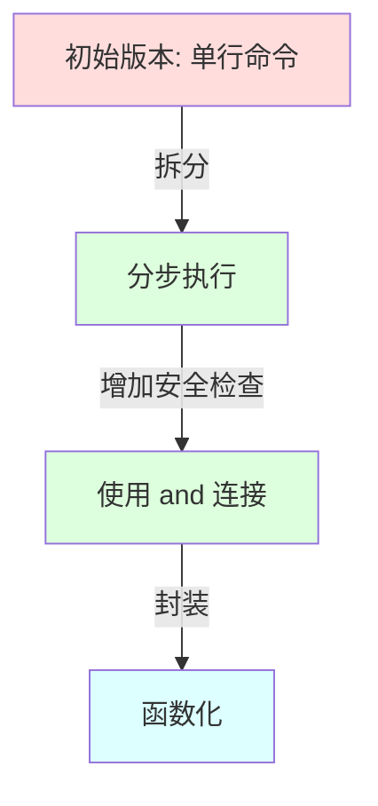
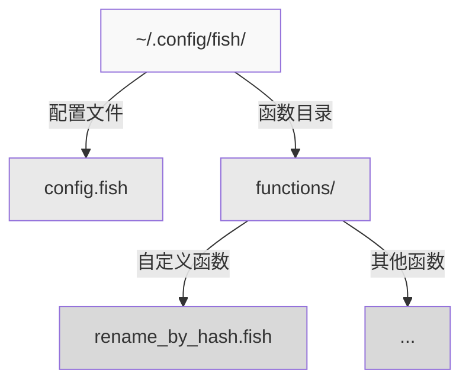

В повседневной работе нам часто приходится выполнять пакетную обработку файлов, например переименовывать файлы, основываясь на характеристиках их содержимого. Если вы новичок в программировании оболочки, вам может показаться, что это простая задача. Но на самом деле существует множество деталей и лучших практик, связанных с тем, как сделать это безопасно. Давайте рассмотрим конкретный пример того, что делает Fish Shell таким особенным, когда речь идет о безопасном программировании.

<! ---далее-->

## Начиная с требований

Предположим, нам нужно переименовать изображение JPEG и соответствующий ему файл с текстовым описанием, причем новое имя файла должно содержать MD5-значение текстового файла и временную метку файла изображения. Это типичная задача обработки файлов, которая включает в себя:

1. вычисление MD5-значения файла
2. получение временной метки файла
3. переименование двух связанных файлов

## Общие правила для начинающих

Если вы уже использовали Bash или Zsh, вы можете написать это так:

```bash
mv sample.jpeg "$(md5 sample.txt | awk '{print $NF}').t$(gstat --format=%W sample.jpeg).jpeg"
```.

Эта строка команды будет работать в Bash или Zsh. Но когда вы запустите ее в Fish Shell, вы обнаружите, что она выполняется не так, как ожидалось.

## Философия безопасности Fish Shell

Почему эта же команда не работает в Fish Shell? Это связано с важной философией дизайна Fish Shell: консервативной оценкой.

В Bash/Zsh, когда встречается `$(...)` или обратная кавычка, оболочка немедленно выполняет команду и заменяет результат. Такой "жадный" подход удобен, но он также представляет собой риск для безопасности:
- Команды в строках выполняются автоматически, что может привести к неожиданному выполнению команды.
- Обработка ошибок недостаточно ясна, и сбои на промежуточных этапах могут быть проигнорированы.
- Обработка ошибок недостаточно ясна, сбои на промежуточных этапах могут быть проигнорированы.

В Fish Shell используется другая схема:
1. замена команд в строках не выполняется автоматически
2. `eval` или другой способ выполнения команд должен быть использован явно.
3. рекомендуется более структурированный способ организации команд.

## Инкрементные улучшения

Давайте посмотрим, как можно шаг за шагом улучшить эту команду:



### 1. Пошаговое выполнение
Во-первых, мы можем разбить операцию на несколько шагов:

```fish
set md5sum (md5 sample.txt | awk '{print $NF}')
set timestamp (gstat --format=%W sample.jpeg)
mv sample.jpeg "$md5sum.t$timestamp.jpeg"
```

Преимущество этого заключается в следующем:
- Каждый шаг хорошо виден
- Легко проверить промежуточные результаты
- Легко проверить промежуточные результаты

### 2. использование и соединения для обеспечения безопасности

Чтобы улучшить это, мы используем `and` для обеспечения успешного выполнения каждого шага:

```fish
set md5sum (md5 sample.txt | awk '{print $NF}'); and \
set timestamp (gstat --format=%W sample.jpeg); and \
mv sample.jpeg "$md5sum.t$timestamp.jpeg"; and \
mv sample.txt "$md5sum.txt"
```.

Преимущество этого заключается в следующем:
- Если какой-либо шаг завершился неудачно, последующие шаги не выполняются
- Можно избежать переименования части файла, в то время как другая часть не работает
- Сохраняется согласованность файлов

### 3. Инкапсуляция в функции

Наконец, мы можем инкапсулировать функцию в многократно используемую функцию:

```fish
function rename_by_hash
    set -l txt_file $argv[1]
    set -l jpeg_file $argv[2]
    
    if test ! -f $txt_file; or test ! -f $jpeg_file
        echo "Usage: rename_by_hash text_file jpeg_file"
        return 1
    end
    
    if set -l md5sum (md5 $txt_file | awk '{print $NF}')
        and set -l timestamp (gstat --format=%W $jpeg_file)
        mv $jpeg_file "$md5sum.t$timestamp.jpeg"
        and mv $txt_file "$md5sum.txt"
        echo "Files renamed successfully"
    else
        echo "Error occurred during renaming"
        return 1
    end
end
```.

Эта финальная версия имеет множество замечательных возможностей:
- Проверка ввода: проверяет существование файла.
- Обработка ошибок: предоставляет понятные сообщения об ошибках
- Гибкость: может работать с произвольными именами файлов
- Возможность повторного использования: инкапсулируется как функция для легкого повторного использования.
- Дружественные подсказки: результат операции хорошо виден

## Основы программирования безопасности в оболочке Fish Shell

На этом примере мы можем обобщить некоторые ключевые принципы безопасного программирования в Fish Shell:

1. **Явное предпочтительнее неявного**:
   - Выполнение команд должно быть явным, а не скрытым в строках.
   - Область видимости переменных должна быть явной (используйте -l, чтобы пометить локальные переменные)

2. **Прогрессивная обработка ошибок**:
   - Используйте команды, связанные со строками `and`.
   - Условная проверка перед важными операциями
   - Предоставление содержательных сообщений об ошибках

3. **Структурированное программирование**:
   - Инкапсулируйте связанные операции в виде функций
   - Используйте осмысленные имена переменных
   - Добавляйте соответствующие комментарии и подсказки

4. **Проверка безопасности**:
   - Проверьте существование входного файла
   - Проверка результатов выполнения команд
   - Поддерживать атомарность операций

5. **Удобство для пользователя**:
   - Предоставление четких инструкций по использованию
   - Вывод результирующего состояния операции
   - Поддерживать читабельность кода

## Предложения для практики

1. При разработке новых функций сначала тестируйте каждый шаг в командной строке. 2.
2. Подтвердите базовую функциональность, а затем постепенно добавляйте обработку ошибок.
3. Если вы обнаружите, что какая-либо операция часто повторяется, подумайте о том, чтобы инкапсулировать ее в виде функции.
4. Сохраняйте часто используемые функции в каталоге `~/.config/fish/functions/`.
5. регулярно пересматривайте и обновляйте существующие функции, чтобы убедиться, что они соответствуют последним практикам безопасности.



## Резюме

Функции безопасности Fish Shell поначалу могут показаться немного строгими, но на самом деле эти ограничения помогают нам писать более безопасный и надежный код. Следуя этим принципам, мы можем.
- Избежать распространенных ошибок программирования в оболочке
- Создавать код, который легче поддерживать
- Обеспечить лучший пользовательский опыт

Привыкнув к такому стилю программирования, вы обнаружите, что эти "ограничения" на самом деле помогают создавать более надежные системы.
