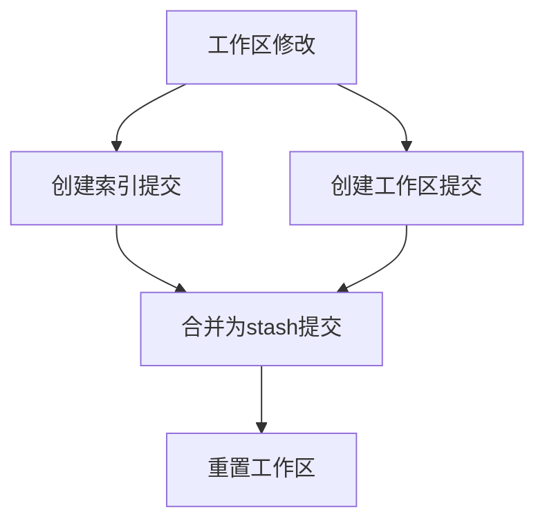
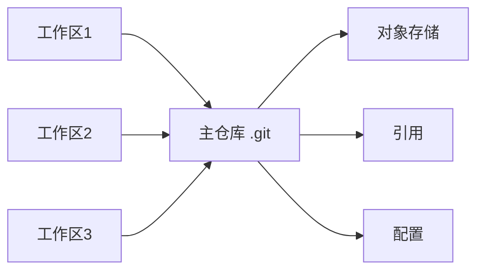

Git 作为最流行的版本控制系统，除了基本的 add、commit、push 操作外，还隐藏着许多强大的功能。这些功能不仅能提高工作效率，更能帮助我们更好地理解 Git 的工作原理。让我们深入探索这些进阶技巧。

<!--more-->

## Git Stash：工作区的临时存储机制

### 工作原理

Git Stash 本质上是将当前工作区和暂存区的修改保存到一个栈结构中。每个 stash 条目实际上是一个特殊的 commit，包含了：

- 工作区的修改
- 暂存区的修改（如果有的话）
- 当前的 HEAD 引用

```bash
# 查看 stash 的详细信息
git stash show -p stash@{0}

# 查看 stash 的提交对象
git show stash@{0}
```

### 高级用法

```bash
# 只 stash 部分文件
git stash push -m "部分修改" -- file1.js file2.js

# stash 包括未跟踪的文件
git stash save -u "包含新文件的修改"

# 创建分支并应用 stash
git stash branch new-feature stash@{1}
```

### 原理解析

当执行 `git stash` 时，Git 会：

1. 创建一个包含当前索引状态的提交
2. 创建另一个包含工作区修改的提交
3. 将这两个提交合并为一个"stash commit"
4. 重置工作区和索引到 HEAD 状态



## Git Worktree：多工作区并行开发

### 核心概念

Git Worktree 允许你从同一个仓库创建多个工作目录，每个目录可以检出不同的分支。这些工作区共享同一个 .git 目录（准确说是共享对象存储和引用）。

### 实际应用场景

1. **并行开发**：在不同功能分支上同时工作
2. **代码审查**：在审查 PR 时不影响当前工作
3. **紧急修复**：快速切换到 hotfix 而不丢失当前进度
4. **性能测试**：同时运行不同版本的代码

```bash
# 创建新的工作区
git worktree add -b feature-x ../project-feature-x

# 列出所有工作区
git worktree list

# 删除工作区
git worktree remove ../project-feature-x

# 清理已删除的工作区引用
git worktree prune
```

### 工作原理

每个 worktree 都有自己的：
- HEAD 文件
- 索引文件
- 工作目录

但共享：
- 对象数据库（.git/objects）
- 引用（.git/refs）
- 配置文件



## Cherry-pick 与合并的智能去重

### Patch-ID 机制

Git 使用 patch-id 来识别等效的代码更改。Patch-ID 是基于代码改动内容（diff）计算的哈希值，不包含提交元数据。

```bash
# 查看提交的 patch-id
git show <commit-hash> | git patch-id

# 比较两个提交的改动是否相同
git diff <commit1> <commit2>
```

### 合并时的去重原理

当 Git 执行合并操作时：

1. 计算每个提交的 patch-id
2. 比较源分支和目标分支的 patch-id
3. 相同的 patch-id 会被自动跳过

这解释了为什么 cherry-pick 的提交在后续合并时不会产生冲突。

## Git Bisect：二分查找算法的实际应用

### 算法原理

Bisect 使用二分查找算法，在 O(log n) 的时间复杂度内找到引入问题的提交。

```bash
# 自动化 bisect
git bisect start
git bisect bad HEAD
git bisect good v1.0

# 使用脚本自动测试
git bisect run ./test.sh
```

### 自动化测试脚本示例

```bash
#!/bin/bash
# test.sh

# 编译项目
make clean && make

# 运行测试
if ./run-tests; then
    exit 0  # 测试通过，标记为 good
else
    exit 1  # 测试失败，标记为 bad
fi
```

## Sparse-checkout 与 Partial Clone

### 区别与联系

**Sparse-checkout**：
- 完整克隆仓库历史
- 选择性地在工作区显示文件
- 可以随时改变显示的内容

**Partial Clone**：
- 只克隆部分历史或对象
- 按需从远程获取缺失的对象
- 减少初始克隆的大小和时间

### 组合使用

```bash
# 部分克隆 + 稀疏检出
git clone --filter=blob:none --sparse <url>
cd repo
git sparse-checkout init --cone
git sparse-checkout set src/module1
```

### 性能考虑

1. **Sparse-checkout** 适合：
   - 需要完整历史但只工作于部分文件
   - 频繁切换关注的目录

2. **Partial Clone** 适合：
   - 仓库极大，本地存储有限
   - 网络带宽受限
   - 只关心最近的历史

## Git Reflog：本地操作的时光机

### 工作原理

Reflog 记录 HEAD 和分支引用的所有变化，包括：
- 提交
- 分支切换
- Reset 操作
- Rebase 操作

```bash
# 查看详细的 reflog
git reflog show --date=relative

# 恢复到特定的 reflog 条目
git reset --hard HEAD@{2}
```

### 数据持久性

- Reflog 条目默认保留 90 天
- 不可达对象默认保留 30 天
- 可以通过配置修改这些时间

```bash
git config gc.reflogExpire "180 days"
git config gc.reflogExpireUnreachable "90 days"
```

## Git Patch：代码更改的可移植格式

### 上下文匹配算法

Git patch 使用"上下文行"来定位更改位置：

1. 记录修改行前后的 3 行代码作为上下文
2. 应用时查找匹配的上下文模式
3. 支持一定程度的模糊匹配

```bash
# 生成带有更多上下文的 patch
git format-patch -U5 HEAD~1

# 检查 patch 是否能应用
git apply --check patch-file.patch

# 应用 patch 并解决冲突
git apply --3way patch-file.patch
```

## 高级配置与优化

### 全局 Git 钩子

```bash
# 设置全局钩子目录
git config --global core.hooksPath ~/.git-hooks

# 创建全局 pre-commit 钩子
cat > ~/.git-hooks/pre-commit << 'EOF'
#!/bin/bash
# 运行代码格式化检查
npm run lint
EOF

chmod +x ~/.git-hooks/pre-commit
```

### 性能优化配置

```bash
# 启用多核心支持
git config --global pack.threads "0"

# 增加 HTTP 传输缓冲区
git config --global http.postBuffer 524288000

# 启用文件系统缓存
git config --global core.fscache true
```

## AI 时代的 Git 工作流展望

随着 AI 工具的发展，Git 的使用方式也在演进：

1. **智能冲突解决**：AI 辅助解决合并冲突
2. **自动提交信息生成**：基于代码改动自动生成有意义的提交信息
3. **代码审查辅助**：AI 分析代码改动，提供审查建议
4. **智能 bisect**：AI 辅助快速定位问题提交

这些进阶功能不仅提高了开发效率，更帮助我们深入理解 Git 的设计哲学。掌握这些技巧，你将能更好地应对复杂的版本控制场景，提升团队协作效率。

## 思考题

如果你正在维护一个大型开源项目，需要同时处理多个版本的 bug 修复和新功能开发，你会如何组合使用这些 Git 进阶功能来优化你的工作流程？
