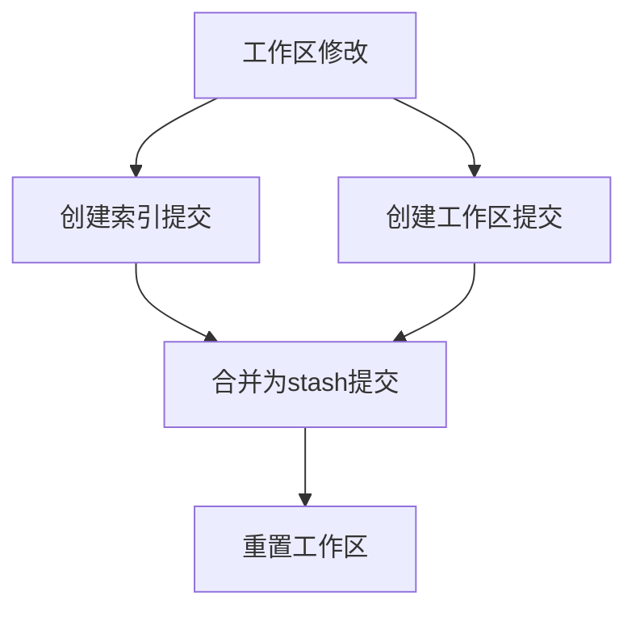

Git, как самая популярная система контроля версий, скрывает множество мощных возможностей в дополнение к основным операциям добавления, фиксации и отправки. Эти возможности не только повышают производительность, но и помогают нам лучше понять, как работает Git. Давайте погрузимся в эти продвинутые техники.

<! --- больше-->

## Git Stash: механизм временного хранения для рабочих пространств

### Как это работает

Git Stash - это, по сути, стековая структура, в которой хранятся текущие изменения рабочего пространства и области хранения. Каждая запись в стэше - это специальный коммит, который содержит:

- Изменения рабочего пространства
- Изменения в области хранения (если есть)
- Текущая ссылка на HEAD

```bash
# 查看 stash 的详细信息
git stash show -p stash@{0}

# 查看 stash 的提交对象
git show stash@{0}
```

### Расширенное использование

```bash
# 只 stash 部分文件
git stash push -m "部分修改" -- file1.js file2.js

# stash 包括未跟踪的文件
git stash save -u "包含新文件的修改"

# 创建分支并应用 stash
git stash branch new-feature stash@{1}
```

### Принципы

При выполнении `git stash`, Git будет:

1. создаст коммит с текущим состоянием индекса
2. создаст другой коммит, содержащий изменения в рабочей области
3. объединит оба коммита в один "stash commit"
4. сбросит рабочее пространство и индекс в состояние HEAD



## Git Worktree: параллельная разработка в нескольких рабочих пространствах

### Основные концепции

Git Worktree позволяет создавать несколько рабочих каталогов из одного репозитория, каждый из которых может проверять разные ветки. Эти рабочие пространства используют один и тот же каталог .git (точнее, хранилище объектов и ссылок).

### Практические сценарии применения

1. **Параллельная разработка**: одновременная работа над разными функциональными ветками.
2. **Обзор кода**: просмотр PR без ущерба для текущей работы.
3. **Аварийное исправление**: быстрое переключение на хотфикс без потери текущего прогресса.
4. **Тестирование производительности**: одновременный запуск разных версий кода

```bash
# 创建新的工作区
git worktree add -b feature-x ../project-feature-x

# 列出所有工作区
git worktree list

# 删除工作区
git worktree remove ../project-feature-x

# 清理已删除的工作区引用
git worktree prune
```

### Как это работает

Каждое рабочее дерево имеет свой собственный:
- файл HEAD
- индексный файл
- рабочий каталог

но общий:
- База данных объектов (.git/objects)
- Ссылки (.git/refs)
- Файлы конфигурации

```mermaid
graph LR
    A[主仓库 .git] --> B[对象存储]
    A --> C[引用]
    A --> D[配置]
    E[工作区1] --> A
    F[工作区2] --> A
    G[工作区3] --> A
```.

## Cherry-pick с объединенной интеллектуальной дедупликацией

### Механизм Patch-ID

Git использует patch-id для идентификации эквивалентных изменений кода, который представляет собой хэш-значение, вычисляемое на основе содержимого изменения кода (diff) и не включающее метаданные коммита.

```bash
# 查看提交的 patch-id
git show <commit-hash> | git patch-id

# 比较两个提交的改动是否相同
git diff <commit1> <commit2>
```

### Принципы дедупликации при слиянии

Когда Git выполняет операцию слияния:

1. вычисляет patch-id каждого коммита
2. сравнивает патч-иды исходной и целевой ветвей
3. идентичные patch-id автоматически пропускаются.

Это объясняет, почему коммиты с "вишнёвой подборкой" не конфликтуют с последующими слияниями.

## Git Bisect: алгоритм Bisect в действии

### Как работает алгоритм

Bisect использует алгоритм двоичного поиска, чтобы найти коммит, в котором возникла проблема, с временной сложностью O(log n).

```bash
# 自动化 bisect
git bisect start
git bisect bad HEAD
git bisect good v1.0

# 使用脚本自动测试
git bisect run ./test.sh
```

### Пример сценария автоматизированного тестирования

```bash
#!/bin/bash
# test.sh

# 编译项目
make clean && make

# 运行测试
if ./run-tests; then
    exit 0  # 测试通过，标记为 good
else
    exit 1  # 测试失败，标记为 bad
fi
```

## Sparse-checkout vs Partial Clone

### Разница и связь

**Sparse-checkout**:
- Полное клонирование истории репозитория
- Выборочное отображение файлов в рабочей области
- Отображение может быть изменено в любое время

**Частичное клонирование**:
- Клонирование только части истории или объектов
- Получение недостающих объектов из удаленного местоположения по требованию
- Сократите размер и время первоначального клонирования

### Используется в комбинации

```bash
# 部分克隆 + 稀疏检出
git clone --filter=blob:none --sparse <url>
cd repo
git sparse-checkout init --cone
git sparse-checkout set src/module1
```.

### Соображения по производительности

1. **Sparse-checkout** Подходит:
   - Нужна полная история, но работаете только с частичными файлами
   - Частое переключение интересующих каталогов

2. **Частичное клонирование** Подходит для:
   - Очень большие репозитории с ограниченным локальным хранилищем
   - Ограниченная пропускная способность сети
   - Интересует только недавняя история

## Git Reflog: машина времени для локальных операций.

## Как это работает ##

Reflog записывает все изменения в HEAD и ссылки на ветки, включая:
- коммиты
- Переключения ветки
- Операции сброса
- Операции перебазирования

```bash
# 查看详细的 reflog
git reflog show --date=relative

# 恢复到特定的 reflog 条目
git reset --hard HEAD@{2}
```

### ```bash
# 查看详细的 reflog
git reflog show --date=relative

# 恢复到特定的 reflog 条目
git reset --hard HEAD@{2}
```_ __PROTECTED_CODE_BLOCK_9

- Записи в журнале по умолчанию хранятся 90 дней.
- Недоступные объекты по умолчанию хранятся 30 дней.
- Эти сроки могут быть изменены с помощью конфигурации

```bash
git config gc.reflogExpire "180 days"
git config gc.reflogExpireUnreachable "90 days"
```

## Git Patch: переносимый формат для изменений кода

### Алгоритм контекстного сопоставления

Патчи Git используют "контекстные строки" для поиска изменений:

1. записывает 3 строки кода до и после строки изменения в качестве контекста.
2. ищет совпадающие контекстные шаблоны во время работы приложения
3. поддерживает некоторую степень нечеткого сопоставления

```bash
# 生成带有更多上下文的 patch
git format-patch -U5 HEAD~1

# 检查 patch 是否能应用
git apply --check patch-file.patch

# 应用 patch 并解决冲突
git apply --3way patch-file.patch
```

## Расширенная настройка и оптимизация

### Глобальные крючки Git

```bash
# 设置全局钩子目录
git config --global core.hooksPath ~/.git-hooks

# 创建全局 pre-commit 钩子
cat > ~/.git-hooks/pre-commit << 'EOF'
#!/bin/bash
# 运行代码格式化检查
npm run lint
EOF

chmod +x ~/.git-hooks/pre-commit
```.

### Оптимизированная по производительности конфигурация

```bash
# 启用多核心支持
git config --global pack.threads "0"

# 增加 HTTP 传输缓冲区
git config --global http.postBuffer 524288000

# 启用文件系统缓存
git config --global core.fscache true
```

## Взгляд на рабочие процессы Git в эпоху искусственного интеллекта

По мере развития инструментов искусственного интеллекта меняется и способ использования Git:

1. **Интеллектуальное разрешение конфликтов**: разрешение конфликтов при слиянии с помощью ИИ.
2. **Автоматизированная генерация сообщений о фиксации**: автоматическая генерация значимых фиксаций на основе изменений кода.
3. **Помощь в рецензировании кода**: ИИ анализирует изменения кода и предоставляет рекомендации по рецензированию.
4. **Интеллектуальный биссект**: быстрое обнаружение проблемных коммитов с помощью ИИ.

Эти продвинутые функции не только повышают эффективность разработки, но и помогают понять философию дизайна Git. Овладев этими навыками, вы сможете лучше справляться со сложными сценариями контроля версий и повысите эффективность совместной работы команды.

## Вопросы для размышления

Если вы поддерживаете крупный проект с открытым исходным кодом и должны одновременно заниматься исправлением ошибок и разработкой новых функций для нескольких релизов, как бы вы использовали комбинацию этих улучшений Git для оптимизации рабочего процесса?
