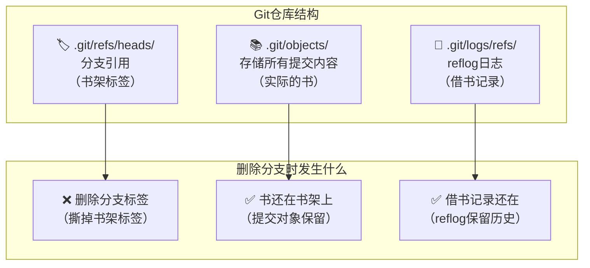
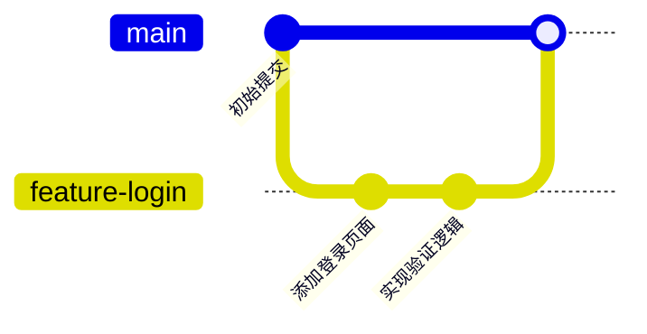
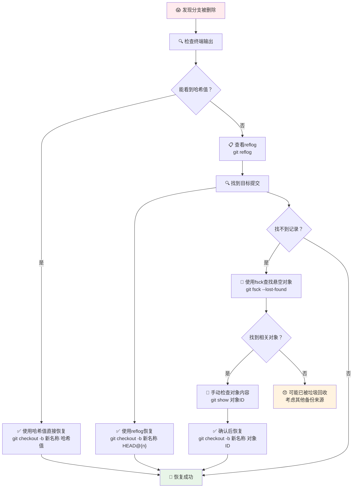

刚刚手滑删掉了一个重要的Git分支？看到那行红色的"Deleted branch"信息时是不是心都凉了半截？别担心，你的代码还在！只要掌握正确的方法，99%的情况下都能完美恢复。

<!--more-->

## 紧急情况：立即恢复刚删除的分支

如果你刚刚删除了分支（就像一个开发者删除了`feature-login`分支后立刻后悔），最快的恢复方法是使用Git删除时显示的提交哈希值。

当你删除分支时，Git会显示类似这样的信息：
```bash
warning: deleting branch 'feature-login' that has been merged to
         'refs/remotes/origin/main', but not yet merged to HEAD
Deleted branch feature-login (was a1b2c3d).
```

注意这里的`a1b2c3d`，这就是你的"救命稻草"！立即运行：

```bash
git checkout -b feature-login a1b2c3d
```

就这么简单，你的分支回来了！所有的提交、所有的代码，一个都不少。

## 找不到哈希值？用reflog来救急

如果你关闭了终端，或者忘记了那个神奇的哈希值，不要慌。Git有一个强大的"黑匣子"叫reflog，它记录了你所有的操作历史。

```bash
git reflog
```

你会看到类似这样的输出：
```
a1b2c3d HEAD@{0}: checkout: moving from feature-login to main  
b2c3d4e HEAD@{1}: commit: 添加用户登录功能
c3d4e5f HEAD@{2}: commit: 修复登录表单验证
d4e5f6g HEAD@{3}: checkout: moving from main to feature-login
```

找到你要恢复的分支的最后一次提交（通常是删除前的最后一个操作），复制那个哈希值，然后：

```bash
git checkout -b 新分支名 b2c3d4e
```

## Git的内部机制：为什么删除的分支还能恢复？

让我们用一个形象的比喻来理解Git的工作原理。想象Git仓库就像一个巨大的图书馆：



当你删除一个分支时，Git只是删除了指向某个提交的"标签"（分支引用），但实际的提交内容仍然安全地存储在`.git/objects`目录中。这就像从图书馆撕掉了书架标签，但书本身还好好地放在那里。

## 深入理解：Git的三层保护机制

### 第一层：分支引用（Branch References）


分支实际上就是一个指向特定提交的指针。当你删除分支时，只是删除了这个指针。

### 第二层：Reflog（引用日志）
Reflog是Git的"后悔药"，它记录了每个引用（分支、HEAD等）的变化历史。默认情况下，reflog会保存90天的历史记录。

### 第三层：对象存储（Object Storage）
所有的提交、文件内容都以对象的形式存储在`.git/objects`中。即使没有任何分支指向它们，这些对象也会保留一段时间，直到垃圾回收器清理它们。

## 更多恢复场景和解决方案

### 场景1：删除了远程分支的本地跟踪分支
如果删除的是跟踪远程分支的本地分支，可以这样恢复：
```bash
git checkout -b 分支名 origin/分支名
```

### 场景2：找到特定时间点的分支状态
使用reflog的时间参数：
```bash
git reflog show --date=iso
git checkout -b 恢复分支名 HEAD@{2025-07-20 10:30:00}
```

### 场景3：批量查找可能丢失的提交
```bash
git fsck --lost-found
```

这个命令会找到所有"悬空"的提交对象。

## 预防措施：如何避免误删分支

### 1. 使用Git别名增加确认步骤
在你的`.gitconfig`中添加：
```ini
[alias]
    delete-branch = "!f() { echo \"Are you sure you want to delete branch '$1'? (y/N)\"; read -r response; if [[ \"$response\" =~ ^[Yy]$ ]]; then git branch -d \"$1\"; else echo \"Cancelled.\"; fi; }; f"
```

### 2. 定期备份重要分支
```bash
git push origin feature-branch:backup/feature-branch
```

### 3. 使用受保护分支策略
在团队项目中设置分支保护规则，防止意外删除重要分支。

## 垃圾回收：什么时候真的找不回来？

Git会在以下情况下清理"无用"的对象：
- 手动运行`git gc --aggressive --prune=now`
- 对象超过默认的过期时间（通常是30天）
- 仓库变得过大，Git自动进行垃圾回收

但在实际工作中，由于大多数开发者很少手动运行垃圾回收，误删的分支通常都能在相当长的时间内恢复。

## 工作流程图：完整的分支恢复策略



## 小结

误删Git分支虽然让人心慌，但在绝大多数情况下都不是真正的灾难。Git的设计哲学就是"never lose data"（永不丢失数据），它通过多层机制保护你的工作成果。记住这几个关键点：

1. **分支删除只是删除引用，不是删除内容**
2. **reflog是你最好的朋友，记录了所有操作历史**  
3. **及时恢复，不要等待太久**
4. **学会预防，设置合适的工作流程**

下次再遇到类似情况时，深吸一口气，打开终端，几条命令就能让你的分支"起死回生"。毕竟，在Git的世界里，很少有真正不可挽回的错误。

有了这些知识，你是否对Git的强大容错能力有了更深的理解？在日常开发中，你还遇到过哪些看似"致命"但实际可以恢复的Git操作？不妨在实际项目中试试这些恢复技巧，但记得先在测试仓库中练习！
