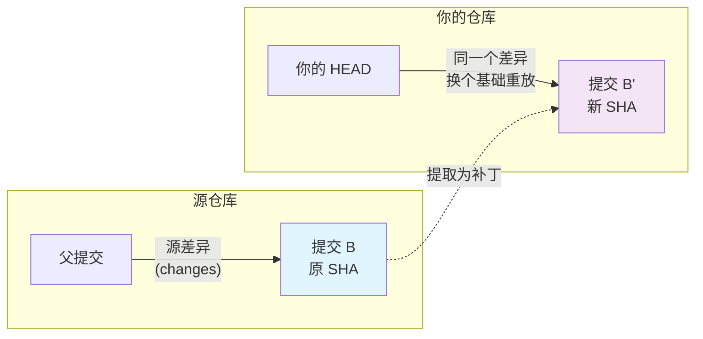

一个真实的求助：旧仓库 `~/old-repo` 的编译环境坏了，于是重新克隆了一份到 `~/new-repo`，但旧仓库里还有两个提交没推送到任何地方。能不能直接在新仓库里把它们"摘"过来？

`git cherry-pick` 会敲的人多，用对的人少——语法只有一个，真正会出事的全在边界上。这篇把六个边界逐个走一遍，文中所有命令输出都在 Git 2.56.0 上实测过。

<!--more-->

## 先建立一个心智模型：cherry-pick 是"重放差异"

Git 官方文档对 cherry-pick 的定义只有一句：*Apply the changes introduced by some existing commits.* 关键词是 **changes**，不是 commits。

一次 cherry-pick 只有三个要素：

| 要素 | 是什么 |
|------|--------|
| 源差异 | 那个提交相对**它自己的**父提交的改动，即 `git diff <commit>^ <commit>` 的结果 |
| 新基础 | 你当前所在的 HEAD |
| 新提交 | 把源差异在新基础上重放，生成一个**全新的提交对象** |



抓住"重放差异"这四个字，六个边界就都是它的推论：

1. **新提交是新对象。** 父提交变了，SHA 必然不同。Git 不会认为 B 和 B' "是同一个变更"——除非你留下文字记录，或者事后用工具反查（边界五）。
2. **差异可能放不进去。** 新基础的上下文和原来不一致时，重放会失败，这就是冲突。冲突是重放失败的信息，不是障碍（边界四）。
3. **merge 提交没有唯一的"源差异"。** 一个 merge 有两个父提交，相对父一的差异和相对父二的差异是两个完全不同的补丁，Git 不替你选（边界三）。

## 边界一：提交在另一个仓库里

### 先问一句：这些提交推送过远端吗

这一步值得放在最前面，因为两个答案的成本差一个数量级：

| 提交在哪里 | 你要做的事 |
|------------|------------|
| 已经在远端（`origin`） | `git fetch origin` 之后直接 cherry-pick，**旧仓库根本不参与** |
| 只存在于旧仓库的本地 | 从下面四种搬运方式里选一种 |

很多"跨仓库搬运"的需求，追问一句就会发现根本不用跨——先确认，再动手。

### 方式一：把旧仓库加为远程

```bash
cd ~/new-repo
git remote add old-repo ~/old-repo
git fetch old-repo
git log --oneline old-repo/main      # 先看清楚要摘的是什么
git cherry-pick <sha-b> <sha-c>      # 先父后子
```

fetch 会把对象复制过来，所以旧仓库里的 SHA 在你的仓库里已经可以直接解析。用完清掉：

```bash
git remote remove old-repo
```

删掉 remote 不会弄丢已经摘过来的提交——你生成的新提交是完整快照，而 Git 的垃圾回收是从所有引用出发算可达性的，只要新提交在你的分支上，它们用到的内容就都是可达的。

### 方式二：直接从路径 fetch（不建 remote）

```bash
cd ~/new-repo
git fetch ~/old-repo main
```

```
From ~/old-repo
 * branch            main       -> FETCH_HEAD
```

`git remote -v` 依然是空的——你没有配置任何远程，只是借用了一下对方的对象库。之后按 SHA 摘即可（实测退出码 0）。

代价是这些提交不属于任何分支，只靠 `FETCH_HEAD` 和 reflog 兜底。想留住它们，顺手落成一条本地分支：

```bash
git fetch ~/old-repo main:refs/heads/from-old
#  * [new branch]      main       -> from-old
```

### 方式三：git bundle —— 用一个文件搬走

仓库不在同一台机器上，或者你想留一份可归档的搬运记录时，`git bundle` 最干净：

```bash
# 旧仓库：打包
cd ~/old-repo
git bundle create /tmp/commits.bundle main

# 新仓库：先验证，再 fetch
cd ~/new-repo
git bundle verify /tmp/commits.bundle
git fetch /tmp/commits.bundle main:refs/heads/from-old
```

实测 verify 的输出：

```
~/old-repo is okay
The bundle contains this ref:
100b174adb2a455e922b5c79870d5eec39bea500 refs/heads/main
The bundle records a complete history.
The bundle uses this hash algorithm: sha1
```

注意 `records a complete history` 这一行。如果它换成 `The bundle requires this ref: <sha>`，说明你打的不是完整历史，接收方必须先有那些前置提交才能用。实测对照——只打包最后两个提交（`main~2..main`），拿到一个没有前置提交的仓库里验证：

```
error: Repository lacks these prerequisite commits:
error: 0b0904cf21b028c72f33b817e48ad23b86fc3e06
```

补上前置提交之后再次 verify 就通过了，输出里会多出一行 `The bundle requires this ref: 0b0904c...`。

**结论**：跨机器搬运就打完整分支的 bundle，别省那点体积。

### 方式四：format-patch + am

```bash
# 旧仓库
git format-patch -2 -o /tmp/patches      # 生成最后两个提交的 .patch 文件

# 新仓库
git am /tmp/patches/*.patch
```

什么时候用它？当你想把补丁**当成文件**审一遍、存档、或者走邮件列表流程时。但它不是"更稳妥的 cherry-pick"：`git am` 遇到冲突会留下 `.patch` 和 `.rej` 文件，恢复路径比 cherry-pick 的三方合并更难走；它也不处理 merge 提交（`format-patch` 默认根本不为 merge 生成补丁）。日常搬运，cherry-pick 才是更稳的那一个。

顺便澄清一个流传很广的说法——"`format-patch` 能完整保留提交信息和作者时间戳"。cherry-pick 同样保留作者与作者时间（它替换的只是 committer），这不是两者的区别。两者真正的区别是**产物形态**：一个是可以传来传去的文件，一个是仓库里的对象。

### 四种方式对比

| 方式 | 适合 | 代价 |
|------|------|------|
| 加 remote | 两个仓库会长期往来 | 留下远程配置（用完可删） |
| 路径 fetch | 同机一次性搬运 | 不建分支，只靠 FETCH_HEAD 兜底 |
| **bundle** | 跨机器、需要归档 | 多一个文件；范围打包有前置提交要求 |
| format-patch | 需要人工审阅补丁内容 | 冲突恢复更麻烦，不支持 merge |

## 边界二：一次摘一串

### `A..B` 不含 A

这是最容易安静出错的地方。实测：仓库里有 c1–c5 五个提交，另一个分支从 c1 起步。

```bash
$ git cherry-pick $c2..$c5
[dest 1c2b1e5] c3
[dest a456034] c4
[dest 3f6f1dc] c5
```

摘了 3 个。`c2..c5` 的语义是"从 c5 可达、但**从 c2 不可达**的提交"，所以 c2 自己不在里面。

要连 c2 一起摘，得写 `c2^..c5`，或者等价地用它前面的提交：`c1..c5`。实测 `c1..c5` 摘了 4 个（c2、c3、c4、c5）。

应用次序不用操心，Git 会自动按拓扑序从旧到新来——**但左端必须自己数清楚。**

> 我在准备这篇的实测脚本时，就因为左端写错白跑了一次：本该冲突的提交根本没进范围，命令安静地成功了。安静的成功比报错更危险。

### 攒着一起提交：`-n`

```bash
$ git cherry-pick -n $d1..$d3
退出码 = 0
$ git log --oneline
f31ea66 d1                       # 没有产生任何新提交
$ git status --short
A  g2.txt
A  g3.txt                        # 改动全部在暂存区
```

适合"把上游三个提交合成一个本地提交"的场景，之后 `git commit` 一次收尾。注意 `-n` 只是不提交，遇到冲突照样会停下来。

## 边界三：要摘的是 merge 提交

### 不给 `-m`，直接失败

```bash
$ git cherry-pick 3d0169a
error: commit 3d0169a10b2e1f73d7fae844e5f5c4e278677dd8 is a merge but no -m option was given.
fatal: cherry-pick failed
```

原因回到心智模型：merge 有两个父提交。"相对父一的差异"是合进来的分支带来的改动，"相对父二的差异"是主线上的改动——两个都成立，Git 不替你选。

`-m 1` 的意思是"以 **1 号父提交为主线**"，也就是取 `git diff <merge>^1 <merge>` 这个差异：

```bash
$ git cherry-pick -m 1 3d0169a
[backport c0b8914] merge feature into main
 1 file changed, 2 insertions(+)
```

父提交的编号顺序是：**1 号是你执行 `git merge` 时所在的分支，2 号是被合进来的分支。** 别靠猜，直接看：

```bash
git log -1 --format='%H %P' <merge>
```

### 为什么 `git show <merge> | git apply` 行不通

网上流传过这条"处理 merge 提交"的偏方。实测：

```bash
$ git show 3d0169a
commit 3d0169a10b2e1f73d7fae844e5f5c4e278677dd8
Merge: eca626b d8cb163
Author: Demo User <demo@example.com>
Date:   Mon Jan 15 10:00:00 2024 +0000

    merge feature into main
```

——就这些，**一行 diff 都没有**。`git show` 对 merge 提交默认输出的是"组合差异"（combined diff），它只列出**与所有父提交都不同**的文件；一次顺利的合并里不存在这样的文件，所以输出是空的。把它喂给 `git apply`：

```bash
$ git show 3d0169a | git apply --check -
error: No valid patches in input (allow with "--allow-empty")
```

退出码 128。这条路不通。

要真正看清 merge 带来了什么，显式指定父提交：

```bash
$ git diff 3d0169a^1 3d0169a
diff --git a/app.conf b/app.conf
--- a/app.conf
+++ b/app.conf
@@ -1 +1,3 @@
 mode=fast
+timeout=30
+retry=3
```

### 一个小提醒

摘过来的 merge 提交，commit message 仍然是原来那句 `merge feature into main`——它描述的是原来的上下文，落到你的分支上通常没有意义。加 `-e` 顺手改掉：

```bash
git cherry-pick -m 1 -e 3d0169a
```

## 边界四：冲突时谁是谁

### ours / theirs 站在哪边

cherry-pick 底层走的是三方合并，其中的"我们"和"他们"是这样站位的：

| 角色 | 在 cherry-pick 里指谁 |
|------|----------------------|
| ours / HEAD | **你当前所在的分支**（接收方，改动落下来的地方） |
| theirs | **正在被摘的那个提交** |

实测的冲突现场：

```
<<<<<<< HEAD
mode=safe          ← 你的分支
=======
mode=turbo         ← 被摘的提交
>>>>>>> a027dcf (tune: mode turbo + notes tuned)
```

### `-X ours` 会静默丢改动

这是全篇最需要警惕的一条。同一个冲突，加上 `-X ours`：

```bash
$ git cherry-pick -X ours a027dcf
Auto-merging app.conf
[main 9812733] tune: mode turbo + notes tuned
 1 file changed, 1 insertion(+), 1 deletion(-)
退出码 = 0
```

**没有报错，命令成功了，提交也生成了。** 但看看结果：

```
mode=safe          ← 你这一侧保住了
workers=4
retries=3
timeout=30
log_level=info
region=ap-east
owner=platform
notes=tuned        ← 非冲突的部分照常应用了
```

而被摘的那个提交原本想改成的是：

```
mode=turbo         ← 这个改动被安静地丢掉了
...
notes=tuned
```

`mode=turbo` 消失了，可提交信息还明明白白写着 `tune: mode turbo + notes tuned`。**提交历史在这里开始说谎。**

`-X ours` 的准确语义是：**冲突的 hunk 取"我们这一侧"，非冲突的部分照常应用。** 它不解决冲突，它让冲突的一部分安静地消失。而 cherry-pick 的目的恰恰就是把那些改动搬过来——所以这个选项在 cherry-pick 里绝大多数时候是自相矛盾的。`-X theirs` 同理，方向反过来而已。

### `--strategy=ours` 更彻底：什么都不摘

注意这跟上面不是同一个选项。`-s` 是**策略**，`-X` 是**策略的选项**：

```bash
$ git cherry-pick --strategy=ours a027dcf
The previous cherry-pick is now empty, possibly due to conflict resolution.
If you wish to commit it anyway, use:

    git commit --allow-empty

Otherwise, please use 'git cherry-pick --skip'
```

`ours` 策略的规则是"整个结果取我们这一侧的树"——于是被摘提交的内容**一点都进不来**，结果等于什么都没改，Git 只好停下来告诉你"这次摘取是空的"。

所以当有人建议"冲突太多的话用 `--strategy=ours` 跳过"时，把这句话翻译一下：**"把你想搬的东西全部丢掉。"** 那不是跳过冲突，那是跳过改动。

### 冲突现场有四个出口

```bash
git cherry-pick --continue   # 解决完冲突，继续
git cherry-pick --skip       # 放弃这一个提交，继续摘后面的
git cherry-pick --abort      # 整个操作取消，回到开始前的状态
git cherry-pick --quit       # 忘掉"正在 cherry-pick"这个状态，但保留当前改动
```

`--skip` 实测（一次摘两个提交，第一个冲突）：

```bash
$ git cherry-pick $s1^..$s2
CONFLICT (content): Merge conflict in app.conf
$ git cherry-pick --skip
[main 70e71db] s2: add extra       # 冲突的 s1 被放弃，s2 正常摘过来
```

四个出口里，`--abort` 是唯一能完全恢复原状的。手忙脚乱的时候记住它就够了。

### 反复解同一类冲突：rerere

```bash
git config --global rerere.enabled true
```

打开之后 Git 会记录你解过的冲突，下次遇到同样的冲突自动套用上次的解法。长期在多个分支之间同步同一批改动时，这个开关能省下大量重复劳动。

## 边界五：摘完怎么验证没摘错

重放产生的是**新提交**，所以"这个提交到底从哪来"必须自己留证据。

### 提交时留证据：`-x`

```bash
git cherry-pick -x <sha>
```

会在提交信息末尾追加一行 `(cherry picked from commit <sha>)`，把血缘写进历史本身。这一条的细节（多层追踪、什么情况下不该用）[已经单独写过一篇]()。

### 事后反查：`git cherry`

同一个变更在两边各有一个 SHA，怎么知道它们是一回事？靠 patch-id——**把提交的差异算成一个与父提交无关的指纹**。

实测（`src` 上有一个原始提交，`dst` 上有一个摘过来的副本）：

```bash
$ git cherry -v src dst
+ c7e502096b76e2eed5a4fb60329d98303def6c4b chore: unrelated work
- 71a50df7cc65bb7c1dc7d3251e8956040ba3c3f4 feat: add feature
```

`-` 表示"这个提交的内容 `src` 里已经有了"（正是摘过来的那个），`+` 表示没有。要判断"某个分支还有哪些改动没被上游收走"，这条命令比肉眼看 log 可靠得多。

### 并排对比：`git range-diff`

想知道"摘过来的副本和原始提交改的是不是同一个东西"，`range-diff` 是标准答案：

```bash
$ git range-diff main..src dst~1..dst
1:  8000d95 = 1:  71a50df feat: add feature
```

`=` 表示两个补丁内容一致。如果解冲突时动过手脚，这里会显示 `!` 并把差异摊开——**这是少数能验证"冲突解得对不对"的工具之一。**

顺手的选择还有 `git log --cherry-mark`：

```bash
$ git log --oneline --cherry-mark --left-right src...dst
= 8000d95 feat: add feature
= 71a50df feat: add feature
> c7e5020 chore: unrelated work
```

`=` 标记的就是"内容等价的一对"。

## 边界六：摘错了怎么退

按"改动走到哪一步"分三档：

| 状态 | 命令 | 效果 |
|------|------|------|
| 还卡在冲突里 | `git cherry-pick --abort` | 完全回到操作开始前 |
| 已经提交，还没推送 | `git reset --soft HEAD~N` | 撤销最近 N 个提交，改动留在暂存区 |
| 已经推送了 | `git revert <新提交>` | 生成一个反向提交，历史可追溯 |

第三档要特别注意：**用新提交的 SHA，不是原提交的。** `revert` 撤销的是"这次重放"，而在你的分支上留下记录的是那个新对象；拿一个从未在你分支上存在过的 SHA 去 revert，Git 只会告诉你它不认识。

（`git reset --soft` 保留改动，`--hard` 连改动一起丢——不确定的时候用 `--soft`。）

## 什么时候别用 cherry-pick

cherry-pick 有三个天然成本，动手前值得称一称：

1. **每次摘取都产生新对象。** 同一个改动被摘到 N 个分支，就是 N 个互不相识的提交，Git 永远不会自动帮你把它们认成同一个——这正是[为什么 merge 通常比 cherry-pick 更聪明]()的原因。
2. **长期拿 cherry-pick 代替合并，会积累"影子提交"。** 两条分支各自带着内容相同、SHA 不同的提交，等到真正合并的那一天，Git 会把它们当成两拨改动，你要把已经解过的冲突再解一遍。
3. **上下文会漂。** 摘的次数越多，原提交的上下文与新基础的差距越大，冲突只会越来越难解。

**要搬的是一段连续历史，而且还在同一个仓库里**，那多半该用 rebase：

```bash
# 把 feature 上的 C、D、E 三个提交搬到 newbase 之上
git rebase --onto newbase C^ E
```

**要同步的是整条分支**，用 merge。cherry-pick 真正的主场是：热修复要同时落到多个分支、只想要别人分支里的某几个提交、以及——像本文开头那样——把提交从一份仓库搬到另一份仓库。

## 一页速查表

```bash
# 搬运
git fetch ~/old-repo main                     # 从路径拉（不建 remote）
git bundle create x.bundle main               # 打包（跨机器）
git bundle verify x.bundle                    # 接收方先验证
git fetch x.bundle main:refs/heads/from-old   # 落成本地分支

# 摘取
git cherry-pick <sha>                         # 摘一个
git cherry-pick A^..B                         # 摘一段（含 A！A..B 不含 A）
git cherry-pick -n A^..B                      # 攒着不提交
git cherry-pick -x <sha>                      # 留下血缘记录
git cherry-pick -m 1 <merge>                  # 摘 merge，以 1 号父为基线
git cherry-pick -e <sha>                      # 顺手改提交信息

# 冲突现场
git cherry-pick --continue | --skip | --abort | --quit

# 验证与善后
git range-diff main..src dst~1..dst           # 比对原始提交与副本
git cherry -v <upstream> <branch>             # 哪些改动上游已经有了
git log --cherry-mark --left-right A...B      # 标出内容等价的一对
git reset --soft HEAD~N                       # 撤销刚摘的提交，保留改动
```

## 回到开头那个问题

旧仓库里的两个提交，三步就能搬过来：

```bash
cd ~/new-repo
git fetch ~/old-repo main:refs/heads/from-old   # 或者打个 bundle 过来
git log --oneline from-old                      # 先看清楚要摘什么
git cherry-pick -x <sha-b> <sha-c>              # 顺序：先父后子
```

只要 `~/old-repo/.git` 还在，那两个提交就完好无损——坏掉的只是编译环境，和仓库无关。而 cherry-pick 搬的是源码变更，`build/`、`node_modules/` 这类产物从来不参与，所以在新仓库里从头编译，反而是最干净的路径。

留一个可以自己动手验证的问题：**如果那两个提交曾经推送过远程，上面的步骤里哪几步可以省掉？** 想清楚这个，边界一的判断就长在手上了。
