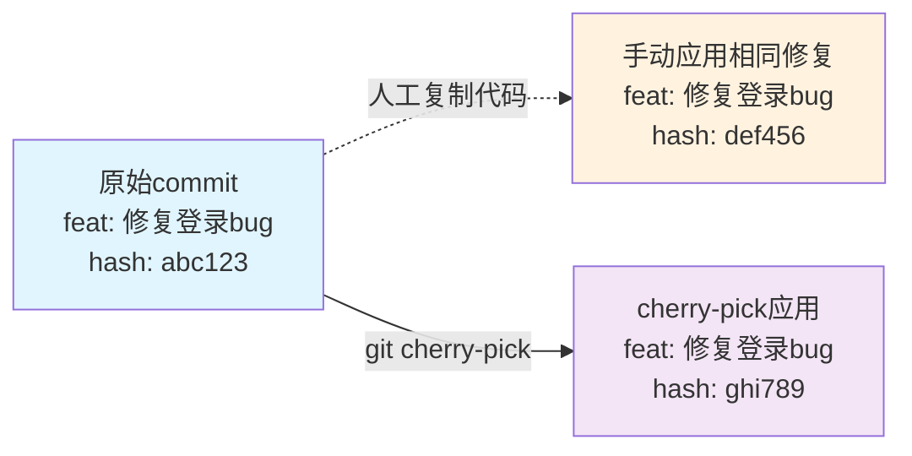
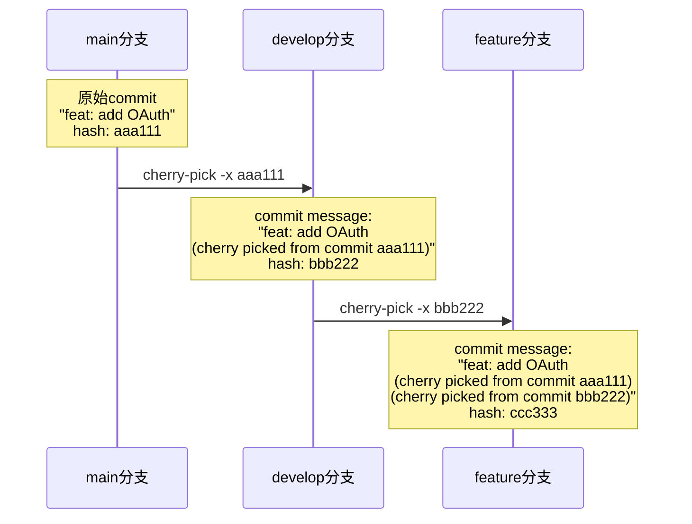
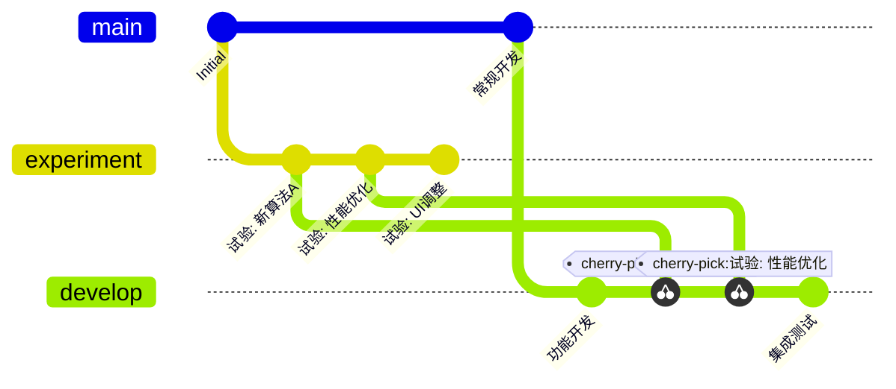

作为一名开发者，你是否遇到过这样的困扰：在项目的不同分支间穿梭时，看到一些似曾相识的commit，却无法确定它们之间的关系？这个功能是从哪个分支来的？是直接开发的还是从别处cherry-pick过来的？如果是后者，原始的commit在哪里？

<!--more-->

这种情况在复杂项目中极其常见，特别是当团队采用多分支开发策略时。今天我们来深入了解Git cherry-pick的追踪机制，以及如何建立清晰的代码变更血缘关系。

## 问题的根源：Git的"健忘症"

### Git为什么不记住变更来源

Git的设计哲学基于内容寻址系统，它只关心：
- 文件内容的具体变化
- commit的元数据（作者、时间、父节点）
- 每个commit的唯一哈希值

但Git天生不具备"语义理解"能力。对它来说，同样的代码变更在不同分支上就是完全独立的两个commit，即使逻辑上它们解决的是同一个问题。



### 现实场景中的痛点

想象这样一个场景：你的团队正在开发一个电商平台，有以下分支结构：

- `main`：生产环境代码
- `develop`：开发主分支  
- `feature/payment-v2`：新支付系统
- `hotfix/security-patch`：紧急安全修复

当安全修复需要同时应用到多个分支时，如果没有proper的追踪，几个月后你看到commit历史时就会一头雾水。

## 解决方案：-x参数的威力

### 基础用法

Git cherry-pick提供了`-x`参数来自动添加追踪信息：

```bash
# 普通cherry-pick（无追踪）
git cherry-pick abc123

# 带追踪的cherry-pick
git cherry-pick -x abc123
```

使用`-x`参数后，新的commit message会变成：

```
原始commit message：
feat: 添加用户权限验证

使用-x后的commit message：
feat: 添加用户权限验证

(cherry picked from commit abc123def456...)
```

### 多层追踪的威力

更令人惊喜的是，多次cherry-pick会建立完整的追踪链：



这样就建立了完整的变更血缘关系：`main → develop → feature`

## 实际开发场景应用

### 场景1：热修复(Hotfix)传播

生产环境发现严重bug，需要快速修复并同步到所有相关分支：

```bash
# 在hotfix分支修复
git checkout -b hotfix/critical-auth-bug
# 修复代码...
git commit -m "fix: resolve authentication bypass vulnerability"
# 记录commit hash，比如: abc123

# 应用到main分支
git checkout main
git cherry-pick -x abc123

# 应用到develop分支  
git checkout develop
git cherry-pick -x abc123

# 应用到各个feature分支
git checkout feature/user-dashboard
git cherry-pick -x abc123
```

几个月后查看任何分支的这个commit，都能清楚知道它来自hotfix分支。

### 场景2：功能特性的选择性合并

有时候feature分支包含多个commit，但只需要其中几个：

```bash
# feature分支有以下commits：
# commit1: feat: add user profile API
# commit2: feat: add profile validation  
# commit3: chore: update dependencies
# commit4: feat: add profile photo upload

# 只选择API相关的commits到release分支
git checkout release/v2.1
git cherry-pick -x commit1
git cherry-pick -x commit2  
git cherry-pick -x commit4
```

这样release分支就有了清晰的特性来源追踪。

### 场景3：实验性功能的迁移

开发团队在实验分支做了创新功能，测试成功后需要合并到主开发流程：



## 建立最佳实践

### Fish Shell别名设置

为了让追踪成为默认行为，建议设置shell别名：

```fish
# 设置abbreviation，让gcp默认带追踪
abbr -a gcp 'git cherry-pick -x'

# 使用方式
gcp abc123  # 自动等价于 git cherry-pick -x abc123
```

### 团队约定建议

1. **默认使用-x参数**：除非有特殊原因，否则总是使用`-x`
2. **commit message规范**：在原始commit就写清楚用途和背景
3. **定期review**：在code review时检查cherry-pick的合理性
4. **文档记录**：重要的cross-branch变更要在项目文档中记录

### 查找工具和命令

当你怀疑某个commit可能是cherry-pick时：

```bash
# 查看commit详细信息
git show <commit-hash>

# 搜索包含特定文本的commits
git log --grep="cherry picked" --oneline

# 查看某个commit在哪些分支存在
git branch --contains <commit-hash>

# 搜索相似的commit message
git log --grep="关键词" --all --oneline
```

## 重要技术细节澄清

### Cherry-pick只能操作commit，不能直接操作分支

需要注意的是，`git cherry-pick`命令只能操作具体的commit，不能直接cherry-pick整个分支。当你使用分支名时：

```bash
# 这个命令实际上是：
git cherry-pick -x hotfix/critical-auth-bug
# 等价于：
git cherry-pick -x $(git rev-parse hotfix/critical-auth-bug)
# 即cherry-pick该分支的最新commit
```

如果hotfix分支包含多个commit，你需要：

```bash
# 查看分支的所有commits
git log --oneline hotfix/critical-auth-bug
# abc123 fix: resolve auth bypass (最新)
# def456 test: add security tests  
# ghi789 refactor: improve auth logic

# 逐个cherry-pick（推荐，便于控制）
git cherry-pick -x ghi789
git cherry-pick -x def456  
git cherry-pick -x abc123

# 或批量cherry-pick一个范围
git cherry-pick -x ghi789^..abc123
```

## 特殊情况处理

### 什么时候不使用-x

虽然我们推荐默认使用`-x`，但以下情况可能需要考虑：

1. **重构commit message**：如果原始message不够清晰，可能需要重写
2. **内部工具分支**：一些临时的工具或脚本分支可能不需要追踪
3. **隐私考虑**：某些企业环境可能不希望暴露内部分支结构

### 追踪信息过多怎么办

如果一个commit被多次cherry-pick，message可能变得冗长：

```
feat: add payment gateway

(cherry picked from commit aaa111)
(cherry picked from commit bbb222)  
(cherry picked from commit ccc333)
```

这时可以考虑：
- 在最终合并时使用squash merge清理历史
- 或者手动编辑commit message保留最重要的追踪信息

## 总结

Git cherry-pick的`-x`参数是一个被低估的功能，它能够：

- **建立清晰的代码变更血缘关系**
- **提高团队协作效率**  
- **简化问题排查过程**
- **增强项目维护性**

通过建立"默认使用`-x`"的团队习惯，你的项目将拥有更加透明和可追踪的变更历史。记住，好的工具配合好的习惯，才能真正提升开发效率。

下次当你在不同分支间移动代码时，别忘了加上那个小小的`-x`参数 - 它会在未来某个时刻拯救你和你的团队。
