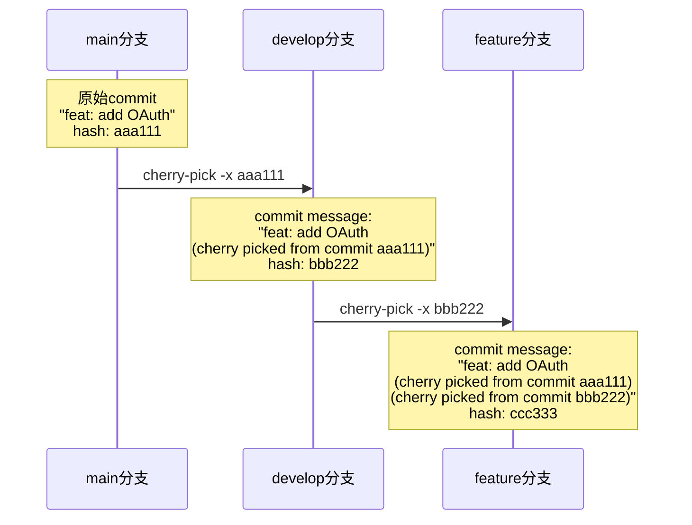

Как разработчик, вы когда-нибудь сталкивались с проблемой, когда, путешествуя между разными ветками проекта, вы видели несколько коммитов "дежа вю", но не могли определить связь между ними? Из какой ветки появилась эта функция? Была ли она разработана напрямую или взята откуда-то еще? Если последнее, то где находится исходный коммит?

<! -еще-->

Такая ситуация очень часто встречается в сложных проектах, особенно когда команды используют стратегию многофилиальной разработки. Сегодня мы рассмотрим механизм отслеживания вишенок в Git и то, как установить четкую линию изменений кода.

## Корень проблемы: амнезия Git'а

## Почему Git не помнит источник изменений

Философия дизайна Git'а основана на системе адресации содержимого, которая заботится только о нём:
- Конкретные изменения в содержимом файла
- Метаданные о коммите (автор, время, родитель)
- Уникальное хэш-значение для каждого коммита

Но Git по своей сути не является "семантически осведомленным". Для него одно и то же изменение кода - это два совершенно разных коммита на разных ветках, даже если они логически решают одну и ту же задачу.

```mermaid
graph LR
    A["原始commit<br/>feat: 修复登录bug<br/>hash: abc123"] 
    B["手动应用相同修复<br/>feat: 修复登录bug<br/>hash: def456"]
    C["cherry-pick应用<br/>feat: 修复登录bug<br/>hash: ghi789"]
    
    A -.->|"人工复制代码"| B
    A -->|"git cherry-pick"| C
    
    style A fill:#e1f5fe
    style B fill:#fff3e0
    style C fill:#f3e5f5
```.

### Болевые точки в реальных сценариях

Представьте себе сценарий, в котором ваша команда разрабатывает платформу электронной коммерции со следующей разветвленной структурой:

- `main`: код производственной среды
- `develop`: мастер-ветвь разработки
- __PROTECTED_INLINE_CODE__14__: новая платежная система
- `hotfix/security-patch`: экстренные исправления безопасности

Когда исправления безопасности должны быть применены к нескольким веткам одновременно, без отслеживания PROTECTED, вы будете сбиты с толку, когда увидите историю коммитов спустя несколько месяцев.

## Решение: сила параметра -x

### Базовое использование

Git cherry-pick предоставляет параметр `-x` для автоматического добавления информации о трассировке:

```bash
# 普通cherry-pick（无追踪）
git cherry-pick abc123

# 带追踪的cherry-pick
git cherry-pick -x abc123
```.

С параметром `-x` новое сообщение о фиксации становится:

```
原始commit message：
feat: 添加用户权限验证

使用-x后的commit message：
feat: 添加用户权限验证

(cherry picked from commit abc123def456...)
```

### Сила многоуровневой трассировки

Еще более удивительно то, что несколько вишенок создают полную цепочку трассировок:



Это создает полную цепочку изменений: `main → develop → feature`

## Практическое применение сценария разработки

### Сценарий 1: Распространение исправлений

В производственной среде обнаружена серьезная ошибка, которую необходимо быстро исправить и синхронизировать со всеми соответствующими ветками:

```bash
# 在hotfix分支修复
git checkout -b hotfix/critical-auth-bug
# 修复代码...
git commit -m "fix: resolve authentication bypass vulnerability"
# 记录commit hash，比如: abc123

# 应用到main分支
git checkout main
git cherry-pick -x abc123

# 应用到develop分支  
git checkout develop
git cherry-pick -x abc123

# 应用到各个feature分支
git checkout feature/user-dashboard
git cherry-pick -x abc123
```.

Если посмотреть на этот коммит в любой ветке несколько месяцев спустя, становится ясно, что он был сделан в ветке хотфиксов.

### Сценарий 2: Выборочное объединение функциональных возможностей

Иногда функциональные ветки содержат множество коммитов, но только некоторые из них необходимы:

```bash
# feature分支有以下commits：
# commit1: feat: add user profile API
# commit2: feat: add profile validation  
# commit3: chore: update dependencies
# commit4: feat: add profile photo upload

# 只选择API相关的commits到release分支
git checkout release/v2.1
git cherry-pick -x commit1
git cherry-pick -x commit2  
git cherry-pick -x commit4
```.

Таким образом, в релизной ветке можно четко отследить, откуда взялась функция.

### Сценарий 3: Миграция экспериментальных функций

Команда разработчиков внесла инновационные функции в экспериментальную ветку, которые после успешного тестирования необходимо включить в основной процесс разработки:


## Важные технические детали прояснены

### Cherry-pick может работать только с коммитами, но не напрямую с ветками.

Обратите внимание, что команда __PROTECTED_INLINE_CODE__20__ может работать только с конкретными коммитами, а не напрямую выбирать ветки целиком. Когда вы используете имя ветки:

```bash
# 这个命令实际上是：
git cherry-pick -x hotfix/critical-auth-bug
# 等价于：
git cherry-pick -x $(git rev-parse hotfix/critical-auth-bug)
# 即cherry-pick该分支的最新commit
```

Если ветка хотфикса содержит несколько коммитов, вам необходимо:

```bash
# 查看分支的所有commits
git log --oneline hotfix/critical-auth-bug
# abc123 fix: resolve auth bypass (最新)
# def456 test: add security tests  
# ghi789 refactor: improve auth logic

# 逐个cherry-pick（推荐，便于控制）
git cherry-pick -x ghi789
git cherry-pick -x def456  
git cherry-pick -x abc123

# 或批量cherry-pick一个范围
git cherry-pick -x ghi789^..abc123
```

## Обработка особых случаев

### Когда не следует использовать -x

Хотя мы рекомендуем использовать `-x` по умолчанию, следующие ситуации могут потребовать внимания:

1. **Рефакторинг сообщения о фиксации**: если исходное сообщение недостаточно понятно, его может потребоваться переписать
2. **Внутренние ветки инструментов**: некоторые временные ветки инструментов или скриптов могут не нуждаться в отслеживании
3. **Соображения конфиденциальности**: некоторые корпоративные среды могут не захотеть раскрывать внутренние структуры ветвлений

### Что делать, если сообщений трассировки слишком много

Если коммит выбирается несколько раз, сообщения могут стать длинными:

```
feat: add payment gateway

(cherry picked from commit aaa111)
(cherry picked from commit bbb222)  
(cherry picked from commit ccc333)
```.

Самое время подумать об этом:
- Использовать squash merge для очистки истории во время финального слияния.
- Или вручную отредактировать сообщение о фиксации, чтобы сохранить наиболее важную информацию о трассировке.

## Резюме

Параметр __PROTECTED_INLINE_CODE__22__ в Git cherry-pick - это недооцененная возможность, которая может:

- **Установить четкую последовательность изменений кода** **Установить четкую последовательность изменений кода
- **Повысить эффективность совместной работы команды
- **Упростить процесс устранения проблем
- **Улучшить сопровождаемость проекта

Выработав в команде привычку "по умолчанию использовать `-x`", ваши проекты будут иметь более прозрачную и прослеживаемую историю изменений. Помните, что хорошие инструменты и хорошие привычки - это единственный способ действительно повысить эффективность разработки.

В следующий раз, когда вы будете перемещать код между ветками, не забудьте добавить этот маленький параметр `-x` - он спасет вас и вашу команду в будущем.
