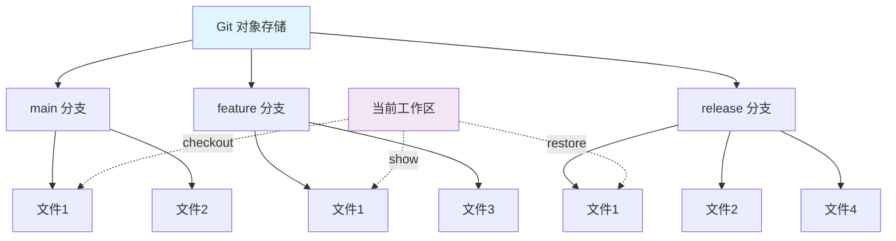
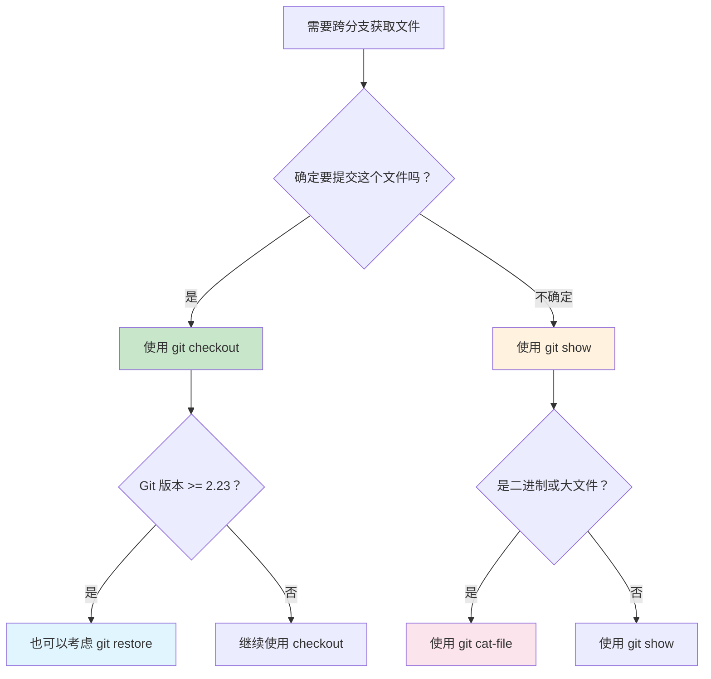

想象一下，你正在进行项目开发，突然需要从另一个分支获取某个配置文件。你会怎么做？很多开发者的第一反应是：克隆一个新的项目副本，切换到目标分支，然后手动复制文件。如果你也是这样做的，那么这篇文章将彻底改变你的工作方式。

<!--more-->

## 从图书馆借书说起

在深入 Git 命令之前，让我们用一个生动的比喻来理解这个概念。把 Git 仓库想象成一个巨大的图书馆，每个分支就像是图书馆的不同楼层，每个楼层都有相同主题但不同版本的书籍。当你需要某本书时，你不需要搬到另一个图书馆（克隆整个项目），你只需要：

- 从指定楼层的书架上取出你要的书
- 决定是带回办公桌直接使用，还是先在阅览室看看内容
- 根据需要选择不同的借阅服务

Git 的跨分支文件操作就是这样的"图书馆服务系统"。

## 核心原理：Git 的对象存储机制

Git 的强大之处在于它将每个文件、每个提交都存储为独立的对象。当你需要访问其他分支的文件时，Git 并不需要切换整个工作区，而是可以直接从对象存储中"按需取用"。

这里有一个通用的访问模式：`<分支名或提交ID>:文件路径`



无论你使用哪种命令，都遵循这个基本格式。比如：
- `main:src/config.yaml` 表示 main 分支的 src/config.yaml 文件
- `v1.2.3:package.json` 表示 v1.2.3 标签的 package.json 文件
- `abc123:docs/README.md` 表示提交 abc123 的 docs/README.md 文件

## 四种主要方法详解

### 方法一：checkout - 直接借阅窗口

这是最常用的方法，就像图书馆的"直接借阅窗口"，一步到位。

```bash
# 基本语法
git checkout <分支名> -- <文件路径>

# 实际例子
git checkout release/3.3-devops -- batch/helm/values-compassbatch-new-test.yaml
git checkout main -- src/config/database.yaml
git checkout v2.1.0 -- package.json
```

**特点：**
- 文件直接进入暂存区（staged），准备提交
- 保持原始文件权限和属性
- 一条命令解决问题

**使用场景：**
- 你确定要这个文件，并准备提交
- 跨版本同步配置文件
- 快速恢复误删的文件

### 方法二：show - 阅览室窗口

这种方法像是"阅览室服务"，让你先看看内容，再决定如何处理。

```bash
# 基本语法
git show <分支名>:<文件路径> > <目标路径>

# 实际例子
git show release/3.3-devops:batch/helm/values-compassbatch-new-test.yaml > batch/helm/values-compassbatch-new-test.yaml
git show main:src/config/database.yaml > config-backup.yaml
```

**特点：**
- 不影响 Git 状态，需要手动重定向
- 可以保存到任意位置
- 更安全的预览方式

**使用场景：**
- 不确定是否要直接暂存文件
- 需要保存到不同位置
- 比较不同分支的文件内容

### 方法三：restore - 专业恢复服务

这是 Git 2.23+ 新增的命令，专门设计用于文件恢复，语义更清晰。

```bash
# 基本语法
git restore --source=<分支名> <文件路径>

# 高级用法
git restore --source=release/3.3-devops --staged --worktree batch/helm/values-compassbatch-new-test.yaml
```

**特点：**
- 可以精确控制恢复到工作区、暂存区或两者
- 语义更明确（checkout 既能切换分支又能恢复文件）
- 更现代的 Git 操作方式

**使用场景：**
- 使用较新版本的 Git
- 需要精确控制文件状态
- 团队规范要求使用新语法

### 方法四：cat-file - 档案管理员直接取档案

这是底层命令，直接访问 Git 对象，特别适合处理特殊情况。

```bash
# 基本语法
git cat-file -p <分支名>:<文件路径> > <目标路径>

# 实际例子
git cat-file -p release/3.3-devops:batch/helm/values-compassbatch-new-test.yaml > batch/helm/values-compassbatch-new-test.yaml
```

**特点：**
- 最接近 Git 内部机制
- 处理二进制文件更可靠
- 适合大文件操作

**使用场景：**
- 处理二进制文件或大文件
- 需要最原始的文件访问方式
- 进行底层 Git 操作

## 批量操作技巧

当你需要拷贝多个文件时，可以使用循环或者直接列出多个文件：

```bash
# Fish Shell 语法（批量 checkout）
for file in \
  "batch/helm/values-compassbatch-new-test.yaml" \
  "compass-api/helm/values-compass-api-api-new-prod.yaml" \
  "compass-api/helm/values-compass-api-api-new-stage.yaml"
    git checkout release/3.3-devops -- "$file"
end

# 或者一次性指定多个文件
git checkout release/3.3-devops -- \
  batch/helm/values-compassbatch-new-test.yaml \
  compass-api/helm/values-compass-api-api-new-prod.yaml \
  compass-api/helm/values-compass-api-api-new-stage.yaml
```

## 实际应用场景

### 场景一：配置文件同步

在微服务项目中，你经常需要在不同环境分支间同步配置文件：

```bash
# 将生产环境的配置同步到测试分支
git checkout main
git checkout production -- config/database.yaml
git checkout production -- config/redis.yaml
git commit -m "sync: update database and redis config from production"
```

### 场景二：热修复文件获取

当生产环境出现问题，你需要从修复分支获取特定文件：

```bash
# 从热修复分支获取修复后的文件
git checkout main
git checkout hotfix/critical-bug -- src/payment/processor.js
git checkout hotfix/critical-bug -- tests/payment/processor.test.js
```

### 场景三：功能模块移植

将某个功能分支的特定模块移植到主分支：

```bash
# 移植新功能模块
git checkout main
git checkout feature/new-auth -- src/auth/
git checkout feature/new-auth -- docs/auth-guide.md
```

## 常见陷阱和注意事项

**1. 检查工作区状态**
在执行跨分支文件操作前，确保工作区是干净的：
```bash
git status
# 确保没有未提交的更改
```

**2. 文件路径的准确性**
Git 的文件路径区分大小写，确保路径完全正确：
```bash
# 错误示例
git checkout main -- Config/Database.yaml  # 大小写错误

# 正确示例
git checkout main -- config/database.yaml
```

**3. 分支名的有效性**
确保目标分支存在且可访问：
```bash
# 查看所有分支
git branch -a

# 确保分支存在
git show release/3.3-devops:batch/helm/values-compassbatch-new-test.yaml
```

## 效率对比：新方法 vs 传统方法

让我们对比一下效率差异：

**传统方法（克隆项目）：**
```bash
# 1. 克隆项目到新目录
git clone project.git project-temp
cd project-temp

# 2. 切换分支
git checkout target-branch

# 3. 复制文件
cp path/to/file ../original-project/

# 4. 回到原项目
cd ../original-project

# 5. 清理临时目录
rm -rf project-temp
```

**新方法（直接获取）：**
```bash
# 一条命令解决
git checkout target-branch -- path/to/file
```

效率提升显而易见：从 5 个步骤减少到 1 个步骤，从分钟级操作变成秒级操作。

## 选择指南

根据不同情况选择最适合的方法：



**快速选择建议：**
- **日常使用**：优先选择 `git checkout`
- **不确定时**：使用 `git show` 先预览
- **新环境下**：可以尝试 `git restore`
- **特殊文件**：考虑 `git cat-file`

## 总结

Git 的跨分支文件操作功能让我们可以像在图书馆中自由借阅不同楼层的书籍一样，灵活地在不同分支间获取所需文件。掌握了 `<分支名>:<文件路径>` 这个核心模式，你就掌握了 Git 文件操作的精髓。

从今天开始，告别克隆整个项目的笨办法，让你的 Git 操作更加优雅高效。无论是配置文件同步、热修复获取，还是功能模块移植，这些技巧都会让你的开发工作事半功倍。

记住那个图书馆的比喻：你不需要搬家，只需要知道如何从正确的书架上取到你要的书。
