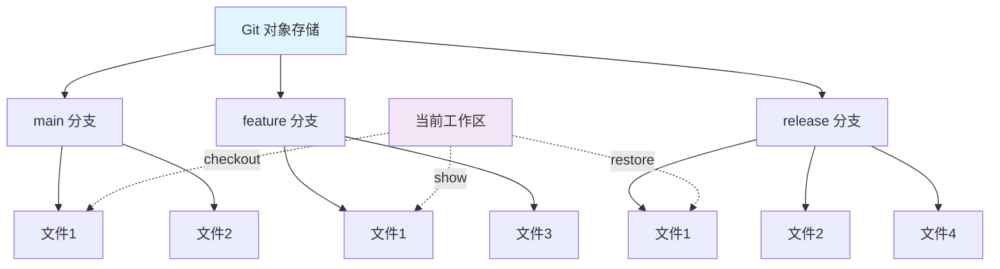

Представьте, что вы работаете над проектом, и вдруг вам понадобилось получить определенный файл конфигурации из другой ветки. Что вы будете делать? Первая реакция многих разработчиков: клонировать новую копию проекта, переключиться на целевую ветку и скопировать файл вручную. Если вы поступаете именно так, то эта статья полностью изменит ваш подход к работе.

<! ---далее-->

## Заимствование книг из библиотеки

Прежде чем мы погрузимся в изучение команд Git, давайте воспользуемся яркой аналогией для понимания концепции. Представьте себе ваш Git-репозиторий как гигантскую библиотеку, где каждый филиал - это отдельный этаж библиотеки, и на каждом этаже находятся разные версии книг на одну и ту же тему. Когда вам нужна определенная книга, вам не нужно переходить в другую библиотеку (клонировать весь проект), вам просто нужно это сделать:

- Взять нужную книгу с полок на данном этаже.
- Решить, стоит ли вернуть ее на свой стол и сразу же использовать, или сначала ознакомиться с содержимым в читальном зале.
- Выбрать различные услуги кредитования в зависимости от ваших потребностей

Кросс-бранч манипуляция файлами в Git - это такая "система библиотечного обслуживания".

## Основные принципы: механизм объектного хранения Git'а.

Сила Git'а в том, что он хранит каждый файл и каждый коммит как отдельный объект. Когда вам нужно получить доступ к файлу в другой ветке, Git не требует переключения рабочих пространств; вы можете получить доступ к нему непосредственно из хранилища объектов по мере необходимости.

Вот распространенный шаблон доступа: __PROTECTED_INLINE_CODE__15__.



Какую бы команду вы ни использовали, она следует этому основному формату. Например:
- `main:src/config.yaml` указывает на файл src/config.yaml в основной ветке.
- `v1.2.3:package.json` для файла package.json в ветке v1.2.3.
- `abc123:docs/README.md` для файла docs/README.md для abc123.

## Четыре основных метода

### Метод 1: проверка - прямое окно проверки

Это наиболее часто используемый метод, он похож на библиотечное "окно прямого заимствования" - одношаговый процесс.

```bash
# 基本语法
git checkout <分支名> -- <文件路径>

# 实际例子
git checkout release/3.3-devops -- batch/helm/values-compassbatch-new-test.yaml
git checkout main -- src/config/database.yaml
git checkout v2.1.0 -- package.json
```

**Особенности:** ** ** Файл попадает непосредственно в зону постановки (staged).
- Файл попадает непосредственно в область постановки (staged), готовый к фиксации.
- Сохраняет исходные разрешения и атрибуты файла.
- Одна команда решает проблему

**Сценарии использования:**.
- Вы уверены, что файл вам нужен, и готовы к фиксации
- Синхронизация файлов конфигурации разных версий
- Быстрое восстановление файла, который был удален по ошибке

### Метод 2: показать - окно читального зала

Этот метод похож на "службу читального зала", которая позволяет просмотреть содержимое, прежде чем решить, что с ним делать.

```bash
# 基本语法
git show <分支名>:<文件路径> > <目标路径>

# 实际例子
git show release/3.3-devops:batch/helm/values-compassbatch-new-test.yaml > batch/helm/values-compassbatch-new-test.yaml
git show main:src/config/database.yaml > config-backup.yaml
```

**Особенности
- Не влияет на состояние Git, требует ручного перенаправления.
- Может быть сохранен в любое место.
- Более безопасный способ предварительного просмотра

**Сценарии использования:**.
- Вы не уверены, что хотите сохранять файлы напрямую.
- Нужно сохранить в разных местах
- Сравнить содержимое файлов в разных ветках

### Метод 3: восстановление - Профессиональные услуги восстановления

Это новая команда в Git 2.23+, разработанная специально для восстановления файлов и имеющая более четкую семантику.

```bash
# 基本语法
git restore --source=<分支名> <文件路径>

# 高级用法
git restore --source=release/3.3-devops --staged --worktree batch/helm/values-compassbatch-new-test.yaml
```

**Функции:**
- Точный контроль над тем, хотите ли вы восстановить в рабочую область, в область постановки или в обе.
- Более семантично (checkout и переключает ветки, и восстанавливает файлы).
- Более современный подход к Git

**Сценарии использования:**.
- Использование новой версии Git
- Необходим точный контроль над статусом файлов
- Спецификация команды требует нового синтаксиса

### Метод 4: cat-file - архивариус получает файл напрямую

Это базовая команда, напрямую обращающаяся к объектам Git, и она особенно хороша для работы с особыми случаями.

```bash
# 基本语法
git cat-file -p <分支名>:<文件路径> > <目标路径>

# 实际例子
git cat-file -p release/3.3-devops:batch/helm/values-compassbatch-new-test.yaml > batch/helm/values-compassbatch-new-test.yaml
```

**Особенности.
- Наиболее близок к внутреннему устройству Git
- Более надежная работа с бинарными файлами
- Идеально подходит для больших файлов

**Сценарии использования:**
- Работа с бинарными файлами или большими файлами
- Необходим примитивный доступ к файлам
- Выполнение базовых операций Git

## Техника пакетных операций

Когда вам нужно скопировать несколько файлов, вы можете использовать циклы или просто перечислить несколько файлов:

```bash
# Fish Shell 语法（批量 checkout）
for file in \
  "batch/helm/values-compassbatch-new-test.yaml" \
  "compass-api/helm/values-compass-api-api-new-prod.yaml" \
  "compass-api/helm/values-compass-api-api-new-stage.yaml"
    git checkout release/3.3-devops -- "$file"
end

# 或者一次性指定多个文件
git checkout release/3.3-devops -- \
  batch/helm/values-compassbatch-new-test.yaml \
  compass-api/helm/values-compass-api-api-new-prod.yaml \
  compass-api/helm/values-compass-api-api-new-stage.yaml
```

## Практические сценарии применения

### Сценарий 1: синхронизация файлов конфигурации

В проектах микросервисов часто требуется синхронизировать файлы конфигурации между различными ветвями окружения:

```bash
# 将生产环境的配置同步到测试分支
git checkout main
git checkout production -- config/database.yaml
git checkout production -- config/redis.yaml
git commit -m "sync: update database and redis config from production"
```.

### Сценарий 2: Получение файлов исправлений

При возникновении проблемы в производственной среде вам нужно получить определенный файл из ветки исправлений:

```bash
# 从热修复分支获取修复后的文件
git checkout main
git checkout hotfix/critical-bug -- src/payment/processor.js
git checkout hotfix/critical-bug -- tests/payment/processor.test.js
```.

### Сценарий 3: Миграция функциональных модулей

Перенос конкретного модуля из функциональной ветки в основную ветку:

```bash
# 移植新功能模块
git checkout main
git checkout feature/new-auth -- src/auth/
git checkout feature/new-auth -- docs/auth-guide.md
```.

## Общие подводные камни и предостережения

**1. Проверка состояния рабочего пространства **.
Перед выполнением кросс-бранч файловой операции убедитесь, что рабочая область чиста:
```bash
git status
# 确保没有未提交的更改
```.

**2. Точность путей к файлам** Пути к файлам в Git'е чувствительны к регистру.
Пути к файлам в Git'е чувствительны к регистру, поэтому убедитесь, что они правильные:
```bash
# 错误示例
git checkout main -- Config/Database.yaml  # 大小写错误

# 正确示例
git checkout main -- config/database.yaml
```.

**3. Валидность имен ветвей**.
Убедитесь, что целевая ветка существует и доступна:
```bash
# 查看所有分支
git branch -a

# 确保分支存在
git show release/3.3-devops:batch/helm/values-compassbatch-new-test.yaml
```

## Сравнение эффективности: новый подход и традиционный подход

Давайте сравним разницу в эффективности:

**Традиционный метод (клонированный проект): **.
```bash
# 1. 克隆项目到新目录
git clone project.git project-temp
cd project-temp

# 2. 切换分支
git checkout target-branch

# 3. 复制文件
cp path/to/file ../original-project/

# 4. 回到原项目
cd ../original-project

# 5. 清理临时目录
rm -rf project-temp
```_.

**Новый метод (прямое извлечение): ** ```bash
# 一条命令解决
git checkout target-branch -- path/to/file
```.
```bash
# 一条命令解决
git checkout target-branch -- path/to/file
```

Выигрыш в эффективности очевиден: с 5 шагов до 1, с минутных до секундных операций.

## Руководство по выбору

Выберите наиболее подходящий метод для каждой конкретной ситуации:

```mermaid
graph TD
    A[需要跨分支获取文件] --> B{确定要提交这个文件吗？}
    B -->|是| C[使用 git checkout]
    B -->|不确定| D[使用 git show]
    
    C --> E{Git 版本 >= 2.23？}
    E -->|是| F[也可以考虑 git restore]
    E -->|否| G[继续使用 checkout]
    
    D --> H{是二进制或大文件？}
    H -->|是| I[使用 git cat-file]
    H -->|否| J[使用 git show]
    
    style C fill:#c8e6c9
    style D fill:#fff3e0
    style F fill:#e1f5fe
    style I fill:#fce4ec
```.

**Быстрый выбор: ```mermaid
graph TD
    A[需要跨分支获取文件] --> B{确定要提交这个文件吗？}
    B -->|是| C[使用 git checkout]
    B -->|不确定| D[使用 git show]
    
    C --> E{Git 版本 >= 2.23？}
    E -->|是| F[也可以考虑 git restore]
    E -->|否| G[继续使用 checkout]
    
    D --> H{是二进制或大文件？}
    H -->|是| I[使用 git cat-file]
    H -->|否| J[使用 git show]
    
    style C fill:#c8e6c9
    style D fill:#fff3e0
    style F fill:#e1f5fe
    style I fill:#fce4ec
```.
- **Ежедневное использование**: предпочтите `git checkout`.
- **Когда вы не уверены**: используйте `git show` для предварительного просмотра.
- **Новое окружение**: попробуйте `git restore`.
- **Специальные файлы**: рассмотрите `git cat-file`.

## Резюме

Межфилиальная работа с файлами в Git'е позволяет вам брать книги с разных этажей библиотеки и получать нужные файлы из ветки в ветку. Если вы освоили паттерн `<分支名>:<文件路径>`, то вы поняли суть работы с файлами в Git.

Начиная с сегодняшнего дня, попрощайтесь с клонированием всего проекта и сделайте свои операции с Git'ом более элегантными и эффективными. Будь то синхронизация конфигурационных файлов, получение горячих исправлений или перенос функциональности, эти приемы сделают вашу разработку вдвое быстрее.

Помните аналогию с библиотекой: вам не нужно переезжать, вам просто нужно знать, как достать нужные вам книги с нужной полки.
