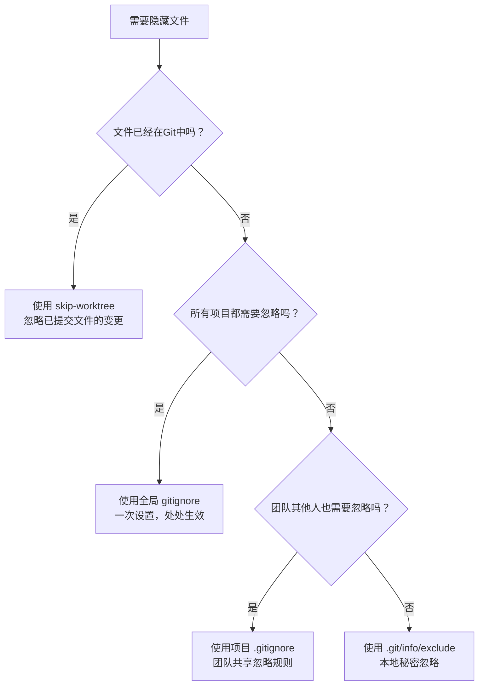

你有没有遇到过这样的困扰：Git 总是提醒你有未跟踪的文件，但这些文件你既不想提交，又不想删除？比如系统自动生成的 `.DS_Store` 文件，或者你的个人配置文件？

今天我们来学习 4 种让这些"麻烦"文件在 Git 中"消失"的方法，每种方法都有自己的适用场景，掌握了它们，你就能让 Git 乖乖听话！

<!--more-->

## 问题场景：当 Git "太关心"你的文件时

想象一下，小李是一名程序员，他的项目里总是出现这样的情况：

```bash
$ git status
On branch main
Untracked files:
  (use "git add <file>..." to include in what will be committed)
        .DS_Store
        config.local
        my-notes.txt

nothing added to commit but untracked files present
```

每次检查状态，Git 都会"善意"提醒他这些文件没有被跟踪。但问题是：
- `.DS_Store` 是 macOS 系统文件，没必要提交
- `config.local` 是他的个人配置，不应该影响其他同事
- `my-notes.txt` 是私人笔记，不想让别人看到

怎么办？删掉吗？不行，这些文件都有用。提交吗？也不合适，会影响团队协作。

这就需要我们的"文件隐藏大法"了！

## 方法一：全局忽略 - 一劳永逸的解决方案

**适用场景**：系统文件、编辑器配置等在所有项目中都不想要的文件

这是最省心的方法，设置一次，所有项目都生效。

### 第一步：创建全局忽略文件

```bash
# 用你喜欢的编辑器打开（这里用 nano 举例）
nano ~/.gitignore
```

### 第二步：添加要忽略的文件类型

```
# macOS 系统文件
.DS_Store
.DS_Store?
.AppleDouble
.LSOverride

# Windows 系统文件  
Thumbs.db
ehthumbs.db
Desktop.ini

# 编辑器文件
*.swp
*.swo
*~
.vscode/
.idea/

# 临时文件
*.tmp
*.temp
.cache/
```

### 第三步：告诉 Git 使用这个文件

```bash
git config --global core.excludesfile ~/.gitignore
```

完成！现在你所有的 Git 项目都会自动忽略这些文件了。

## 方法二：项目级忽略 - 团队共享的规则

**适用场景**：项目特定的文件，需要所有团队成员都忽略

如果某些文件只在这个项目中需要忽略，并且希望团队其他成员也忽略它们，就用这个方法。

### 创建或编辑 .gitignore 文件

```bash
# 在项目根目录
nano .gitignore
```

### 添加项目特定的忽略规则

```
# 构建产物
dist/
build/
*.o
*.exe

# 日志文件
logs/
*.log

# 依赖文件
node_modules/
vendor/

# 配置文件
config.local.*
secrets.json
```

### 提交这个配置

```bash
git add .gitignore
git commit -m "添加项目忽略规则"
```

现在团队所有成员都会应用这些规则了。

## 方法三：本地项目忽略 - 我的秘密我做主

**适用场景**：只有你需要忽略，但不想影响团队的文件

有时候你有一些个人文件只想在本地忽略，比如你的调试脚本、个人笔记等。这时候用这个方法：

```bash
echo "my-debug-script.py" >> .git/info/exclude
echo "personal-notes.md" >> .git/info/exclude
```

这个文件只在你的本地生效，不会被提交到仓库，不会影响其他人。

## 方法四：忽略已提交的文件 - 后悔药也有

**适用场景**：文件已经在仓库中，但现在想忽略它的变更

这是最"高级"的场景。假设之前你已经提交了一个配置文件 `config.yml`，但现在每个人都需要不同的配置，不想再跟踪它的变更：

```bash
# 让 Git 假装这个文件没有变化
git update-index --skip-worktree config.yml
```

现在即使你修改 `config.yml`，Git 也不会显示它有变更。

### 如果要恢复跟踪：

```bash
git update-index --no-skip-worktree config.yml
```

## 快速决策指南

面对一个需要隐藏的文件，怎么快速选择方法？



## 常见问题解答

**Q: 我设置了全局 gitignore 但不生效？**
A: 检查是否执行了配置命令：`git config --global core.excludesfile ~/.gitignore`

**Q: 能否撤销 skip-worktree？**
A: 可以，使用：`git update-index --no-skip-worktree 文件名`

**Q: .gitignore 和 .git/info/exclude 有什么区别？**
A: .gitignore 会被提交到仓库，所有人共享；.git/info/exclude 只在本地生效。

**Q: 如果文件已经被跟踪，但我想用 .gitignore 忽略它？**
A: 需要先移除跟踪：`git rm --cached 文件名`，然后添加到 .gitignore。

## 实战技巧

1. **优先使用全局忽略**：对于 `.DS_Store`、`Thumbs.db` 这类系统文件，设置一次全局忽略比在每个项目中都设置要省心得多。

2. **团队协作要沟通**：如果要在项目的 .gitignore 中添加新规则，最好和团队讨论一下，确保大家都同意。

3. **定期清理**：偶尔检查一下你的忽略规则，删除不再需要的条目。

4. **备份重要配置**：如果使用 skip-worktree 忽略了配置文件，记得备份你的本地版本。

掌握了这 4 种方法，你就能让 Git 变得更听话，不再为那些"多余"的文件提醒而烦恼。记住，选择合适的方法很重要 - 不是所有问题都需要用大锤解决！

现在就试试吧，让你的 Git 工作区变得清爽整洁！
