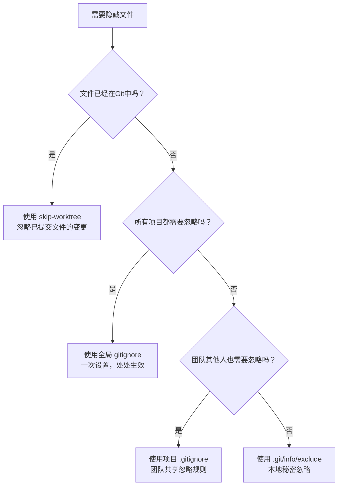

Сталкивались ли вы с проблемой, что Git постоянно напоминает вам о неотслеживаемых файлах, которые вы не хотите коммитить или удалять? Например, файл `.DS_Store`, который автоматически генерируется системой, или ваш личный конфигурационный файл?

Сегодня мы узнаем 4 способа заставить эти "проблемные" файлы "исчезнуть" в Git'е, каждый метод имеет свои сценарии применения, освоив их, вы сможете сделать Git послушным!

<! ---далее-->

## Сценарий проблемы: Когда Git слишком сильно заботится о ваших файлах.

Представьте, что у Ли, программиста, есть проект, в котором постоянно происходит подобное:

```bash
$ git status
On branch main
Untracked files:
  (use "git add <file>..." to include in what will be committed)
        .DS_Store
        config.local
        my-notes.txt

nothing added to commit but untracked files present
```.

Каждый раз, когда он проверяет статус, Git "любезно" напоминает ему, что эти файлы не отслеживаются. Но вот в чем проблема:
- `.DS_Store` - это системный файл macOS, и его не нужно коммитить.
- `config.local` - это его личная конфигурация, и она не должна влиять на его коллег.
- `my-notes.txt` - это личная заметка, которую он не хочет, чтобы видели другие.

Что делать? Удалить их? Нет, эти файлы полезны. Отправить их? Это тоже не подходит, это помешает командной работе.

Вот тут-то и приходит на помощь наша техника "Скрытие файлов"!

## Метод 1: Глобальное игнорирование - решение раз и навсегда

**Сценарий**: системные файлы, конфигурация редактора и т. д. нужны не во всех проектах.

Это самый простой метод: задайте его один раз, и он будет работать для всех проектов.

### Шаг 1: Создайте глобальный файл игнорирования

```bash
# 用你喜欢的编辑器打开（这里用 nano 举例）
nano ~/.gitignore
```.

### Шаг 2: Добавьте тип игнорируемого файла

```
# macOS 系统文件
.DS_Store
.DS_Store?
.AppleDouble
.LSOverride

# Windows 系统文件  
Thumbs.db
ehthumbs.db
Desktop.ini

# 编辑器文件
*.swp
*.swo
*~
.vscode/
.idea/

# 临时文件
*.tmp
*.temp
.cache/
```

### Шаг 3: Сообщите Git'у, что нужно использовать этот файл

```bash
git config --global core.excludesfile ~/.gitignore
``` ### Шаг 3: Скажите Git'у использовать этот файл.

Готово! Теперь все ваши Git-проекты будут автоматически игнорировать эти файлы.

## Метод 2: Игнорирование на уровне проекта - правила совместной работы в команде

**Сценарий**: специфические для проекта файлы, которые должны игнорироваться всеми членами команды

Используйте этот метод, если определенные файлы должны игнорироваться только в этом проекте, и вы хотите, чтобы остальные члены команды тоже их игнорировали.

### Создайте или отредактируйте файл .gitignore

```bash
# 在项目根目录
nano .gitignore
```

### Добавьте правила игнорирования для конкретного проекта

```
# 构建产物
dist/
build/
*.o
*.exe

# 日志文件
logs/
*.log

# 依赖文件
node_modules/
vendor/

# 配置文件
config.local.*
secrets.json
```

### Зафиксируйте эту конфигурацию

```bash
git add .gitignore
git commit -m "添加项目忽略规则"
```

Теперь все члены команды будут применять эти правила.

## Метод 3: Игнорирование локального проекта - Мои секреты, мой путь

**Сценарий**: только файлы, которые нужно игнорировать, но которые не должны влиять на команду

Иногда у вас есть личные файлы, которые вы просто хотите игнорировать локально, например, ваши отладочные скрипты, личные заметки и т.д. Вот тогда-то и стоит воспользоваться этим методом:

```bash
echo "my-debug-script.py" >> .git/info/exclude
echo "personal-notes.md" >> .git/info/exclude
```.

Этот файл будет действовать только локально, он не будет зафиксирован в репозитории и не повлияет ни на кого другого.

## Метод 4: Игнорировать коммитированные файлы - тоже есть таблетка раскаяния!

**Сценарий**: Файл уже находится в репозитории, но теперь вы хотите игнорировать его изменения!

Это самый "продвинутый" сценарий. Допустим, вы уже зафиксировали файл конфигурации `config.yml`, но теперь всем нужна другая конфигурация, и вы не хотите следить за ее изменениями:

```bash
# 让 Git 假装这个文件没有变化
git update-index --skip-worktree config.yml
```

Теперь, даже если вы измените `config.yml`, Git не покажет, что он изменился.

### Если вы хотите восстановить трассировку:

```bash
git update-index --no-skip-worktree config.yml
```.

## Краткое руководство по принятию решений

Когда вы сталкиваетесь с файлом, который необходимо скрыть, как быстро выбрать метод?



## Часто задаваемые вопросы

**Q: Я установил глобальный gitignore, но он не работает? **
A: Проверьте, была ли выполнена команда конфигурации: __PROTECTED_INLINE_CODE__17__.

** В: Могу ли я отменить команду skip-worktree?
О: Да, используйте команду: `git update-index --no-skip-worktree 文件名` **В: Могу ли я отменить skip-worktree?

**Q: В чем разница между .gitignore и .git/info/exclude? **Q: В чем разница между .gitignore и .git/info_exclude?
О: .gitignore фиксируется в репозитории и распространяется на всех; .git/info/exclude действует только локально.

** В: Что делать, если файл уже отслеживается, но я хочу игнорировать его с помощью .gitignore? **
О: Сначала нужно удалить отслеживание: `git rm --cached 文件名`, а затем добавить его в .gitignore.

## Практические советы

1. **Преимущество глобального игнорирования**: Для системных файлов, таких как `.DS_Store`, `Thumbs.db`, гораздо экономичнее один раз установить глобальное игнорирование, чем устанавливать его в каждом проекте.

2. **Работа в команде должна быть согласована**: Если вы хотите добавить новое правило в .gitignore вашего проекта, стоит обсудить его с командой, чтобы убедиться, что все согласны.

3. **Периодическая чистка**: периодически проверяйте свои правила игнорирования и удаляйте записи, которые больше не нужны.

4. **Бекап важных конфигураций**: Не забывайте делать резервные копии локальной версии вашего конфигурационного файла, если вы игнорируете его с помощью skip-worktree.

С помощью этих четырех методов вы можете сделать Git более послушным и перестать беспокоиться о "лишних" напоминаниях о файлах. Помните, что важно выбрать правильный подход - не все проблемы нужно решать с помощью кувалды!

Попробуйте прямо сейчас и сделайте свое рабочее пространство Git чистым и аккуратным!
