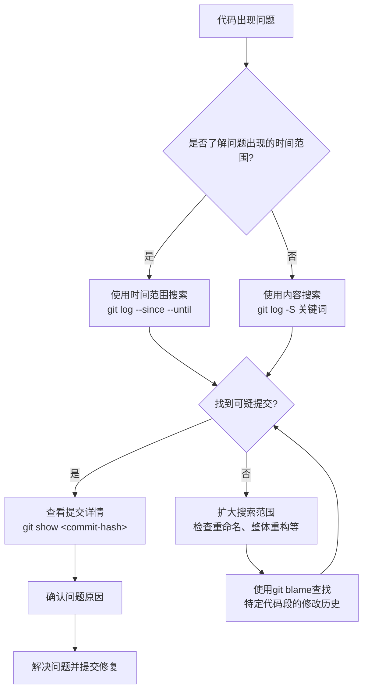

当某个函数突然消失，或者某行关键代码被莫名其妙修改时，Git历史记录就是你最强大的调查工具。本文将介绍如何像侦探一样追踪Git历史中的代码变更，解决"谁改了这段代码"、"这个函数什么时候被删除的"等问题。

<!--more-->

## 从一个真实案例开始

最近我遇到了一个有趣的问题：我的一个Fish Shell脚本突然报错，提示"Unknown command: get_last_command"。这个函数曾经明明可以正常工作，却突然不见了。这究竟是怎么回事？是我不小心删除了这个函数？还是在合并代码时出了问题？

这类问题对开发者来说并不罕见。当你面对一个曾经能工作但现在出问题的代码时，追踪历史变更就成了解决问题的关键。

## Git历史追踪的基本命令

### git log：查看提交历史

`git log`是最基本的历史查看命令，但它有很多强大的参数：

```bash
# 查看文件的提交历史
git log path/to/file.ext

# 显示每次提交的具体修改内容
git log -p path/to/file.ext

# 限制显示条目数
git log -n 5 path/to/file.ext
```

**使用场景**：当你想了解一个文件的所有修改历史时，这是第一步。

### git show：查看单次提交详情

```bash
# 查看某次提交的详细内容
git show <commit-hash>

# 查看某次提交对特定文件的修改
git show <commit-hash> -- path/to/file.ext
```

**使用场景**：当你已经找到可疑的提交记录，需要查看详细修改内容时使用。

### git blame：查找每行代码的"责任人"

```bash
# 查看文件的每一行最后是谁修改的
git blame path/to/file.ext

# 只查看特定行范围
git blame -L 10,20 path/to/file.ext
```

**使用场景**：当你想知道"这行代码是谁写的/改的"时，这个命令能精确定位到每行代码的最后修改者。

## 高级搜索技巧

以上命令很基础，但在大型项目中可能效率不高。接下来介绍一些更精确的搜索技巧。

### 搜索特定内容的变更

```bash
# 搜索添加或删除了特定字符串的提交
git log -p -S "function_name" path/to/file.ext

# 搜索匹配正则表达式的变更
git log -p -G "function\s+get_\w+" path/to/file.ext
```

`-S`参数（俗称"pickaxe"）非常强大，它能找出所有添加或删除了特定字符串的提交。这对于追踪函数的添加和删除特别有用。

**使用场景**：当你想找到特定函数或变量何时被添加、修改或删除时使用。

### 使用更精确的搜索选项

```bash
# 显示每个匹配提交前后的完整差异
git log -p -S "function_name" --pickaxe-all path/to/file.ext

# 只匹配整行添加或删除的情况
git log -p -S "function_name" --pickaxe-regex path/to/file.ext
```

**使用场景**：当你需要更精确地控制搜索结果，或者查看更完整的上下文时使用。

### 按时间范围缩小搜索

```bash
# 查找特定时间段内的提交
git log --since="2023-01-01" --until="2023-02-01" path/to/file.ext

# 结合内容搜索
git log -p -S "function_name" --since="1 month ago" path/to/file.ext
```

**使用场景**：当你大致知道问题出现的时间段，可以用这种方式缩小搜索范围。

## 实战案例：查找丢失的函数

回到我们开始的例子，如果要查找丢失的`get_last_command`函数，可以这样操作：

1. 首先，搜索含有这个函数名的提交：

```bash
git log -p -S "get_last_command" path/to/file.fish
```

2. 如果找不到，可能是在某次重构中整个函数被移除，尝试搜索函数定义：

```bash
git log -p -S "function get_last_command" path/to/file.fish
```

3. 如果还是找不到，可能这个函数是在某个特定的提交中整块删除的，可以尝试查看文件的完整历史：

```bash
git log -p path/to/file.fish
```

4. 查看特定时间段的变更：

```bash
git log -p --since="3 months ago" path/to/file.fish
```

通过这些命令，我们通常能找到函数是何时、被谁删除的，以及删除的具体上下文。

## 使用图形化工具辅助

虽然命令行功能强大，但图形化工具有时更直观：

1. **gitk**：内置的图形化历史查看器
   ```bash
   gitk path/to/file.ext
   ```

2. **Git GUI客户端**：如GitKraken、SourceTree等提供更友好的界面

3. **IDE集成**：如VS Code的Git History插件、IntelliJ的内置Git工具等

这些工具对不熟悉命令行的开发者特别友好，也能提供更直观的历史视图。

## 实用技巧

### 1. 使用别名简化命令

可以在`.gitconfig`中设置常用命令的别名：

```
[alias]
    find-str = log -p -S
    blame-range = blame -L
    history = log --follow -p
```

### 2. 组合使用命令

有时候单个命令无法解决问题，可以组合使用：

```bash
# 找出删除特定字符串的提交，并查看完整修改
git log -S "removed_function" --oneline | head -1 | cut -d' ' -f1 | xargs git show
```

### 3. 跟踪文件重命名

当文件被重命名时，普通的`git log`可能会丢失历史，使用`--follow`参数可以解决：

```bash
git log --follow -p path/to/renamed_file.ext
```

## 总结

Git不仅是一个版本控制工具，也是解决代码历史问题的侦探工具箱。通过本文介绍的命令和技巧，你可以：

1. 找出何时、被谁引入了特定代码
2. 追踪丢失的函数或被删除的代码
3. 了解代码演变的完整历史
4. 定位导致问题的具体提交

下次当你面对"代码明明好好的，怎么突然不工作了"的问题时，不妨戴上侦探帽，使用Git历史追踪工具，你会发现解决问题比想象中容易得多。

记住：在Git的世界里，没有真正消失的代码，只有等待被发现的历史线索。



---

希望这些技巧能帮助你在Git的历史长河中找到问题的答案。如有任何问题或补充，欢迎在评论区留言讨论！
