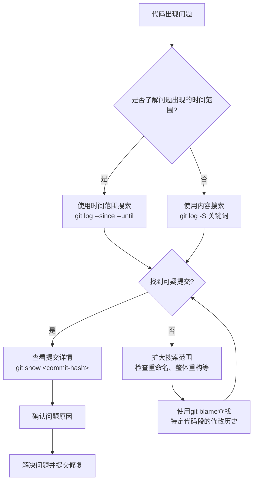

Когда функция внезапно исчезает или ключевая строка кода была необъяснимо изменена, история Git - ваш самый мощный инструмент расследования. В этой статье мы расскажем, как проследить изменения кода в истории Git, подобно детективу, чтобы решить проблему "кто изменил этот код", "когда эта функция была удалена" и так далее.

<! ---далее-->

## Начнем с реального случая

Недавно я столкнулся с интересной проблемой: один из моих скриптов Fish Shell внезапно выдал ошибку "Неизвестная команда: get_last_command". Раньше эта функция работала нормально, но внезапно она исчезла. Что здесь происходит? Я случайно удалил функцию? Или возникла проблема с объединением кода?

Подобные проблемы не редкость для разработчиков. Когда вы сталкиваетесь с кодом, который раньше работал, но теперь имеет проблемы, отслеживание истории изменений - ключ к решению проблемы.

## Основные команды для отслеживания истории Git

### git log: просмотр истории фиксаций

`git log` - это самая базовая команда просмотра истории, но у нее много мощных аргументов:

```bash
# 查看文件的提交历史
git log path/to/file.ext

# 显示每次提交的具体修改内容
git log -p path/to/file.ext

# 限制显示条目数
git log -n 5 path/to/file.ext
```

**Сценарий использования**: Это первый шаг, когда вы хотите узнать всю историю модификаций файла.

### git show: просмотр деталей одиночного коммита

```bash
# 查看某次提交的详细内容
git show <commit-hash>

# 查看某次提交对特定文件的修改
git show <commit-hash> -- path/to/file.ext
```.

**Сценарий использования**: Используйте эту функцию, когда вы нашли подозрительный коммит и вам нужно просмотреть детали изменений.

### git blame: найти "ответственного" за каждую строку кода.

```bash
# 查看文件的每一行最后是谁修改的
git blame path/to/file.ext

# 只查看特定行范围
git blame -L 10,20 path/to/file.ext
```.

**Сценарий**: Когда вы хотите узнать, "кто написал/изменил эту строку кода", эта команда может точно определить последний модификатор каждой строки кода.

## Советы по расширенному поиску

Приведенные выше команды являются базовыми, но могут быть не очень эффективны в больших проектах. Далее мы рассмотрим некоторые более точные методы поиска.

### Поиск конкретных изменений в содержимом

```bash
# 搜索添加或删除了特定字符串的提交
git log -p -S "function_name" path/to/file.ext

# 搜索匹配正则表达式的变更
git log -p -G "function\s+get_\w+" path/to/file.ext
```

Параметр `-S` (широко известный как "кирка") очень мощный, так как он находит все коммиты, которые добавляют или удаляют определённую строку. Это особенно полезно для отслеживания добавлений и удалений в функциях.

**Сценарий использования**: используйте, когда хотите найти, когда определенная функция или переменная была добавлена, изменена или удалена.

### Используйте более точные параметры поиска

```bash
# 显示每个匹配提交前后的完整差异
git log -p -S "function_name" --pickaxe-all path/to/file.ext

# 只匹配整行添加或删除的情况
git log -p -S "function_name" --pickaxe-regex path/to/file.ext
```.

**Сценарий использования**: используйте, когда вам нужен более точный контроль над результатами поиска или чтобы увидеть более полный контекст.

### Сужение поиска по временному диапазону

```bash
# 查找特定时间段内的提交
git log --since="2023-01-01" --until="2023-02-01" path/to/file.ext

# 结合内容搜索
git log -p -S "function_name" --since="1 month ago" path/to/file.ext
```

**Сценарий использования**: когда вы примерно знаете период времени, в течение которого возникает проблема, вы можете сузить поиск таким образом.

## Практический пример: поиск недостающих функций

Возвращаясь к примеру, с которого мы начали, чтобы найти недостающую функцию `get_last_command`, вы можете сделать это следующим образом:

1. Сначала найдите коммиты, содержащие это имя функции:

```bash
git log -p -S "get_last_command" path/to/file.fish
```

2. если вы не можете найти ее, возможно, вся функция была удалена в ходе рефакторинга; попробуйте поискать определение функции:

```bash
git log -p -S "function get_last_command" path/to/file.fish
```

3. если вы все еще не можете ее найти, возможно, функция была полностью удалена в определенном коммите, попробуйте посмотреть полную историю файла:

```bash
git log -p path/to/file.fish
```

4. проверьте изменения, сделанные за определенный период времени:

```bash
git log -p --since="3 months ago" path/to/file.fish
```

С помощью этих команд мы обычно можем узнать, когда и кем была удалена функция, а также конкретный контекст удаления.

## Используйте графические инструменты для помощи

Командная строка - это мощный инструмент, но графические инструменты более интуитивны, если они доступны:

1. **gitk**: встроенный графический просмотрщик истории
   ```bash
   gitk path/to/file.ext
   ```.

2. **Git GUI-клиент**: GitKraken, SourceTree и т. д. предоставляют более удобный интерфейс.

3. **IDE-интеграция**: например, плагин Git History для VS Code, встроенные инструменты Git для IntelliJ и т. д.

Эти инструменты особенно удобны для разработчиков, не знакомых с командной строкой, и обеспечивают более интуитивное представление истории.

## Практические советы

### 1. Использование псевдонимов для упрощения команд

В `.gitconfig` можно задать псевдонимы для общих команд:

```
[alias]
    find-str = log -p -S
    blame-range = blame -L
    history = log --follow -p
```

### 2. Объединение команд

Иногда одна команда не решает проблему, и ее можно использовать в комбинации:

```bash
# 找出删除特定字符串的提交，并查看完整修改
git log -S "removed_function" --oneline | head -1 | cut -d' ' -f1 | xargs git show
```.

### 3. Переименование файла трассировки

При переименовании файла обычный `git log` может потерять историю, что может быть решено с помощью параметра `--follow`:

```bash
git log --follow -p path/to/renamed_file.ext
```

## Резюме

Git - это не только инструмент контроля версий, но и набор инструментов детектива для решения проблем с историей кода. С помощью команд и техник, описанных в этой статье, вы сможете:

1. узнать, когда и кем был введен конкретный код
2. отследить отсутствующие функции или удаленный код
3. понять полную историю развития кода
4. найти конкретный коммит, вызывающий проблему

В следующий раз, когда вы столкнетесь с вопросом "Почему код вдруг перестал работать?", наденьте шляпу детектива и воспользуйтесь трекером истории Git, и вы увидите, что решить проблему гораздо проще, чем вы думали.

Помните: в мире Git нет такого понятия, как исчезающий код, есть только исторические подсказки, которые ждут своего часа.



---

Надеюсь, эти советы помогут вам найти ответы на ваши вопросы в долгой истории Git'а. Если у вас есть вопросы или дополнения, пожалуйста, не стесняйтесь оставлять их в разделе комментариев для обсуждения!
