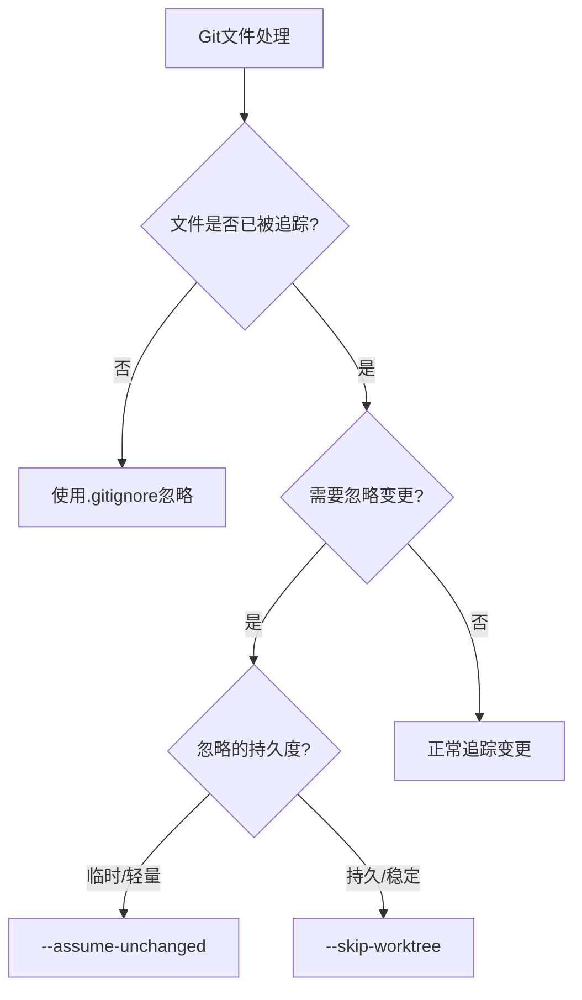

当你使用Git时，是否曾被一些不想提交但总是显示为已修改的文件所困扰？例如MacOS的.DS_Store文件、IDE的配置文件或是子模块中的临时文件？本文将介绍Git中不为人熟知但极其实用的忽略文件变更的方法。

<!--more-->

## 问题场景

小李是一名前端开发者，最近接手了一个包含多个子模块的项目。他发现每次打开Finder（MacOS的文件管理器）后，Git状态总是显示子模块有变更，即使他没有修改任何代码。

```bash
$ git status
Changes not staged for commit:
  (use "git add <file>..." to update what will be committed)
  (use "git restore <file>..." to discard changes in working directory)
  (commit or discard the untracked or modified content in submodules)
	modified:   docs/theme (modified content)
```

检查后发现，原来是子模块中存在一个`.DS_Store`文件（MacOS自动生成的文件），而系统的清理工具会定期删除这些文件。这个文件原本已被提交到子模块的仓库中，导致每次被删除后都会被Git检测为变更。

## 常规解决方案的局限

对于未追踪的文件，通常我们会使用`.gitignore`来解决。但这个方法对于**已经被Git追踪的文件是无效的**。

许多开发者可能会采用以下方案，但都有各自的问题：

1. 直接提交变更：但这只是临时解决，文件很快会再次被修改或删除
2. 在`.gitignore`中添加文件：对已追踪的文件无效
3. 删除文件然后加入`.gitignore`：在子模块中可能导致其他问题
4. 每次手动恢复文件：繁琐且不优雅

## Git的隐藏武器：update-index

Git提供了一个强大但不太为人所知的命令：`git update-index`，它可以帮助我们优雅地解决这个问题。

这个命令有两个特别有用的选项：

### 1. assume-unchanged 标记

```bash
git update-index --assume-unchanged <file-path>
```

这个命令告诉Git："假设这个文件不会改变，忽略它的任何变化。"

适用场景：
- 性能优化，避免Git检查大文件的变更
- 临时忽略本地配置文件的变动
- 对于不经常修改的文件

取消标记：
```bash
git update-index --no-assume-unchanged <file-path>
```

### 2. skip-worktree 标记

```bash
git update-index --skip-worktree <file-path>
```

这个命令告诉Git："在工作区中跳过这个文件，无论它如何变化都忽略。"

适用场景：
- 长期忽略本地配置文件
- 对文件进行本地修改但不想提交
- 需要在各种Git操作（如分支切换）后保持忽略状态

取消标记：
```bash
git update-index --no-skip-worktree <file-path>
```

## 两者的区别

虽然两个命令看起来相似，但它们有重要区别：

- `--assume-unchanged` 更轻量，但在某些Git操作（如切换分支）后可能失效
- `--skip-worktree` 更持久稳定，能在各种Git操作后保持有效

下面用一张图表示它们的差异：



## 处理子模块中的文件

对于子模块中的文件，这些命令稍有不同。**重要的是，你必须在子模块目录中执行这些命令**：

```bash
# 错误方式
$ git update-index --assume-unchanged path/to/submodule/file.txt
fatal: Unable to mark file path/to/submodule/file.txt

# 正确方式
$ cd path/to/submodule
$ git update-index --assume-unchanged file.txt
```

这是因为子模块本质上是一个独立的Git仓库，主仓库只是引用它的某个特定提交。

## 实际案例解决

回到小李的问题，他可以这样解决：

```bash
# 进入子模块目录
cd docs/theme

# 标记.DS_Store文件
git update-index --skip-worktree .DS_Store
```

之后，即使.DS_Store文件被删除或修改，Git也不会将其显示为变更。

## 检查哪些文件被标记了

要查看哪些文件被标记为`assume-unchanged`或`skip-worktree`，可以使用：

```bash
# 查看assume-unchanged的文件
git ls-files -v | grep "^[a-z]"

# 特别查看skip-worktree的文件
git ls-files -v | grep "^S"
```

输出中，小写字母表示`assume-unchanged`，`S`表示`skip-worktree`。

## 在团队中的最佳实践

这些命令只在本地仓库有效，不会影响其他团队成员。但为了团队协作，建议：

1. 记录这些需要忽略的文件，可以创建一个`local-ignore.sh`脚本
2. 在文档中说明哪些文件需要忽略及原因
3. 考虑使用`git config`设置全局忽略规则

## 其他相关解决方案

除了`update-index`命令，还有一些相关的解决方案：

1. 对于子模块整体，可以设置忽略子模块的变更：
   ```bash
   git config submodule.<submodule-name>.ignore dirty
   ```

2. 全局忽略特定类型的文件：
   ```bash
   git config --global core.excludesfile ~/.gitignore_global
   ```
   
3. 禁用MacOS的.DS_Store生成：
   ```bash
   defaults write com.apple.desktopservices DSDontWriteNetworkStores true
   ```

## 总结

Git的`update-index`命令提供了一种优雅的方式来忽略已追踪文件的变更，无需修改`.gitignore`或删除文件。通过正确使用`--assume-unchanged`和`--skip-worktree`标记，你可以让Git工作流更加顺畅。

- 对于临时忽略或性能优化，使用`--assume-unchanged`
- 对于持久忽略和本地配置，使用`--skip-worktree`
- 对于子模块中的文件，记得进入子模块目录执行命令

掌握这些技巧，将使你的Git使用体验更加专业和高效。

你是否也遇到过类似的Git困扰？尝试使用这些命令后，效果如何？欢迎在评论区分享你的经验！
