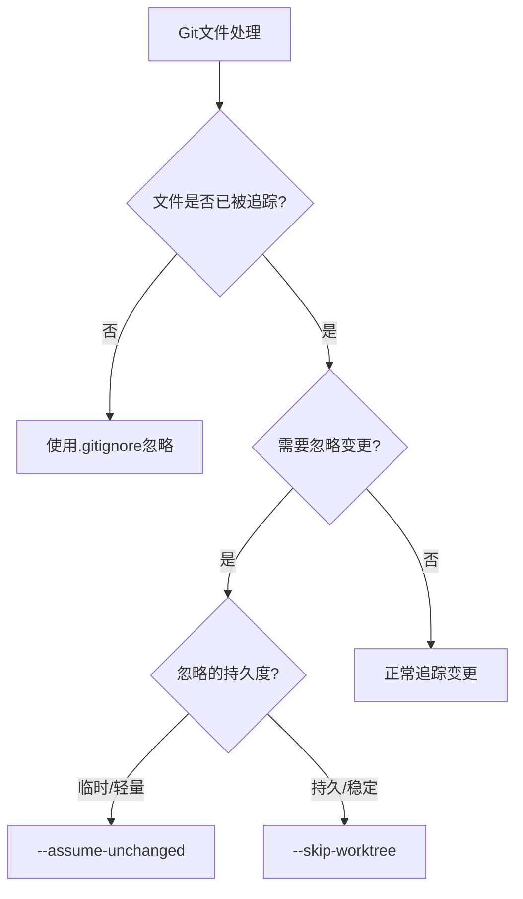

Когда вы используете Git, вам приходилось сталкиваться с файлами, которые вы не хотите фиксировать, но они всегда отображаются как изменённые? Например, файлы .DS_Store в macOS, конфигурационные файлы в IDE или временные файлы в подмодулях? В этой статье мы рассмотрим менее известный, но чрезвычайно полезный способ игнорирования изменений файлов в Git.

<! --подробнее-->

## Проблемные сценарии

Ли - фронтенд-разработчик, который недавно взял на себя проект, содержащий несколько подмодулей. Он заметил, что каждый раз, когда он открывает Finder (файловый менеджер MacOS), статус Git всегда показывает, что в подмодулях есть изменения, хотя он не менял никакого кода.

```bash
$ git status
Changes not staged for commit:
  (use "git add <file>..." to update what will be committed)
  (use "git restore <file>..." to discard changes in working directory)
  (commit or discard the untracked or modified content in submodules)
	modified:   docs/theme (modified content)
```

При проверке оказалось, что в подмодуле был файл `.DS_Store` (файл, автоматически генерируемый MacOS), а инструмент очистки системы периодически удаляет такие файлы. Изначально этот файл был зафиксирован в репозитории подмодуля, поэтому при каждом удалении он определялся Git'ом как измененный.

## Ограничения традиционных решений

Для неотслеживаемых файлов мы обычно используем `.gitignore`. Однако этот метод не эффективен для **файлов, которые уже отслеживаются Git'ом**.

Многие разработчики могут использовать следующие решения, но все они имеют свои проблемы:

1. зафиксировать изменения напрямую: однако это лишь временное решение, и вскоре файл снова будет изменен или удален
2. добавить файл в `.gitignore`: не подходит для отслеживаемых файлов
3. удалять файлы и затем добавлять их в `.gitignore`: может вызвать другие проблемы в подмодуле
4. каждый раз восстанавливать файлы вручную: громоздко и неэлегантно

## Скрытое оружие Git'а: update-index

Git предоставляет мощную, но малоизвестную команду: `git update-index`, которая помогает нам элегантно решить эту проблему.

У этой команды есть две особенно полезные опции:

### 1. флаг assume-unchanged

```bash
git update-index --assume-unchanged <file-path>
```.

Эта команда говорит Git'у: "Предположим, что этот файл не изменится, и будем игнорировать любые изменения в нем".

Применимые сценарии:
- Оптимизация производительности, чтобы избежать проверки Git'ом изменений в больших файлах
- Временное игнорирование изменений в локальных конфигурационных файлах
- Для редко изменяемых файлов

Снимите пометку:
```bash
git update-index --no-assume-unchanged <file-path>
```.

### 2. маркеры пропусков рабочего дерева

```bash
git update-index --skip-worktree <file-path>
```

Эта команда указывает Git'у "пропустить этот файл в рабочем пространстве и игнорировать его независимо от изменений".

Применимые сценарии:
- Игнорирование локальных конфигурационных файлов в течение длительных периодов времени
- Внесение локальных изменений в файл, которые вы не хотите фиксировать.
- Вам нужно игнорировать файл после различных операций Git (например, переключения ветвей).

Разблокировка:
```bash
git update-index --no-skip-worktree <file-path>
```.

## Разница между ними

Хотя эти две команды выглядят похоже, у них есть важные различия:

- `--assume-unchanged` более легковесна, но может выйти из строя после некоторых операций с Git (например, переключения веток).
- `--skip-worktree` - более стойкая и стабильная, и может использоваться после различных операций с Git.

Вот графическое представление их различий:



## Обработка файлов в подмодулях

Для файлов в подмодулях эти команды немного отличаются. **Важно, чтобы эти команды выполнялись в каталоге подмодуля**:

```bash
# 错误方式
$ git update-index --assume-unchanged path/to/submodule/file.txt
fatal: Unable to mark file path/to/submodule/file.txt

# 正确方式
$ cd path/to/submodule
$ git update-index --assume-unchanged file.txt
```.

Это связано с тем, что подмодуль по сути является отдельным Git-репозиторием, а основной репозиторий просто ссылается на него для конкретного коммита.

## Практическое решение

Возвращаясь к проблеме Ли, он может решить ее следующим образом:

```bash
# 进入子模块目录
cd docs/theme

# 标记.DS_Store文件
git update-index --skip-worktree .DS_Store
```_.

После этого, даже если файл .DS_Store будет удален или изменен, Git не покажет его как измененный.

## Проверьте, какие файлы помечены

Чтобы посмотреть, какие файлы помечены как `assume-unchanged` или `skip-worktree`, вы можете использовать:

```bash
# 查看assume-unchanged的文件
git ls-files -v | grep "^[a-z]"

# 特别查看skip-worktree的文件
git ls-files -v | grep "^S"
```

В выводе строчные буквы обозначают `assume-unchanged`, а `S` - `skip-worktree`.

## Лучшие практики в командах

Эти команды действуют только в локальном хранилище и не влияют на других членов команды. Тем не менее, они рекомендуются для работы в команде:

1. документировать файлы, которые необходимо игнорировать, создав скрипт `local-ignore.sh`.
2. документировать, какие файлы нужно игнорировать и почему
3. рассмотрите возможность использования `git config` для установки глобальных правил игнорирования

## Другие связанные решения

В дополнение к команде `update-index` существует ряд связанных с ней решений:

1. для подмодулей в целом можно настроить игнорирование изменений в подмодулях:
   ```bash
   git config submodule.<submodule-name>.ignore dirty
   ```

2. глобально игнорировать определенные типы файлов:
   ```bash
   git config --global core.excludesfile ~/.gitignore_global
   ```

3. отключить генерацию .DS_Store для macOS:
   ```bash
   defaults write com.apple.desktopservices DSDontWriteNetworkStores true
   ```

## Резюме

Команда `update-index` в Git'е предоставляет элегантный способ игнорировать изменения отслеживаемых файлов без необходимости модифицировать `.gitignore` или удалять файлы. Правильно используя флаги `--assume-unchanged` и `--skip-worktree`, вы сможете сделать рабочий процесс в Git более плавным.

- Для временного игнорирования или оптимизации производительности используйте `--assume-unchanged`.
- Для постоянного игнорирования и локальной настройки используйте `--skip-worktree`.
- Для файлов в подмодулях не забудьте зайти в каталог подмодуля и выполнить команду

Освоение этих советов сделает вашу работу с Git'ом более профессиональной и эффективной.

Сталкивались ли вы с подобными проблемами при работе с Git? Что получилось после того, как вы попробовали использовать эти команды? Не стесняйтесь поделиться своим опытом в разделе комментариев!
