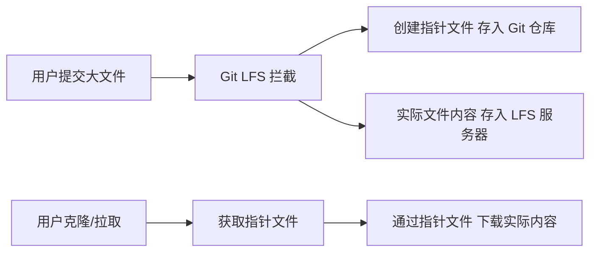

在开发过程中，我们总会遇到需要将大型二进制文件（如 PDF、APK、DMG、字体文件等）纳入版本控制的情况。如果直接将这些文件添加到普通的 Git 仓库中，可能导致仓库体积膨胀、克隆时间延长，甚至使团队协作变得困难。Git LFS（Large File Storage）正是为解决这一问题而生的扩展工具。

<!--more-->

## 为什么需要 Git LFS？

作为一名开发者，你可能已经遇到过这样的情况：

> "昨天刚拉取仓库花了半小时，同事说加了几个安装包和资源文件..."
> 
> "每次 clone 项目时，都需要下载历史上所有版本的大型二进制文件，即使这些文件你根本不需要..."
> 
> "不小心将一个 100MB 的 PDF 文件提交到了 Git 仓库，删除后仓库大小依然没变小..."

这些就是 Git 处理大文件时的典型痛点。Git 的设计初衷是管理文本文件（如代码），它会存储每个文件的完整历史。对于经常变化的大型二进制文件，这种策略会导致仓库体积迅速膨胀。

## Git LFS 的工作原理

Git LFS 采用了一种巧妙的策略：它不直接将大文件存储在 Git 仓库中，而是存储一个指向该文件的"指针"。实际的文件内容被上传到一个单独的 LFS 存储服务器。



这种机制带来的好处是：
- Git 仓库保持小巧和高效
- 只在需要时才下载大文件的内容
- 可以像处理普通文件一样使用 Git 命令

## 开始使用 Git LFS

### 安装 Git LFS

首先，你需要在系统上安装 Git LFS。

macOS (使用 Homebrew):
```bash
brew install git-lfs
```

Ubuntu/Debian:
```bash
sudo apt install git-lfs
```

Windows (使用 Chocolatey):
```bash
choco install git-lfs
```

或直接从[官方网站](https://git-lfs.com)下载安装程序。

### 在仓库中设置 Git LFS

安装后，你需要在你的 Git 仓库中初始化 Git LFS：

```bash
cd 你的仓库路径
git lfs install
```

这个命令只需在每个仓库执行一次。它会设置必要的 Git LFS 钩子。

### 配置要跟踪的文件类型

接下来，告诉 Git LFS 你想要跟踪哪些类型的文件：

```bash
# 跟踪常见的二进制文件类型
git lfs track "*.pdf"
git lfs track "*.apk"
git lfs track "*.dmg"
git lfs track "*.exe"
git lfs track "*.zip"
git lfs track "*.iso"
git lfs track "*.psd"
git lfs track "*.ttf" "*.otf"  # 字体文件
```

这些命令会创建或更新 `.gitattributes` 文件，指定哪些文件应该由 Git LFS 管理。请务必将此文件提交到你的仓库：

```bash
git add .gitattributes
git commit -m "配置 Git LFS 跟踪文件类型"
```

### 添加和提交大文件

一旦配置好 Git LFS，你就可以像处理普通文件一样添加和提交大文件：

```bash
git add path/to/largefile.pdf
git commit -m "添加大型PDF文件"
git push
```

当你执行 `git push` 时，Git LFS 会自动将大文件上传到 LFS 存储服务器。

## 实用技巧与最佳实践

### 1. 优化 .gitattributes 配置

只跟踪真正需要 LFS 处理的文件类型，避免将小文件也纳入 LFS：

```bash
# 更精确的跟踪配置
git lfs track "*.pdf" "*.psd" "*.ai"  # 设计文件
git lfs track "*.apk" "*.ipa"         # 应用安装包
git lfs track "*.mp4" "*.mov"         # 视频文件
git lfs track "*.zip" "*.tar.gz"      # 压缩文件
```

### 2. 检查 LFS 跟踪状态

确认哪些文件正在被 Git LFS 跟踪：

```bash
# 查看当前配置的跟踪模式
git lfs track

# 查看当前被 LFS 管理的文件
git lfs ls-files
```

### 3. 迁移现有仓库中的大文件

如果已有仓库中存在大文件，可以使用 `git lfs migrate` 命令将它们转换为 LFS 对象：

```bash
# 将当前分支中的大文件（超过 500KB）转换为 LFS 对象
git lfs migrate import --above=500KB --everything
```

**注意**：这会重写 Git 历史，所以在执行前请确保与团队成员协调好。

### 4. 拉取策略优化

默认情况下，Git LFS 会在你检出包含 LFS 对象的分支时自动下载文件内容。你可以通过以下命令修改这一行为：

```bash
# 延迟下载 LFS 对象，仅在实际使用文件时下载
git config lfs.fetchexclude "*"

# 仅为特定类型的文件自动下载 LFS 内容
git config lfs.fetchinclude "*.pdf,*.ttf"
git config lfs.fetchexclude "*"
```

### 5. 查看 LFS 对象而不下载

有时你可能只想查看 LFS 对象的元信息，而不下载实际内容：

```bash
git lfs pointer --file=path/to/file.pdf
```

### 6. 考虑 LFS 存储限制

大多数 Git 托管服务（如 GitHub、GitLab）对 LFS 存储和带宽有限制，特别是免费账户。在设计项目时，请考虑：

- 是否真的需要将所有大文件纳入版本控制？
- 是否可以使用外部存储服务，仅在仓库中保存链接？
- 项目团队是否愿意承担 LFS 存储的额外成本？

## 常见问题与解决方案

### 问题：克隆仓库时不想下载 LFS 文件

如果只想克隆代码，不需要 LFS 文件：

```bash
GIT_LFS_SKIP_SMUDGE=1 git clone 仓库URL
```

### 问题：LFS 文件历史占用大量空间

可以使用 Git LFS 清理命令删除不再需要的 LFS 文件历史：

```bash
# 删除所有远程跟踪分支中不再引用的 LFS 对象
git lfs prune
```

### 问题：团队成员没有安装 Git LFS

如果团队成员没有安装 Git LFS，他们仍然可以克隆仓库，但只会得到指针文件而非实际内容。请确保团队中的每个人都安装了 Git LFS。

### 问题：想要从 LFS 转回普通 Git 管理

如果某些文件不再需要 LFS 管理：

```bash
# 从 .gitattributes 中移除跟踪配置
git lfs untrack "*.pdf"

# 确认文件不再由 LFS 跟踪
git lfs status
```

## 实际案例：管理项目中的字体文件

假设你的项目需要包含自定义字体文件，比如 "PangMenZhengDaoXiXianTi-2.ttf"：

```bash
# 设置 LFS 跟踪字体文件
git lfs track "*.ttf"
git add .gitattributes
git commit -m "配置 Git LFS 跟踪字体文件"

# 添加字体文件并提交
git add ./PangMenZhengDaoXiXianTi-2.ttf
git commit -m "添加庞门正道细线体字体文件"
git push

# 查看已跟踪的 LFS 文件
git lfs ls-files
# 输出: 498b3f556e * PangMenZhengDaoXiXianTi-2.ttf
```

## 结语

Git LFS 为开发团队提供了一种优雅的方式来管理大型文件，既保持了 Git 的高效性，又解决了大文件版本控制的难题。通过本文介绍的最佳实践，你可以让项目中的大文件管理变得轻松自如，让团队协作更加流畅。

对于任何现代开发项目，特别是那些包含设计资源、媒体文件、编译产物或其他大型二进制文件的项目，Git LFS 都是一个不可或缺的工具。希望这些实践经验能帮助你更好地管理项目中的大文件！

## 参考资源

- [Git LFS 官方文档](https://git-lfs.github.com/)
- [GitHub 的 Git LFS 使用指南](https://docs.github.com/en/repositories/working-with-files/managing-large-files/about-git-large-file-storage)
- [GitLab 的 Git LFS 管理](https://docs.gitlab.com/ee/topics/git/lfs/)
