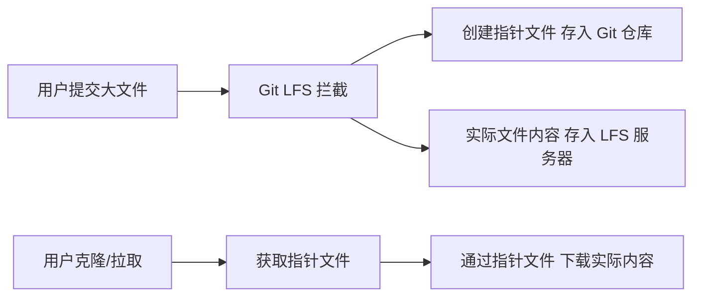

В процессе разработки мы постоянно сталкиваемся с необходимостью включения больших бинарных файлов (таких как PDF, APK, DMG, файлы шрифтов и т. д.) в ситуацию контроля версий. Git LFS (Large File Storage) - это расширение, которое решает эту проблему, добавляя такие файлы непосредственно в обычный Git-репозиторий, что может привести к раздуванию репозитория, увеличению времени клонирования и даже затруднить совместную работу команды.

<! ---далее-->

## Зачем мне нужен Git LFS?

Как разработчик, вы наверняка сталкивались с этим раньше:

> "Вчера на перенос репозитория ушло полчаса, и мой коллега сказал, что добавил несколько инсталляторов и ресурсных файлов..."
>
> "Каждый раз, когда вы клонируете проект, вам приходится скачивать большие двоичные файлы всех версий в истории, даже если они вам совсем не нужны..."
>
> > "Случайно отправил в Git-репозиторий PDF-файл размером 100 МБ, и после его удаления размер репозитория не уменьшился..." > >

Это типичные проблемы при работе с большими файлами в Git, который изначально был разработан для работы с текстовыми файлами (например, кодом) и хранит полную историю каждого файла. Для больших бинарных файлов, которые часто меняются, эта стратегия может привести к быстрому расширению репозиториев.

## Как работает Git LFS

Git LFS использует умную стратегию: вместо того чтобы хранить большие файлы непосредственно в вашем Git-репозитории, он хранит "указатель" на файл. Фактическое содержимое файла загружается на отдельный сервер хранения LFS.



Преимущество этого механизма заключается в том, что репозитории Git остаются небольшими и эффективными:
- Git-репозитории остаются маленькими и эффективными
- большие файлы загружаются только при необходимости
- Команды Git можно использовать как обычные файлы.

## Начало работы с Git LFS

### Установка Git LFS

Сначала вам нужно установить Git LFS на вашу систему.

macOS (с помощью Homebrew).
```bash
brew install git-lfs
```.

Ubuntu/Debian.
```bash
sudo apt install git-lfs
```.

Windows (с использованием Chocolatey): ```bash
choco install git-lfs
``` Ubuntu/Debian.
```bash
choco install git-lfs
```

Или скачайте установщик прямо с [официального сайта](https://git-lfs.com).

### Настройка Git LFS в репозитории

После установки необходимо инициализировать Git LFS в вашем Git-репозитории:

```bash
cd 你的仓库路径
git lfs install
```

Эту команду нужно выполнить только один раз для каждого репозитория. Она установит необходимые хуки Git LFS.

### Настройте типы файлов для отслеживания

Далее укажите Git LFS, какие типы файлов вы хотите отслеживать:

```bash
# 跟踪常见的二进制文件类型
git lfs track "*.pdf"
git lfs track "*.apk"
git lfs track "*.dmg"
git lfs track "*.exe"
git lfs track "*.zip"
git lfs track "*.iso"
git lfs track "*.psd"
git lfs track "*.ttf" "*.otf"  # 字体文件
```

Эти команды создают или обновляют файл `.gitattributes`, указывая, какими файлами должен управлять Git LFS. Обязательно зафиксируйте этот файл в вашем репозитории:

```bash
git add .gitattributes
git commit -m "配置 Git LFS 跟踪文件类型"
```

### Добавление и фиксация больших файлов

После настройки Git LFS вы можете добавлять и фиксировать большие файлы так же, как и обычные файлы:

```bash
git add path/to/largefile.pdf
git commit -m "添加大型PDF文件"
git push
```_.

Когда вы запускаете `git push`, Git LFS автоматически загружает большие файлы на сервер хранения LFS.

## Практические советы и лучшие практики

### 1. Оптимизация конфигурации .gitattributes

Отслеживайте только те типы файлов, которые действительно нуждаются в обработке LFS, и избегайте включения в LFS маленьких файлов:

```bash
# 更精确的跟踪配置
git lfs track "*.pdf" "*.psd" "*.ai"  # 设计文件
git lfs track "*.apk" "*.ipa"         # 应用安装包
git lfs track "*.mp4" "*.mov"         # 视频文件
git lfs track "*.zip" "*.tar.gz"      # 压缩文件
```.

### 2. Проверка состояния отслеживания LFS

Проверьте, какие файлы отслеживаются Git LFS:

```bash
# 查看当前配置的跟踪模式
git lfs track

# 查看当前被 LFS 管理的文件
git lfs ls-files
```

### 3. Перенос больших файлов из существующего хранилища

Если в существующем хранилище есть большие файлы, вы можете использовать команду `git lfs migrate` для их преобразования в объекты LFS:

```bash
# 将当前分支中的大文件（超过 500KB）转换为 LFS 对象
git lfs migrate import --above=500KB --everything
```

**Примечание**: Это переписывает историю Git, поэтому перед выполнением этой команды обязательно согласуйте ее с членами команды.

### 4. Оптимизация Pull-стратегии

По умолчанию Git LFS автоматически загружает содержимое файлов, когда вы проверяете ветку, содержащую объекты LFS. Вы можете изменить это поведение с помощью следующей команды:

```bash
# 延迟下载 LFS 对象，仅在实际使用文件时下载
git config lfs.fetchexclude "*"

# 仅为特定类型的文件自动下载 LFS 内容
git config lfs.fetchinclude "*.pdf,*.ttf"
git config lfs.fetchexclude "*"
```

### 5. Просмотр объектов LFS без их загрузки

Иногда вы можете захотеть просмотреть только метаинформацию об объекте LFS, не загружая его содержимое:

```bash
git lfs pointer --file=path/to/file.pdf
```.

### 6. Рассмотрение ограничений хранения LFS

Большинство сервисов хостинга Git (например, GitHub, GitLab) имеют ограничения на хранение LFS и пропускную способность, особенно для бесплатных аккаунтов. Учитывайте это при разработке проекта:

- Действительно ли необходимо включать все большие файлы в систему контроля версий?
- Можно ли использовать внешний сервис хранения и просто хранить ссылки в репозитории?
- Готова ли команда проекта нести дополнительные расходы на хранение LFS?

## Часто задаваемые вопросы и решения

### Проблема: не хочу загружать файлы LFS при клонировании репозиториев

Если вы хотите клонировать только код, LFS-файл вам не нужен:

```bash
GIT_LFS_SKIP_SMUDGE=1 git clone 仓库URL
```

### Проблема: история файла LFS занимает много места

Вы можете использовать команду Git LFS cleanup, чтобы удалить историю файлов LFS, которая вам больше не нужна:

```bash
# 删除所有远程跟踪分支中不再引用的 LFS 对象
git lfs prune
```

### Проблема: у члена команды не установлен Git LFS

Если у члена команды не установлен Git LFS, он все равно сможет клонировать репозиторий, но получит только файлы-указатели, а не его содержимое. Убедитесь, что у всех членов вашей команды установлен Git LFS.

### Проблема: Попытка перейти от LFS обратно к обычному управлению Git

Если некоторые файлы больше не нуждаются в управлении с помощью LFS:

```bash
# 从 .gitattributes 中移除跟踪配置
git lfs untrack "*.pdf"

# 确认文件不再由 LFS 跟踪
git lfs status
```

## Практический пример: управление файлами шрифтов в проекте

Предположим, что ваш проект должен содержать пользовательские файлы шрифтов, например "PangMenZhengDaoXiXianTi-2.ttf":

```bash
# 设置 LFS 跟踪字体文件
git lfs track "*.ttf"
git add .gitattributes
git commit -m "配置 Git LFS 跟踪字体文件"

# 添加字体文件并提交
git add ./PangMenZhengDaoXiXianTi-2.ttf
git commit -m "添加庞门正道细线体字体文件"
git push

# 查看已跟踪的 LFS 文件
git lfs ls-files
# 输出: 498b3f556e * PangMenZhengDaoXiXianTi-2.ttf
```.

## Заключение

Git LFS предоставляет командам разработчиков элегантный способ управления большими файлами, который сохраняет эффективность Git'а и решает проблемы контроля версий для больших файлов. Используя лучшие практики, описанные в этой статье, вы сможете сделать управление большими файлами в ваших проектах легким и сделать совместную работу команды более гладкой.

Git LFS - незаменимый инструмент для любого современного проекта разработки, особенно для тех, которые содержат дизайнерские ресурсы, медиафайлы, продукты сборки или другие большие двоичные файлы. Мы надеемся, что эти практические уроки помогут вам лучше управлять большими файлами в ваших проектах!

## Справочные ресурсы

- [Официальная документация Git LFS](__PROTECTED_LINK_URL__21__)
- [GitHub's Git LFS User Guide](https://docs.github.com/en/repositories/working-with-files/managing-large-files/about-git-large-file-storage)
- [GitLab's Git LFS Administration](https://docs.gitlab.com/ee/topics/git/lfs/)
