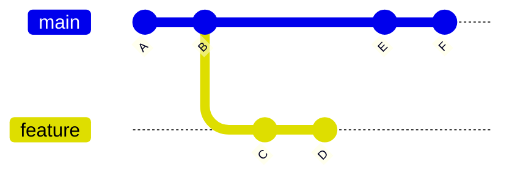
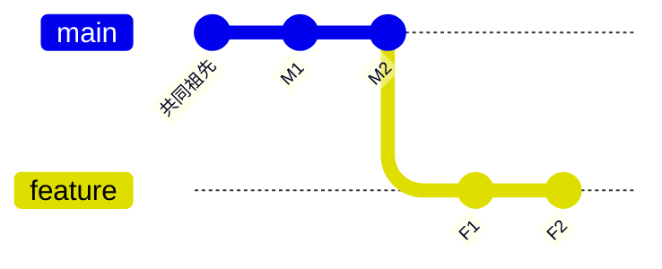

在日常开发中，我们经常需要查看其他分支的提交历史，但又不想频繁切换分支打断当前的工作流程。Git提供了一个非常简单但强大的解决方案，让你能够直接查看任何分支或提交的日志记录。

<!--more-->

## 核心原理：Git的引用系统

Git的设计哲学非常优雅，所有的分支、标签、提交ID本质上都是对某个提交节点的引用。这意味着你可以在任何Git命令中直接使用这些引用，而不需要先切换到对应的分支。



在上图中，无论你当前在哪个分支，都可以直接查看`main`或`feature`分支的历史。

## 基础用法

最简单的命令格式就是：

```bash
git log [选项] <分支名/提交ID>
```

### 查看其他分支的最新提交

```bash
# 查看main分支的最后10条提交
git log -10 main

# 查看远程分支的提交历史
git log -5 origin/develop

# 查看特定提交之前的历史
git log -3 abc1234
```

### 实用的格式选项

```bash
# 简洁的单行格式，适合快速浏览
git log -10 --oneline feature-branch

# 包含图形化分支结构
git log -10 --graph --oneline main

# 自定义格式：哈希值、作者、时间、提交信息
git log -5 --pretty=format:"%h - %an, %ar : %s" develop

# 显示文件修改统计
git log -3 --stat feature-branch
```

## 分支比较：发现差异的利器

Git的真正威力在于能够轻松比较不同分支间的差异。

### 单向比较

```bash
# 查看feature分支有但main分支没有的提交
git log main..feature

# 等价写法
git log feature ^main
```

### 双向比较

```bash
# 查看两个分支的所有不同提交
git log --oneline main...feature
```



在这个例子中：
- `main..feature` 显示：F1, F2
- `feature..main` 显示：M1, M2  
- `main...feature` 显示：M1, M2, F1, F2

## 实际应用场景

### 场景一：代码审查前的准备

作为团队负责人，你需要了解开发分支的变化：

```bash
# 快速查看feature分支相对于main的新提交
git log --oneline main..feature-user-auth

# 查看详细的修改内容
git log --stat main..feature-user-auth
```

### 场景二：发布前的版本确认

```bash
# 检查即将发布的内容
git log --oneline --graph release..main

# 确认最近的几个重要提交
git log -5 --pretty=format:"%h %s (%an)" main
```

### 场景三：调试问题时的历史追踪

```bash
# 查看可能引入bug的提交
git log --since="2 weeks ago" --grep="user" main

# 查看特定文件的修改历史
git log --oneline -- src/auth.py main
```

## 进阶技巧

### 结合其他Git命令

```bash
# 查看其他分支的特定文件内容
git show feature:src/config.js

# 比较当前分支与其他分支的文件差异
git diff main..feature -- package.json
```

### 使用别名提高效率

在`.gitconfig`中设置别名：

```bash
git config --global alias.lg "log --graph --pretty=format:'%Cred%h%Creset -%C(yellow)%d%Creset %s %Cgreen(%cr) %C(bold blue)<%an>%Creset' --abbrev-commit"

# 使用时：
git lg -10 main
```

## 总结

Git的引用系统让查看其他分支日志变得异常简单。核心要记住的就是：

1. **基本格式**：`git log [选项] <引用>`
2. **比较语法**：`A..B`（A到B的差异）和`A...B`（A和B的所有差异）
3. **灵活性**：分支名、提交ID、标签都是有效的引用

这种设计哲学体现了Git的优雅之处：简单的概念组合出强大的功能。掌握了这个基础模式，你就能够在不打断当前工作流的情况下，高效地浏览和分析整个项目的历史变化。

无论是日常开发、代码审查还是问题调试，这些技巧都能显著提升你的工作效率。记住，Git的威力不在于复杂的命令，而在于理解其简洁而一致的设计理念。
