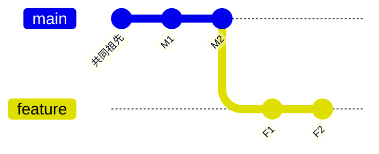

В процессе ежедневной разработки нам часто требуется просмотреть историю коммитов других веток, но мы не хотим часто переключаться между ветками и прерывать текущий рабочий процесс. Git предлагает очень простое, но мощное решение, которое позволяет напрямую просматривать записи журнала любой ветки или коммита.

<! --подробнее-->

## Основные принципы: система ссылок Git'а

Философия дизайна Git'а элегантна в том, что все ветки, теги и идентификаторы коммитов - это, по сути, ссылки на узел коммита. Это означает, что вы можете использовать эти ссылки непосредственно в любой команде Git без необходимости сначала переключаться на соответствующую ветку.


### Полезные параметры форматирования

```bash
# 简洁的单行格式，适合快速浏览
git log -10 --oneline feature-branch

# 包含图形化分支结构
git log -10 --graph --oneline main

# 自定义格式：哈希值、作者、时间、提交信息
git log -5 --pretty=format:"%h - %an, %ar : %s" develop

# 显示文件修改统计
git log -3 --stat feature-branch
```

## Сравнение ветвей: отличный инструмент для выявления различий

Настоящая сила Git'а заключается в его способности легко сравнивать различия между ветками.

### Одностороннее сравнение

```bash
# 查看feature分支有但main分支没有的提交
git log main..feature

# 等价写法
git log feature ^main
```

### Двунаправленное сравнение

```bash
# 查看两个分支的所有不同提交
git log --oneline main...feature
```



В этом примере:
- `main..feature` Показать: F1, F2
- `feature..main` Показать: M1, M2
- `main...feature` Показать: M1, M2, F1, F2

## Практические сценарии применения

### Сценарий 1: Подготовка к проверке кода

Как руководитель команды, вы должны быть в курсе изменений в ветке разработки:

```bash
# 快速查看feature分支相对于main的新提交
git log --oneline main..feature-user-auth

# 查看详细的修改内容
git log --stat main..feature-user-auth
```.

### Сценарий 2: проверка предрелизной версии

```bash
# 检查即将发布的内容
git log --oneline --graph release..main

# 确认最近的几个重要提交
git log -5 --pretty=format:"%h %s (%an)" main
```

### Сценарий 3: Трассировка истории при отладке проблем

```bash
# 查看可能引入bug的提交
git log --since="2 weeks ago" --grep="user" main

# 查看特定文件的修改历史
git log --oneline -- src/auth.py main
```

### Дополнительные советы

### Комбинирование других команд Git

```bash
# 查看其他分支的特定文件内容
git show feature:src/config.js

# 比较当前分支与其他分支的文件差异
git diff main..feature -- package.json
```

### Используйте псевдонимы для повышения эффективности

Установите псевдонимы в `.gitconfig`:

```bash
git config --global alias.lg "log --graph --pretty=format:'%Cred%h%Creset -%C(yellow)%d%Creset %s %Cgreen(%cr) %C(bold blue)<%an>%Creset' --abbrev-commit"

# 使用时：
git lg -10 main
```

## Резюме

Ссылочная система Git'а позволяет невероятно легко просматривать журналы других веток. Главное, что нужно запомнить:

1. **базовый формат**: `git log [选项] <引用>`
2. **Синтаксис сравнения**: `A..B` (разница между A и B) и `A...B` (все различия между A и B)
3. **Гибкость**: имена ветвей, идентификаторы коммитов, теги - все это допустимые ссылки

Эта философия дизайна является примером элегантности Git'а: простые концепции в сочетании с мощными возможностями. Вооружившись этим основополагающим шаблоном, вы сможете эффективно перемещаться и анализировать исторические изменения в проекте, не прерывая текущий рабочий процесс.

Будь то повседневная разработка, обзор кода или отладка проблем, эти методы могут значительно повысить вашу производительность. Помните, что сила Git заключается не в сложности команд, а в простоте и последовательности философии его разработки.
