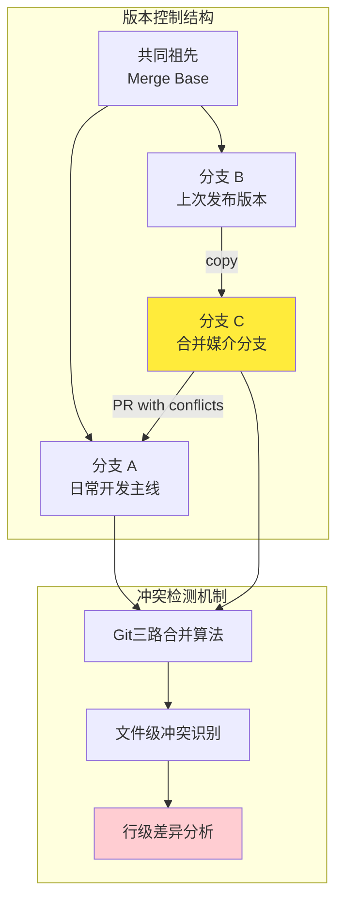
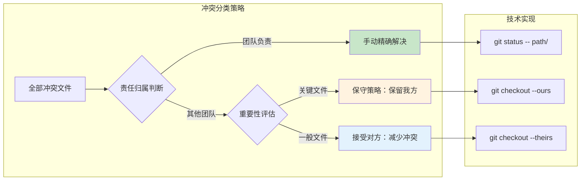
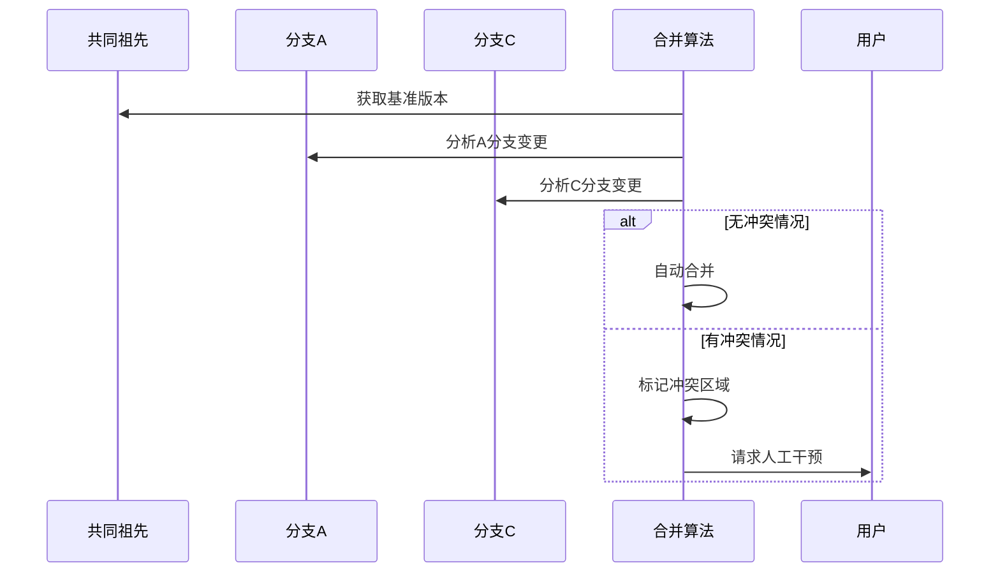
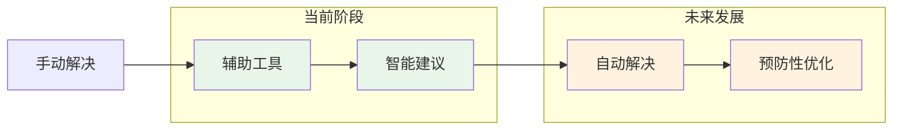

在现代软件开发中，分支合并冲突是团队协作中不可避免的技术挑战。本文将深入分析一个真实的冲突解决案例，探讨其背后的技术原理和最佳实践策略。

通过这个案例，我们将看到如何将复杂的版本控制问题转化为可管理的、系统化的解决方案。

<!--more-->

## 技术背景：分布式版本控制中的冲突本质

### 问题模型分析

在我们的案例中，团队面临的是典型的三路合并（three-way merge）冲突：



### 冲突产生的根本原因

Git的合并算法基于三路合并策略，当系统检测到以下情况时会产生冲突：
1. **同一文件的相同位置**在两个分支中都有修改
2. **文件的重命名或移动**在两个分支中不一致
3. **文件的添加/删除**操作在两个分支中存在分歧

## 解决策略：分域责任制与选择性自动化

### 核心理念：责任边界清晰化

我们采用的策略基于一个关键洞察：**不是所有冲突都需要同等程度的人工干预**。



### 技术实现细节

#### 1. 冲突预览与分析阶段

```bash
# 获取完整的冲突信息而不执行合并
git merge-tree $(git merge-base origin/A origin/C) origin/A origin/C

# 针对特定目录的冲突分析
git diff origin/A...origin/C --name-only -- devops/
```

这个阶段的技术价值在于：
- **零风险探索**：不改变工作目录状态
- **精确定位**：识别具体的冲突范围
- **决策支持**：为后续策略提供数据基础

#### 2. 安全的本地合并环境

```bash
git checkout -b local-C origin/C
git merge origin/A --no-commit
```

`--no-commit` 参数的技术意义：
- **暂存合并结果**：允许检查和修改合并内容
- **回滚能力**：可以通过 `git merge --abort` 轻松撤销
- **分步处理**：支持复杂的冲突解决流程

#### 3. 选择性冲突解决算法

```bash
# 针对性处理团队负责区域
git status -- devops/
# 手动编辑解决冲突

# 自动化处理其他区域
find . -name "*.orig" -not -path "./devops/*" -exec rm {} \;
git checkout --theirs non-critical-path/
git checkout --ours critical-but-external-path/
```

### 分支命名与推送策略

```bash
git push origin local-C:C
```

这个语法的技术优势：
- **本地与远程解耦**：本地分支名可以更具描述性
- **精确更新**：避免意外推送到错误分支
- **PR自动更新**：直接更新现有的Pull Request

## 深层技术原理解析

### Git合并算法的工作机制

Git的三路合并算法工作流程：



### 冲突标记的语义分析

Git生成的冲突标记具有明确的语义结构：

```
<<<<<<< HEAD (当前分支)
我们的修改内容
=======
他们的修改内容
>>>>>>> origin/A (合并来源分支)
```

理解这个结构对于正确解决冲突至关重要。

### 选择性解决策略的算法复杂度

我们的方法将 O(n²) 的复杂问题转化为 O(k + (n-k)) 的线性问题：
- k：需要手动处理的文件数量
- (n-k)：可以自动处理的文件数量

## 扩展应用与最佳实践

### 1. 企业级工作流集成

```bash
#!/bin/bash
# conflict-resolution-framework.sh

TEAM_SCOPE=${1:-"devops/"}
STRATEGY=${2:-"conservative"}

case $STRATEGY in
    "conservative")
        # 对非团队文件采用保守策略
        git checkout --ours $(git diff --name-only --diff-filter=U | grep -v $TEAM_SCOPE)
        ;;
    "progressive")
        # 对非团队文件采用进取策略
        git checkout --theirs $(git diff --name-only --diff-filter=U | grep -v $TEAM_SCOPE)
        ;;
esac
```

### 2. CI/CD流水线集成

```yaml
# .github/workflows/conflict-resolution.yml
conflict_check:
  steps:
    - name: Detect conflicts in team scope
      run: |
        if git merge-tree ${{ github.event.pull_request.base.sha }} ${{ github.sha }} | grep -q "^$TEAM_SCOPE"; then
          echo "::warning::Conflicts detected in team scope - manual review required"
        fi
```

### 3. 预防性策略

#### 分支保护规则
- 实施路径级的CODEOWNERS配置
- 设置必要的代码审查流程
- 建立自动化冲突检测机制

#### 团队协作模式
- 定期同步主分支的变更
- 使用功能开关减少大规模冲突
- 实施渐进式集成策略

## 技术展望：AI辅助的冲突解决

### 机器学习在冲突解决中的应用前景

未来的冲突解决可能会集成以下AI技术：

1. **语义分析**：理解代码变更的意图，而不仅仅是文本差异
2. **历史学习**：基于团队的历史决策模式自动选择解决策略
3. **影响分析**：预测不同解决方案对系统稳定性的影响

### 自动化程度的进化



## 总结与反思

本案例展示了如何将复杂的技术问题转化为系统化的解决方案。关键要素包括：

1. **问题分解**：将整体冲突分解为可管理的子问题
2. **责任划分**：基于团队结构和业务逻辑进行合理分工
3. **工具组合**：巧妙运用Git的高级特性实现自动化
4. **风险控制**：通过本地测试和逐步推进降低风险

这种方法论不仅适用于版本控制，也为其他复杂的工程问题提供了解决思路：分解、分类、分步解决。

在快速迭代的软件开发环境中，这样的系统化方法将变得越来越重要。它不仅提高了效率，更重要的是建立了可重复、可扩展的问题解决框架。
